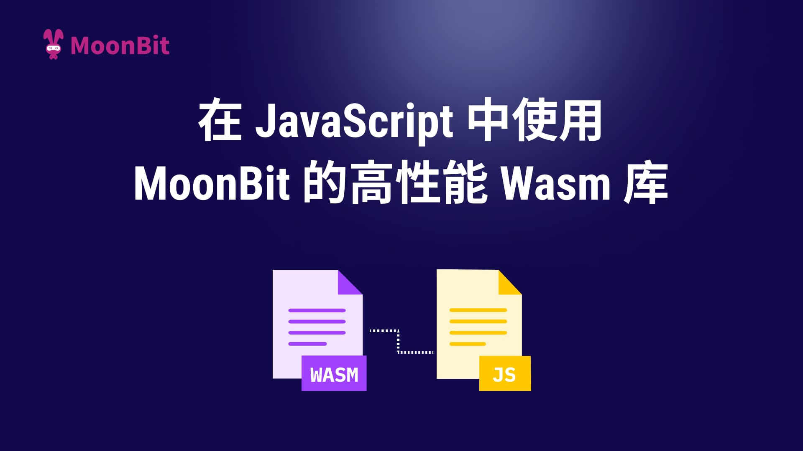
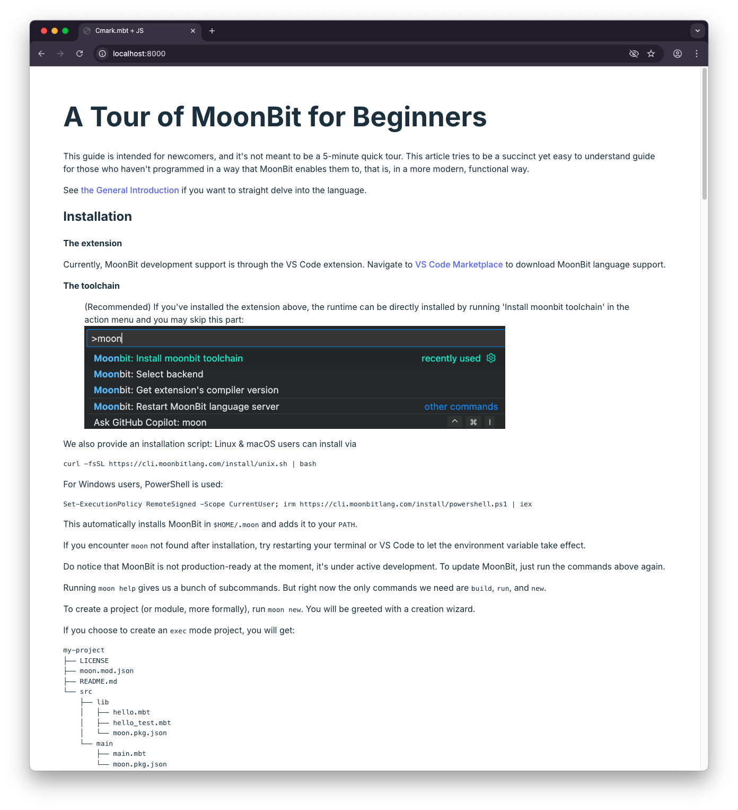

---
description:
  在 JavaScript 中使用 MoonBit 的高性能 Wasm 库
slug: call-wasm-from-js
image: /img/blogs/zh/2025-01-22-call-wasm-from-js/cover.png
tags: [MoonBit, Wasm, JavaScript]
---

# 在 JavaScript 中使用 MoonBit 的高性能 Wasm 库



在我们之前的[一篇博客文章][js-string-builtins]中，我们已经开始探索如何在 MoonBit 的 Wasm GC 后端中直接使用 JavaScript 字符串。正如我们所见，不仅可以用 MoonBit 编写一个兼容 JavaScript 的字符串操作 API，而且在编译为 Wasm 后，生成的产物体积非常小。

然而，您可能会好奇，在更现实的使用场景中，这将会是什么样子。因此，今天我们展示一个更贴近实际的场景：在一个由 JavaScript 驱动的 Web 应用程序中渲染 Markdown 文档，并借助 MoonBit 库 [Cmark] 和 Wasm 的 JS 字符串内置提案。

## 动机

[Cmark] 是一个新的 MoonBit 库，用于处理 Markdown 文档，可以解析纯 CommonMark 和各种常见的 Markdown 语法扩展（如任务列表、脚注、表格等）。此外，它从早期开始就支持外部渲染器，并附带了一个名为 `cmark_html` 的官方 HTML 渲染器实现。

鉴于 Markdown 在当今网络世界中的广泛存在，将 Markdown 转换为 HTML 的流程仍然是几乎每个 JavaScript 开发者工具箱中的重要工具。因此，这也成为展示 MoonBit Wasm GC API 在前端 JavaScript 中使用的理想场景。

## 封装 Cmark

为了进行这个演示，先创建一个新的项目目录：

```console
> mkdir cmark-frontend-example
```

在该目录中，首先创建一个 MoonBit 库 `cmarkwrap` 来封装 [Cmark]：

```console
> cd cmark-frontend-example && moon new cmarkwrap
```

这个额外的项目 `cmarkwrap` 的主要作用是：

- [Cmark] 本身不通过 FFI 边界暴露任何 API，这对大多数 MoonBit 库来说是常见的情况；
- 我们需要从 [mooncakes.io] 仓库中获取 [Cmark] 项目，并将其本地编译为 Wasm GC。

`cmarkwrap` 的结构非常简单：

- `cmark-frontend-example/cmarkwrap/src/lib/moon.pkg.json`:

  ```json
  {
    "import": ["rami3l/cmark/cmark_html"],
    "link": {
      "wasm-gc": {
        "exports": ["render", "result_unwrap", "result_is_ok"],
        "use-js-builtin-string": true
      }
    }
  }
  ```

  这个配置基本与[之前的博客][js-string-builtins]中介绍的设置相同，为 Wasm GC 目标启用了 `use-js-builtin-string` 标志，并导出了相关的封装函数。

- `cmark-frontend-example/cmarkwrap/src/lib/wrap.mbt`:

  ```rs
  ///|
  typealias RenderResult = Result[String, Error]

  ///|
  pub fn render(md : String) -> RenderResult {
    @cmark_html.render?(md)
  }

  ///|
  pub fn result_unwrap(res : RenderResult) -> String {
    match res {
      Ok(s) => s
      Err(_) => ""
    }
  }

  ///|
  pub fn result_is_ok(res : RenderResult) -> Bool {
    res.is_ok()
  }
  ```

  这里是关键部分。`render()` 函数封装了底层的 `@cmark_html.render()` 函数，不再是一个抛出异常的函数，而是返回一个 `RenderResult` 类型。

  然而，由于 `RenderResult` 是一个 Wasm 对象（而不是数字或字符串），对 JavaScript 来说是[不透明][opaque type]的，因此无法直接被 JavaScript 调用者使用。因此，我们还需要在 MoonBit 中提供拆解该类型的方法：`result_unwrap()` 和 `result_is_ok()` 函数正是为此目的设计的，它们接受一个 `RenderResult` 输入。

## 与 JavaScript 集成

现在是编写项目 Web 部分的时候了。在此阶段，您可以自由选择任何框架或打包工具。本次演示选择在 `cmark-frontend-example` 目录下初始化一个最小的项目结构，无需额外的运行时依赖。以下是项目的 HTML 和 JS 部分：

- `cmark-frontend-example/index.html`:

  ```html
  <!doctype html>
  <html lang="en">
    <head>
      <meta charset="UTF-8" />
      <meta name="viewport" content="width=device-width, initial-scale=1.0" />
      <title>Cmark.mbt + JS</title>
    </head>
    <body>
      <div id="app"></div>
      <script type="module" src="/src/main.js"></script>
      <link rel="stylesheet" href="/src/style.css" />
    </body>
  </html>
  ```

  这个简单的 HTML 文件包含一个 `id="app"` 的 `div`，稍后会用作渲染 Markdown 文档的目标。

- `cmark-frontend-example/src/main.js`:

  ```js
  const cmarkwrapWASM = await WebAssembly.instantiateStreaming(
    fetch("../cmarkwrap/target/wasm-gc/release/build/lib/lib.wasm"),
    {}，
    {
      builtins: ["js-string"],
      importedStringConstants: "_",
    },
  );
  const { render, result_is_ok, result_unwrap } =
    cmarkwrapWASM.instance.exports;

  function cmarkWASM(md) {
    const res = render(md);
    if (!result_is_ok(res)) {
      throw new Error("cmarkWASM failed to render");
    }
    return result_unwrap(res);
  }

  async function docHTML() {
    const doc = await fetch("../public/tour.md");
    const docText = await doc.text();
    return cmarkWASM(docText);
  }

  document.getElementById("app").innerHTML = await docHTML();
  ```

  将 `cmarkwrap` 集成到 JavaScript 中相对简单。在 `fetch` 并加载 Wasm 产物后，可以直接调用封装函数。`result_is_ok()` 帮助我们判断是否在正常路径上：如果是，我们可以通过 `result_unwrap()` 解包跨 FFI 边界的 HTML 结果；否则，可以抛出一个 JavaScript 错误。如果一切顺利，我们最终可以将渲染结果填充到 `<div id="app"></div>` 中。

现在我们可以编译 MoonBit 的 Wasm GC 产物并启动开发服务器：

```console
> moon -C cmarkwrap build --release --target=wasm-gc
> python3 -m http.server
```

大功告成！您现在可以在浏览器中访问 [http://localhost:8000](http://localhost:8000)，并查看由 [Cmark] MoonBit 库渲染的 [_A Tour of MoonBit for Beginners_][tour]。



您可以在 [GitHub](https://github.com/moonbit-community/cmark-frontend-example) 上找到该演示的代码。

**了解更多**

- [下载MoonBit](https://www.moonbitlang.cn/download/)
- [MoonBit初学者之旅](https://docs.moonbitlang.com/zh-cn/latest/tutorial/tour.html)
- 浏览[MoonBit Language Tour](https://tour.moonbitlang.com/)
- 浏览[MoonBit文档](https://docs.moonbitlang.com/en/latest/index.html)

[Cmark]: https://github.com/moonbit-community/cmark
[mooncakes.io]: https://mooncakes.io
[js-string-builtins]: https://www.moonbitlang.cn/blog/js-string-builtins
[opaque type]:
  https://github.com/WebAssembly/gc/blob/756060f5816c7e2159f4817fbdee76cf52f9c923/proposals/gc/MVP-JS.md#explanation
[tour]:
  https://github.com/moonbitlang/moonbit-docs/blob/cb21840b01374397ff1330f5065bab8f25cb95ed/next/tutorial/tour.md
