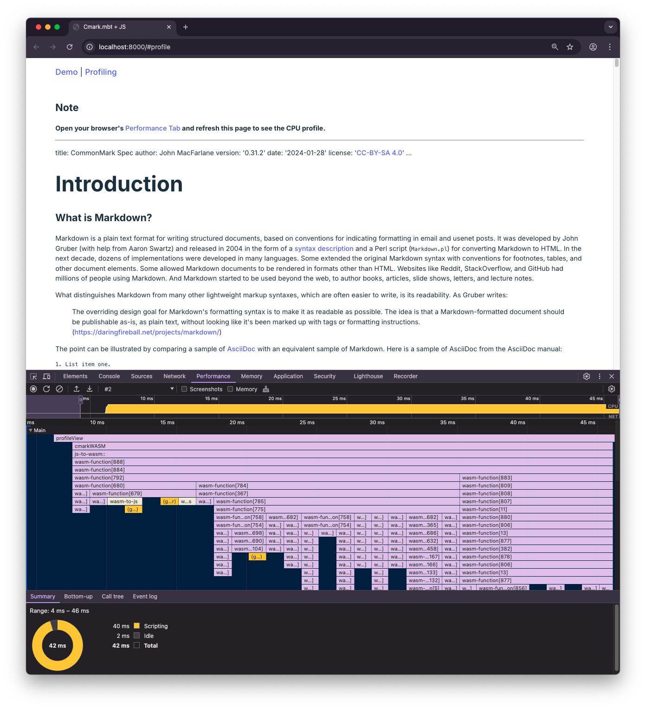
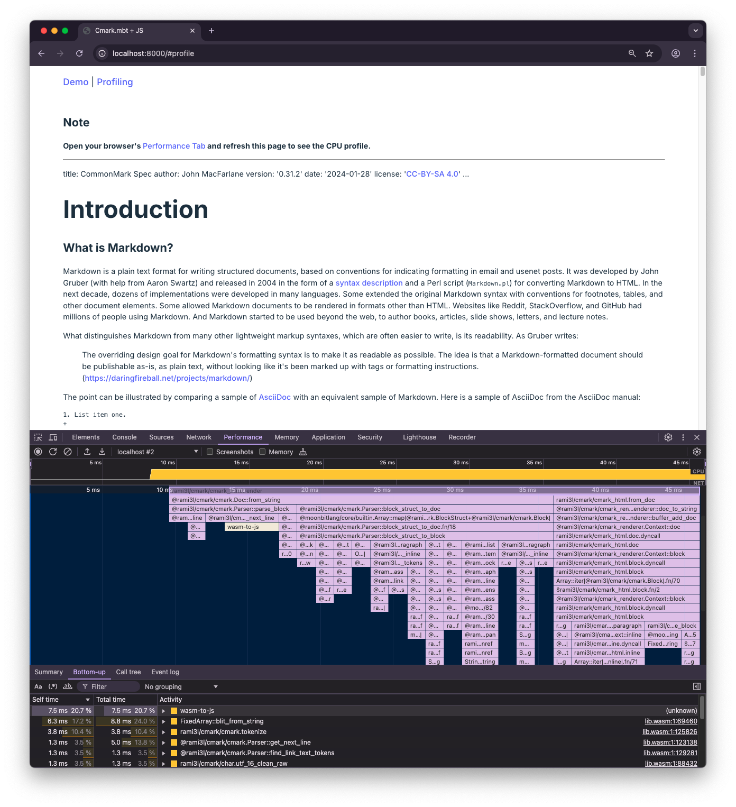
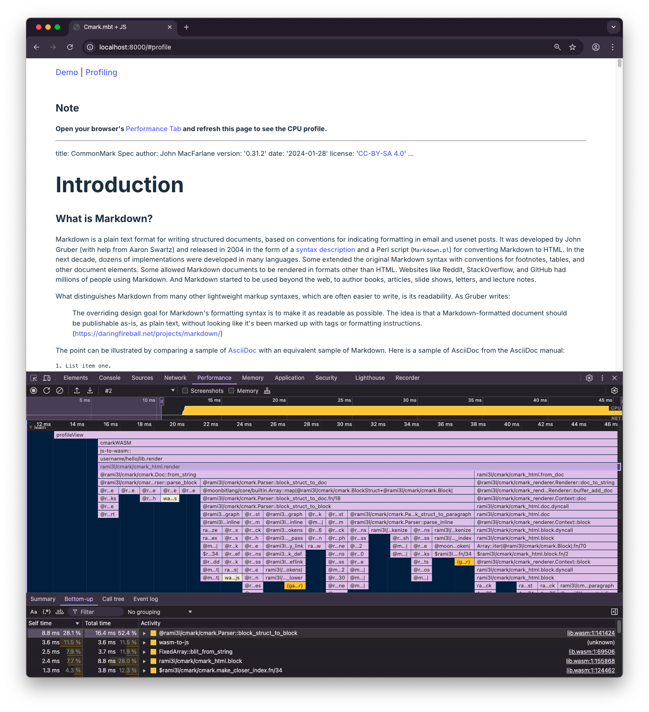

# 使用 Chrome 对 MoonBit 生成的 Wasm 进行性能分析


在[我们前一篇博客][call-wasm-from-js]中，我们介绍了如何在前端 JavaScript 中使用 MoonBit 驱动的 Wasm 库 [Cmark]。在本文中，我们将探索如何直接从 Chrome 浏览器中对该库进行性能分析。希望这篇教程能对你在使用 MoonBit 在类似的场景中进行开发时提供一些洞察，从而实现更好的整体性能。

具体而言，在本文中，我们将重点介绍如何对我们之前[在前端应用中使用 Cmark 的示例][cmark-frontend-example]做最小程度的修改，以便将 Chrome 内置的 V8 性能分析器应用到 [Cmark] 的 Wasm 代码中。

## 对 Cmark 库进行性能分析

我们很容易可以重构原始的前端应用程序，并添加一个新的导航栏以包含 “Demo” 和 “Profiling” 两个链接。点击第一个链接将使浏览器渲染原本的 _A Tour of MoonBit for Beginners_ 示例的 HTML，点击第二个链接将导航到我们的新文档进行性能分析。（如果你对实际实现感兴趣，你可以在本文的末尾找到最终代码的链接。）

现在，我们已经准备为实际实现 Wasm 性能分析着手编写一些代码了。那么，与 JavaScript 性能分析相比，进行 Wasm 性能分析是否有不同之处？

实际上，我们可以使用与 JavaScript 相同的 API 来进行 Wasm 性能分析。Chromium 文档中有一篇[文章][console-apis]详细描述了这些 API，简而言之：

- 当我们调用 `console.profile()` 时，V8 性能分析器将开始记录 CPU 性能概况；
- 之后，我们可以调用我们希望分析的性能关键函数；
- 最后，当我们调用 `console.profileEnd()` 时，性能分析器将停止记录，并将结果数据可视化显示在 Chrome 的性能标签页中。

考虑到这一点，让我们来看一下实际的性能分析功能实现：

```javascript
async function profileView() {
  const docText = await fetchDocText("../public/spec.md");
  console.profile();
  const res = cmarkWASM(docText);
  console.profileEnd();
  return (
    `<h2>Note</h2>
<p>
  <strong
    >Open your browser's
    <a
      href="https://developer.chrome.com/docs/devtools/performance"
      rel="nofollow"
      >Performance Tab</a
    >
    and refresh this page to see the CPU profile.</strong
  >
</p>` + res
  );
}
```

如你所见，我们必须最小化性能分析器激活期间执行的代码范围。因此，我们在该范围内仅调用了 [`cmarkWASM()`] 函数。

另一方面，我们选择了 [《CommonMark 规范》][spec] 的 0.31.2 版本（即前文中提到的 `spec.md`）作为性能分析模式的输入文档。我们选择这一文档的主要原因是该文档使用了许多不同的 Markdown 特性，同时它的长度也足以使许多 Markdown 解析器遇到问题：

```console
> wc -l spec.md  # 行数
    9756 spec.md
> wc -w spec.md  # 词数
   25412 spec.md
```

我们重新组织了前端应用程序，使得点击导航栏中的 “Profiling” 链接将触发上面定义的 `profileView()` 函数，从而得到以下结果：



如果你曾深入研究过性能优化，那么你应该不会对这个火焰图应该感到陌生了...

等等，`wasm-function[679]`、`wasm-function[367]` 这些名字又是什么？我们该如何知道哪个函数对应哪个编号？

事实证明，我们需要在构建 Wasm 文件时保留一些调试信息。毕竟，我们一直使用以下命令构建我们的 MoonBit 项目：

```console
> moon -C cmarkwrap build --release --target=wasm-gc
```

...而去除调试信息是 `moon` 在生成 release 版本时的标准行为。

幸运的是，我们可以使用一个额外的标志 `--no-strip` 来保留符号信息，而不必依赖于慢速的 debug 版本。让我们使用这个标志重新构建项目：

```console
> moon -C cmarkwrap build --release --no-strip --target=wasm-gc
```

> **注意**
>
> 类似地，如果我们想对生成的 Wasm 文件使用 `wasm-opt`，可以使用 `wasm-opt` 的 `--debuginfo`（或 `-g`）标志来保留优化后输出中的函数名。

保留函数名后，我们终于可以在性能标签页中看到实际情况了！



## 分析火焰图

如上图所示的火焰图可以很好地总结函数调用及其各自的执行时间。如果你不太熟悉它，火焰图的主要思路如下：

- **Y 轴** 表示调用栈，最顶部的函数最先被调用；
- **X 轴** 表示执行时间，每个矩形节点的宽度对应于某个函数及其子函数的调用所花费的总时间。

既然我们正在研究 Cmark 库的性能，我们应该向下检索，并特别注意那里的 `@rami3l/cmark/cmark_html.render()` 节点。例如，在该节点处，我们可以清楚地看到 `render()` 的执行被分成了两个主要部分，分别被图中的两个子节点代表：

- `@rami3l/cmark/cmark.Doc::from_string()`，表示将输入的 Markdown 文档转换为语法树；
- `@rami3l/cmark/cmark_html.from_doc()`，表示将语法树渲染为最终的 HTML 文档。

为了更好地查看性能情况，我们可以单击火焰图中的 `render()` 节点。这会让 Chrome 更新“自底向上”视图，并仅显示由 `render()` 递归调用的函数。这样，我们将会得到如下所示的结果：



在“自底向上”视图中按自时间（即排除子函数所用时间的总时间）对条目进行排序，我们可以轻松找出那些自己消耗最多时间的函数，进而对这些函数的实现进行进一步的细致检查。同时，我们还需要尽量消除深层次的调用栈，这可以通过查找火焰图中较长的垂直条形找到。

## 实现高性能

在开发过程中，Cmark 已经使用我们上面展示的性能分析方法进行了数百次性能分析，以追求令人满意的性能。那么，它在与流行的 JavaScript Markdown 库的比较中表现如何呢？

在这个测试中，我们选择了 [Micromark] 和 [Remark]——这两个在 JavaScript 生态系统中广泛使用的 Markdown 库——作为我们的参考。我们在这个测试中使用了最新版本的 Chrome 133 作为我们的 JS 和 Wasm 运行时，并使用 [Tinybench] 来测量每个库的平均吞吐量。

以下是这些库在 MacBook M1 Pro 上将《CommonMark 规范》转换为 HTML 的平均吞吐量：

| 测试（从最快到最慢）               | 样本数 | 平均值/Hz  | ±/%      |
| ---------------------------------- | ------ | ---------- | -------- |
| **cmark.mbt (WASM-GC + wasm-opt)** | **21** | **203.66** | **3.60** |
| cmark.mbt (WASM-GC)                | 19     | 188.46     | 3.84     |
| micromark                          | 10     | 15.48      | 2.07     |
| remark                             | 10     | 14.28      | 3.16     |

结果非常明确：得益于持续的性能分析和优化过程，Cmark 现在比 JavaScript 基于的库快了大约 12 倍，相比于 Micromark 快了 13 倍。并且，`wasm-opt` 的额外优化步骤可以为 Cmark 提供额外的性能提升，将这些因子提高到大约 13 倍和 14 倍。

总之，Cmark 的性能证明了 MoonBit 在前端开发场景中提供可见效率提升的强大能力。

如果你对这个演示的细节感兴趣，可以在 [GitHub][cmark-frontend-example-profiling] 上查看最终代码。用于基准测试的代码也可以在 [这里][cmark-frontend-example-bench] 获得。

**New to MoonBit?**

- [下载 MoonBit](https://www.moonbitlang.cn/download/).
- [MoonBit 初学者之旅](https://docs.moonbitlang.cn/tutorial/tour.html).
- [MoonBit 语言导览](https://tour.moonbitlang.com/zh/index.html).
- 查看 [MoonBit 文档](https://docs.moonbitlang.cn/).
- 参与 [MoonBit 线上挑战赛](https://www.moonbitlang.cn/2024-oj-contest/).

[Cmark]: https://github.com/moonbit-community/cmark
[Tinybench]: https://github.com/tinylibs/tinybench
[Micromark]: https://github.com/micromark/micromark
[Remark]: https://github.com/remarkjs/remark
[spec]: https://spec.commonmark.org/0.31.2
[call-wasm-from-js]: http://moonbitlang.cn/blog/call-wasm-from-js
[console-apis]: https://developer.chrome.com/docs/devtools/console/utilities/#profile-function
[cmark-frontend-example]: https://github.com/moonbit-community/cmark-frontend-example
[cmark-frontend-example-profiling]: https://github.com/moonbit-community/cmark-frontend-example/tree/profiling
[cmark-frontend-example-bench]: https://github.com/moonbit-community/cmark-frontend-example/tree/bench
[`cmarkWASM()`]: https://www.moonbitlang.cn/blog/call-wasm-from-js#integrating-with-javascript:~:text=function%20cmarkWASM(md)
