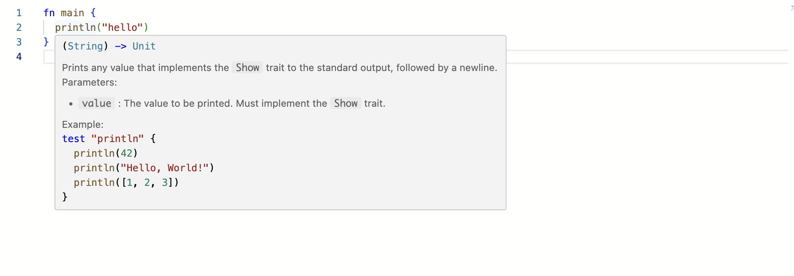
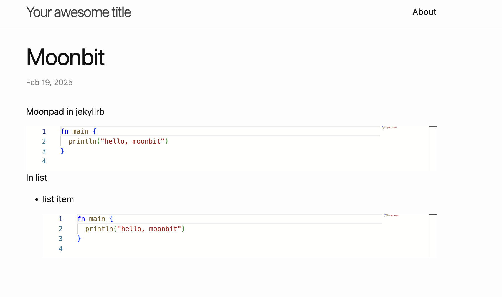
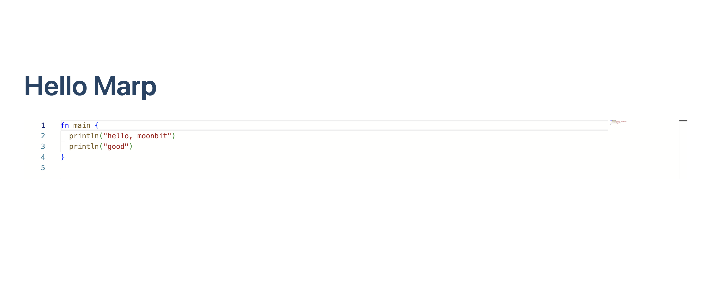

# 如何在你的网站中使用 Moonpad


在[MoonBit官网](https://www.moonbitlang.cn)和[语言导览](https://tour.moonbitlang.com/zh/index.html)中都有一个组件可以在浏览器中直接编写 MoonBit 代码并实时编译运行。它就是我们开发的 Moonpad 组件，目前已经发布到 [npm](https://www.npmjs.com/package/@moonbit/moonpad-monaco) 上，这篇博客将介绍如何在你的网站中使用 Moonpad。

这篇博客中出现的所有代码已都上传到 github，你可以在 [https://github.com/moonbit-community/moonpad-blog-examples](https://github.com/moonbit-community/moonpad-blog-examples) 中看到。

## 什么是 Moonpad

MoonBit 插件目前已具备多种为开发者带来极大便利的功能。除了针对 MoonBit 语法的高亮显示、自动补全，以及错误提示等功能的支持外，还实现了开箱即用的调试器、实时值追踪、测试以及内置的MoonBit AI助手，能够非常有效地减少除核心开发以外的工作量，提供一个高效流畅的开发环境。

在本篇教程中介绍的 Moonpad 是一个基于 monaco editor 的在线 MoonBit 编辑器，支持 MoonBit 语法高亮、自动补全、错误提示等功能。除此之外还支持在浏览器中实时编译 MoonBit 代码，可以说是一个在浏览器上的简单版 MoonBit 插件。它在 MoonBit 的官网和语言导览已经有所使用。如果你想体验完整版的 MoonBit 开发功能可以安装我们的 [VS Code 插件](https://aka.moonbitlang.com/vsh)。

## 如何使用 Moonpad

### 准备

新建一个 JS 项目：

```bash
mkdir moonpad
cd moonpad
npm init -y
```

安装依赖：

```bash
npm i @moonbit/moonpad-monaco esbuild monaco-editor-core
```

每个依赖的作用如下：

- `@moonbit/moonpad-monaco` 是一个 monaco editor 的插件，提供 MoonBit 语法高亮、自动补全、错误提示、编译源代码等功能。
- `esbuild` 是一个快速的 JavaScript 打包工具，用于打包源码。
- `monaco-editor-core` 是 monaco editor 的核心库。选择这个库而不是`monaco-editor`的原因是，这个库没有 monaco editor 自带的 MoonBit 用不上的各种其他语言的语法高亮和 html, css, js 等语言的语义支持，打包出来的体积更小。

### 编写代码

接下来我们需要编写使用 moomnpad 和 monaco editor 的代码以及构建脚本。

以下展示的代码都是在 `moonpad` 目录下编写的。并且带有大量注释，以便你更好的理解。

创建 `index.js` 文件并输入以下代码：

```js
import * as moonbitMode from "@moonbit/moonpad-monaco";
import * as monaco from "monaco-editor-core";

// monaco editor 要求的全局变量，具体可以查看其文档：https://github.com/microsoft/monaco-editor
self.MonacoEnvironment = {
  getWorkerUrl: function () {
    return "/moonpad/editor.worker.js";
  },
};

// moonbitMode 是一个 monaco-editor 的扩展，也就是我们提到的 Moonpad。
// moonbitMode.init 会初始化 MoonBit 的各种功能，并且会返回一个简单的 MoonBit 构建系统，用于编译/运行 MoonBit 代码。
const moon = moonbitMode.init({
  // 一个可以请求到 onig.wasm 的 URL 字符串
  // onig.wasm 是 oniguruma 的 wasm 版本。oniguruma 是一个正则表达式引擎，在这里用于支持 MoonBit 的 textmate 语法高亮。
  onigWasmUrl: new URL("./onig.wasm", import.meta.url).toString(),
  // 一个运行 MoonBit LSP 服务器的 Worker，用于给 MoonBit 语言提供LSP服务。
  lspWorker: new Worker("/moonpad/lsp-server.js"),
  // 一个工厂函数，返回一个运行 MoonBit 编译器的 Worker，用于在浏览器中直接编译 MoonBit 代码。
  mooncWorkerFactory: () => new Worker("/moonpad/moonc-worker.js"),
  // 一个配置函数，用于配置哪些codeLens需要被显示。这里我们出于简单的考虑，直接返回false，不显示任何codeLens。
  codeLensFilter() {
    return false;
  },
});
// 值得一提的是，这里所有的路径都是硬编码的，这意味着后面在编写构建脚本时，我们需要确保这些路径都是正确的。

// 挂载 Moonpad

// 创建一个 editor model，并且指定其 languageId 为 "moonbit"，在这里我们可以初始化代码内容，
// moonpad 只对 languageId 为 "moonbit" 的 model 提供 LSP 服务。
const model = monaco.editor.createModel(
  `fn main {
  println("hello")
}
`,
  "moonbit",
);

// 创建一个 monaco editor，展示我们之前创建的 model，并将其挂载到 `app` div 元素上。
monaco.editor.create(document.getElementById("app"), {
  model,
  // 这个主题是 moonpad 提供的主题，相比于 monaco 自带的主题，语法高亮效果更好。
  // 此外 moonpad 还提供了一个暗色主题 "dark-plus"，你可以尝试将其替换为 "dark-plus"。
  theme: "light-plus",
});
```

创建 `esbuild.js` 并输入以下代码，这是我们的构建脚本，用于打包 `index.js` ：

```js
const esbuild = require("esbuild");
const fs = require("fs");

// dist 是我们的输出目录，这里把它清空，确保 esbuild 总是从头开始构建
fs.rmSync("./dist", { recursive: true, force: true });

esbuild.buildSync({
  entryPoints: [
    "./index.js",
    // 打包 monaco editor 用于提供编辑服务的 worker，这也是 `index.js` 中 MonacoEnvironment.getWorkerUrl 的返回值。
    // 之前提到所有的路径都是硬编码的，所以下面会使用 `entryNames` 确保这个 worker 打包之后的名字是 `editor.worker.js`。
    "./node_modules/monaco-editor-core/esm/vs/editor/editor.worker.js",
  ],
  bundle: true,
  minify: true,
  format: "esm",
  // 输出目录对应我们在 `index.js` 中硬编码的路径。
  outdir: "./dist/moonpad",
  entryNames: "[name]",
  loader: {
    ".ttf": "file",
    ".woff2": "file",
  },
});

fs.copyFileSync("./index.html", "./dist/index.html");

// 复制 `index.js` 中初始化 moonpad 所需要的各种 worker 文件。
// 由于它们已经被打包过了，所以不需要用 esbuild 再次打包。
fs.copyFileSync(
  "./node_modules/@moonbit/moonpad-monaco/dist/lsp-server.js",
  "./dist/moonpad/lsp-server.js",
);
fs.copyFileSync(
  "./node_modules/@moonbit/moonpad-monaco/dist/moonc-worker.js",
  "./dist/moonpad/moonc-worker.js",
);
fs.copyFileSync(
  "./node_modules/@moonbit/moonpad-monaco/dist/onig.wasm",
  "./dist/moonpad/onig.wasm",
);
```

最后是 `index.html` 文件，非常简单，没什么值得注意的。

```html
<!DOCTYPE html>
<html lang="en">
  <head>
    <meta charset="UTF-8" />
    <meta name="viewport" content="width=device-width, initial-scale=1.0" />
    <title>Document</title>
    <link rel="stylesheet" href="/moonpad/index.css" />
  </head>
  <body>
    <div id="app" style="height: 500px"></div>
    <script type="module" src="/moonpad/index.js"></script>
  </body>
</html>
```

### 构建并启动服务器

运行构建脚本

```sh
node esbuild.js
```

此时 `dist` 文件夹应包含以下文件：

```
dist
├── index.html
└── moonpad
    ├── codicon-37A3DWZT.ttf
    ├── editor.worker.js
    ├── index.css
    ├── index.js
    ├── lsp-server.js
    ├── moonc-worker.js
    └── onig.wasm

2 directories, 8 files
```

此处展示的 `codicon-37A3DWZT.ttf` 文件后面的哈希值不一定与你实际操作下来的相同，但是无伤大雅。

在 dist 文件夹下启动一个 http 服务器：

```sh
python3 -m http.server 8081 -d ./dist
```

打开 [locahost:8081](http://localhost:8081/)，可以看到 moonpad 已经成功渲染出来了。



## 如何在你的网站中使用 Moonpad

接下来我们以 [jekyll](https://jekyllrb.com/) 和 [marp](https://marpit.marp.app/) 为例，展示如何在你的网站中使用 Moonpad。

### 原理

在上一节中我们最终得到了一个 `moonpad` 文件夹，其中包含使用 Moonpad 需要的所有文件。任何网页只要修改一下 `index.js` 最后硬编码的挂载逻辑然后导入 `moonpad/index.js` 和 `moonpad/index.css`，就可以直接使用 Moonpad。

所以，想要在网页中使用 Moonpad，我们需要做的是：

1. 根据不同的网页框架修改 `moonpad/index.js` 中的挂载逻辑。
1. 在需要使用 Moonpad 的页面中导入 `moonpad/index.js` 和 `moonpad/index.css`。
1. 将 `moonpad` 文件夹放到网站的静态资源目录下。确保它的路径是 `/moonpad`

### 在 jekyll 中使用 Moonpad

[Jekyll](https://jekyllrb.com/) 是一个简单的、博客感知的静态网站生成器。它使用 Markdown 或 Textile 以及 Liquid 模板引擎来生成静态网页。Jekyll 通过将内容与模板结合，生成可以直接部署到任何 Web 服务器上的静态文件。它特别适合用于 GitHub Pages，允许用户轻松地创建和维护博客或网站。

#### 观察 jekyll 渲染代码块的结构

在 jekyll 中对于这样的 markdown 代码块：

````markdown
```moonbit
fn main {
  println("hello, moonbit")
}
```
````

会生成如下的 html 结构：

```html
<pre><code class="language-moonbit">fn main {
  println("hello, moonbit")
}
</code></pre>
```

如果我们希望 jekyllrb 中所有的 moonbit 代码块都在 Moonpad 中渲染，那么我们需要将生成的 `pre` 元素替换为 `div` 并将 Moonpad 挂载在这个 `div` 上。

以下是这个逻辑的实现：

```js
// 便利所有的 moonbit 代码块
for (const pre of document.querySelectorAll("pre:has(code.language-moonbit)")) {
  // 获得代码块的内容
  const code = pre.textContent;
  // 创建一个 div 元素，这将会是 monaco editor 的挂载点
  const div = document.createElement("div");
  // 根据代码内容设置 div 的高度
  const height = code.split("\n").length * 20;
  div.style.height = `${height}px`;
  // 将代码块替换为 div
  pre.replaceWith(div);
  // 使用获得的代码内容创建一个 monaco editor model
  const model = monaco.editor.createModel(code, "moonbit");
  // 创建 monaco editor 并挂载到 div 上，展示上一行创建的 model
  monaco.editor.create(div, {
    model,
    theme: "light-plus",
  });
}
```

只需将上面的代码替换掉 `index.js` 中的挂载逻辑即可。

#### 导入 Moonpad

jekyll 支持在 markdown 中直接使用 html，所以我们可以在 markdown 中直接导入 Moonpad。在需要使用 Moonpad 的 markdown 文件中的最后加入以下代码即可。

```html
<link rel="stylesheet" href="/moonpad/index.css" />
<script type="module" src="/moonpad/index.js"></script>
```

#### 将 moonpad 文件夹放到 jekyll 的静态资源目录下

在执行 `jekyll build` 之后，jekyll 会将所有的静态资源放到 `_site` 目录下。我们只需要将 `moonpad` 文件夹复制到 `_site` 目录下即可。

复制后 `_site` 文件夹的目录结构应为

```
_site/
├── ... # 其他静态资源
└── moonpad
    ├── codicon-37A3DWZT.ttf
    ├── editor.worker.js
    ├── index.css
    ├── index.js
    ├── lsp-server.js
    ├── moonc-worker.js
    └── onig.wasm
```

#### 结果

完成以上步骤后，即可在 jekyll 中使用 Moonpad。效果如下：



### 在 marp 中使用 Moonpad

[Marp](https://marp.app/) 是一个 Markdown 转换工具，可以将 Markdown 文件转换为幻灯片。它基于 [Marpit](https://marpit.marp.app/) 框架，支持自定义主题，并且可以通过简单的 Markdown 语法来创建和设计幻灯片，非常适合用于制作技术演示文稿。

#### 观察 marp 渲染代码块的结构

对于和上一小节 jekyll 中相同的代码块，marp 渲染出来的 html 结构大致如下：

```html
<marp-pre>
  ...
  <code class="language-moonbit">fn main { println("hello, moonbit") } </code>
</marp-pre>
```

显然，如果我们希望所有的 moonbit 代码块都使用 moonpad 渲染，我们需要将 `marp-pre` 替换为 `div` 并将 Moonpad 挂载在这个 `div` 上。

以下是这个逻辑的实现，和 jekyll 的例子大同小异：

```js
for (const pre of document.querySelectorAll(
  "marp-pre:has(code.language-moonbit)",
)) {
  const code = pre.querySelector("code.language-moonbit").textContent;
  const div = document.createElement("div");
  const height = code.split("\n").length * 20;
  div.style.height = `${height}px`;
  pre.replaceWith(div);
  const model = monaco.editor.createModel(code, "moonbit");
  monaco.editor.create(div, {
    model,
    theme: "light-plus",
  });
}
```

只需将上面的代码替换掉 `index.js` 中的挂载逻辑即可。

#### 导入 Moonpad

marp 同样支持在 markdown 中使用 html，但需要显示开启这个选项。在需要使用 Moonpad 的 markdown 文件中的最后面加入以下代码：

```html
<link rel="stylesheet" href="/moonpad/index.css" />
<script type="module" src="/moonpad/index.js"></script>
```

并在构建时开启 `html` 选项：

```sh
marp --html
```

#### 将 moonpad 文件夹放到 marp 的静态资源目录下

在 marp 中预览幻灯片一般有两种方式，一种是使用 marp 自带的 server 功能，另一种是将 markdown 文件导出为 html，自行配置服务器。

对于 marp 自带的 server 功能，我们需要将 `moonpad` 文件夹放到 `marp --server` 命令指定的文件夹内。

对于将 markdown 导出为 html 的情况，我们需要保证 `moonpad` 文件夹和导出的 html 文件在同一个目录下。

#### 结果

完成以上步骤后，即可在 marp 中使用 Moonpad。效果如下：



可惜的是，在 marp 中 monaco editor 的 hover 提示位置不对，目前我们还不知道如何解决这一问题。

## 如何使用 Moonpad 编译 MoonBit 代码

上面提到 `moonbitMode.init` 会返回一个简单的构建系统，我们可以使用这个构建系统来编译并运行 MoonBit 代码。它暴露了两个方法: `compile` 和 `run`：分别用来编译和运行 MoonBit 代码。例如：

```js
// compile 还可以通过参数进行更多的配置，例如编译带测试的文件等。这里我们只编译一个单文件
const result = await moon.compile({ libInputs: [["a.mbt", model.getValue()]] });
switch (result.kind) {
  case "success":
    // 如果编译成功，则会返回编译器 js 后端编译出来的 js 代码
    const js = result.js;
    // 可以使用 run 方法运行编译出来的 js，得到标准输出的流。
    // 值得注意的是，这里流的最小单位不是字符，而是标准输出每一行的字符串。
    const stream = moon.run(js);
    // 将流中的内容收集到 buffer 中，并在控制台输出。
    let buffer = "";
    await stream.pipeTo(
      new WritableStream({
        write(chunk) {
          buffer += `${chunk}\n`;
        },
      }),
    );
    console.log(buffer);
    break;
  case "error":
    break;
}
```

打开控制台，可以看到输出了 `hello`。

对于`compile`函数的更多用法以及把代码输出展示在页面上的方法，可以参考语言导览中的代码：[moonbit-docs/moonbit-tour/src/editor.ts#L28-L61](https://github.com/moonbitlang/moonbit-docs/blob/a5dab53482b694d5f065cc4ba6a540b72193c321/moonbit-tour/src/editor.ts#L28-L61)

**下一步**

- [下载 MoonBit](https://aka.moonbitlang.com/vsh)
- [MoonBit 初学者之旅](https://docs.moonbitlang.cn/tutorial/tour.html)
- [MoonBit 语言导览](https://tour.moonbitlang.com/zh/index.html)
- 查看 [MoonBit 文档](https://docs.moonbitlang.cn/)
- 参与 [MoonBit 线上挑战赛](https://www.moonbitlang.cn/2024-oj-contest/)
