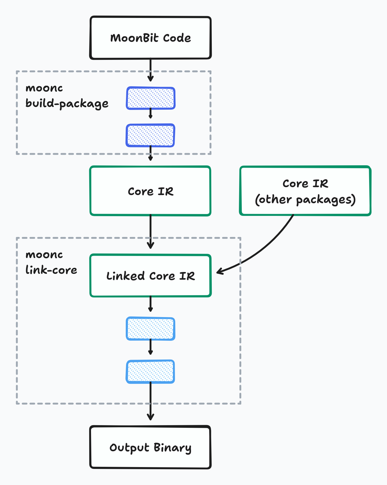
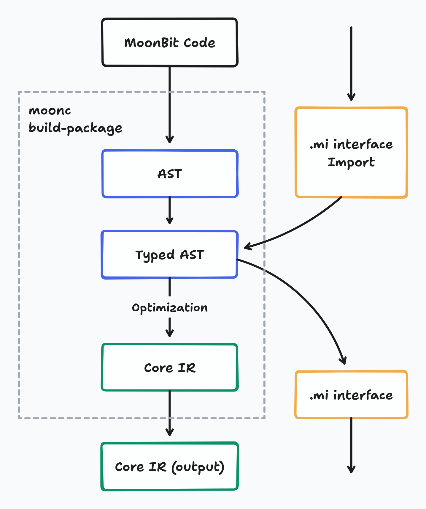
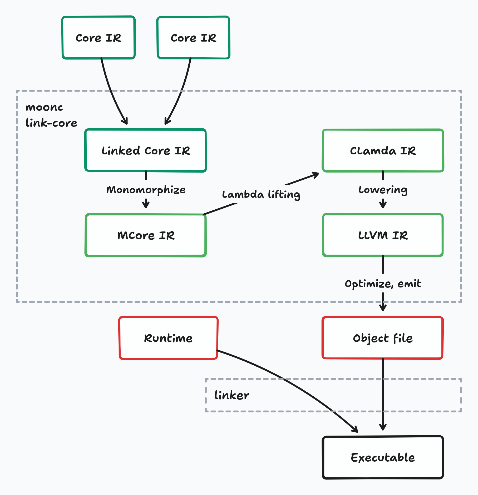
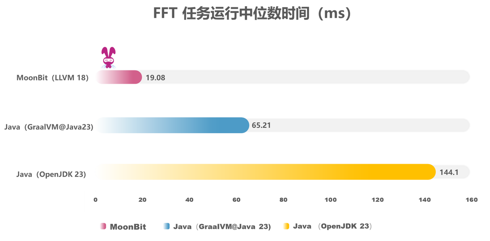
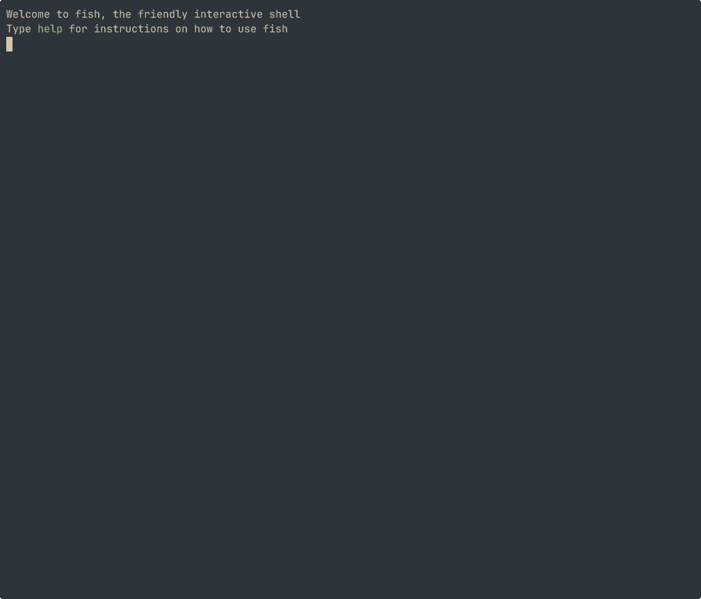

# MoonBit成为北大编程课程语言；LLVM后端同步发布

MoonBit 团队近期取得两项进展。

MoonBit 语言发布了 LLVM 后端编译器。通过LLVM，MoonBit 可以直接编译为原生二进制文件，不再依赖C编译器，避免了兼容性问题。团队可以将更多精力投入在在运行时系统的创新上。

几乎同一时间，MoonBit 被纳入北京大学的编程语言课程，成为教学实践中的重要工具。

相比于推动企业生态的转型，高校教育场景为新的编程语言提供了最肥沃的土壤，因为学生群体具备高度开放性与探索精神。通过与课程体系融合，新语言能以自然和高效的方式进入年轻开发者的视野，从而逐步塑造未来的技术生态。

MoonBit 成为了少数能在工业级性能与教学实践价值之间，取得平衡的编程语言及开发者工具链。

MoonBit 团队近期双线告捷：LLVM 后端编译器发布，初步测试显示其性能超过主流语言水平，实验性的支持原生后端调试功能。

当前，国产基础软件的自主化进程正迈向深水区。

作为这一进程中的代表性力量，MoonBit 以 “快速、简单、可拓展” 为核心特质，构建跨越学术与产业的技术生态。

自2022年诞生以来，MoonBit 通过多后端架构设计，在编译速度、运行效率和代码体积等关键指标上实现对传统编程语言的超越，覆盖从嵌入式设备到云端服务的全栈开发场景。

在此过程中，MoonBit 逐渐找到了自己的位置，即做引领者而非追随者，和全球开发者并肩，重新定义编程语言的未来规则。

## LLVM后端发布

MoonBit 的核心目标是通过性能突破与开发者体验革新，解决现有编程语言在关键场景中的效率瓶颈，如高并发和资源受限环境。

MoonBit 同步完善 C 后端并推出 LLVM 后端，分别针对嵌入式设备优化与跨平台高性能场景，通过统一工具链，实现了从硬件层到服务端的全场景覆盖。

**LLVM 的引入，让 MoonBit 语言自身编译到原生二进制文件的过程可以完全脱离 C 编译器进行，避免了 C 编译器带来的兼容性问题。**

在支持直接分发预编译的运行时库后，MoonBit 程序将彻底脱离对 C 编译器的依赖，可以仅依赖链接器生成原生程序。

有了 LLVM 处理底层的编译工作，团队可以将更多精力投入在在运行时系统的创新上。比如利用LLVM 对异常处理的完整支持，将错误处理函数优化为性能更好的 try-catch 实现。

1. 性能维度：
LLVM 后端复用与 Rust/Swift 相同的工业级优化管线（如自动向量化、LTO），为 MoonBit 提供与现代语言同级的优化潜力。
2. 体验维度：
原生集成 DWARF 调试信息，支持 GDB/LLDB 源码级调试，并计划实现运行时数据结构可视化。
3. 生态扩展：
基于 LLVM 对 RISC-V 向量扩展等新硬件的原生支持，MoonBit 可快速适配前沿架构。

MoonBit 的编译流程采用 “两阶段分层优化” 架构，兼顾开发效率与运行时性能。其核心思想是：在包级别进行轻量级即时优化，在链接阶段实施全局深度优化，既满足增量编译的敏捷性，又保障最终产物的性能。

## 成为北京大学课程语言

北京大学计算机学院近日调整其研究生课程《编程语言的设计原理》。**自2025年春季学期起，MoonBit 替代编程语言OCaml 成为该课程推荐的实践工具。**

高校在选择教学工具时，通常对语言的成熟度和稳定性有着严格的要求。编程语言的发展通常较为漫长，像OCaml等经典语言经过30多年的学术验证，才逐步在教学中得到广泛应用。

在此背景下，北京大学计算机学院率先将诞生仅两年的 MoonBit 引入其编程语言理论课程，无疑是创新之举。

MoonBit在工具链和语言特性的支持上，相比传统编程语言具有更好的表达能力和开发体验。

不仅保留了函数式编程的核心范式，还通过现代化工具链、AI编程和内存安全机制的整合，**为教学场景提供了从理论到实践的衔接**。

## MoonBit 发展历程

过去一年，MoonBit 的全球用户数实现了12倍的指数级增长，且在国内外知名高校、海外云服务提供商、国家信息学竞赛组织等多个应用场景中落地。

根据2024年度 MoonBit 社区调查反馈，59.14%的用户已使用MoonBit 超过3个月，并持续运用在日常开发工作中。

在稳定的用户基础上，80%的用户评价 MoonBit 的性能为“优秀”。用户普遍认可其语言特性和平台规模生态。平台已实现从开发到部署的全流程自动化，尤其在微服务架构和云原生应用领域具有独特优势。

## LLVM 编译流程

MoonBit 程序的编译流程可以分为两部分。

第一部分是按需和增量式的，通过命令 `moonc build-package` 将每个包从源代码编译，输出我们称为 Core IR 的中间表示。Core IR 是一个以 ANF（Administrative Normal Form）风格的中间表示，我们用它来进行编译器优化。在这一部分，我们对 IR 进行各种优化。

第二部分是通过命令 `moonc link-core` 将包链接成最终的二进制文件。在这里，来自不同包的 Core IR 被链接在一起并再次优化，使用死代码消除、内联等优化技术。后结果被传递到编译流程的下游，最终生成输出二进制文件。

### 包的编译

在每个包的编译过程中，编译从抽象语法树（AST）开始——这是原始代码在内存中的结构化表示。

然后，从代码结构和导入的库中推断每个表达式的类型。这给我们带来了带类型的 AST（TAST）——每个表达式都标注了类型的 AST。

从 TAST，我们将其降级为主要的中间表示 Core IR，并进行一些高层级的变换和优化。这些优化包括将异步函数转换为普通形式，对不会逃逸的数据结构进行拆箱，以及删除未被其他代码引用的死代码。经过这些优化的 Core IR 结果成为每个库的编译形式。

### 链接和代码生成

与许多在链接后不做太多处理的编译型编程语言不同，MoonBit 的编译流程中，在 Core IR 链接后还有一系列降级和优化过程，逐步将 IR 转换为目标代码。

在编译时，来自不同包的 Core IR 首先被链接在一起。然后，通过优化和单态化（也就是移除泛型函数）转换为 MCore IR，再通过另一个移除闭包和降级的过程转换为 CLambda IR。垃圾收集的调用也在这个阶段被添加。

CLambda IR 是生成不同后端代码之前的最后一步。对于 WASM、JS 和 C 后端，输出代码是自包含的，所以只需要一步就能生成输出代码，然后将其写入输出文件。

LLVM 后端做的事情比其他后端要稍微复杂一些：CLambda IR 被转换为 LLVM IR，并通过 LLVM 库中的更多优化过程。在所有 LLVM 优化之后，代码被生成为目标文件，最后与预构建的运行时链接成一个可执行文件。

### 性能实测：LLVM 后端的工业级表现

LLVM 后端的 MoonBit 在性能方面也有着不俗的成绩。比如使用经典的 FFT 算法 benchmark ，让 MoonBit 和 Java 运行同样的 Cooley-Tukey 算法。MoonBit 相比 Java 有8倍以上的性能提升，比将 Java 静态编译的编译器 GraalVM 也有3倍以上的性能提升。
下面是 MoonBit 与 Java 实现的 FFT 算法的性能对比。FFT（快速傅里叶变换）是一个计算序列的离散傅里叶变换的高效算法，在信号处理、压缩等许多领域有重要应用。FFT 算法涉及大量数值运算和数组操作，可以很好地体现语言的基础性能：

由于 LLVM 后端涉及到更多的底层调整和优化，工具链还尚未能完全发挥 LLVM 所带来的性能优势。团队将会在未来的更新中继续优化 LLVM 后端生成的代码质量，进一步提升它的性能。

### 原生后端调试支持

在面向虚拟机的 JS 后端，借助 Chrome Debugger，MoonBit真正实现了调试体验的"开箱即用"。然而，对于面向原生平台的 C 后端，调试体验却并不完全尽如人意。在 C 后端中，用户可以调试编译后生成的 C 文件，但是 C 文件与输出的原始文件的映射信息在这一过程中依然是缺少的。

在 LLVM 的帮助下，当前MoonBit编译器已具备向最终二进制文件注入DWARF格式符号表的能力。

MoonBit 现在可以向输出二进制文件中插入调试信息，将二进制文件中的指令直接对应到源文件和行号列号。这一功能将很大程度上改善输出的文件与源代码映射信息缺失的问题。

基于该调试信息生成机制，MoonBit工具链支持开发者使用标准调试工具（如LLDB）对编译产物进行源码级调试。

具体而言，调试器能够自动解析符号映射关系，当执行流到达预设的源码位置时准确触发断点中断。比如，可以在 lldb 调试器中插入断点，以将程序在指定的位置暂停。

虽然目前 MoonBit LLVM 后端对调试信息支持仍处于初步阶段，但已经对开发调试有了一定的帮助。团队后续会加入对调试器更好的支持，比如在调试器中展示局部变量和数据结构当前的值，以及更好的 name mangling 等。

### 未来展望

LLVM 的引入带来的最显著的改进是，MoonBit 语言自身编译到原生二进制文件的过程可以完全脱离 C 编译器进行，避免了 C 编译器带来的各种兼容性问题。在支持直接分发预编译的运行时库后，MoonBit 程序将彻底脱离对 C 编译器的依赖，可以仅依赖链接器生成原生程序。

有了 LLVM 处理底层的编译工作，团队可以将更多精力投入在在运行时系统的创新上，比如利用LLVM 对[异常处理](https://llvm.org/docs/ExceptionHandling.html)的完整支持，将错误处理函数优化为性能更好的 try-catch 实现；LLVM 对[追踪式垃圾收集](https://llvm.org/docs/GarbageCollection.html)的原生支持能够考虑用追踪式 GC 来替代现有的 Perceus 和引用计数方案。

**下一步**

- [下载 MoonBit](https://aka.moonbitlang.com/vsh)
- [MoonBit 初学者之旅](https://docs.moonbitlang.cn/tutorial/tour.html)
- [MoonBit 语言导览](https://tour.moonbitlang.com/zh/index.html)
- 查看 [MoonBit 文档](https://docs.moonbitlang.cn/)
- 参与 [MoonBit 线上挑战赛](https://www.moonbitlang.cn/2024-oj-contest/)
