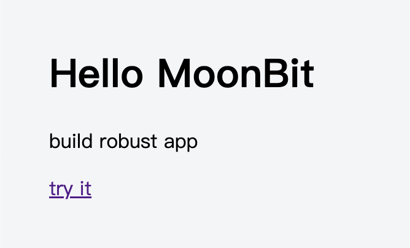

# 在 MoonBit 中引入 Elm 架构：用简单原则打造健壮的 Web 应用


Elm 是一种纯函数式编程语言，专为构建前端 Web 应用程序而设计。它编译为 JavaScript，强调简洁性、性能和健壮性。

纯函数式的含义是函数没有副作用，这使得代码更易于理解和调试。通过强大的静态类型检查，Elm 确保应用程序不会抛出运行时异常，从而提供更高的可靠性。Elm 架构强制执行单向数据流，使状态管理变得可预测且简单。

受 Elm 的启发，我们使用 MoonBit 开发了一个名为 [Rabbit-TEA](https://github.com/moonbit-community/rabbit-tea) 的前端 Web 框架。

## 为什么选择 MoonBit？

函数式编程的兴起也推动了 React 从基于类的范式向 React Hooks 的演进。在 JavaScript 中已经有了一些函数式框架，那么为什么还需要 MoonBit？

尽管 JavaScript 生态中已经有一些支持函数式风格的框架和库，但 JavaScript 本身缺乏诸如模式匹配等特性，这使得编码体验不够理想。以下是 MoonBit 和 JavaScript 等效代码的对比：

```moonbit
let x = match y {
  a => value1
  b => value2
  c => value3
}
f(x)
```

```javascript
var x = null;
if (y == a) { x = value1 }
else if (y == b) { x = value2 }
else { x = value3 }
// x 可能会在这里被意外修改！
return f(x);

// 或者
const x = y == a ? value1 : (y == b ? value2 : value3);
return f(x);
```

以下是另一个 MoonBit 例子。函数 `validate_utf8` 检查输入的 `bytes` 是否是有效的 UTF-8 序列：

```moonbit
fn validate_utf8(bytes : Bytes) -> Bool {
  loop bytes {
    [0x00..=0x7F, ..xs]
    | [0xC0..=0xDF, 0x80..=0xBF, ..xs]
    | [0xE0..=0xEF, 0x80..=0xBF, 0x80..=0xBF, ..xs]
    | [0xF0..=0xF7, 0x80..=0xBF, 0x80..=0xBF, 0x80..=0xBF, ..xs] => continue xs
    [_, ..] => false
    [] => true
  }
}
```

MoonBit 是一种面向表达式的语言，变量默认是不可变的。它完全支持模式匹配这一在函数式编程语言中流行已久的特性，确保生成高效的 JavaScript 代码。此外，MoonBit 编译器支持多种后端，包括 JavaScript、WebAssembly 和 native 后端。

## Rabbit-TEA 如何工作

TEA 架构非常的简单，它由 Model、View、Update 组成：

- Model：App 的状态，由不可变的数据结构组成。
- View：App 的视图，声明了如何将 Model 显示为 HTML、用户的操作触发什么消息。
- Update：App 的逻辑，处理用户触发的消息，将旧的 Model 转换为新的 Model。

下面是一个完整的计数器程序：

```moonbit
typealias Model = Int
let model = 0

enum Msg {
  Increment
  Decrement
}

fn update(msg : Msg, model : Model) -> (Command[Msg], Model) {
  match msg {
    Increment => (none(), model + 1)
    Decrement => (none(), model - 1)
  }
}

fn view(model : Model) -> Html[Msg] {
  div([
    h1([text(model.to_string())]),
    button(click=Msg::Increment, [text("+")]), // button1
    button(click=Msg::Decrement, [text("-")]), // button2
  ])
}

fn main {
  @tea.startup(model~, update~, view~)
}
```

这个程序除了定义 Model、Update 和 View，还定义了 `Msg` 类型。`Msg` 类型类似于事件。当用户点击增加按钮时，会触发运行时向 `update` 函数发送 `Increment` 消息以及当前的 `model`。在 `update` 函数中，并不会直接修改 `model`，而是基于旧值创建一个新的 `model` 并返回。整个函数是无副作用的。最后，新的 `model` 将通过 `view` 函数渲染为 HTML。

`update` 函数还返回一个 `Cmd` 类型，它表示一个未执行的操作。我们稍后会对此进行介绍。

## 声明式视图: HTML EDSL

EDSL 即内嵌领域特定语言，是通过利用编程语言已有的语法结构设计的 DSL，不需要额外的预处理和编译步骤。

Rabbit-TEA 使用 MoonBit 的 labeled argument 语法糖定义了一组辅助函数，这些 HTML 函数尽可能地通过类型来提示用户参数的作用, 避免滥用模糊和令人困惑的 `String` 类型。它们使用起来就像：

```moonbit
fn view() -> Html[Msg] {
  div([
    h1([text("hello MoonBit")]),
    p([text("build robust app")]),
    a(href="moonbitlang.com", target=Blank, [text("try it")]),
  ])
}
```



以标签 `<a>` 为例子，它的辅助函数的类型定义如下。除了唯一的 `childrens` 参数，其他所有参数都是 labeled argument，labeled argument 根据需要可以声明为可选的，或者设置缺省值。

```moonbit
pub(all) enum Target {
  Self
  Blank
}

pub fn a[M](
  style~ : Array[String] = [],
  id? : String,
  class? : String,
  href~ : String,
  target~ : Target = Self,
  childrens : Array[Html[M]]
) -> Html[M]
```

在未来，我们将考虑在 MoonBit 中引入类似 JSX 的拓展语法，使视图的代码拥有更好的可读性。

## 消息与模式匹配

TEA 架构充分利用了模式匹配和带标签联合类型，用户定义的 Msg 可以视情况带上额外的数据，这使得 `update` 处理消息时更加安全和灵活。

例如，对于一个 `input` 元素，假如希望在用户输入的同时，处理它的值并将结果显示在另一个元素 `p` 中。我们可以在 `Msg` 类型中增加一个带 `String` 数据的 enum constructor，`GotInputChange`。`GotInputChange` 的类型和 `input` 中 `change` 参数的类型都是 `(String) -> Msg`。用户在修改 `input` 的值时，`input` 的值会被打包进 `GotInputChange` 并发送给 `update` 函数处理。

```moonbit
enum Msg {
  GotInputChange(String)
}

fn update(msg : Msg, model : String) -> (Cmd[Msg], String) {
  match msg {
    GotInputChange(value) => {
      ...
      (none(), value)
    }
  }
}

fn view(model : String) -> Html[Msg] {
  div([
    p([text(model)])
    input(input_type=Text, value=model, change=Msg::GotInputChange),
  ])
}
```

依靠 MoonBit 的穷尽性检查，下次 `Msg` 增加新的 enum constructor 时，IDE 将会提示相关的 pattern matching 需要处理新的 case，减少运行时错误。

## 管理副作用

Rabbit-TEA 与 Elm 一样使用 Cmd 类型管理函数的副作用，也就是修改外部状态、与外部系统交互的操作。
例如，请求浏览器记录 URL History、滚动浏览器视图、向服务器发送 JSON 请求并处理返回的数据。
所有的这些操作被封装为 Cmd。Cmd 代表一个未执行的动作，只有当它被 Update 函数的返回时，才会被 Rabbit-TEA 的 runtime 触发执行。

下面的例子演示了在用户点击相关的卡片时，先将界面转换为加载状态，然后通过 http 请求加载卡片的内容。
`@http.get` 返回了一个 Cmd，而它的第一个参数是请求的 URL，第二个参数声明期望的数据格式和处理响应的方法。

```moonbit
enum Msg {
  GotCardText(Result[String, String])
  ClickCard(Int)
}

pub fn update(msg : Msg, model : Model) -> (Cmd[Msg], Model) {
  match msg {
    ClickCard(id) => (@http.get("/api/card/\{id}", expect=Text(GotCardText)), Loading)
    GotCardText(Ok(text)) => (none(), Editing(text))
    GotCardText(Err(_)) => (none(), NotFound)
  }
}
```

这样一来，服务器响应请求时将触发 `GotCardText` 这个消息。它带上了一个 `Result[String,String]` 类型，
这提示我们对响应进行分类讨论：当成功返回 card text 时，我们更新 `model` 以便 `view` 向用户展示内容；当请求失败时，我们跳转到 `NotFound` 页面。

`Cmd` 模式鼓励用户避免在一个函数中交替地触发副作用和更新 Model，从而防止 update 和 view 同时存在两个 Model 的数据来源，保证程序状态的一致性。

## 与 JS 世界交互

上面提到的这些 Cmd 并非经过框架特殊处理，而是基于 Cmd 的接口实现的。你也可以定义自己的 Cmd 来让 Rabbit-TEA 和外部的 JS 世界交互。MoonBit 允许以内联的形式书写 JS 代码，并将它和函数定义绑定。这很简单：

```moonbit
extern "js" fn set_timeout(f : () -> Unit, ms : Int) = "(f,ms) => setTimeout(f, ms)"
```

`set_timeout` 绑定了 JS 的函数 `setTimeout`。参数 f 表示将要触发的动作，`ms` 表示触发前等待的时间。
我们定义一个函数 `delay`。它接受的参数 `msg` 表示将要触发的消息，`ms` 作用同上，最终返回 `Cmd`。

```moonbit
fn delay[M](msg : M, ms : Int) -> Cmd[M] {
  Cmd(fn(events){
    set_timeout(fn(){ events.trigger_update(msg) }, ms)
  })
}
```

`Cmd` 类型的值可以通过同名的 `Cmd` 构造器创建，它是一个未执行的动作的包装。在这个包装中，我们让 `set_timeout` 在合适的时机调用 `events.trigger_update(msg)`，让运行时使用 `msg` 和当前的 `model` 调用 `update` 函数。

我们可以使用这个 `delay` 函数，在用户点击按钮的5秒后显示一段文本：

```moonbit
enum Msg {
  Timeout(String)
  SetTime
}

fn update(msg : Msg, model : String) -> (Cmd[Msg], String) {
  match msg {
    Timeout(tips) => (none(), tips)
    SetTime => (delay(Timeout("You clicked the button 5s ago."), 5000), "")
  }
}

fn view(model : String) -> Html[Msg] {
  div([
    text(model),
    button(click=Msg::SetTime, [text("show tips after 5s")]),
  ])
}
```

不过，在编写内联 JS 时需要小心运行时错误。我们计划在 Rabbit-TEA 中提供更丰富的 Cmd，用户一般不需要自己编写这些绑定。

## 轻量的运行时

我们开发 Rabbit-TEA 时并没有注意过编译生成的 js 文件的大小。得益于 MoonBit 的全局 DCE 优化，我们发现 Rabbit-TEA 在带上 virtual dom 和 MoonBit 的标准库的同时，一个计数器应用生成的代码仅 33KB（经过 minify，未 gzip），小于 vue 的 50～60kb。

## 结论

在实现 Rabbit-TEA 的同时，我们还用它重写 MoonBit 的包管理网站 [mooncakes.io](https://mooncakes.io)。目前 mooncakes.io 和 Rabbit-TEA 还不够完善。我们希望随着 mooncakes.io 的实际应用，Rabbit-TEA 也能够成为成熟可靠的 UI 框架。我们未来也计划探索 TEA 架构的更多可能性，例如 native 后端支持、服务端渲染、时间旅行调试等等令人兴奋的特性。

如果你对这个框架和 MoonBit 感兴趣，也欢迎参与到 MoonBit 的社区当中。

**下一步**

- [下载 MoonBit](https://aka.moonbitlang.com/vsh)
- [MoonBit 初学者之旅](https://docs.moonbitlang.cn/tutorial/tour.html)
- [MoonBit 语言导览](https://tour.moonbitlang.com/zh/index.html)
- 查看 [MoonBit 文档](https://docs.moonbitlang.cn/)
