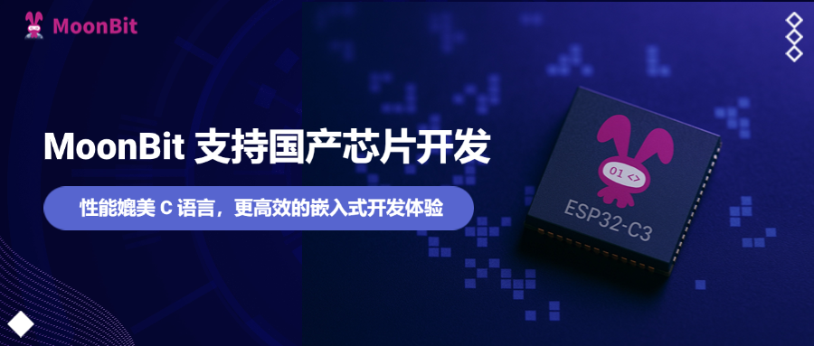

import Video1 from "./video1.mp4"
import Video2 from "./video2.mp4"


# MoonBit支持国产芯片开发--性能媲美C



## 在 ESP32-C3 上实现生命游戏

过去，我们曾在文章[《硬件实现：在ESP32-C6单片机上运行MoonBit WASM-4小游戏》](https://www.moonbitlang.cn/blog/wasm4-hardware)中，展示了如何通过 WebAssembly (WASM) 将 MoonBit 程序移植到物理硬件，初步探索其在嵌入式领域的潜力。
而如今，随着 MoonBit Native 后端 的正式发布: [MoonBit 支持 Native 后端](https://www.moonbitlang.cn/blog/native)，MoonBit 迈出了关键一步：**无需再依赖 WebAssembly 作为中间层，代码可以直接以原生形式运行在嵌入式硬件之上**。
这项进步不仅显著提升了性能和资源利用效率，也为 MoonBit 深度整合进嵌入式与物联网生态、直接控制硬件设备，奠定了坚实基础。

为了具体展示 MoonBit Native 在嵌入式开发中的优势，**本文将通过一个经典实例——在乐鑫 ESP32-C3 芯片（或其 QEMU 仿真环境）上实现“康威生命游戏”——来进行探讨。**

- 生命游戏是一个非常经典的细胞自动机，在一个二维网格上模拟细胞的生死演化。每个细胞的状态（存活或死亡）根据其周围 8 个邻居的状态，在离散的时间步中同时更新。基本规则包括：存活细胞在邻居过少（< 2）或过多（> 3）时死亡，在邻居适中（2或3）时继续存活；死亡细胞在正好有 3 个存活邻居时“复活”。
- ESP32-C3 是一款流行的低成本、低功耗 RISC-V 微控制器，资源相对有限。生命游戏对计算和内存访问有一定要求，使其成为检验嵌入式系统性能和编程语言效率的理想模型。我们的目标是利用 MoonBit 编写生命游戏的核心逻辑，并将其运行结果显示出来。不仅支持在连接了 ST7789 LCD 的真实 ESP32-C3 硬件上运行，也支持在开发机上通过 QEMU 仿真环境运行，以方便开发和验证。

## 准备工作

在开始之前，**请确保你的系统中安装了乐鑫官方提供的链接: ESP IDF 开发框架**。请参考链接: [ESP官方文档](https://docs.espressif.com/projects/esp-idf/zh_CN/v5.4.1/esp32/get-started/index.html#get-started-how-to-get-esp-idf)，当前支持的ESP-IDF（乐鑫物联网开发框架）版本为 **v5.4.1**。若希望使用 QEMU 仿真，请参考乐鑫官方文档中的链接: [QEMU模拟器](https://docs.espressif.com/projects/esp-idf/zh_CN/v5.4.1/esp32c3/api-guides/tools/qemu.html)章节安装相关工具链。

本文使用MoonBit native后端生成C代码，并且借助链接: [moonbit-esp32](https://mooncakes.io/docs/moonbitlang/esp32)  包将MoonBit项目打包为静态链接库，以嵌入到标准的ESP-IDF项目中。 `moonbit-esp32` 库的核心功能体现在其  `components` 包中。这个目录扮演着关键的桥梁角色，专门负责提供 MoonBit 语言到 ESP-IDF中各种核心组件功能的绑定。具体来说，该目录下包含了多个子模块，例如 `gpio` （通用输入输出）、 `spi`（串行外设接口）、 `lcd`（液晶显示屏控制，包含通用接口和特定驱动如 ST7789 的封装）、 `task`（封装 FreeRTOS 任务管理）以及  `qemu_lcd`（针对 QEMU 仿真环境的 LCD 接口）。每一个子模块都封装了对应的 ESP-IDF C API，允许开发者使用类型安全、更符合 MoonBit 语言习惯的方式来直接操作 ESP32 的硬件外设和系统服务，从而将 MoonBit 的现代语言特性带入底层嵌入式开发。

本文相关代码位于 [链接](https://github.com/moonbit-community/moonbit-esp32-example)  仓库中的 game-of-life 子目录中。

*注意：本文所述的开发与测试流程仅在 macOS 系统上验证通过，其他操作系统用户可能需要根据平台差异自行进行调整。*

## 生命游戏逻辑的实现

相关代码位于`game.mbt` 文件中。

1. 首先我们定义`DEAD` 定义为 `0`，`ALIVE` 定义为 `Int16` 类型的`-1` 。这里定义`ALIVE` 为 `-1` 而不是`1` 是一个巧妙的优化：在 RGB565 颜色格式下，`0` （`0x0000`）恰好代表黑色，而 `-1`（`0xFFFF` ）恰好代表白色。这样，在将游戏状态数据传输给 LCD 时，可以省去颜色转换的步骤。
2. 网格大小由`ROWS` 和`COLS` (均为 240) 定义。`cells` 使用一个一维 `FixedArray` 全局变量来存储整个二维网格的当前状态。`FixedArray` 是固定大小的数组，大小为 112.5KB(240 * 240 * 2 / 1024)。因为ESP32-C3可用内存约有320KB，且并不是连续的，所以`next`数组没有定义成完整的下一个状态副本，而是定义为一个 3 行滚动缓冲区，大小约为1.4KB。我们通过模运算循环使用这三行空间来存储计算中的下一代状态，并采用延迟提交策略将计算完成的旧行写回`cells` ，以降低内存使用峰值。

```moonbit

const DEAD : Int16 = 0
const ALIVE : Int16 = -1

pub const ROWS : Int = 240
pub const COLS : Int = 240

let cells : FixedArray[Int16] = FixedArray::make(ROWS * COLS, 0)
let next : FixedArray[Int16] = FixedArray::make(3 * COLS, 0)

```

在计算下一个状态时，核心代码如下：

```moonbit
let live_neighbors = live_neighbor_count(row, col)
let next_cell = match (cell, live_neighbors) {
  (ALIVE, _..<2) => DEAD  // 优雅地用范围模式匹配邻居数小于2的情况
  (ALIVE, 2 | 3) => ALIVE // 使用或模式, 将邻居数为2或3的情况合并在一个分支
  (ALIVE, 3..<_) => DEAD  // 用范围模式匹配邻居数大于3的情况
  (DEAD, 3) => ALIVE
  (otherwise, _) => otherwise // 必须考虑所有情况, 编译器会进行穷尽性检查
}

```

这是实现生命游戏规则的核心，充分展现了 MoonBit 模式匹配的强大和优雅。生命游戏的规则被近乎直译地映射到 MoonBit 的 `match` 模式匹配语句中，代码清晰、直观且不易出错。

此外，在需要性能的场景，MoonBit提供了对数组的`unsafe`操作。这在性能关键路径上消除了数组边界检查的开销，是嵌入式开发中为了榨取极致性能的常用手段，但需要开发者确保逻辑的正确性。

最后，对比 QEMU（仿真）版本和 ST7789（硬件）版本的 `main.mbt` 文件。
与 QEMU 虚拟 LCD 面板相关的逻辑位于 `game-of-life/qemu/src/main/main.mbt`，关键代码摘录如下：

```moonbit
let panel = @qemu_lcd.esp_lcd_new_rgb_qemu(@game.COLS, @game.ROWS, BPP_16)
  ..reset!()
  ..initialize!()
@game.init_universe()
for i = 0; ; i = i + 1 {
  let start = esp_timer_get_time()
  panel.draw_bitmap!(0, 0, @game.ROWS, @game.COLS, cast(@game.get_cells()))
  @game.tick()
  let end = esp_timer_get_time()
  println("tick \\\\{i} took \\\\{end - start} us")
}

```

这段代码借助MoonBit ESP32 binding，首先初始化一个用于 QEMU 仿真的虚拟 LCD 面板，并对其进行复位和初始化设置。这段 MoonBit 代码利用了级联运算符 (`..`) 和错误处理(`!`)。

- 首先创建 `panel` 对象。
- 接着，`..reset!()` 使用级联运算符，在 `panel` 上调用 `reset` 方法；由于 reset 函数的返回类型可能包含错误，末尾的 `!` 表示：如果 `reset` 成功，则继续执行；如果 `reset` 引发了一个错误，`!` 会立即将该错误重新抛出，中断后续操作。
- 同理，`..initialize!()` 只有在 `reset!` 成功后才会执行，并且同样带有自动错误传播的 `!`。这种组合使得对同一对象执行一系列可能失败的操作时，代码既简洁（避免重复写 `panel`）又安全（错误自动向上传播）。
- 接着，它初始化生命游戏的世界状态。
- 最后，代码进入一个无限循环：在每次循环中，它将当前的游戏状态绘制到虚拟 LCD 上，然后计算并更新游戏到下一代状态，同时测量并打印出每次绘制和更新操作所花费的时间。

与 ST7789 LCD 相关的逻辑位于 `game-of-life/st7789/src/main/main.mbt`，关键代码摘录如下：

```moonbit
let spi_config : @spi.SPI_BUS_CONFIG = { ... }
@spi.spi_bus_initialize(@spi.SPI2_HOST, spi_config, SPI_DMA_CH_AUTO) |> ignore

...

let panel = @lcd.esp_lcd_new_panel_st7789(
    io_handle~,
    reset_gpio_num=PIN_RST,
    rgb_ele_order=@lcd.BGR,
    bits_per_pixel=16,
  )
  ..reset!()
  ..initialize!()
  ..config!(on_off=true, sleep=false, invert_color=true)
@game.init_universe()
for i = 0; ; i = i + 1 {
  let start = esp_timer_get_time()
  panel.draw_bitmap!(0, 0, @game.ROWS, @game.COLS, cast(@game.get_cells()))
  @game.tick()
  let end = esp_timer_get_time()
  println("tick \\\\{i} took \\\\{end - start} us")
}

```

- 这段代码首先定义了与物理 ST7789 LCD 连接所需的 GPIO 引脚和 SPI 时钟速度等常量。
- 接着，它执行了一系列硬件初始化步骤：配置并启动 SPI 总线，创建基于 SPI 的 LCD IO 句柄，然后使用特定驱动初始化 ST7789 面板并设置其显示状态（复位、初始化、开启显示、唤醒、颜色反转）。
- 完成硬件准备后，它初始化生命游戏的状态。
- 最后，程序进入一个无限循环，在循环中不断将当前游戏画面绘制到物理 LCD 屏幕上，计算游戏的下一代状态，并测量打印每次循环所需的时间。

此外，读者可以注意到，MoonBit支持标签参数。无论是在 `esp_lcd_new_panel_st7789` 的调用中（`如reset_gpio_num=PIN_RST, rgb_ele_order=...）`，还是在后续链式调用的 `..config!(on_off=true, ...)` 中，都明确地将值与其参数名称关联起来。这种方式极大地提高了代码的可读性和自文档性，使得参数的意图一目了然，并且也无需关心参数顺序。

我们可以发现：生命游戏的计算 (@game.tick()) 和主循环结构完全相同。主要的区别在于与显示设备的交互层。ST7789 版本需要进行详细的物理硬件配置（定义 GPIO 引脚、配置 SPI 总线、初始化特定 LCD 驱动）；而 QEMU 版本则直接与仿真环境提供的虚拟 LCD 接口交互，初始化过程相对简单。

## 运行实例代码

您可以通过克隆示例代码仓库来亲自体验：

```bash
git clone <https://github.com/moonbit-community/moonbit-esp32-example.git>

```

1. **QEMU 版本**
为了方便读者不借助硬件复现，我们提供了QEMU版本，代码位于 game-of-life/qemu 目录，在确保环境配置无误后，运行以下命令便可看到结果。33.1 FPS (每帧约 30.2 ms)

```
cd game-of-life/qemu
moon install
make set-target esp32c3
make update-deps
make build
make qemu

```

**以下为运行效果**

<video autoPlay loop muted playsInline src={Video1} style={{width: '100%'}}></video>


此外，我们还提供了一份使用C实现的代码，位于 game-of-life/qemu-c 目录，测试结果表明，使用C实现的生命游戏每帧的计算时间与MoonBit版本相同，均为30.1ms左右。

2. **ST7789 版本**

此版本在真实的 ESP32-C3 开发板和 ST7789 LCD 上运行。实测帧率约 27.1 FPS (每帧约 36.9ms)。

```
cd game-of-life/st7789
moon install
make set-target esp32c3
make build
make flash monitor

```

<video autoPlay loop muted playsInline src={Video2} style={{width: '100%'}}></video>

此外，我们还提供了一份使用C实现的代码，位于 game-of-life/st7789-c 目录，测试结果表明，使用C实现的生命游戏每帧的计算时间与 MoonBit 版本几乎相同，为36.4ms。

对于具体的测试方法，详见链接: [仓库](https://github.com/moonbit-community/moonbit-esp32-example/tree/main/game-of-life/bench)

## 总结

通过在 ESP32-C3 上运行生命游戏的实例，我们展示了 MoonBit 的 Native 后端在嵌入式开发中的应用。**MoonBit生命游戏代码经过优化，能到达与C几乎相同的速度**。同时，MoonBit 的模式匹配等现代语言特性有助于提升代码的可读性和开发体验。结合其与 ESP-IDF 等生态系统的无缝集成能力，MoonBit 为ESP32嵌入式开发提供了一种将原生级执行效率与现代化开发体验相结合的高效解决方案。

**下一步**

- [下载 MoonBit](https://aka.moonbitlang.com/vsh)
- [MoonBit 初学者之旅](https://docs.moonbitlang.cn/tutorial/tour.html)
- [MoonBit 语言导览](https://tour.moonbitlang.com/zh/index.html)
- 查看 [MoonBit 文档](https://docs.moonbitlang.cn/)