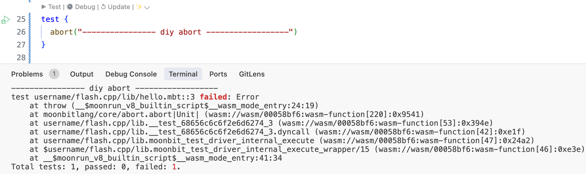
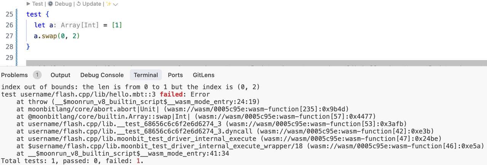

# MoonBit 新特性：Virtual Package 虚拟包机制


 Moonbit  最近新增了一项特性：virtual package。通过将一个 package 声明为虚拟包，定义好一套接口（通过 .mbti 文件声明），**用户可选择具体使用哪一份实现，如不指定则使用该虚拟包的默认实现。通过这项特性，给分离接口与实现带来较大灵活性。***注意：目前这项特性处于实验性状态*。

## 使用方法

以: [virtual_pkg_demo](https://github.com/moonbit-community/examples/tree/main/virtual_pkg_demo)  这个项目为例，项目结构如下：

```
.
├── virtual // 声明为 virtual package，其中的 virtual.mbti 定义了一套接口
├── impl    // 为 virtual 包中的接口提供了一份自定义实现
├── lib     // 依赖了 virtual 包中的接口
└── main    // 依赖了 lib 包，声明了用 impl 包去 override 掉 virtual 包的默认实现
```

- 声明某个包为 virtual package：在 virtual 包的 `moon.pkg.json` 中用一下字段声明该包是一个 `virtual` 包。包中需有 .mbti 文件否则报错，若 `"has-default"` 为 `true` 则会构建默认实现的编译产物，在没有 override 该包的情况下一起被链接

    ```json
    "virtual": {
        "has-default": true
    }
    ```

- 为某个 virtual package 提供自定义实现：在 impl 包中的 `moon.pkg.json` 设置 `"implement"` 字段为某个 virtual 包的完整包名。需要完整地实现 virtual package 中的 `.mbti` 文件中规定的接口

    ```json
        "implement": "username/hello/virtual"
    ```

- 使用 virtual package：在 lib 包的 `moon.pkg.json` 中的 `"import"` 字段中引入 virtual 包
- 覆盖 virtual package：在 `main` 包的 `moon.pkg.json` 中的 `"overrides"` 字段中设置实现包。如果没有设置实现包且 virtual 包有默认实现则使用默认实现，无默认实现则报错

    ```json
    {
      "is-main": true,
      "import": [
        "username/hello/lib"
      ],
      "overrides": [
        "username/hello/impl"
      ]
    }
    ```


## 具体示例

下面通过一个小例子说明 virtual package 在 `moonbitlang/core` 中的使用。`moonbitlang/core/abort` 被定义为一个 virtual package。具体代码如下：

- abort.mbti：声明了这个包中暴露出来的 api

    ```
    package "moonbitlang/core/abort"

    // Values
    fn abort[T](String) -> T

    // Types and methods

    // Type aliases

    // Traits
    ```

- abort.mbt：提供了 `fn abort[T](String) -> T` 这个 api 的默认实现。

    ```
    pub fn abort[T](msg : String) -> T {
      let _ = msg
      panic_impl()
    }

    ///|
    fn panic_impl[T]() -> T = "%panic"
    ```


在目前的默认实现中会故意忽略掉 `msg` 参数，这是因为如果使用 `println(msg)` 的话会导致生成的 .wasm 文件依赖 `moonrun` 运行时中定义的 `spectest::print_char` 函数，此时若是使用除了 `moonrun` 之外的 wasm 运行时（如 wasmtime、wasmer 等）则会导致报错：

```
error: Unable to instantiate the WebAssembly module
╰─▶ 1: Error while importing "spectest"."print_char": unknown import. Expected Function(FunctionType { params: [I32], results: [] })
```

### 自定义 `moonbitlang/core/abort` 的实现

`abort(msg)` 接口在许多 builtin 数据结构中都有用到，在不满足某些 invariant 的情况下会在运行时失败退出，而按照目前的默认实现，abort 中的 msg 不会输出，用户也较难发现出错的原因。为此，我们可以自定义 abort 的实现，让他打印出 msg（当然，如果你不用 moonrun 以外的运行时运行编译好的 .wasm 的话），做法如下：
首先执行 `moon add moonbitlang/dummy_abort`，然后在 `moon.pkg.json` 中增加以下字段：

```
"overrides": [
    // 这个包给 moonbitlang/core/abort 这个 virtual package 提供了一份自定义实现
    "moonbitlang/dummy_abort/abort_show_msg"
]
```

测试此时 abort 的行为，可以发现传入的参数确实被打印出来了



故意在一个数组上错误地使用 `swap`，abort 报错信息如下



未来，moonbit 社区将会提供符合 wasi 标准的库去实现 `println`，届时编译出来的 .wasm 也可以在支持此标准的 wasm 运行时上运行，敬请期待

