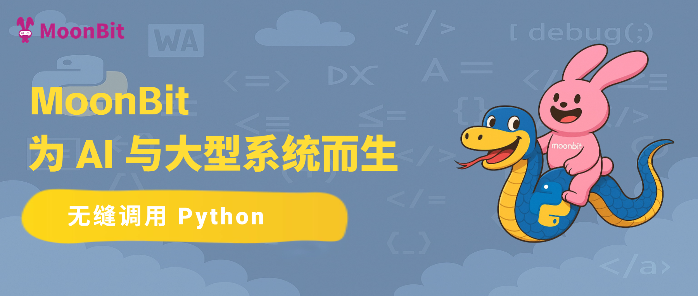
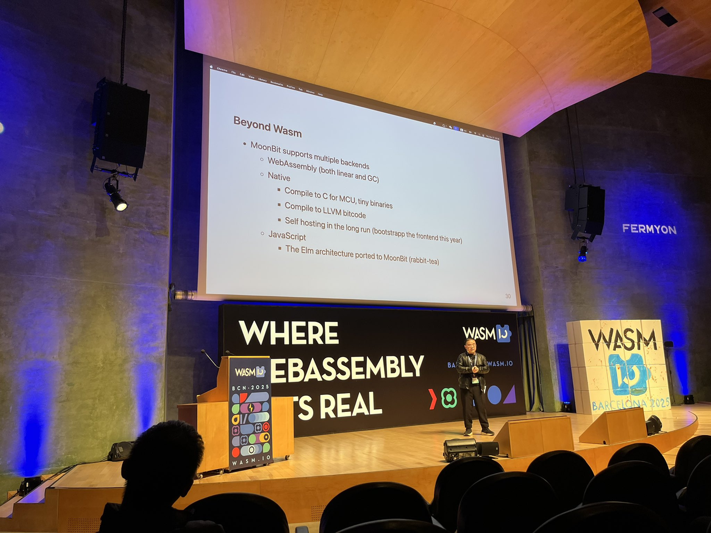

# MoonBit：为 AI 与大型系统而生，无缝调用 Python

> **引言:** MoonBit 正在为开发者提供一种全新的路径：不必舍弃 Python 的生态优势即能获得更严谨智能、适合大型系统与 AI 编程的开发体验。
在近二十年的开发实践中，Python 为大量应用领域的开发者打开了技术民主化的大门。Python成功的背后，是一整套逾千万开发者共同维护的应用库和依赖组件经济。其丰富的应用库已全面覆盖各类开发场景和行业需求。

然而，进入人工智能时代，Python曾经的“易学易用”，在面对更大、更复杂的任务时，反而成了一把双刃剑：简洁带来了开发门槛的降低，也带来了在类型安全与系统扩展性上的结构性不足。工业界也因此对一种新型语言的需求日益迫切：它需要既能兼容 Python 已建立的庞大生态，又具备类型安全、静态分析与高可维护性的现代语言特性。

在 AI 工具链的加持下，MoonBit 的实践验证了实现上述需求的可能性，让编程语言可通过“生态继承”而非“生态重建”实现迭代。

MoonBit的技术路径为行业提供了启示：
- 生态复用模式：通过 AI 自动化封装，降低跨语言调用门槛，避免重复造轮子，加速技术栈升级。
- 静态类型普惠化：将严格类型系统与 AI 代码生成结合，既保留 Python 的灵活性，又弥补动态类型的系统性缺陷，推动开发者向更安全的编程范式过渡。
## 无缝融合Python 生态

Python简单易学、生态丰富，适合小项目开发，但难以胜任复杂大型系统的构建。在大模型面前，Python的短板逐渐明显：
- 动态类型 → 一旦规模复杂，运行时错误频发，缺乏编译期防护。
- 保守语法 → 缺乏现代语法导致难以清晰地表达复杂和高度抽象的逻辑。
- 对 AI 编程不友好 → AI 编程依赖静态类型系统、清晰可分析的错误信息，以支持高质量的代码生成与自动修复。然而，Python 在静态分析能力和错误提示方面存在明显不足。其错误信息往往零散、不具结构性，难以形成有效的上下文推理，既限制了 AI 在大型项目中的参与能力，也降低了自动化调试与修复的准确性。

Rust 、C++ 、Ocaml、Hashell 等编程语言都曾尝试吸取 Python 丰富生态的优势，去其糟粕。原理是首先通过CPython的API调用Python解释器获得Python对象，进而再使用语言本身的类型系统和语法进行管理。

但是在没有 AI 代码生成工具时代，后续的库的拓展开发所需要耗费的精力太大，所以至今难以全面完成。而且这几门编程语言学习曲线过于陡峭，对于 Python 用户来说缺乏动力去替换。

MoonBit 借鉴了 Rust、C++ 等语言对 CPython 的集成和类型管理经验，并在此基础上，进一步结合了自研的「moon-agent」智能体框架（即将公开上线）。

通过 AI 驱动的自动封装机制，MoonBit 可批量生成对主流 Python 库的高质量绑定。一旦封装完成，结合 MoonBit 的原生构建系统，用户可在不抛弃原有 Python 资产的前提下，获得更强的类型系统、更智能的 IDE 支持与更精确的 AI 代码生成能力。
备注：「moon-agent」 智能体框架即将公开上线

## 国际关注
自 2023 年底开源核心编译器并发布 WASM 后端后，**MoonBit 受邀亮相WASM I/O 2025，成为首个登上该全球 WebAssembly 核心大会的中国开发者平台。**
随后，MoonBit 也在刚刚结束的国际顶尖函数式编程会议 **作为唯一受邀的国产语言项目**，登上了编程语言与系统架构领域重量级会议 LambdaConf 2025，与 Jai 编程语言作者 Jonathon Blow、新加坡前总理李显龙之子、 Scala 社区核心贡献者李浩毅等开发者代表同台演讲。
在这两场国际会议上，MoonBit 展示了其在语言设计、异步模型、工具链构建等方面的进展，代表了中国语言研发项目在全球开发语言演进中的全新探索。

## MoonBit的优势
- AI原生 设计：MoonBit 在语言设计层面即高度适配 AI 编程需求，内部实际场景测试中已实现“千行级代码零改动一次跑通”的成果。
- 工具链先进、体验统一：从语言本身、到文档内联代码校验、再到 IDE 与构建系统，MoonBit 提供一体化的现代开发体验。
- 更低学习门槛，更快迁移路径：相较 Rust、C 等语言，MoonBit 学习曲线更平缓。

对不同层级用户的使用体验：
- 对初级用户而言：MoonBit 提供完善的类型系统、编译器静态分析、详细的错误提示，有助于一次性写出更健壮 、稳定的代码。
- 对高级用户、企业级用户而言：MoonBit 让团队可以直接在 MoonBit 中使用现有的 Python 资产，无需重写或迁移，从而安全地构建大型系统。
- 对生态贡献者而言：绑定 Python 库比绑定 C 库要简单得多。只需要编写 MoonBit 代码和部分 Python 代码，而无需处理 C 库的链接器、头文件位置、C Wrapper 等底层细节。

以下两个案例可以直观的体验MoonBit无缝融合Python生态。
- 例-1 双摆，turtle 绘图工具，绘画双摆（封装好）

这是一个通过封装 Python turtle 库实现的 MoonBit 示例。整段绘图逻辑完全使用 MoonBit 语法编写，用户无需接触任何 Python 代码，即可实现图形绘制。这种体验不仅继承了 Python 图形库的成熟能力，更充分发挥了 MoonBit 编译器的类型检查、自动补全和错误提示等工具链优势。
从开发者视角来看，虽然底层依赖的是 Python 原生的 Turtle 实现，但封装后的接口在语义上已高度 MoonBit 化：调用方式更加简洁，参数具备明确的类型与可推导性，逻辑结构也更具可组合性与可维护性。
这一案例充分体现了 MoonBit 在生态融合方面的设计思路——通过自研的封装与构建机制，MoonBit 可以以最小成本复用 Python 丰富的类库资源，避免了绑定 C 库时常见的链接器配置、头文件路径、内存模型差异等复杂操作，极大降低了跨语言调用的技术门槛。
简而言之，MoonBit 以一种面向现代开发者的方式，实现了对 Python 生态的高层次封装，使“使用外部库”不再是一项复杂任务，而是变成了“编写 MoonBit 代码”的自然延伸。

- 例-2 外星人小游戏，直接调用 Python 生态（直接调用）

与此形成鲜明对比的是传统 C 库的绑定方式：开发者常需面对冗长的头文件、复杂的函数签名、不一致的内存模型，以及 CMake、Makefile 等构建系统的繁琐配置。这不仅加重了使用门槛，也大幅拉高了调试与部署成本。
而在 MoonBit 中，这一过程被大幅简化：
- 只需一行 pyimport，即可获取 Python 库模块引用；
-  开发者将无需再烦恼繁琐的C/C++头文件嵌套问题，不同平台链接的差异问题，不同项目构建系统的兼容问题等等。

以上，以两个实际案例展示了 MoonBit 对 Python 生态的无缝融合能力：
- 在封装类库方面，MoonBit 可将如 turtle 这类图形库高度 MoonBit 化，开发者几乎无需接触底层即可直接绘图；
- 在直接调用方面，MoonBit 也能加载完整的 Python 模块，如 pygame 外星人小游戏，支持复杂逻辑的原样运行。
相较于传统 C 库绑定所需的大量工程配置与接口对接，MoonBit 调用 Python 模块无需引入 C 头文件、无需处理链接器与构建系统，开发体验更轻量、更稳定。
那么，这种“无缝融合”是否只是技术细节上的简化？通过进一步对比一下 MoonBit 与 Python 在调用方式上的代码对比，MoonBit 不只是“能用”Python 库，而是用一种更现代的方式让代码更简洁、更易懂。

## MoonBit 与 Python 对比

1. 对比一：错误提示机制的友好性

左边: MoonBit, 右边: Python

在图中，MoonBit 和 Python 都因颜色参数写错而报错，但两者的提示体验截然不同：
MoonBit 编译器在构建阶段即指出问题所在，直接定位到具体文件与行号，错误信息结构化、语义明确，例如：“Color 枚举中不存在 Greenyellw 构造器（正确的单词是Greenyellow）”。这类提示不仅方便开发者快速定位和修改，也便于 IDE 与 AI 工具理解上下文并生成修复建议。
相比之下，Python 仅在运行时报错，输出大量调用堆栈，真正有用的信息被埋藏在底部 ValueError 中，缺乏清晰的上下文与可操作性，对初学者尤其不友好。
从底层机制看，这是静态语言与动态语言在错误处理上的根本差异：MoonBit 在“运行前”就能发现问题，Python 通常只能在“运行后”才暴露错误。

2. 对比二：类型系统驱动的 IDE 自动补全

在 Python 中，`color='orange'` 这样的参数是通过字符串传递的，完全缺乏类型约束。如果不小心写成 `'oragne'`，程序将直接在运行时报错或表现异常，而 IDE 无法在编辑阶段提供任何帮助——既没有补全，也无法进行静态检查。
相反，MoonBit 对参数类型采用显式的枚举建模。例如颜色参数使用 `@plt.Color` 枚举类型（如 `Orange`、`Darkblue` 等），IDE 能根据类型信息实时提供候选选项，开发者不必记忆，也不必担心拼写错误。同时，编译器会在构建阶段对所有参数合法性进行验证，错误可在运行前即被发现。
这一设计不仅提升了日常开发效率，更在构建复杂系统或 AI 自动代码生成场景中大幅降低了“微错误”的发生概率。**类型驱动的补全与验证机制，是实现高可靠性与智能协同开发的基础**

## 总结
MoonBit 的崛起，标志着国产编程语言从“技术追赶”转向“场景创新”的关键转折。它不仅是 Python 生态的挑战者，更是 AI 时代编程范式的探路者——若能在性能、生态与开发者体验间持续平衡，或将成为下一代云原生与边缘计算开发的核心基础设施。这场革新能否成功，取决于技术、社区与商业化的协同共振，而答案或许将在未来三年初见分晓。

## 项目链接
- python.mbt：https://github.com/Kaida-Amethyst/python.mbt
- matplotlib.mbt: https://github.com/moonbit-community/matplotlib.mbt