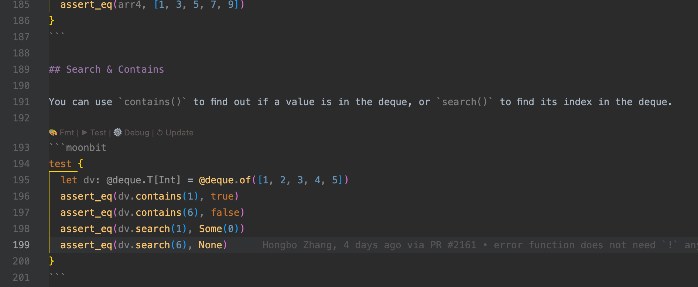
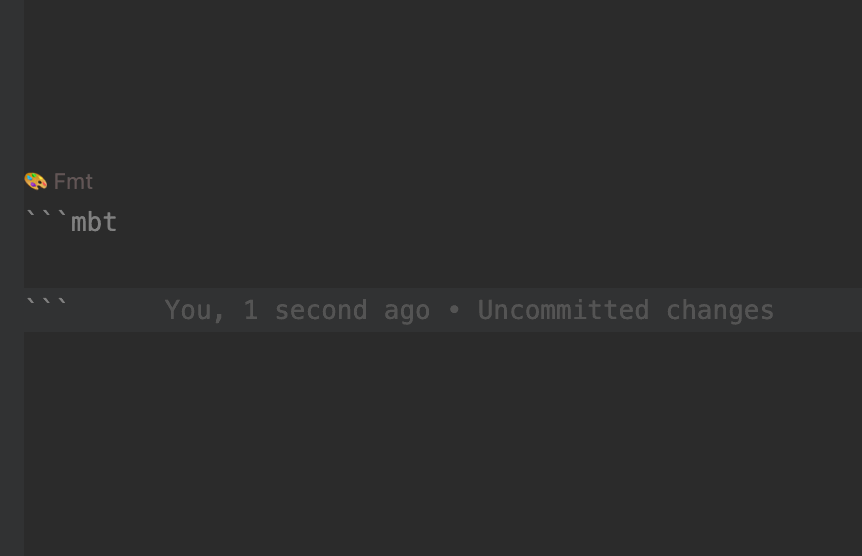
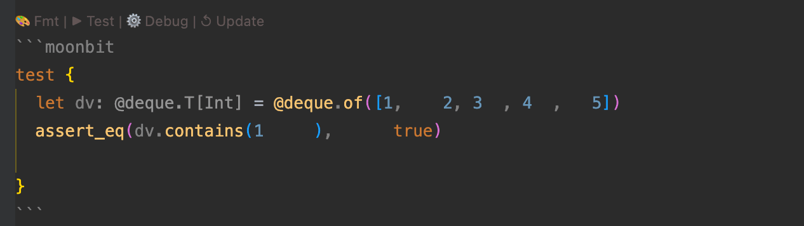
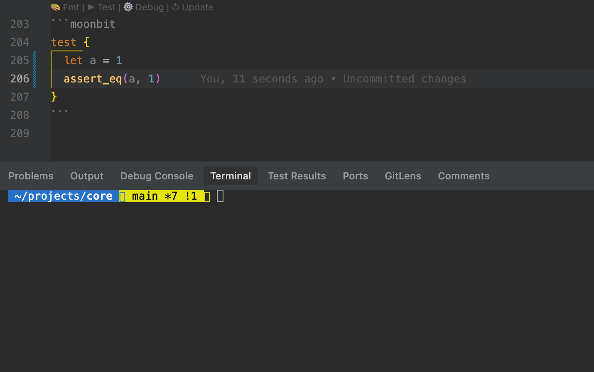
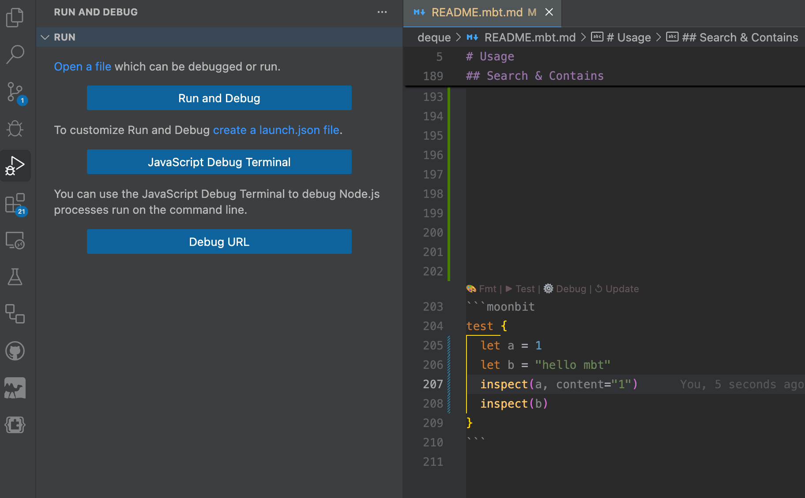
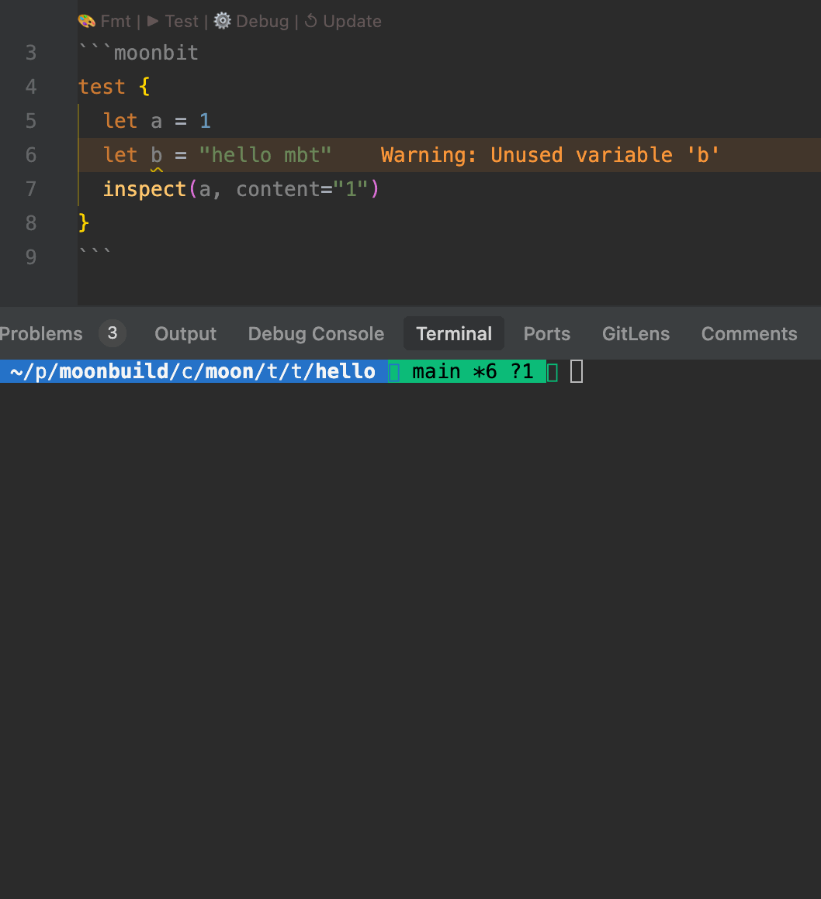
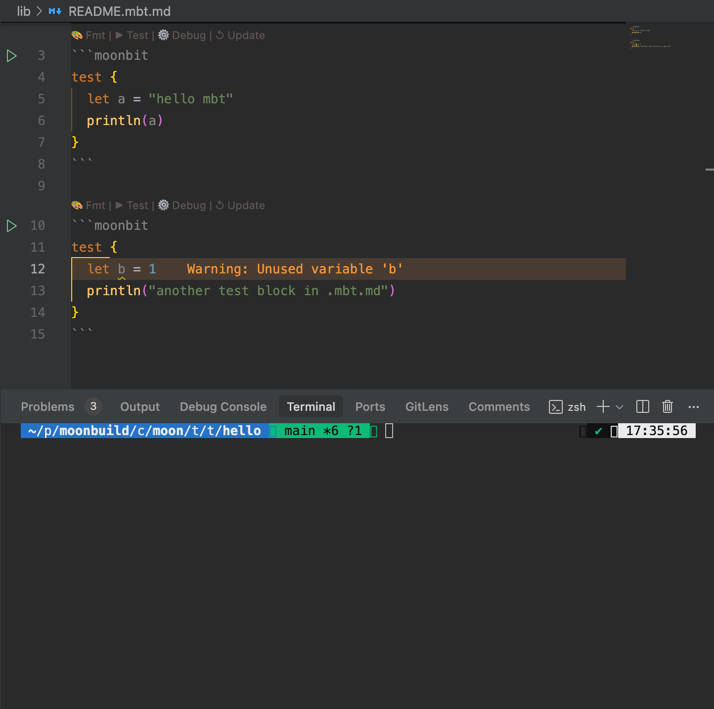

import Video1 from "./video.mp4"

# 面向文档(Markdown)编程：MoonBit 的创新开发体验

MoonBit 自诞生以来，始终致力于为开发者提供极致的开发体验。通过整合编译器、构建系统和 IDE 等核心组件，**MoonBit 正式推出“面向文档编程”（Document-Oriented Programming）的创新概念**。这一功能在 Markdown 文档中无缝集成了代码静态分析、IDE 原生支持、自动化格式化、测试运行和调试等功能，为开发者带来前所未有的文档与代码协同体验。与传统的编程模式相比，MoonBit 的面向文档编程突破了将文档嵌入源代码注释的局限。传统方式（如通过注释记录 API 文档）适合简短说明，但难以承载详细的文档内容或可运行的代码示例。

虽然一些编程语言（如 Rust）支持文档中的代码高亮和测试，MoonBit 在此基础上进一步扩展，提供了更强大、更自然的文档编程体验：在 Markdown 文档（`.mbt.md` 文件）中的 MoonBit 代码块与常规 .mbt 源文件享有相同的工具链支持，真正实现 **“文档即代码，代码即文档”**。借助 MoonBit 工具链，在 Markdown 文档中进行编程的过程如下：在某个包中新建 Markdown 文档，注意该文档需以 `.mbt.md` 结尾，这是 MoonBit 工具链识别文档的标志。
## 使用方式
在 MoonBit 项目中，只需在某个包中创建一个以 `.mbt.md` 结尾的 Markdown 文档，即可启用面向文档编程功能。`.mbt.md` 是 MoonBit 工具链识别文档的标志，文件中的 MoonBit 代码块将获得与源代码一致的开发支持，享受与 `.mbt` 文件相同的功能支持，包括但不限于：
- **代码高亮**：语法高亮，增强文档可读性。
- **跳转到定义**：点击符号跳转到其定义位置。
- **代码补全**：提供类型引导的智能补全建议。
- **实时诊断**：检测代码中的警告和错误，实时渲染在 IDE 中。
- **自动化格式化**：一键格式化代码块，保持风格一致。
- **测试运行**：支持文档中的测试代码运行。
- **调试支持**：在文档中直接调试代码。
在该文档中通过  ```` ```mbt ```` 或者  ```` ```moonbit ```` 声明代码块，写在这些块中的代码便能享受到原生的 IDE 功能支持：

    

    
## IDE 支持
MoonBit 的 IDE（基于 VS Code 插件）为 `.mbt.md` 文件提供了原生支持，极大提升了文档编程的效率。以下是一些实用的功能：
1. 便捷的代码块插入：
  - MoonBit IDE 提供专用的代码片段（code snippet）。在 `.mbt.md` 文件中输入 `mbt` 并触发补全，即可自动插入 ```` ```mbt ````代码块，简化编写流程。
  

2. 自动化格式化：
  - 每个 MoonBit 代码块上方显示 CodeLens 按钮（如 `Fmt`），点击即可一键格式化代码块，保持规范一致的代码风格。
  

3. 测试与调试：
  - 支持在 `.mbt.md` 文件中编写测试代码块（test block），通过 `moon test` 或者代码块上方的 Test CodeLens 自动运行。
  
- 支持调试功能，开发者可以在文档中设置断点，直接调试代码逻辑。
 
 *MoonBit 对于 `.mbt.md` 提供的是开箱即用的原生支持，也就是说，`.mbt.md` 中的代码和常规的 MoonBit 代码是一样的（在实现上我们将其作为黑盒测试处理），用户可以像写黑盒测试一样通过 `@pkg.xxx` 使用本包中的 pub 定义。*

## 工具链支持
MoonBit 的构建系统（moon）对 `.mbt.md` 文件提供全面支持，与常规 `.mbt` 文件无缝集成：
- 静态分析：
  - 运行 moon check 时，工具链会自动检查 `.mbt.md` 文件中的 MoonBit 代码块，输出警告和错误到控制台。
  - IDE 实时检测代码中的类型错误、未定义符号等问题，确保文档代码的正确性。


- 测试运行：
  - 运行 moon test 时，工具链会自动执行 `.mbt.md` 文件中的测试代码块，与常规测试文件（如 _wbtest.mbt、_test.mbt）一起运行。
  - 测试结果统一输出，方便开发者验证文档代码的正确性。


- 构建集成：
  - `.mbt.md` 文件中的代码块被视为黑盒测试，参与构建流程，确保文档与源代码一致。
- 单文件支持：
  - 可以通过 `moon test /path/to/xxx.mbt.md`运行不在某个包中的 `.mbt.md` 文档中的测试。若是该 `.mbt.md` 文档存在于某个包中，在包含该包的项目目录下直接运行 `moon test` 即可。另外，即使是单个 `.mbt.md` 文档（不在某个包中），也可以使用第三方依赖（通过文档首部的 header 声明，示例如下），赋予文档编写极大的灵活性。
````YAML
---
moonbit:
  deps:
    moonbitlang/x: 0.4.23 // 第三方依赖
  backend:
    js                    // 指定运行后端
---

```moonbit
test {
    let single_mbt_md = 1
    let path = "1.txt"
    let content = "Hello, MoonBit"
    @fs.write_string_to_file!(path, content)  // 使用 moonbitlang/x 中的 fs 包
    let res = @fs.read_file_to_string!(path)
    inspect!(res, content=content)
    inspect!(234523)
    println("222")
}
```
````
## 用 `.mbt.md` 写技术博客
借助 `.mbt.md` 文件，开发者可以直接在 Markdown 格式的技术博客中嵌入可运行的 MoonBit 代码，享受 IDE 和工具链的全程支持，如：
- **实时验证**：代码块中的拼写错误（typo）或逻辑错误会被 MoonBit 工具链实时检测，避免博客中出现无效代码。
- **一致体验**：博客编写过程与编码一致，支持代码高亮、补全、跳转等 IDE 功能。
- **可运行示例**：读者可以直接复制代码块运行，或通过 `.mbt.md` 文件复现示例。

这种方式特别适合撰写教程、API 文档或技术文章。现在有许多优秀的静态博客生成框架，支持将 Markdown 文件直接渲染为漂亮的网页。我们以 hexo 框架演示用 `.mbt.md` 写技术博客的过程：

<video autoPlay loop muted playsInline src={Video1} style={{width: '100%'}}></video>

## 用 CI 确保文档代码始终正确
MoonBit 的工具链为 `.mbt.md` 文件提供强大的静态分析支持，结合持续集成（CI）可以确保文档代码始终与源代码保持一致以及文档中的代码始终能够编译以及通过单元测试，一旦因为源代码改动导致文档代码发生 breaking change 也能第一时间发现并修改，避免了文档滞后于代码的常见问题，提升了文档的可信度。
`moonbitlang/core` 项目已经全面接入 `.mbt.md` 文档，其中每个 package 的 README 都以这种格式书写，以详细的文档配合代码示例说明该包的用法，一旦包中的某个 api 改动导致文档中的测试运行失败，`moonbitlang/core` 的 CI 会立刻报告错误，此时开发者便能及时修复源代码中的 bug 或者更新文档以适应新 api。
## 总结
MoonBit 的面向文档编程重新定义了文档与代码的协作方式，通过 `.mbt.md` 文件将 Markdown 文档提升为可执行、可验证的开发环境。借助 IDE 的原生支持、工具链的静态分析和 CI 的自动化验证，开发者可以在编写技术博客、API 文档或教程时享受与编码一致的体验，MoonBit 提供了其他语言难以企及的文档编程体验。欢迎尝试 `.mbt.md` 的 MoonBit 专属文档，体验代码与文档的完美融合！