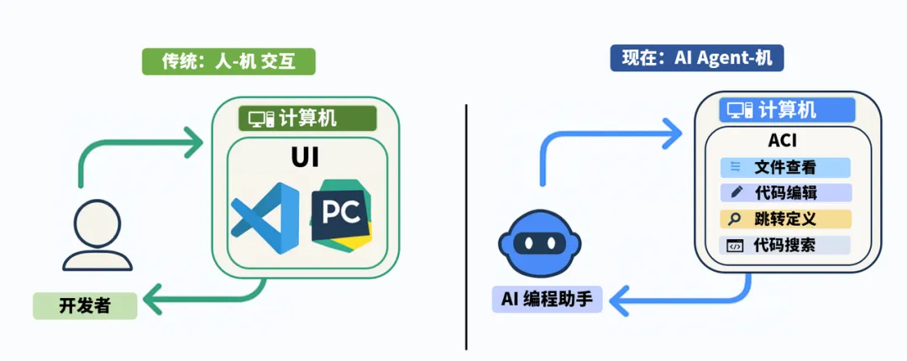
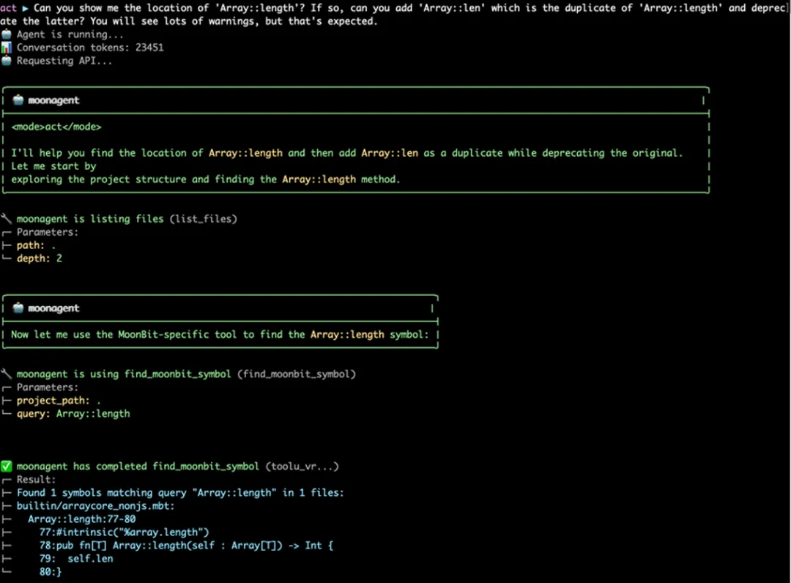
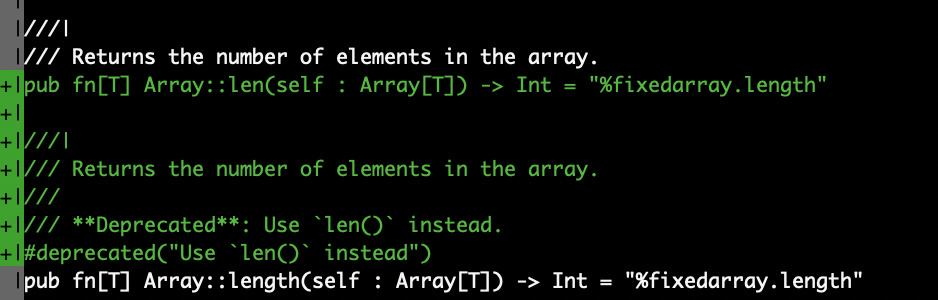
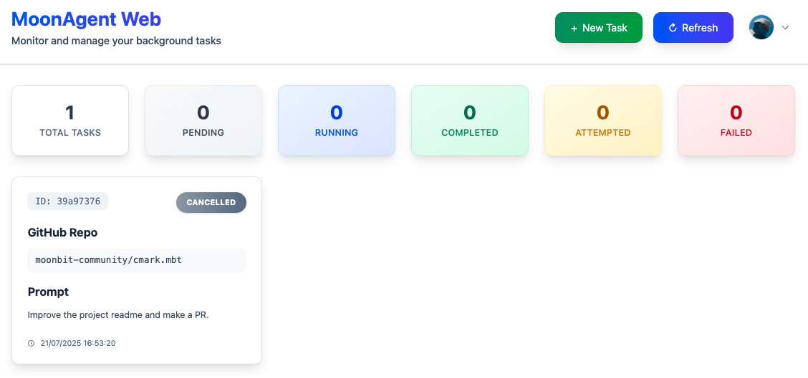
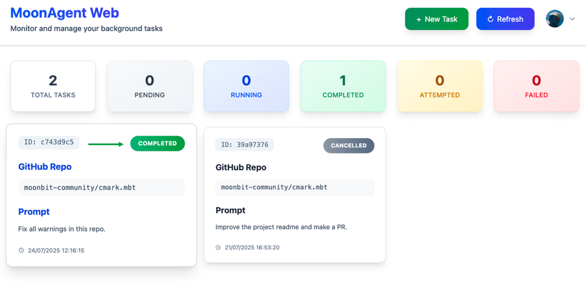
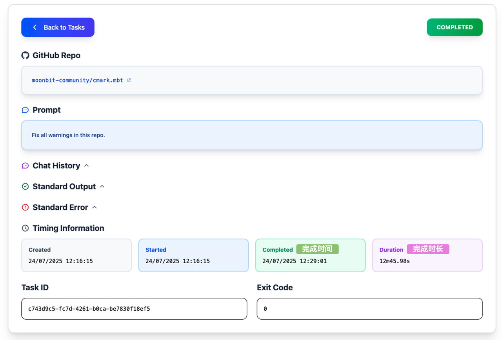
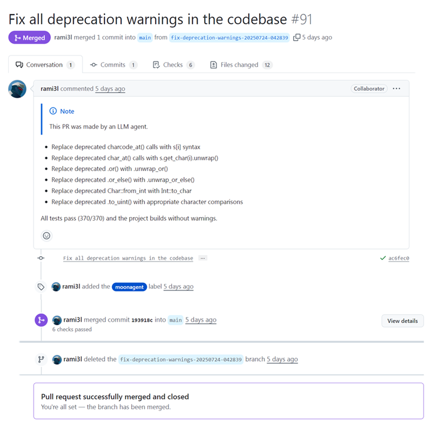

import Show from './show-output.mp4'
import Vscode from './vscode-output.mp4'
import Codex from './codex-output.mp4'
import Cursor from './cursor-output.mp4'
import MoonbitFix from './moonbit-fix-output.mp4'

# MoonBit Pilot：全球首个自底向上的代码智能体，全栈 AI 原生

通过从语言到工具链的 AI 原生重构，IDEA 研究院基础软件中心 MoonBit 团队打造的 MoonBit Pilot 构建出与大模型深度协同的开发环境，在代码生成质量与大规模重构效率上均超越 Cursor 等现有智能编程工具，首次呈现无需人类接管的 L4 软件交付能力的工程闭环雏形。

## MoonBit Pilot 优势一览

- 从代码生成到软件级合成

    MoonBit Pilot 不仅能够辅助补全若干行代码，还通过 prompt 驱动、大模型推理与 MoonBit 语言工具链的高效联动，真正实现工业级软件的全自动化开发。

- 并行协作快速攻克复杂任务

    依托 MoonBit 工具链与先进的 Segment 并发机制，MoonBit Pilot 已进化成为具备状态感知能力的流水线式 Agent 系统。它支持多任务并行处理，系统中的每个子 Agent 如同生产线的精密组件，围绕用户需求高效协同，从而快速攻克复杂任务。

- 开放API降低接入门槛且支持上云

    MoonBit Pilot 进一步提供开放 API 接口，可轻松连接第三方系统（如CI/CD、IDE 插件、AutoCoder、代码审查系统等），极大降低系统接入门槛，使开发者和企业能以极低成本快速享受类 Devin 式的自动化开发体验。

MoonBit Pilot 可高效部署在云端，用户可彻底脱离本地编码过程，专注效果验收与代码审查，实现生产力跃升。

## 从底层语言适配AI,深度激发大模型潜能

大模型赋能下，软件工程领域正发生革命性的变化。代码智能体（Coding Agent）不再只是人类开发者的生产力工具，而是成为具有**端到端交付能力**的软件合成引擎，可覆盖软件开发全生命周期并深度渗透多行业，带来效率跃升与成本锐减，推动产业协作模式重构，这其中孕育着**万亿美元**的商业价值。

然而，当前市场上的代码智能体依托基于人与机器交互的旧式工具，未能打造 AI 直接与机器交互开发的友好环境，限制了 AI 开发的效率与潜力。

*只有从底层开始就设计一整套原生的AI开发者工具 (Agent Devtools Interface)，与大模型垂直整合，才能更好地发挥大模型的潜能。*

基于 AI 原生环境下的开发者工具，通过语言、工具、模型三个层面的深度联动，可实现更精准的需求转化、更低的错误率，显著提升代码生成的效率与可靠性，能够支持更复杂的端到端开发任务，如全流程软件合成、动态代码重构，突破传统 “辅助工具” 的边界。

在这一愿景下，MoonBit Pilot 诞生 —— 从最基础的编程语言到工具链（编译器/调试器/包管理），全栈基于 AI 原生设计重构，在各环节为大模型提供有效反馈。

MoonBit Pilot 不仅能自动高效地生成完整软件库，还附带结构化文档与高质量测试用例，这将帮助企业在保障质量的基础上**降低开发成本、加速交付效率。**

在软件工程中最关键环节之一的大规模代码重构中，MoonBit Pilot 也展现出领先优势，表现超过了“主流编程语言 + 最强大模型”的组合，**在开发过程中高效解决此关键痛点，将助力企业快速应对技术迭代，提升竞争力。**

## MoonBit Pilot 能力展示

零干预合成高质量软件库

下面我们用 MoonBit Pilot 一键生成 TOML 语法解析器作为示例展示其软件合成能力：

*TOML 是一种配置文件格式，设计初衷是简单易读、易写，并能清晰表达嵌套的数据结构。它常用于项目配置文件，特别是在 Rust 生态中被广泛使用。*

<video controls src={Show} style={{width: '100%'}}></video>

我们打开 vscode 运行测试：

<video controls src={Vscode} style={{width: '100%'}}></video>

我们注意到，大模型在最初生成代码时由于缺乏 MoonBit 语料，并未直接输出正确结果。但在自动调用 MoonBit 自研工具链并获取精确反馈的过程中，**模型无需人工干预便完成了修复与优化，最终成功输出正确代码，并自动添加了有效测试，整个过程耗时仅约 6 分钟。**

不只是 TOML, MoonBit Pilot 在很短时间零人工干预合成了 ini-parser, lisp 解释器 等更多示例，这些合成的软件库也将被用于下一代基模的训练中，更好地提升 MoonBit Pilot 的软件合成能力。

ini-parser >> https://github.com/bobzhang/ini-parser

lisp >> https://github.com/bobzhang/lisp-machine-MoonPilot

## 支持超大规模代码重构，提升代码质量

原生语义查找，降低推理成本

AI 生成的代码一个普遍痛点是缺乏可维护性，提升代码可维护性的最重要方法之一就是安全重构。不同于传统智能体依赖 grep 等基于正则的代码查找方式（既低效又不准确，还大量消耗上下文窗口），MoonBit Pilot 提供了原生的语义查找工具，能够一键精确定位代码定义。这不仅提升了交互体验，更重要的是显著减少了 token 浪费，从本质上降低了推理成本，是 Coding Agent 系统中少有的“具备实际节省支出的能力模块”。

这里以一个简单的函数重命名作为示例：

假设我们需要将标准库 Core 中的 `Array::length()` 改名为 `Array::len()`，我们先发出 prompt 指令：`can you add 'Array: :len' which is the duplicate of 'Array:: length' and deprecate the latter`

可以看到，MoonBit Pilot 短时间内即可正确地完成任务。

## 分段编码，快速的高并发重构

传统 Agent 在执行此类修复任务时效率极低，**往往需要反复调用构建系统获取警告信息，并以串行方式逐一调用大模型进行修复，每次调用可能耗时十几到几十秒，完整修复过程可能持续数十分钟。**

同时，这类 Agent 缺乏对警告的结构化处理，导致上下文信息冗杂、重复，进一步干扰大模型的判断与执行效率。

MoonBit Pilot 充分利用底层的 Subagent 机制以及 MoonBit 语言自身提供的分段机制避免并发提交和验证中的竞争与隔离问题，确保并发后的结果能有效合入，实现了真正意义上的多 Agent 并行修复能力，在类似任务场景下，**相比传统 Agent 工作流可以实现 5 至 10 倍的效率提升。**

## 速度远高于 Cursor, Codex

在修复一个由 MoonBit 编程语言构建的包含 126 条警告的大型项目实际场景中， 与市面上主流的编程代码助手 Codex（由 OpenAI  研发）和 Cursor（行业领先）对比，MoonBit Pilot 仅用1/5的时间、零人工干预完成了任务。

- Codex CLI ：35 分钟之后仍然没有完成所有警告的修复工作，且需要中途加入额外的对话内容才能继续任务。

<video controls src={Codex} style={{width: '100%'}}></video>

- Cursor ：16 分钟后因为触发最大工具调用次数而中止，此时剩余警告数并不为 0，在相同提示词的情况下同样会触发串行的警告修复任务。

<video controls src={Cursor} style={{width: '100%'}}></video>

- 相比之下，MoonBit Pilot 在约 7 分钟时间内完成了上述所有 126 条警告的修复任务。并且最终实现从代码到文档的全面修改替换：

<video controls src={MoonbitFix} style={{width: '100%'}}></video>

值得注意的是，大部分 Agent 和语言工具链的组合往往只能完成代码的修正工作，但得益于 MoonBit 语言对 Markdown 格式的特殊支持，MoonBit Pilot 也能确保 `.mbt.md` 文档中代码的正确性。

## 另一种范式：云端异步编程，零人工干预

Cursor 和 Codex 需在用户本地电脑运行且依赖频繁交互，难以支持高并发运行（如同时启动十余个任务）。

MoonBit Pilot 不同于以往基于 VSCode 的 AI 智能体，它不再依赖传统的 LSP (Language Server Protocol) 获取反馈，而是采用一套内部高度定制的 ASP (Agent Server Protocol)，可以脱离 VSCode 等 GUI，高效部署在云端并取得同样效果。

迁移至云端后，用户可彻底脱离编码过程，专注效果验收与代码审查，实现生产力跃升。

以下是使用 Web 端版本的 MoonBit Pilot  在一个真实 MoonBit 项目 https://github.com/moonbit-community/cmark.mbt 中进行自动警告修复的例子。在进入任务总览视图后，可以点击“新建按钮”创建一个新任务。在新建任务页面，我们可以指定目标仓库，并在提示词中说明我们的意图，即修复项目中的所有警告：

稍等一段时间之后，我们便可以看到任务已经变为完成状态。

点击任务卡片可以查看本次任务的用时、对话历史、控制台输出等详情：

在对话历史的末尾，可以看到 MoonBit Pilot 已经成功创建了与修复内容相对应的 GitHub Pull Request：

此 Pull Request 描述和内容完整，CI 检查顺利通过，可以直接合并。

MoonBit 社区基于 MoonBit 的语义基础和 Agent 的智能协作机制，致力于从简单的“写代码”迈向高效的“构建软件”新范式。

团队预计将在接下来的半年时间中，通过 MoonBit Pilot 完成 MoonBit 语言生态的自举。此过程也将为 MoonBit Pilot 提供海量的训练语料和经验积累，使 MoonBit Pilot 最终达到L4级别的软件自动交付。

## 一键安装

MoonBit Pilot 面向所有用户支持桌面端一键安装体验：重新执行 官网安装命令，即可通过 moon pilot 启动 MoonBit Pilot的命令行版本：

https://www.moonbitlang.com/download#moonbit-cli-tools

云端 Web 版本采用定向邀请制开放，MoonBit 正逐步邀请一批对智能体编程、语言工具链感兴趣的开发者参与体验。欢迎感兴趣的用户发送邮件至：jichuruanjian@idea.edu.cn，附加（Github ID），申请开通web 端权限

