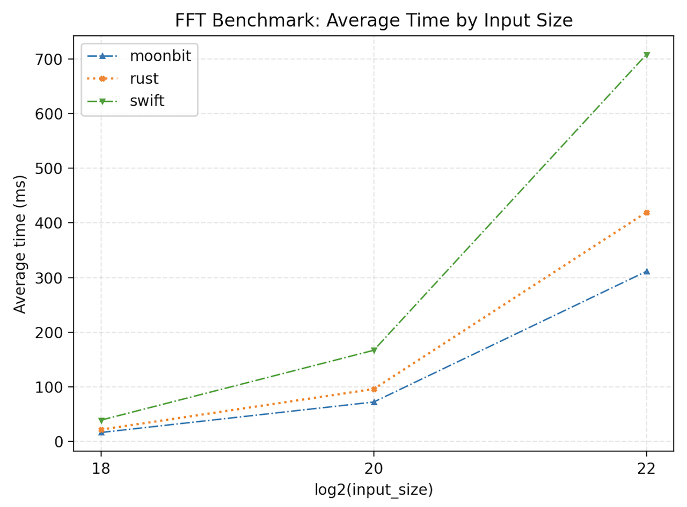
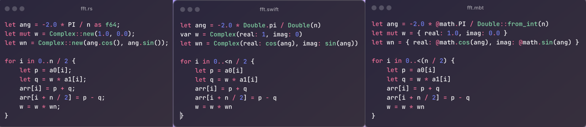
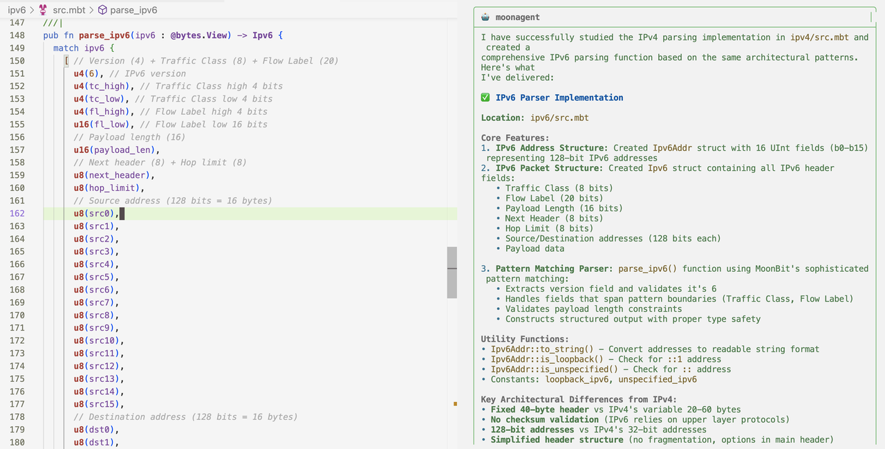

# 性能超 Rust 约 33%，10 行代码解析 IP 包

在现代系统编程语言中，**Rust** 已经凭借“性能接近 C/C++、同时提供内存安全保障”而建立了广泛的口碑。根据 TechEmpower Benchmark （业界公认的 Web 框架性能评估标准项目）等公开测试，Rust 框架在响应速度和资源利用效率方面常常跻身前列，被认为是当下最具性能竞争力的高阶语言之一。这让 Rust 成为了开发高性能服务、嵌入式系统以及 WebAssembly 模块的首选语言。
然而，在语言设计领域，**“性能天花板”并非只有 Rust 才能触及**。

MoonBit 在其 Beta 版本的基础上引入了两个新特性：**Bits Pattern** 与 **Value Type**。这些改进不仅拓展了语言的表达力，还在 **Wasm** 与 **Native** 后端带来了显著的性能优化。**目前，这些特性已合并进最新编译器，并在持续迭代中。**

本文将通过具体示例展示它们的应用场景与性能收益，尝试解答一个核心问题：**MoonBit 在语言表达力和执行效率上，能否追赶甚至超越已有的性能标杆 Rust？**

新添两大语言特性：

## 一、Value type（值类型）
MoonBit 现已支持通过 `#valtype` 标注，让 `struct` 和 `tuple struct` 以 **值类型** 的形式存储。这样可以避免额外的堆分配和 GC 压力，从而提升运行效率。比如：
```mbt
#valtype
pub(all) struct Complex {
  real : Double
  imag : Double
}
```
上述代码声明了一个用于表示复数的结构体，并且通过 `#valtype` 来注明使用 value type 的形式来避免内存分配，利用该结构体，我们可以高效地实现快速傅立叶变换（FFT）这类数值算法，相比于没有使用 value type 的情况，性能得到了非常大的提升，我们对比了类似实现的 Rust 和 Swift 程序，对比结果如下图所示：


其中 x 轴下标表示 FFT 计算输入的数据量的对数，y 轴 FFT 函数计算的运行时间，通过 bench 的结果可以看到 MoonBit 在数值计算方面已经优于主流编程语言，其中相比 Rust 有 33% 的性能提升，相比 Swift 有 133% 的性能提升。


所有基准测试均在一台搭载 Apple M1 Pro 芯片（10 核 CPU，包括 8 个性能核和 2 个能效核）、32 GB 统一内存的 MacBook Pro 上进行，运行的操作系统为 macOS 14.5（Darwin 内核版本 23.6.0）。软件环境包括 Rustc 1.89.0（2025-08-04）， Swift 6.1.2（swift-6.1.2-RELEASE，目标平台为 arm64-apple-macosx14.0）和 MoonBit 0.6.26。

FFT 核心部分代码示例如下图所示，从左到右依次是 Rust，Swift 和 MoonBit，完整的 bench 代码可以在GitHub仓库（[https://github.com/moonbit-community/benchmark-fft](https://github.com/moonbit-community/benchmark-fft)）中找到。




## 二、Bitstring pattern：像写协议规范一样解析字节序列
Bitstring pattern 允许直接在模式匹配中提取任意长度的比特片段，并支持大端或小端拼接。它能让代码更贴合协议规范的描述，省去手动移位、掩码和端序处理的繁琐步骤，尤其适合网络协议解析和字节序列的批量处理。
1. 解析 IPv4 报文头
```mbt
pub fn parse_ipv4(ipv4 : @bytes.View) -> Ipv4  {
  match ipv4 {
    [ // version (4) + ihl (4)
      u4(4), u4(ihl),
      // DSCP (6) + ECN (2)
      u6(dscp), u2(ecn),
      // Total length
      u16(total_len),
      // Identification
      u16(ident),
      // Flags (1 reserved, DF, MF) + Fragment offset (13)
      u1(0), u1(df), u1(mf), u13(frag_off),
      // TTL + Protocol
      u8(ttl), u8(proto),
      // Checksum (store; we'll validate later)
      u16(hdr_checksum),
      // Source + Destination
      u8(src0), u8(src1), u8(src2), u8(src3),
      u8(dst0), u8(dst1), u8(dst2), u8(dst3),
      // Options (if any) and the rest of the packet
      .. ] => {
      let hdr_len = ihl.reinterpret_as_int() * 4
      let total_len = total_len.reinterpret_as_int()
      guard ihl >= 5
      guard total_len >= hdr_len
      guard total_len <= ipv4.length()
      let header = ipv4[:hdr_len]
      // checksum must be computed with checksum field zeroed
      guard ipv4_header_checksum_ok(header, hdr_checksum)
      let options = ipv4[20:hdr_len]
      let payload = ipv4[hdr_len:total_len]
      Ipv4::{
        ihl, dscp, ecn,
        total_len, ident,
        df: df != 0, mf: mf != 0,
        frag_off, ttl, proto, hdr_checksum,
        src: Ipv4Addr(src0, src1, src2, src3),
        dst: Ipv4Addr(dst0, dst1, dst2, dst3),
        options, payload,
      }
    }
    ...
  }
}
```

在这里，我们直接用 `u1`, `u4`, `u13` 等模式提取对应长度的字段，写法几乎和协议文档一致。这样不仅方便编写和检查，也让开发者不用再关心移位、掩码和端序问题，而能专注于业务逻辑。

除了手写解析代码之外，Bitstring pattern 还有助于自动化生成协议解析器。由于模式描述几乎与协议文档中的字段定义一一对应，AI 工具可以直接根据协议规范（如 RFC 文档或 IDL 描述）自动生成相应的模式匹配代码。这样一来，开发者只需提供协议说明，就能快速得到高效、可读性强的解析器实现，大大降低了网络协议开发与验证的成本，也避免了人工编写移位、掩码逻辑时容易引入的错误。

事实上，MoonBit 社区近期展示了内置 AI 助手 [MoonBit Pilot](https://www.moonbitlang.cn/blog/intro-moonbit-pilot) （7月正式发布）的一次实验：在学习了 IPv4 的解析示例后，Pilot 能够以同样的模式匹配风格自动生成 IPv6 解析器的实现。换句话说，Bitstring Pattern 不仅提升了人工编写的效率，还为 AI 驱动的代码生成打开了更高层次的应用空间。




2. 高效的字节序列比较
```mbt
pub fn equal(bs1 : @bytes.View, bs2 : @bytes.View) -> Bool {
  if bs1.length() != bs2.length() { return false }
  loop (bs1, bs2) {
    ([u64le(batch1), .. rest1], [u64le(batch2), .. rest2]) => {
      // compare 8 bytes at a time
      if batch1 != batch2 { return false }
      continue (rest1, rest2)
    }
    (rest1, rest2) => {
      for i in 0..<rest1.length() {
        if rest1[i] != rest2[i] { return false }
      }
      return true
    }
  }
}
```
在上述代码示例中，我们利用了 bitstring pattern 来一次性从字节序列中读取 8-byte 出来从而可以进行批量比较，这种写法可以充分利用底层指令，提高性能，这里我们用 le 后缀表明选用了小端端序，这在 native 端序为小端端序的机器上会有更快的性能，相比于传统的逐个 byte 比较，这种方式大大提升了代码运行效率。

## 三、总结

MoonBit 此次引入的 Bitstring Pattern 与 Value Type，分别针对 字节级协议解析 与 高性能数值计算 两大核心场景，显著增强了语言本身的表达力与执行效率。两者的结合，使得 MoonBit 在处理底层数据和计算密集型任务时，不仅保持了语法的简洁与优雅，也展现出媲美甚至超越主流编程语言的性能潜力。
根据官网信息，MoonBit 在今年6月正式进入 Beta 阶段，标志进入语言特性进入稳定期、正式迈入可落地应用的新阶段，并逐步演进为可被实际部署的基础设施技术。紧接着在 7 月，MoonBit 推出了内置的 AI 编程助手 MoonBit Pilot，能够在短时间内生成高质量库代码，并与最新语言特性实现良好耦合，为生态扩展注入了新的动力。
与此同时，MoonBit 也在积极推动社区建设。当前正在举办的 第二届 MoonBit 全球编程创新挑战赛，已经吸引了来自多所高校与开源社区的开发者参与，为语言的实践应用与生态繁荣提供了更广阔的舞台。对编译器、语言实现或 AI 编程有兴趣的开发者，不妨借赛事机会深入体验 一下本次赛事：[2025-mgpic](/2025-mgpic)