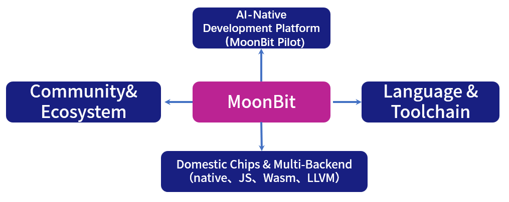
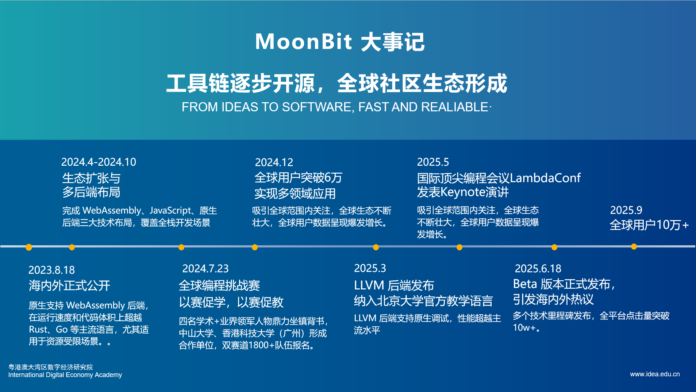

# MoonBit 三周年 | 用代码写就 AI 时代的语言答卷

三年前的 2022 年 9 月 19 日，MoonBit 正式立项。

彼时，我们只有一个愿景：打造一门面向 AI 时代的工业级编程语言与工具链。从零起步的旅程，充满了未知，也充满了可能。当时，我们的选择并不被广泛理解。很多人会问：“为什么要做一门新的语言？这件事根本不赚钱。” 在外界看来，这样的决定既冒险又不合时宜。但我们相信，语言不仅是编程的工具，更是人与 AI、人与复杂软件系统之间的桥梁。**AI 时代需要新的语言，而这件事值得去做。**

带着这样的信念，MoonBit 踏上了这条看似孤独，却至关重要的道路。三年过去，从语言设计到编译器优化，从多后端支持到 IDE 与工具链建设，再到包管理平台与生态搭建，MoonBit 已经走过了从 Alpha 到 Beta 的关键历程。如今，它不仅成为国内首个工业级编程语言，也逐渐走进国内大学课堂、实验室和全球开源社区。

更重要的是，我们没有停下脚步。2025 年，MoonBit 推出了 **MoonBit Pilot** —— 首个自底向上构建的 AI 原生开发工具。它让 AI 从“编程助手”真正升级为“软件合成引擎”，能够高效完成代码生成、调试与大规模重构，在真实场景中展现出 5–10 倍的效率提升，仅仅耗时**7分钟**完成复杂任务修复，远超传统助手，**首次呈现无需人类接管的 L4 软件交付能力的工程闭环雏形**。

三年来，MoonBit 收获的不只是产品和技术，还有社区的信任与共建：**数十万** 余名用户、**两千多个生态包**，每一个数字背后都凝聚着无数开发者的热情。

Fast · Simple · Scale —— 三年前，它是一句愿景，如今，它已经逐渐成为现实。

回头看这三年的成长，MoonBit 的发展大体可以从三个方面去理解：语言与工具链的不断打磨，AI 原生探索的深入，以及社区与生态的日渐壮大。

## 一、工作重心

◎ **核心工作是持续打磨 MoonBit 语言与工具链**： 从最初的编译器、IDE，到多后端支持（Wasm、JavaScript、Native、RISC-V），我们不断提升语言的易用性与性能，力求成为开发者构建下一代应用时最可靠的“基石”并在在某些特定领域落地生根，成为不可或缺的工具。

◎ **向上，拓展AI原生的开发范式**： 在完成语言基础设施的同时，我们逐步拥抱 AI：从 AI 代码生成到文档式编程，再到智能化调试与协作，MoonBit 正在探索如何成为 AI 与开发者之间的“原生接口”，为未来的软件工程提供新范式。

◎ **向下，深耕国产芯片与多后端生态**： 我们积极推进与国产芯片的适配，在 RISC-V 等新兴平台上开展编译工具链研发，推动 MoonBit 在嵌入式与边缘计算场景中落地应用，助力基础软件与硬件生态的自主发展。

◎ **向外，建设开放的社区与生态**： MoonBit 三年来成功举办两届全球编程创新挑战赛（MGPIC），吸引数千名开发者参与；语言进入多所高校课程体系，建立起教学与研究的桥梁；同时通过 Mooncakes.io 包管理平台与 MoonBit Pilot AI 工具，持续壮大开源生态。

## 二、产品进展：拥有系统性技术护城河的基础软件公司

#### MoonBit：国内首个工业级编程语言

自 2022 年立项以来，MoonBit 在语言与工具链层面不断演进。它以现代化的语法和类型系统为核心，提供了 可以在边缘段运行的**云IDE**，覆盖全栈生态的 **Native、Wasm、JavaScript** 等多后端支持，在性能与跨平台能力上展现出工业级水准。在后端硬件支持上，MoonBit支持国产芯片开发， 性能媲美C，且代码可以直接以原生形式运行在嵌入式硬件之上。

作为冰山下的基础软件部分，MoonBit 的编译器和 IDE 得到持续优化，VS Code 插件集成**类型检查**、**智能提示**与**调试功能**，让开发体验逐渐完善。Mooncakes.io 包管理平台也已托管超过**两千个软件包**，逐步沉淀出一个可用、可靠、可持续发展的开发生态。

值得一提的是，MoonBit 还**支持与 Python 的无缝互操作，可以一键调用python 库，** 为现有开发者降低了学习与迁移成本。在这一过程中，MoonBit 已经成为国内首个真正意义上的工业级编程语言，并逐步进入高校课堂和 WebAssembly Component Model 官方文档，走向国际标准体系。

#### MoonBit Pilot：全球领先的端到端软件交付平台

MoonBit 诞生于 AI 浪潮之际，并在 2025 年 6 月推出首个自底向上构建的 AI 原生代码助手 **MoonBit Pilot**。MoonBit +MoonBit Pilot+大模型 相辅相成，共同构建了一个自底向上的三位一体平台：使 AI 从 **“辅助工具”** 升级为真正的 **软件合成引擎**。MoonBit Pilot 依托 Segment 并发机制与 SubAgent 系统，支持大规模并行处理，在真实场景中效率提升 **5–10 倍**。同时，它提供原生语义查找与重构功能，降低 token 消耗与推理成本，帮助团队高效、安全地完成大规模代码演进。实测显示，MoonBit Pilot 在 126 条警告修复任务中仅耗时 **1/5**，速度远超 Cursor 与 Codex，率先展现出 **L4 级别的软件交付能力**。

## 三、知识开源&社区生态

我们不仅持续开源创新技术，还积极向社区分享前沿观点与实战经验，推动编程教育与产业应用的结合。

- **原创文章**：发布 **50+ 篇** 技术与社区好文（覆盖语言设计、工具链优化、AI 原生编程等主题）

- **视频教程**：上线 **30+ 支** MoonBit 官方与合作课程视频

- **全网阅读量**：累计 **超过 20万次**，在技术媒体、公众号、知乎、Bilibili 等平台广泛传播

### 合作与推荐

>我一直想用的一句话叫做懂语言者得天下，这句话来鼓励大家：“从事任何科研工作时，不妨以语言为着眼点思考”。发展自己的编程语言是一件非常有意义的事情，编程语言是最能够体现计算机软件底层逻辑的学科分支。可以毫不夸张地讲，懂语言者得天下。很多困难的事情，一旦有勇气，善于思考，就不是难题。——**沈向洋 粤港澳大湾区数字经济研究院创院理事长**

 >这代年轻人是数字原生的一代，也是面对 AI 原生的一代，而创造一门属于这个时代的编程语言显得尤为重要。编程的基本理念就是为了解决问题，而 MoonBit 为大家提供了一个非常好的解题工具。——**倪明选 香港科技大学（广州）校长**

>发展我们自己的编程语言，对于建立自主创新体系，在国际竞争中争取主动地位具有重要意义。MoonBit 是面向AI时代构建的全新编程平台，聚焦 RISC-V 平台的编译环节，将编程语言与自主硬件生态深度融合  ——**中国科学院软件研究所所长 赵琛**

>MoonBit 是我见过**第一个** 从语法、实用性、编译性能、生态兼容与AI交互等多方面系统统筹的新语言。团队年轻有朝气，行动力强，我对 MoonBit 抱有很大期待，并欢迎更多编程爱好者一同参与！ ——**前 IOI 中国国家队教练，《算法竞赛入门经典》作者**

- **中科院 PLCT 实验室联合项目（甲辰计划）**

    - PLCT 实验室对 MoonBit 语言的先进性和潜力高度认可

    - 启动不少于 110+ 实习岗位，预计后续开放更多人才培养名额

    - 系统软件方向探索（如 core-utils）

    

- **北京大学 & 清华大学课程合作**

    - 成为北京大学研究生课程官方教学实践工具

    - 覆盖语法、编译、运行等实践环节

    - 成为国内 Top2 课程体系实践教学工具

    .JPEG)

## **采访与报道**

**甲子光年**：国产编程语言也能走向世界级？这家深圳团队就快做到了｜甲子光年

**硅星人**：专访 MoonBit 创始人张宏波，探讨 AI 时代编程语言的未来

**AI** **科技评论**：刊发 MoonBit AI 原生开发工具探索文章

**InfoQ**：报道 MoonBit Beta 发布与语言特性更新

**SegmentFault**：专题介绍 MoonBit 在开源与社区建设方面的进展

**V2EX 社区**：开发者热议 MoonBit 与 Rust、Go 等语言的比较与生态成长

**WebAssembly官方**：MoonBit 正式收录进 Component Model 文档，成为生态支持语言之一

## 未来：

关于未来，MoonBit 的目标还希望**成为一家商业上成功的公司**。只有实现商业上的良性循环，我们才能持续投入技术研发，为更多开发者带来价值。这不仅关乎 MoonBit 自身，更希望通过我们的实践，推动更多基础软件创新案例的出现，为整个行业注入新的动力。

我们始终相信，**中国需要有属于自己的平台**，去吸引和承载更多优秀人才投身基础软件。MoonBit 希望通过自身的成长，让更多开发者看到这个领域的价值与前景，并在这里实现自我价值。真正的成功，不只是技术和产品的突破，更是让更多人愿意加入，共同推动社会的长期进步。

在 2025 年的这一刻，我们把这份喜悦与感恩分享给你。未来三年，MoonBit 将继续坚守初心，拥抱 AI，持续推动基础软件创新，与大家一起书写下一个篇章。

三年前的 2022 年 9 月 19 日，MoonBit 正式立项。如今的MoonBit已经三岁啦！未来三年，MoonBit 将继续坚守初心，拥抱 AI，持续推动基础软件创新，与大家一起书写下一个篇章

