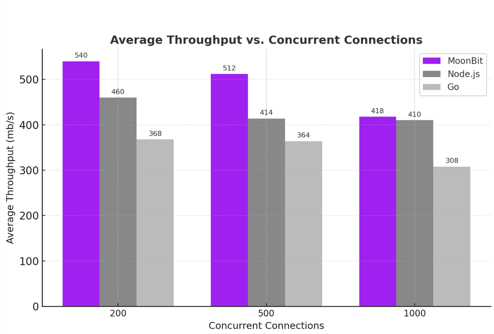
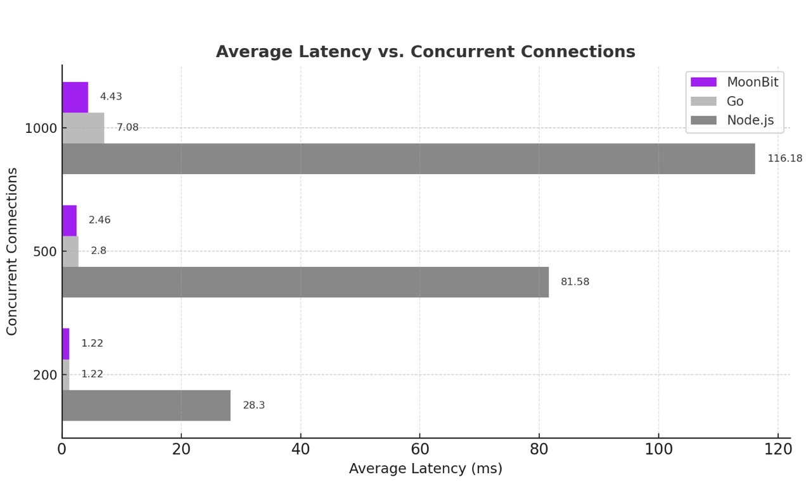
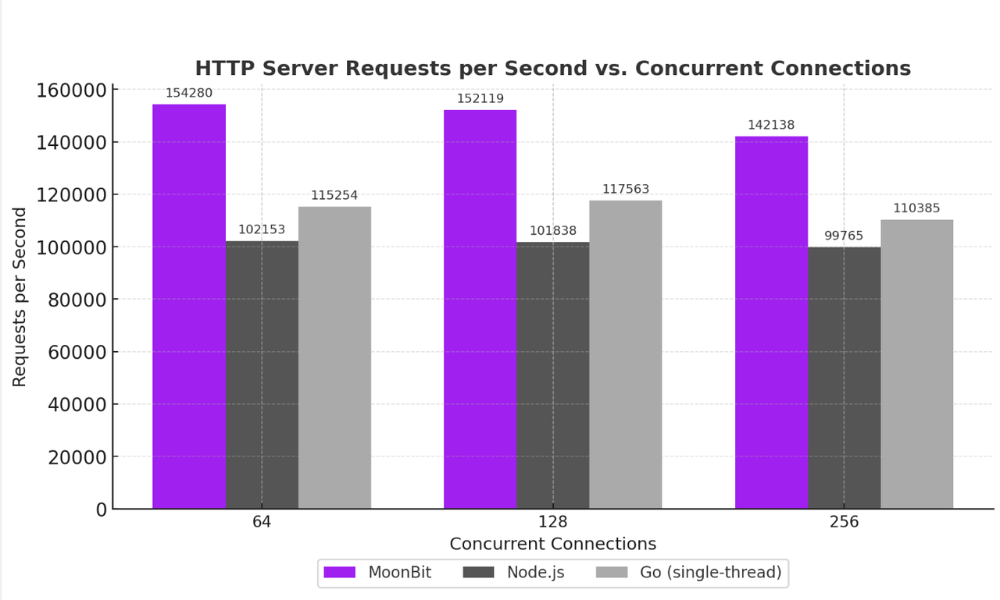

# MoonBit 异步网络库发布


近日，MoonBit
语言发布了初步的异步编程支持，补全了关键语言特性的最后一块拼图。MoonBit
的目标应用包括云服务、AI agent 等重度依赖异步编程的领域。因此，MoonBit
团队十分注重异步编程支持，在 MoonBit beta release
后不到半年就发布了异步编程支持。作为一门新兴语言，MoonBit
语言的异步编程支持吸取了现有语言的经验与教训，具有比现有语言更简洁的语法。MoonBit
语言的异步运行时基于结构化并发理念设计，能够帮助用户编写出更加健壮、安全的异步程序。

## 什么是异步编程？

异步编程指的是编写能够在运行途中中断、同时执行多个任务的程序。典型的例子是一个网络服务器。网络服务器需要同时处理多个连接、服务多个客户。但对于每个连接，大部分的时间会花在等待网络
IO
上，实际进行计算的时间只占一小部分。如果用同步的方式来处理连接，即处理完一个连接再处理下一个，就会花费大量时间在等待上，严重影响性能。如果用异步的方式来编写网络服务器，就能在某个连接等待网络
IO
的时候中断它的运行，切换至其他无需等待的任务进行处理，最大化利用计算资源。许多依赖于网络的重要应用，例如云服务、AI
agent，都需要用异步的方式编写。

最初，异步编程是通过操作系统提供的进程或线程来实现的。每个进程或线程对应程序中的一个任务，由操作系统负责中断进程/线程，并在不同任务间切换。然而，无论进程还是线程，都有较大的创建开销、内存占用和上下文切换开销。因此，基于进程/线程的异步程序，难以同时处理大量任务。在
21 世纪初，人们发现基于线程的服务器无法同时处理超过 1000
个连接。“让服务器能够同时处理 1000 个连接” 的挑战被称为 C10K
问题，它催生了下一代的、用户态的异步编程技术：事件循环。基于事件循环的程序不再依赖于操作系统的进程/线程，一切都在用户态完成。因此，基于事件循环的异步程序里，任务的创建和切换开销极低，可以同时处理更多的任务。基于事件循环的异步程序突破了
C10K 问题，成为了互联网时代的各种基础设施的基石。

随着网络服务的重要性的提高，越来越多应用程序也需要用到异步编程来发起各种网络请求。然而，手工编写事件循环时，为了支持任务的中断和切换，程序的逻辑会被分散到程序的不同部分，使得开发效率和程序的可维护性极大下降。因此，新一代的编程语言，如
Go/Rust/Swift/Kotlin，都提供了原生的异步编程支持，使异步程序能像普通的同步程序一样自然地编写。C++/JavaScript/C#/Python
等语言，也在新版本中添加了原生的异步编程支持。可以说，异步编程已经成为了现代编程语言不可缺少的一部分。然而，异步编程是一个非常复杂的主题，许多设计的选择没有定论。除了为云服务而生的
Go
语言之外，大部分其他语言的异步编程支持都是在语言发布多年后才添加，且往往经历了较长时间的开发。

## MoonBit 中的异步编程

### 无需 `await` 的简洁语法

在 MoonBit 中，可以用 `async`
关键字声明异步函数。异步函数中可以调用其他异步函数，例如由运行时提供的异步 IO
原语。但异步函数只能在其他异步函数中被调用，不能被普通函数调用。MoonBit 支持
`async fn main` 作为异步程序的入口，还原生支持 `async test` 语法来测试异步程序。

在许多语言中，除了声明异步函数要用 `async` 关键字标记，调用异步函数也需要用
`await` 关键字标记。但在 MoonBit 中，调用异步函数时无需添加任何特殊标记，MoonBit
编译器会根据类型自动推断函数调用的种类。MoonBit 的 IDE
会用斜体来渲染异步函数调用。因此，哪怕语法上没有特殊标记，阅读代码时依然可以快速找到所有异步的函数调用。

下面的代码是一个在 MoonBit 中异步发起网络请求的测试。可以看到，MoonBit
中进行异步编程非常简洁，几乎和同步编程一样方便：

```moonbit
async test {
  let (response, _) = @http.get("https://www.moonbitlang.cn")
  inspect(response.code, content="200")
}
```

### 结构化并发设计

在异步程序中，由于可以不断在不同任务间切换，程序的控制流往往比同步程序复杂。此外，异步程序常常与网络通信等
IO
需求相关联，和外界交互时可能出现各种各样的意外情况和错误。因此，正确进行错误处理也是异步编程的一大难题。传统的异步编程系统往往是非结构化的：所有任务都是全局的，一个任务除非自己终止或是被显式取消，都不会停止运行。这意味着，在利用多个并行的任务处理某项工作时，如果其中的某个任务出错，程序需要手动取消其他任务。否则，其他任务就会默默在后台继续运行，成为孤儿任务，导致资源泄漏甚至程序崩溃。异步程序的控制流本就复杂，在此基础上，健壮的程序还需要手动进行错误处理，错误处理的途中还可能出现新的意外情况。因此，编写
“在出错时也表现正确” 的异步程序非常困难，远比编写 “顺利运行时表现正确”
的异步程序要难。如何辅助用户写出能正确处理错误的异步程序，是异步编程系统设计时的重要课题。

对于这个问题，MoonBit 的答案是
“结构化并发”。结构化并发是一种新兴的异步编程范式，旨在解决异步编程的错误处理困难等问题。在
MoonBit
中，异步任务不再是全局的，而是相互嵌套、呈现出树状结构的。基于结构化并发的理念，**一个任务只会在子任务全都结束运行后结束**。这保证了不会有孤儿任务及其带来的资源泄漏等问题。在一个任务出错时，MoonBit
会自动取消它的所有子任务，并把错误向上传播，使得异步程序的错误处理就像同步程序一样方便。

下面的例子是 RFC 8305 中描述的 happy eyeball
算法，它能很好演示结构化并发理念的优越性。当程序像某个域名发起网络请求时，首先会通过
DNS 请求获得目标域名的 IP 列表。接下来，程序需要从 IP 列表中选择一个 IP
来连接到目标服务器。而 happy eyeball 就是一个自动的 IP
选择算法，它的运行方式是：依次尝试 IP 列表中的每个
IP，尝试发起连接。在发起上次连接尝试后，如果 250
毫秒内连接没有成功，就尝试下一个
IP。任何时候，只要有任何一个连接成功，就关闭其他连接，使用成功的那个连接来发起请求。Happy
eyeball 的控制流非常复杂：

- 在 250 毫秒的等待途中的任何时刻，只要有一个连接成功，就应该立刻返回成功的连接

- 在返回成功的连接时，需要正确的关闭其他连接，以避免资源泄漏

- 在某个连接出错时，算法依然可以继续等待其他连接或尝试其他 IP

MoonBit 中，happy eyeball 算法的实现如下：

```moonbit
pub async fn happy_eyeball(addrs : Array[@socket.Addr]) -> @socket.TCP {
  let mut result = None
  @async.with_task_group(fn(group) {
    for addr in addrs {
      group.spawn_bg(allow_failure=true, fn() {
        let conn = @socket.TCP::connect(addr)
        result = Some(conn)
        group.return_immediately(())
      })
      @async.sleep(250)
    }
  })
  match result {
    Some(conn) => conn
    None => fail("connection failure")
  }
}
```

`happy_eyeball` 函数接受一串 IP 地址作为输入，根据 happy eyeball
算法尝试从其中选择一个 IP 进行连接，并返回最终选择的 TCP 连接。函数中，通过
`@async.with_task_group` 创建一个新的任务组。在 MoonBit
中，任务组是结构化并发的核心。所有子任务都必须被创建在某个任务组中，而
`with_task_group`
只会在所有子任务都结束运行后才返回。在新的任务组里，我们遍历每个 IP 地址，用
`group.spawn_bg`
在后台起一个新的任务来尝试连接。因此，在算法运行时，可能有多个连接尝试在同时进行。在尝试每个地址后，我们用
`@async.sleep` 来实现 happy eyeball 中的 250
毫秒等待时间。在尝试连接的子任务内部，我们用 `@socket.TCP::connect`
来发起连接。如果连接成功，我们记录成功的连接，并通过 `group.return_immediately`
立刻终止整个任务组。`return_immediately` 会自动取消任务组中的所有其他任务。

MoonBit 中的 happy eyeball
实现非常简洁，几乎就是对算法描述的直接翻译，但它能自动照顾到算法中的所有细节：

- `group.return_immediately` 会自动取消所有其他连接请求。如果此时我们处于
  `@async.sleep` 的等待中，`@async.sleep` 也会被自动取消，使得 `group`
  能立刻结束

- 取消某个连接请求时，如果 `@socket.TCP::connect`
  已经创建了连接，但连接还没有成功，它会自动关闭连接，不会有资源泄漏

- 由于在创建子任务时传递了
  `allow_failure=true`，某次连接请求失败不会影响其他连接尝试

作为对比，Python 的 `asyncio` 库中的
[happy eyeball 实现](https://github.com/aio-libs/aiohappyeyeballs/blob/main/src/aiohappyeyeballs/impl.py)
需要约 200 行代码，可读性也不如 MoonBit 版本。

结构化并发带来的另一大优势，是异步代码的高度模块化。例如，如果想给发起连接的操作加上时间限制，只需要使用
`@async.with_timeout` 函数包裹发起连接的代码即可：

```moonbit
@async.with_timeout(3000, fn() {
  let addrs = ..
  happy_eyeball(addrs)
})
```

`@async.with_timeout`
提供的时间限制是精确的时间限制：在上面的例子里，三秒之后，无论 `with_timeout`
的程序处于哪一个位置，都会立刻被取消。在 MoonBit
中，所有异步代码在默认状态下都是可以取消的。而 `with_timeout`
内部的代码在编写时，完全无需考虑外面的时间限制。

### 性能对比

MoonBit 的异步运行时 `moonbitlang/async` 目前支持 Linux 及 MacOS 上的 native
后端，使用一个自定义的线程池和 `epoll`/`kqueue`
实现。虽然尚处于开发初期，MoonBit 的异步运行时已经有优异的性能表现。类似
Node.js，MoonBit
的异步运行时是单线程、多任务的：异步程序中同步的部分只会在一个线程上执行。这样的好处是程序只要中间不调用异步函数，就可以当成单线程程序来看待。在使用共享资源时，不需要加锁或担心
race condition 等等。代价则是无法同时利用多个 CPU
核心来计算。不过，异步程序往往是 IO 密集的，计算的占比很小，只用一个 CPU
核心也足够实现不俗的性能。

下面是一个简单的 TCP
服务器的性能测试。这个服务器会把收到的所有数据原样回复给对方。这个例子里几乎没有计算的成分，可以很好地展示运行时系统本身的性能。性能测试会向服务器并行地维护
N
个连接，不断向服务器发送数据并收取服务器的回复。期间，测试会记录每个连接的平均吞吐量以及平均延迟（从发送第一个数据包到收到第一个回复的时间）。对比的对象是
Node.js 和 Go 语言。性能测试的结果如下：



测试结果显示，**MoonBit 在 200 到 1000
个并发连接下始终保持最高吞吐量**，在高并发场景中明显优于 Node.js 和
Go。这表明其异步运行时具备出色的扩展性。

 在高并发场景下，**MoonBit
的平均延迟始终保持在个位数毫秒**，即便在 1000 个连接时也只有
**4.43ms**；相比之下，Node.js 延迟超过 **116ms**。这意味着 MoonBit
的异步运行时能够在大规模连接下依然保持快速响应。

下面是一个 HTTP 服务器的例子。相比 TCP 服务器，HTTP 例子需要进行 HTTP
协议的解析，有更多的计算成分，不是单纯的 IO。得益于 MoonBit
语言本身的优秀性能，在这个测试中 MoonBit 依然表现良好。这个测试会使用
(https://github.com/wg/wrk) 工具，通过多个连接不断向 HTTP 服务器发送
`GET / HTTP/1.1`
的请求，服务器应当返回一个空的回复。测试会记录服务器每秒处理的请求数以及每个请求的平均延迟。测试的结果如下：

 

这里，Go 的 HTTP 服务器 `net.http` 可以使用多个 CPU 核心，为了和 MoonBit 及
Node.js 直接比较，测试时通过 `GOMAXPROCS=1` 限制了 Go 只使用一个 CPU
核心。上述两个测试中的代码都非常简单，因此 Node.js 测试中 javascript
代码的占比很小，更多反映的是它后端的 `libuv`，一个使用 C
编写的事件循环库的性能。

## 实例：使用 MoonBit 编写一个 AI agent

目前，MoonBit
的异步支持已经覆盖大部分基础应用，能够用于编写各种完整的异步程序。例如，下面是一个使用
MoonBit 编写的 AI agent 的例子。例子只包含核心的循环部分，完整的代码可以
[在 GitHub 阅读](https://gist.github.com/tonyfettes/2953d5bef1610fce12cca05ea20655e2)：

```moonbit
let tools : Map[String, Tool] = {
  // 向 LLM 提供的工具列表
 }

async fn main {
  // 和 LLM 的对话历史
  let conversation = []
  // 发送给 LLM 的初始信息
  let initial_message = User(content="Can you please tell me what time is it now?")
  
  for messages = [ initial_message ] {
    let request : Request = {
      model,
      messages: [..self.conversation, ..messages],
      tools: tools.values().collect(),
    }
    // 把对话历史和新的消息一起发送给 LLM 并获取 LLM 的回复
    let (response, response_body) = @http.post(
      "\{base_url}/chat/completions",
      request.to_json(),
      headers={
        "Authorization": "Bearer \{api_key}",
        "Content-Type": "application/json",
        "Connection": "close",
      },
    )
    guard response.code is (200..=299) else {
      fail("HTTP request failed: \{response.code} \{response.reason}")
    }
    let response : Response = @json.from_json(response_body.json())
    let response = response.choices[0].message
    guard response is Assistant(content~, tool_calls~) else {
      fail("Invalid response: \{response.to_json().stringify(indent=2)}")
    }

    // 把 LLM 的回复输出给用户
    println("Assistant: \{content}")
    
    // 把这轮对话添加到对话历史里
    conversation..push_iter(messages)..push(response)

    // 根据 LLM 的请求调用对应的工具
    let new_messages = []
    for tool_call in tool_calls {
      let message = handle_tool_call(tools, tool_call)
      new_messages.push(message)
      println("Tool: \{tool_call.function.name}")
      println(content)
    }
    continue new_messages
  }
}
```

这个 AI agent
的例子看上去和普通的同步代码几乎没有区别，但其实这段代码是完全异步的。它可以模块化地和其他异步代码自由组合，例如监听用户输入、同时运行多个
agent 等等。当程序需要实现较为复杂的异步控制流时，MoonBit
的结构化并发设计也能极大地简化程序、提升程序的健壮性。因此，对于 AI agent
等典型异步应用，MoonBit 的异步编程系统不仅能够胜任，而且是非常合适的选择。
