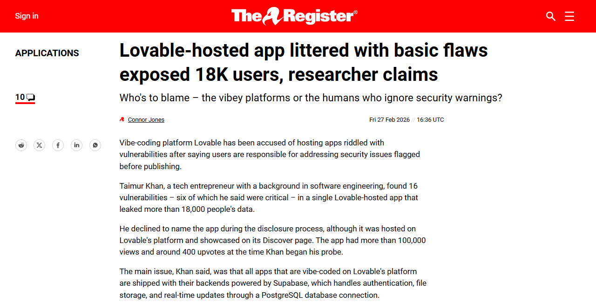
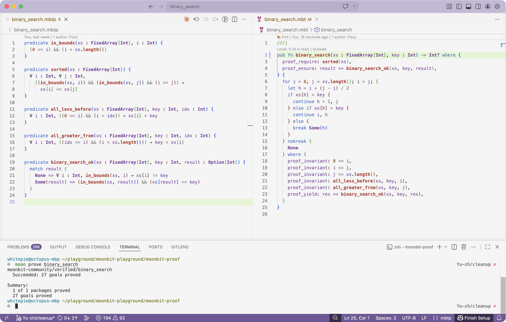
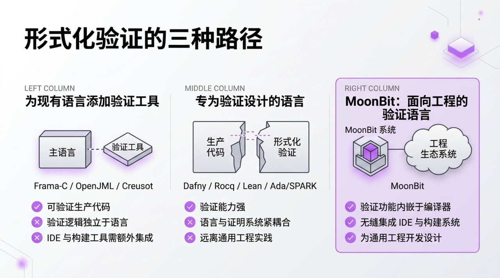

# MoonBit 0.9 发布：AI 自动生成可证明的代码

过去四个月，MoonBit 生态进入指数增长阶段。新增生态规模已接近此前三年的总和的三倍：库的数量从约 2500 增长到 7500 多，累计下载量达到 320 万，正逐步成长为中国智造相关基础软件领域中最具全球影响力的项目之一。

这背后，一个关键变化是 MoonBit 已经完成了在大模型上的[冷启动](https://swe-agi.com)。虽然 MoonBit 作为一门新语言，尚不具备丰富的历史语料，但凭借 AI 原生的设计和对 Agent 友好的工具链，大模型已经能够在极少人工干预的情况下，大规模生成高质量的 MoonBit 代码，甚至一次性生成完整的 C 编译器。

相关链接：https://www.moonbitlang.cn/blog/moonbit-c-compiler

随着代码生成能力快速提升，软件工程面临的核心问题愈发明显：如何确保 AI 在生成大量代码的同时，这些代码依然可靠，并满足应有的约束。

最近，外媒披露了一款借助 AI 生成并上线托管的应用。它表面上功能完整，但在认证、访问控制和数据库权限等基础环节存在一系列漏洞，最终导致上万条用户数据暴露。

相关链接：https://www.theregister.com/2026/02/27/lovable_app_vulnerabilities/

这个案例暴露出的核心问题恰恰在于：应用表面上可以正常工作，但那些真正决定系统是否可靠的关键约束，既没有被清晰表达，也没有被系统验证。

测试和模糊测试仍然重要，但它们依赖样例和覆盖范围，难以直接回答“程序是否始终满足某个关键性质”这一问题。仅靠这些手段，仍难以从根本上杜绝这类问题。

形式化证明为这一难题打开了一条清晰的路径：不再依赖反复测试去逼近正确性，而是直接描述程序应满足的性质，并自动检查实现是否真正满足这些性质。更重要的是，在底层假设可靠的前提下，证明过程本身也可以由 AI 大规模自动生成。

MoonBit 0.9 的一项核心进展，是引入了一整套面向 AI 协作的形式化证明能力。它能够帮助 AI 自动构造复杂证明、生成规范，并对实现是否满足规范进行验证，从而为大规模生成高质量、可验证的代码提供支撑。这也是全球范围内在这一个领域的首次突破。

<!--truncate-->

## MoonBit 中的形式化验证：写代码的同时写证明

以二分查找这个经典例子为例。二分查找看似简单，却是出了名的“容易写错”。Joshua Bloch 在 2006 年曾撰文指出，Java 标准库中的二分查找实现存在整数溢出 Bug，这段代码在生产环境中运行了近十年才被发现。

上图展示了 MoonBit 中对二分查找的完整验证。左侧是带有合约和循环不变量的函数实现，右侧是谓词定义文件，底部终端显示验证全部通过。

### 合约：函数的数学承诺

函数开头的 `proof_requires(sorted(xs))` 和 `proof_ensures(binary_search_ok(xs, key, result))` 是这个函数与外界立下的契约。调用方承诺输入数组有序，函数承诺返回值一定是正确的：找到了就确实是目标元素，没找到就意味着目标值确实不在数组中。这不是注释或文档，而是会被机器严格检验的约束。

### 谓词：用数学语言消除歧义

右侧的 `.mbtp` 文件精确定义了合约中每一个概念的含义。比如，“有序”被定义为“对任意合法下标 `i <= j`，都有 `xs[i] <= xs[j]`”；“查找正确”被定义为“返回 `Some(i)` 时 `xs[i]` 等于目标值，返回 `None` 时数组中不存在等于目标值的元素”。所有概念都用量词和逻辑连接词表达，没有自然语言的模糊空间。

### 循环不变量：连接代码与证明的桥梁

代码底部 `where` 块中的 `proof_invariant` 描述了循环每一轮迭代都必须维持的性质：搜索区间 `[i, j)` 始终合法，区间左侧的元素都小于目标值，区间右侧的元素都大于目标值。正是这些不变量将一段普通的循环代码，变成了可以被逐步推理的证明对象。

### 验证过程

当开发者执行 `moon prove` 时，MoonBit 工具链会将程序逻辑和谓词定义翻译为约束求解问题，再交由 Z3 等 SMT 求解器进行自动化验证。求解器会逐一检查：循环不变量在初始状态是否成立、每次迭代后是否仍然维持、循环结束时能否推导出后置条件。这里验证的不是“某几组输入下程序碰巧返回了正确结果”，而是一个覆盖所有可能输入的数学证明。也就是说，对于任意长度的有序数组和任意目标值，这段二分查找实现都满足其合约承诺。

MoonBit 还可以借助 AI 完成一棵 AVL 树的验证：https://github.com/moonbit-community/verified/tree/main/avl

这也引出一个更关键的问题：如果形式化验证本身过于复杂，它如何走向大规模使用？

## AI 本身就可以写证明

形式化验证最令人望而却步的部分，在于证明本身的编写。循环不变量必须拿捏得恰到好处：它既要足够强，能够推出后置条件；又要足够稳，能够在每一次迭代中维持成立。

MoonBit 的一个重要探索方向，就是借助 AI 降低这一门槛。事实上，前文中的二分查找和 AVL 树证明，包括循环不变量、谓词定义以及 `proof_assert` 引导链，大部分都由 AI Agent 辅助生成。开发者给出函数实现和合约意图，AI 生成候选不变量和中间断言，再由定理证明器进行严格的机器检验。

这形成了一种精妙的协作模式：AI 负责“猜”，证明器负责“查”。AI 可能会出错，它生成的不变量可能过弱，中间断言也可能遗漏；但错误的猜测无法通过证明器的审查。证明器要么确认每一步推理都成立，要么明确指出哪个目标无法证明，AI 再据此修正并继续尝试。最终交付的，始终是经过数学验证的结果，从而避免“AI 幻觉”蒙混过关。

相关链接：https://github.com/moonbit-community/verified

## 开创性地将形式化验证作为语言一等特性原生内置

目前形式化验证方案大致可以分为两类。

**对现有语言叠加验证能力**，如 C 语言的 Frama-C、Java 的 OpenJML、Rust 的 Creusot。

这类方案的优势在于可以直接验证生产代码，但它们面临一个结构性问题：验证和语言是分离的。合约和规范只能通过注释或宏注入，对语言本身而言是不可见的“外挂”。这意味着 IDE 无法原生理解验证注解，补全、跳转、错误提示都需要额外的插件支持；构建系统不知道验证步骤的存在，开发者需要手动维护额外的工具链；当语言本身升级时，验证工具往往要滞后数月甚至数年才能跟上。

**专门为验证设计的语言**，如微软的 Dafny、Rocq（原 Coq）、Lean 等。

这类方案的验证能力更强，语言和证明系统天然一体。但它们缺乏作为通用编程语言的生态基础，没有成熟的包管理、没有广泛的第三方库，也没有大规模的工业用户群。其中 Rocq 和 Lean 表达力极强，但如果要验证 C 或 Java 这样的现有语言，需要在证明器中重新建模目标语言的语义，工程量巨大且难以维护。Ada/SPARK 是少有的兼具工业验证能力和实际部署经验的方案，但它绑定在 Ada 生态中，与现代云原生和 Web 开发场景几乎没有交集。

MoonBit 的差异化在于**垂直整合**：合约、谓词、循环不变量和 `proof_assert` 都是语言语法的一等成员，而不是藏在注释或宏里的二等公民。编译器直接理解这些结构，这意味着 IDE 可以像处理普通代码一样对验证注解提供语法高亮、自动补全、类型检查和错误定位；`moon prove` 作为构建系统的内置命令，与 `moon build`、`moon test` 并列，开发者不需要配置额外的工具链或切换工作流。从编写代码到编写证明，再到运行验证，全部在同一套语言、同一个 IDE、同一条命令行中完成。

再加上 AI 辅助降低了证明编写的门槛，MoonBit 试图**同时解决“不好用”和“门槛高”**这两个历史性难题，不仅让验证更强大，也让它对普通开发者真正可用。

## 展望

在这样的背景下，形式化验证的意义也在发生变化。它不再只是面向极少数安全关键场景的专门技术，而正在成为提升软件可信度的一条现实路径。MoonBit 希望通过语言设计、AI 辅助和工具链整合，持续降低验证的使用门槛，让约束表达、证明生成和结果检查更自然地进入开发流程。我们期待，随着这套能力不断完善，“证明代码正确”能够像编写测试和运行构建一样，逐步成为软件工程中的常规实践。

除了形式化验证之外，本次 0.9 发布还带来了其他关键更新，详情可参见 [MoonBit 2026.4 Jaderabbit](https://www.moonbitlang.cn/updates/2026/04/07/index)。
