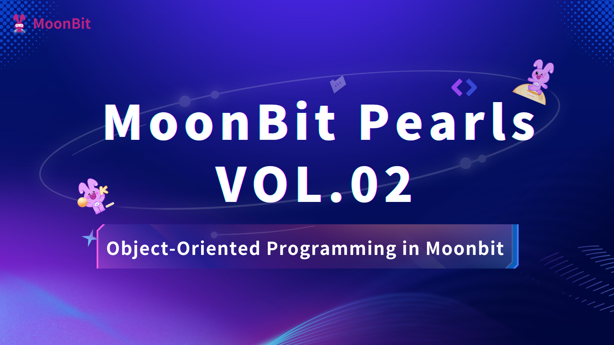

# MoonBit Pearls Vol.02:Object-Oriented Programming in Moonbit



## Introduction

In the world of software development, object-oriented programming (OOP) is an unavoidable topic. Languages like Java and C++ have built countless complex systems with their powerful OOP mechanisms. However, Moonbit, as a modern language centered around functional programming, how does it implement OOP?

Moonbit is a language with functional programming at its core, and its approach to object-oriented programming differs significantly from traditional programming languages. It abandons traditional inheritance mechanisms in favor of the "composition over inheritance" design philosophy. At first glance, this might feel unfamiliar to programmers accustomed to traditional OOP, but upon closer inspection, you'll discover an unexpected elegance and practicality in this approach.

This article will take you through an in-depth exploration of object-oriented programming in Moonbit using a vivid RPG game development example. We'll dissect the three major OOP characteristics—encapsulation, inheritance, and polymorphism—and compare them with their C++ counterparts. Finally, we'll provide some best practice recommendations for real-world development.

## Encapsulation

Imagine we're developing a classic single-player RPG game. In this fantasy world, heroes roam, battle monsters, purchase equipment from NPC merchants, and ultimately rescue a trapped princess. To build such a world, we first need to model all its elements.

Whether it's brave heroes, vicious monsters, or simple tables and chairs, all objects in the game world share some common features. We can abstract these objects as `Sprite`s, with each `Sprite` having a few basic attributes:

- `ID`: A unique identifier for the object, like an ID number.
- `x` and `y`: Coordinates on the game map.

### Classic Encapsulation in C++

In C++, we're accustomed to using `class` to encapsulate data:

```cpp
// A basic Sprite class
class Sprite {
private:
    int id;
    double x;
    double y;

public:
    // Constructor to create objects
    Sprite(int id, double x, double y) : id(id), x(x), y(y) {}

    // Public "getter" methods to access data
    int getID() const { return id; }
    double getX() const { return x; }
    double getY() const { return y; }

    // "Setter" methods to modify data
    void setX(double newX) { x = newX; }
    void setY(double newY) { y = newY; }
};
```

You might ask, "Why bother with all these `get` methods? Why not just make the fields `public`?" This question touches on the core idea of encapsulation.

> Why Encapsulation?
>
> Imagine if your colleague directly modified `sprite.id = enemy_id`. The hero could instantly "transform" into an ally of the enemy and waltz straight to the end—clearly not the game mechanic we want! Encapsulation acts like a protective net around data. `private` fields paired with `getter` methods ensure that external code can only read critical data but not modify it arbitrarily. This design makes the code more robust, avoiding unintended side effects.

### Elegant Encapsulation in Moonbit

In Moonbit, the approach to encapsulation undergoes a subtle yet important shift. Let's look at a simple version first:

```moonbit no check
// Defining Sprite in Moonbit
pub struct Sprite {
  id: Int          // Immutable by default, readable but not writable externally
  mut x: Double    // `mut` keyword indicates mutability
  mut y: Double
}

// We can define methods for the struct
pub fn Sprite::get_x(self: Self) -> Double {
  self.x
}

pub fn Sprite::get_y(self: Self) -> Double {
  self.y
}

pub fn Sprite::set_x(self: Self, new_x: Double) -> Unit {
  self.x = new_x
}

pub fn Sprite::set_y(self: Self, new_y: Double) -> Unit {
  self.y = new_y
}
```

Two key differences stand out here:

**1. Explicit Mutability Declaration**

In Moonbit, fields are **immutable** by default. If you want a field to be modifiable, you must explicitly use the `mut` keyword. In our `Sprite`, `id` remains immutable—perfectly aligning with our design intent, as we don't want an object's identity to be arbitrarily altered. Meanwhile, `x` and `y` are marked as `mut` because sprites need to move freely in the world.

**2. Simpler Access Control**

Since `id` is immutable by default, we don't even need to write a `get_id` method for it! External code can directly read it via `sprite.id`, but any attempt to modify it will be firmly rejected by the compiler. This is more concise than C++'s "private + getter" pattern while maintaining the same level of safety.

> 💡 Practical Advice
>
> When designing data structures, prioritize determining which fields truly need to be mutable. Moonbit's default immutability helps avoid many unintended state modification bugs.

## Inheritance

The second pillar of object-oriented programming is inheritance. In our RPG world, there are various types of `Sprite`s. For simplicity, we'll define three:

- `Hero`: The player-controlled character.
- `Enemy`: Opponents to be defeated.
- `Merchant`: NPCs who sell items.

### Inheritance Hierarchy in C++

In C++, we naturally use class inheritance to build this hierarchy:

```cpp
class Hero : public Sprite {
private:
    double hp;
    double damage;
    int money;

public:
    Hero(int id, double x, double y, double hp, double damage, int money)
        : Sprite(id, x, y), hp(hp), damage(damage), money(money) {}

    void attack(Enemy& e) { /* ... */ }
};

class Enemy : public Sprite {
private:
    double hp;
    double damage;

public:
    Enemy(int id, double x, double y, double hp, double damage)
        : Sprite(id, x, y), hp(hp), damage(damage) {}

    void attack(Hero& h) { /* ... */ }
};

class Merchant : public Sprite {
public:
    Merchant(int id, double x, double y) : Sprite(id, x, y) {}
    // Merchant-specific methods...
};
```

C++'s object-oriented approach is built on the **"is-a"** relationship: `Hero` **is a** `Sprite`, `Enemy` **is a** `Sprite`. This way of thinking is intuitive and easy to grasp.

### Composition-Based Thinking in Moonbit

Now, let's switch to Moonbit. Here, we need to make an important mental shift: **Moonbit's `struct`s do not support direct inheritance**. Instead, we use `trait`s and **composition**.

This design forces us to rethink the problem: we no longer treat `Sprite` as an inheritable "parent class" but instead split it into two independent concepts:

1. **`SpriteData`**: A pure data structure storing all shared `Sprite` data.
2. **`Sprite`**: A `trait` defining the behaviors all `Sprite`s should have.

Here's the actual code:

```moonbit no check
// 1. Define the shared data structure
pub struct SpriteData {
  id: Int
  mut x: Double
  mut y: Double
}

// 2. Define the Trait describing common behaviors
pub trait Sprite {
  getSpriteData(Self) -> SpriteData  // Core method that must be implemented
  getID(Self) -> Int = _             // = _ indicates a default implementation
  getX(Self) -> Double = _
  getY(Self) -> Double = _
  setX(Self, Double) -> Unit = _
  setY(Self, Double) -> Unit = _
}

// Default implementations for Sprite
// Once getSpriteData is implemented, other methods become automatically available
impl Sprite with getID(self) {
  self.getSpriteData().id
}

impl Sprite with getX(self) {
  self.getSpriteData().x
}

impl Sprite with getY(self) {
  self.getSpriteData().y
}

impl Sprite with setX(self, new_x) {
  self.getSpriteData().x = new_x
}

impl Sprite with setY(self, new_y) {
  self.getSpriteData().y = new_y
}
```

> Understanding the Power of Traits
>
> The `Sprite` trait defines a "contract": any type claiming to be a `Sprite` must be able to provide its `SpriteData`. Once this condition is met, methods like `getID`, `getX`, and `getY` become automatically available. The `= _` syntax indicates that the method has a default implementation, a new syntactic feature in Moonbit.

With this foundation, we can implement concrete game characters:

```moonbit
// Define Hero
pub struct Hero {
  sprite_data: SpriteData  // Composing SpriteData
  hp: Double
  damage: Int
  money: Int
}

// Implement the Sprite trait, only needing to provide getSpriteData
pub impl Sprite for Hero with getSpriteData(self) {
  self.sprite_data
}

pub fn Hero::attack(self: Self, e: Enemy) -> Unit {
  // Attack logic...
}

// Define Enemy
pub struct Enemy {
  sprite_data: SpriteData
  hp: Double
  damage: Int
}

pub impl Sprite for Enemy with getSpriteData(self) {
  self.sprite_data
}

pub fn Enemy::attack(self: Self, h: Hero) -> Unit {
  // Attack logic...
}

// Define Merchant
pub struct Merchant {
  sprite_data: SpriteData
}

pub impl Sprite for Merchant with getSpriteData(self) {
  self.sprite_data
}
```

Note the shift in mindset here: Moonbit adopts a **"has-a"** relationship instead of the traditional OOP **"is-a"** relationship. `Hero` **has** `SpriteData` and **implements** the `Sprite` capabilities.

> Does Moonbit Seem More Complex?
>
> At first glance, Moonbit's code might appear to require more "boilerplate" than C++. But this is only superficial! Here, we deliberately avoided many complexities inherent in C++: constructors, destructors, const correctness, template instantiation, etc. More importantly, Moonbit's design shines in large-scale projects—we'll discuss this in detail later.

## Polymorphism

Polymorphism is the third pillar of object-oriented programming, referring to the ability of **the same interface to produce different behaviors when applied to different objects**. Let's explore this through a concrete example: suppose we need to implement a `who_are_you` function that can identify the type of an object and return an appropriate response.

### Polymorphism Mechanisms in C++

C++'s polymorphism mechanisms are complex, encompassing static polymorphism (templates) and dynamic polymorphism (virtual functions, RTTI, etc.). A full discussion of C++ polymorphism is beyond this article's scope, but we'll focus on two classic runtime polymorphism approaches.

### Method 1: Virtual Function Mechanism

The traditional approach is to define virtual functions in the base class and override them in subclasses:

```cpp
class Sprite {
public:
    virtual ~Sprite() = default;  // Virtual destructor
    // Define a "pure virtual function," forcing subclasses to implement it
    virtual std::string say_name() const = 0;
};

// "Override" this function in subclasses
class Hero : public Sprite {
public:
    std::string say_name() const override {
        return "I am a hero!";
    }
    // ...
};

class Enemy : public Sprite {
public:
    std::string say_name() const override {
        return "I am an enemy!";
    }
    // ...
};

class Merchant : public Sprite {
public:
    std::string say_name() const override {
        return "I am a merchant.";
    }
    // ...
};

// Now the who_are_you function becomes trivial!
void who_are_you(const Sprite& s) {
    std::cout << s.say_name() << std::endl;
}
```

### Method 2: RTTI + dynamic_cast

If we don't want to define virtual functions for each class, we can use C++'s Runtime Type Information (RTTI):

```cpp
class Sprite {
public:
    // Only classes with virtual functions can use RTTI
    virtual ~Sprite() = default;
};

// Implementation of who_are_you
void who_are_you(const Sprite& s) {
    if (dynamic_cast<const Hero*>(&s)) {
        std::cout << "I am a hero!" << std::endl;
    } else if (dynamic_cast<const Enemy*>(&s)) {
        std::cout << "I am an enemy!" << std::endl;
    } else if (dynamic_cast<const Merchant*>(&s)) {
        std::cout << "I am a merchant." << std::endl;
    } else {
        std::cout << "I don't know who I am" << std::endl;
    }
}
```

> How RTTI Works
>
> With RTTI enabled, the C++ compiler maintains an implicit `type_info` structure for each object with virtual functions. When `dynamic_cast` is used, the compiler checks this type information: if it matches, it returns a valid pointer; otherwise, it returns `nullptr`. While powerful, this mechanism incurs runtime overhead.

However, the second method has issues in large projects:

1. **Type Unsafety**. If you add a new subclass but forget to update the `who_are_you` function, this bug will only surface at runtime! In modern software development, we prefer such errors to be caught at compile time.
2. **Performance Overhead**. With RTTI enabled, every type check involves a cumbersome type information lookup, which hampers optimization and can lead to performance issues.
3. **Opaque Data**. With RTTI, C++ implicitly adds type information to each class, but this is invisible to the code author. This is problematic for library developers who desire more control over their code. In fact, many large projects disable RTTI—most notably LLVM, a C++ compiler project that itself avoids using RTTI.

### Moonbit's ADT Mechanism

Moonbit elegantly solves polymorphism using **Algebraic Data Types** (ADTs). We introduce a new structure—`SpriteEnum`:

```moonbit no check
pub trait Sprite {
  getSpriteData(Self) -> SpriteData
  asSpriteEnum(Self) -> SpriteEnum  // New: type conversion method
}

// Moonbit allows enum tags and type names to overlap
pub enum SpriteEnum {
  Hero(Hero)
  Enemy(Enemy)
  Merchant(Merchant)
}

// We still need to implement getSpriteData for Sprite
pub impl Sprite for Hero with getSpriteData(self) {
  self.sprite_data
}

pub impl Sprite for Enemy with getSpriteData(self) {
  self.sprite_data
}

pub impl Sprite for Merchant with getSpriteData(self) {
  self.sprite_data
}

// Implement asSpriteEnum for the three subclasses
// This essentially "boxes" the concrete type into the enum
pub impl Sprite for Hero with asSpriteEnum(self) {
  Hero(self)  // Note: Hero here is the enum tag, not the type
}

pub impl Sprite for Enemy with asSpriteEnum(self) {
  Enemy(self)
}

pub impl Sprite for Merchant with asSpriteEnum(self) {
  Merchant(self)
}
```

Now we can implement a type-safe `who_are_you` function:

```moonbit no check
test "who are you" {
  fn who_are_you(s: &Sprite) -> String {
    // Use pattern matching for type dispatch
    match s.asSpriteEnum() {
      Hero(_) => "hero"
      Enemy(_) => "enemy"
      Merchant(_) => "merchant"
    }
  }

  let hero = Hero::new();
  let enemy = Enemy::new();
  let merchant = Merchant::new();
  inspect(who_are_you(hero), content="hero")
  inspect(who_are_you(enemy), content="enemy")
  inspect(who_are_you(merchant), content="merchant")
}
```

The beauty of this approach lies in its **compile-time type safety**! If you add a new `Sprite` subclass but forget to update the `who_are_you` function, the compiler will immediately flag the error instead of waiting until runtime to reveal the issue.

> Static Dispatch vs. Dynamic Dispatch
>
> You might notice the `&Sprite` in the function signature. In Moonbit, this is called a **Trait Object**, supporting dynamic dispatch similar to C++'s virtual function mechanism. If you write `fn[S: Sprite] who_are_you(s: S)`, it becomes static dispatch (generics), where the compiler generates specialized code for each concrete type.
>
> The key difference lies in handling **heterogeneous collections**. Suppose a hero has an AOE skill that targets an array of different enemy types. You must use `Array[&Sprite]` instead of `Array[V]`, as the latter cannot accommodate different concrete types simultaneously.

Moonbit also supports direct method calls akin to C++'s virtual functions:

```moonbit no check
pub trait SayName {
  say_name(Self) -> String
}

pub impl SayName for Hero with say_name(_) {
  "hero"
}

pub impl SayName for Enemy with say_name(_) {
  "enemy"
}

pub impl SayName for Merchant with say_name(_) {
  "merchant"
}

test "say_name" {
  fn who_are_you(s: &SayName) -> String {
    s.say_name()  // Directly call the trait method, like a virtual function
  }

  let hero = Hero::new();
  let enemy = Enemy::new();
  let merchant = Merchant::new();
  inspect(who_are_you(hero), content="hero")
  inspect(who_are_you(enemy), content="enemy")
  inspect(who_are_you(merchant), content="merchant")
}
```

> Explicit RTTI
>
> Essentially, Moonbit's ADT approach makes C++'s implicit RTTI process explicit. Developers know exactly what types exist, and the compiler can perform completeness checks at compile time.

## Multi-Level Inheritance: Building Complex Capability Hierarchies

As the game system evolves, we notice that both `Hero` and `Enemy` have `hp` (hit points), `damage` (attack power), and an `attack` method. Can we abstract these common features into a `Warrior` (fighter) layer?

### Multi-Level Inheritance in C++

In C++, we can naturally insert new intermediate layers into the inheritance chain:

```cpp
class Warrior : public Sprite {
protected: // Using protected so subclasses can access
    double hp;
    double damage;

public:
    Warrior(int id, double x, double y, double hp, double damage)
        : Sprite(id, x, y), hp(hp), damage(damage) {}

    virtual void attack(Sprite& target) = 0; // All warriors can attack

    double getHP() const { return hp; }
    double getDamage() const { return damage; }
};

class Hero final : public Warrior {
    private:
        int money;
    public:
        Hero(int id, double x, double y, double hp, double damage, int money)
            : Warrior(id, x, y, hp, damage), money(money) {}
};

class Enemy final : public Warrior {
    public:
        Enemy(int id, double x, double y, double hp, double damage)
            : Warrior(id, x, y, hp, damage) {}
};

class Merchant final : public Sprite {
    public:
        Merchant(int id, double x, double y) : Sprite(id, x, y) {}
}; // Merchant still directly inherits from Sprite
```

This forms a clear inheritance chain: `Sprite → Warrior → Hero/Enemy`, and `Sprite → Merchant`.

### Composition-Based Multi-Level Capabilities in Moonbit

In Moonbit, we stick to composition, building a more flexible capability system:

```moonbit no check
pub struct WarriorData {
  hp: Double
  damage: Double
}

// Warrior trait inherits from Sprite, forming a capability hierarchy
pub trait Warrior : Sprite {
  getWarriorData(Self) -> WarriorData
  asWarriorEnum(Self) -> WarriorEnum
  attack(Self, target: &Warrior) -> Unit = _  // Default implementation
}

pub enum WarriorEnum {
  Hero(Hero)
  Enemy(Enemy)
}

// Redefine Hero to compose two types of data
pub struct Hero {
  sprite_data: SpriteData    // Base sprite data
  warrior_data: WarriorData  // Warrior data
  money: Int                 // Hero-specific data
}

// Hero needs to implement multiple traits
pub impl Sprite for Hero with getSpriteData(self) {
  self.sprite_data
}

pub impl Warrior for Hero with getWarriorData(self) {
  self.warrior_data
}

pub impl Warrior for Hero with asWarriorEnum(self) {
  Hero(self)
}

// Redefine Enemy
pub struct Enemy {
  sprite_data: SpriteData
  warrior_data: WarriorData
}

pub impl Sprite for Enemy with getSpriteData(self) {
  self.sprite_data
}

pub impl Warrior for Enemy with getWarriorData(self) {
  self.warrior_data
}

pub impl Warrior for Enemy with asWarriorEnum(self) {
  Enemy(self)
}
```

Sometimes, we might need to convert a parent type to a child type. For example, our merchant might react differently to different `Sprite`s: when encountering a `Warrior`, they say, "Want to buy something?"; when encountering another merchant, they do nothing. In such cases, we need to convert the `Sprite` parent type to the `Warrior` child type. The recommended approach is to add a `tryAsWarrior` function to the `Sprite` trait:

```moonbit no check
pub trait Sprite {
  // other methods
  tryAsWarrior(Self) -> &Warrior? = _  // Attempt to convert to Warrior
}

impl Sprite with tryAsWarrior(self) {
  match self.asSpriteEnum() {
    // The first item needs `as &Warrior` to inform the compiler that the expression returns a &Warrior.
    // Without this `as` statement, the compiler would infer the type as `Hero` based on the first expression,
    // leading to a compilation error.
    Hero(h) => Some(h as &Warrior)
    Enemy(e) => Some(e)
    _ => None
  }
}

pub fn Merchant::ask(self: Merchant, s: &Sprite) -> String {
  match s.tryAsWarrior() {
    Some(_) => "Want to buy something?"  // Speak to warriors
    None => ""                           // Stay silent for other types
  }
}
```

The brilliance of this design lies in its **ultimate flexibility**:

- `Hero` and `Enemy` **compose** `SpriteData` and `WarriorData` while **implementing** both `Sprite` and `Warrior` traits, gaining all required capabilities.
- `Merchant` only needs to compose `SpriteData` and implement the `Sprite` trait.
- If we later introduce a `Mage` capability, we simply define `MageData` and the `Mage` trait.
- A character can even be both a `Warrior` and a `Mage`, becoming a "spellblade," without dealing with C++'s diamond inheritance problem.

> The Diamond Inheritance Problem
>
> Suppose we want to create a `Profiteer` class that is both a merchant and an enemy. In C++, if `Profiteer` inherits from both `Enemy` and `Merchant`, diamond inheritance occurs: `Profiteer` ends up with two copies of `Sprite` data! This can lead to bizarre bugs where modifying one copy of the data doesn't reflect in the other. Moonbit's composition approach avoids this problem entirely.

## Deep Issues with Traditional Object-Oriented Programming

At this point, you might think, "Moonbit's approach requires more code and seems more complex!" Indeed, in terms of lines of code, Moonbit appears to need more "boilerplate." However, in real-world software engineering, traditional OOP has several deep-seated issues:

### 1. Fragile Inheritance Chains

**Problem**: Any modification to a parent class affects all subclasses, potentially causing unpredictable ripple effects.

Imagine your RPG game has been out for two years, with hundreds of different `Sprite` subclasses. Now you need to refactor the base `Sprite` class. You'll quickly realize this is impractical. In a traditional inheritance system, this change impacts every subclass, and even minor tweaks can have massive consequences. Some subclasses might exhibit unexpected behavior changes, requiring you to manually inspect and test all related code.

**Moonbit's Solution**: Compositional design lets us use ADTs to immediately identify all `Sprite` subclasses, clearly understanding the scope of any refactoring.

### 2. The Nightmare of Diamond Inheritance

**Problem**: Multiple inheritance can lead to diamond inheritance, causing data duplication and method call ambiguities.

As mentioned earlier, when the `Profiteer` class inherits from both `Enemy` and `Merchant`, it ends up with two copies of `Sprite` data. This not only wastes memory but can also lead to data inconsistency bugs.

**Moonbit's Solution**: Composition naturally avoids this issue. `Profiteer` can have `SpriteData`, `WarriorData`, and `MerchantData`, all clearly defined.

### 3. Runtime Error Risks

**Problem**: Many issues in traditional OOP only surface at runtime, increasing debugging difficulty and project risk.

Recall the `dynamic_cast` example earlier? If you add a new subclass but forget to update the relevant type-checking code, the bug only appears when that code path executes. In large projects, this could mean bugs are discovered only in production.

**Moonbit's Solution**: ADTs paired with pattern matching provide compile-time type safety. Omitting any case triggers a compiler error.

### 4. Complexity Explosion

**Problem**: Deep inheritance trees become difficult to understand and maintain.

After years of development, your game might evolve an inheritance tree like this:

```
Sprite
├── Warrior
│   ├── Hero
│   │   ├── Paladin
│   │   ├── Berserker
│   │   └── ...
│   └── Enemy
│       ├── Orc
│       ├── Dragon
│       └── ...
├── Mage
│   ├── Wizard
│   └── Sorceror
└── NPC
    ├── Merchant
    ├── QuestGiver
    └── ...

```

When refactoring, you might spend significant time just understanding this complex inheritance web, and any change could have unintended side effects.

**Moonbit's Solution**: A flat, compositional structure makes the system easier to understand. Each capability is an independent trait, and composition relationships are immediately clear.

## Conclusion

Through this in-depth comparison, we've seen two fundamentally different philosophies of object-oriented programming:

- **Traditional OOP in C++**: Inheritance-based "is-a" relationships, intuitive but prone to complexity traps.
- **Modern OOP in Moonbit**: Composition-based "has-a" relationships, slightly more complex initially but more elegant in the long run.

While Moonbit's approach requires more "boilerplate" code, this extra code buys us:

- **Better Type Safety**: More errors caught at compile time.
- **Clearer Architecture**: Composition relationships are easier to understand than inheritance.
- **Easier Maintenance**: Changes have more controlled impact.
- **Fewer Runtime Errors**: ADTs and pattern matching ensure completeness.

We must acknowledge that traditional inheritance still has value for small projects or specific scenarios. However, as software systems grow in complexity, Moonbit's "composition over inheritance" philosophy demonstrates superior adaptability and maintainability.

We hope this article provides valuable guidance for your Moonbit programming journey, helping you leverage Moonbit's design strengths when building complex systems.

---

## Full Code Example

```moonbit
pub struct SpriteData {
  id: Int
  mut x: Double
  mut y: Double
}

pub fn SpriteData::new(id: Int, x: Double, y: Double) -> SpriteData {
  SpriteData::{ id, x, y }
}

// 2. Define the Trait describing common behaviors
pub trait Sprite {
  getSpriteData(Self) -> SpriteData
  asSpriteEnum(Self) -> SpriteEnum
  tryAsWarrior(Self) -> &Warrior? = _
  getID(Self) -> Int = _
  getX(Self) -> Double = _
  getY(Self) -> Double = _
  setX(Self, Double) -> Unit = _
  setY(Self, Double) -> Unit = _
}

// Default implementations for Sprite
impl Sprite with getID(self) {
  self.getSpriteData().id
}

impl Sprite with getX(self) {
  self.getSpriteData().x
}

impl Sprite with getY(self) {
  self.getSpriteData().y
}

impl Sprite with setX(self, new_x) {
  self.getSpriteData().x = new_x
}

impl Sprite with setY(self, new_y) {
  self.getSpriteData().y = new_y
}

impl Sprite with tryAsWarrior(self) {
  match self.asSpriteEnum() {
    Hero(h) => Some(h as &Warrior)
    Enemy(e) => Some(e)
    _ => None
  }
}

pub enum SpriteEnum {
  Hero(Hero)
  Enemy(Enemy)
  Merchant(Merchant)
}

pub struct WarriorData {
  hp: Double
  damage: Double
}

pub trait Warrior : Sprite {  // Warrior inherits from Sprite
  getWarriorData(Self) -> WarriorData
  asWarriorEnum(Self) -> WarriorEnum
  attack(Self, target: &Warrior) -> Unit = _
}

impl Warrior with attack(self, target) {
  ignore((self, target))
  // ...
}

pub enum WarriorEnum {
  Hero(Hero)
  Enemy(Enemy)
}

// Define Hero
pub struct Hero {
  sprite_data: SpriteData
  warrior_data: WarriorData
  money: Int
}

pub fn Hero::new(
) -> Hero {
  let sprite_data = SpriteData::new(0, 42, 33)
  let warrior_data = WarriorData::{ hp: 100, damage: 20 }
  Hero::{sprite_data, warrior_data, money: 1000}
}

pub impl Sprite for Hero with getSpriteData(self) {
  self.sprite_data
}

pub impl Sprite for Hero with asSpriteEnum(self) {
  Hero(self)
}

pub impl Warrior for Hero with getWarriorData(self) {
  self.warrior_data
}

pub impl Warrior for Hero with asWarriorEnum(self) {
  WarriorEnum::Hero(self)
}

// Define Enemy
pub struct Enemy {
  sprite_data: SpriteData
  warrior_data: WarriorData
}

pub fn Enemy::new() -> Enemy {
  let sprite_data = SpriteData::new(0, 42, 33)
  let warrior_data = WarriorData::{ hp: 100, damage: 5}
  Enemy::{sprite_data, warrior_data}
}

pub impl Sprite for Enemy with getSpriteData(self) {
  self.sprite_data
}

pub impl Sprite for Enemy with asSpriteEnum(self) {
  Enemy(self)
}

pub impl Warrior for Enemy with getWarriorData(self) {
  self.warrior_data
}

pub impl Warrior for Enemy with asWarriorEnum(self) {
  WarriorEnum::Enemy(self)
}

// Define Merchant
pub struct Merchant {
  sprite_data: SpriteData
}

pub fn Merchant::new() -> Merchant {
  let sprite_data = SpriteData::new(0, 42, 33)
  Merchant::{sprite_data}
}

pub impl Sprite for Merchant with getSpriteData(self) {
  self.sprite_data
}

pub impl Sprite for Merchant with asSpriteEnum(self) {
  Merchant(self)
}

pub fn Merchant::ask(self: Merchant, s: &Sprite) -> String {
  ignore(self)
  match s.tryAsWarrior() {
    Some(_) =>"what to buy something?"
    None => ""
  }
}

test "who are you" {
  fn who_are_you(s: &Sprite) -> String {
    match s.asSpriteEnum() {
      Hero(_) => "hero"
      Enemy(_) => "enemy"
      Merchant(_) => "merchant"
    }
  }
  let hero = Hero::new();
  let enemy = Enemy::new();
  let merchant = Merchant::new();
  inspect(who_are_you(hero), content="hero")
  inspect(who_are_you(enemy), content="enemy")
  inspect(who_are_you(merchant), content="merchant")
}
pub trait SayName {
  say_name(Self) -> String
}

pub impl SayName for Hero with say_name(_) {
  "hero"
}

pub impl SayName for Enemy with say_name(_) {
  "enemy"
}

pub impl SayName for Merchant with say_name(_) {
  "merchant"
}

test "say_name" {
  fn who_are_you(s: &SayName) -> String {
    s.say_name()
  }

  let hero = Hero::new();
  let enemy = Enemy::new();
  let merchant = Merchant::new();
  inspect(who_are_you(hero), content="hero")
  inspect(who_are_you(enemy), content="enemy")
  inspect(who_are_you(merchant), content="merchant")
}

test "merchant ask" {
  let hero = Hero::new();
  let enemy = Enemy::new();
  let merchant = Merchant::new();

  inspect(merchant.ask(hero), content="what to buy something?")
  inspect(merchant.ask(enemy), content="what to buy something?")
  inspect(merchant.ask(merchant), content="")
}
```
