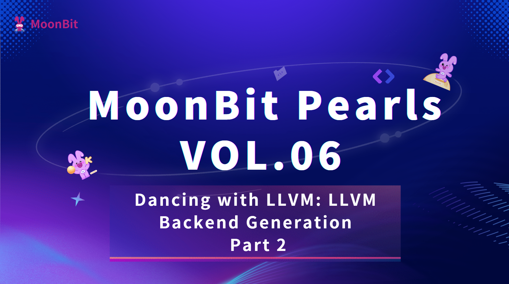

# Dancing with LLVM: A Moonbit Chronicle (Part 2) - LLVM Backend Generation



---

## Introduction

In the process of programming language design, the **frontend** is responsible for understanding and verifying the structure and semantics of a program, while the **compiler backend** takes on the task of translating these abstract concepts into executable machine code. The implementation of the backend not only requires a deep understanding of the target architecture but also mastery of complex optimization techniques to generate efficient code.

**LLVM** (Low Level Virtual Machine), as a comprehensive modern compiler infrastructure, provides us with a powerful and flexible solution. By converting a program into LLVM Intermediate Representation (IR), we can leverage LLVM's mature toolchain to compile the code to various target architectures, including RISC-V, ARM, and x86.

> **Moonbit's LLVM Ecosystem**
>
> Moonbit officially provides two important LLVM-related projects:
>
> - **[`llvm.mbt`](https://github.com/moonbitlang/llvm.mbt)**: Moonbit language bindings for the original LLVM, providing direct access to the llvm-c interface. It requires the installation of the complete LLVM toolchain, can only generate for native backends, and requires you to handle compilation and linking yourself, but it can generate IR that is fully compatible with the original LLVM.
> - **[`MoonLLVM`](https://github.com/moonbitlang/MoonLLVM)**: A pure Moonbit implementation of an LLVM-like system. It can generate LLVM IR without external dependencies and supports JavaScript and WebAssembly backends.
>
> This article chooses `llvm.mbt` as our tool. Its API design is inspired by the highly acclaimed `inkwell` library in the Rust ecosystem.

In the previous article, "Dancing with LLVM: A Moonbit Chronicle (Part 1) - Implementing the Frontend," we completed the conversion from source code to a typed abstract syntax tree. This article will build on that achievement, focusing on the core techniques and implementation details of **code generation**.

---

## Chapter 1: Representing the LLVM Type System in Moonbit

Before diving into code generation, we first need to understand how `llvm.mbt` represents LLVM's various concepts within Moonbit's type system. LLVM's type system is quite complex, containing multiple levels such as basic types, composite types, and function types.

### Trait Objects: An Abstract Representation of Types

In the API design of `llvm.mbt`, you will frequently encounter the core concept of `&Type`. This is not a concrete `struct` or `enum`, but a **Trait Object**—which can be understood as the functional equivalent of an **abstract base class** in object-oriented programming.

```moonbit
// &Type is a trait object representing any LLVM type
let some_type: &Type = context.i32_type()
```

#### Type Identification and Conversion

To determine the specific type of a `&Type`, we need to perform a runtime type check using the `as_type_enum` interface:

```moonbit
pub fn identify_type(ty: &Type) -> String {
  match ty.as_type_enum() {
    IntType(int_ty) => "Integer type with \{int_ty.get_bit_width()} bits"
    FloatType(float_ty) => "Floating point type"
    PointerType(ptr_ty) => "Pointer type"
    FunctionType(func_ty) => "Function type"
    ArrayType(array_ty) => "Array type"
    StructType(struct_ty) => "Structure type"
    VectorType(vec_ty) => "Vector type"
    ScalableVectorType(svec_ty) => "Scalable vector type"
    MetadataType(meta_ty) => "Metadata type"
  }
}
```

#### Safe Type Conversion Strategies

When we are certain that a `&Type` has a specific type, there are several conversion methods to choose from:

1.  **Direct Conversion** (for deterministic scenarios)

    ```moonbit
    let ty: &Type = context.i32_type()
    let i32_ty = ty.into_int_type()  // Direct conversion, errors are handled by llvm.mbt
    let bit_width = i32_ty.get_bit_width()  // Call a method specific to IntType
    ```

2.  **Defensive Conversion** (recommended for production environments)

    ```moonbit
    let ty: &Type = get_some_type()  // An unknown type obtained from somewhere

    guard ty.as_type_enum() is IntType(i32_ty) else {
      raise CodeGenError("Expected integer type, got \{ty}")
    }

    // Now it's safe to use i32_ty
    let bit_width = i32_ty.get_bit_width()
    ```

### Constructing Composite Types

LLVM supports various composite types, which are usually constructed through methods of basic types:

```moonbit
pub fn create_composite_types(context: @llvm.Context) -> Unit {
  let i32_ty = context.i32_type()
  let f64_ty = context.f64_type()

  // Array type: [16 x i32]
  let i32_array_ty = i32_ty.array_type(16)

  // Function type: i32 (i32, i32)
  let add_func_ty = i32_ty.fn_type([i32_ty, i32_ty])

  // Struct type: {i32, f64}
  let struct_ty = context.struct_type([i32_ty, f64_ty])

  // Pointer type (all pointers are opaque in LLVM 18+)
  let ptr_ty = i32_ty.ptr_type()

  // Output type information for verification
  println("Array type: \{i32_array_ty}")      // [16 x i32]
  println("Function type: \{add_func_ty}")    // i32 (i32, i32)
  println("Struct type: \{struct_ty}")        // {i32, f64}
  println("Pointer type: \{ptr_ty}")          // ptr
}
```

> **Important Reminder: Opaque Pointers**
>
> Starting with LLVM version 18, all pointer types use the **opaque pointer** design. This means that regardless of the type they point to, all pointers are represented as `ptr` in the IR, and the specific type information they point to is no longer visible in the type system.

---

## Chapter 2: The LLVM Value System and the BasicValue Concept

Compared to the type system, LLVM's value system is more complex. `llvm.mbt`, consistent with `inkwell`, divides values into two important abstract layers: `Value` and `BasicValue`. The difference lies in distinguishing the source of value creation from the way values are used:

- **Value**: Focuses on how a value is produced (e.g., constants, instruction results).
- **BasicValue**: Focuses on what basic type a value has (e.g., integer, float, pointer).

#### Practical Application Example

```moonbit
pub fn demonstrate_value_system(context: Context, builder: Builder) -> Unit {
  let i32_ty = context.i32_type()

  // Create two integer constants - these are directly IntValue
  let const1 = i32_ty.const_int(10)  // Value: IntValue, BasicValue: IntValue
  let const2 = i32_ty.const_int(20)  // Value: IntValue, BasicValue: IntValue

  // Perform an addition operation - the result is an InstructionValue
  let add_result = builder.build_int_add(const1, const2)

  // In different contexts, we need different perspectives:

  // As an instruction to check its properties
  let instruction = add_result.as_instruction()
  println("Instruction opcode: \{instruction.get_opcode()}")

  // As a basic value to get its type
  let basic_value = add_result.into_basic_value()
  println("Result type: \{basic_value.get_type()}")

  // As an integer value for subsequent calculations
  let int_value = add_result.into_int_value()
  let final_result = builder.build_int_mul(int_value, const1)
}
```

### Complete Classification of Value Types

1.  **ValueEnum**: All possible value types

    ```moonbit
    pub enum ValueEnum {
      IntValue(IntValue)              // Integer value
      FloatValue(FloatValue)          // Floating-point value
      PointerValue(PointerValue)      // Pointer value
      StructValue(StructValue)        // Struct value
      FunctionValue(FunctionValue)    // Function value
      ArrayValue(ArrayValue)          // Array value
      VectorValue(VectorValue)        // Vector value
      PhiValue(PhiValue)             // Phi node value
      ScalableVectorValue(ScalableVectorValue)  // Scalable vector value
      MetadataValue(MetadataValue)    // Metadata value
      CallSiteValue(CallSiteValue)    // Call site value
      GlobalValue(GlobalValue)        // Global value
      InstructionValue(InstructionValue)  // Instruction value
    } derive(Show)
    ```

2.  **BasicValueEnum**: Values that have a basic type

    ```moonbit
    pub enum BasicValueEnum {
      ArrayValue(ArrayValue)              // Array value
      IntValue(IntValue)                  // Integer value
      FloatValue(FloatValue)              // Floating-point value
      PointerValue(PointerValue)          // Pointer value
      StructValue(StructValue)            // Struct value
      VectorValue(VectorValue)            // Vector value
      ScalableVectorValue(ScalableVectorValue)  // Scalable vector value
    } derive(Show)
    ```

### 💡 Best Practices for Value Conversion

In the actual code generation process, we often need to convert between different value perspectives:

```moonbit
pub fn value_conversion_patterns(instruction_result: &Value) -> Unit {
  // Pattern 1: I know what type this is, convert directly
  let int_val = instruction_result.into_int_value()

  // Pattern 2: I just need a basic value, I don't care about the specific type
  let basic_val = instruction_result.into_basic_value()

  // Pattern 3: Defensive programming, check before converting
  match instruction_result.as_value_enum() {
    // Handle integer values
    IntValue(int_val) => handle_integer(int_val)
    // Handle float values
    FloatValue(float_val) => handle_float(float_val)
    _ => raise CodeGenError("Unexpected value type")
  }
}
```

Through this two-layer abstraction, `llvm.mbt` maintains the integrity of the LLVM value system while providing an intuitive and easy-to-use interface for Moonbit developers.

---

## Chapter 3: Practical LLVM IR Generation

Now that we understand the type and value systems, let's demonstrate how to use `llvm.mbt` to generate LLVM IR with a complete example. This example will implement a simple `muladd` function, showing the entire process from initialization to instruction generation.

### Infrastructure Initialization

Any LLVM program begins by establishing three core components:

```moonbit
pub fn initialize_llvm() -> (Context, Module, Builder) {
  // 1. Create an LLVM context - a container for all LLVM objects
  let context = @llvm.Context::create()

  // 2. Create a module - a container for functions and global variables
  let module = context.create_module("demo_module")

  // 3. Create an IR builder - used to generate instructions
  let builder = context.create_builder()

  (context, module, builder)
}
```

### A Simple Function Generation Example

Let's implement a function that calculates `(a * b) + c`:

```moonbit
pub fn generate_muladd_function() -> String {
  // Initialize LLVM infrastructure
  let (context, module, builder) = initialize_llvm()

  // Define the function signature
  let i32_ty = context.i32_type()
  let func_type = i32_ty.fn_type([i32_ty, i32_ty, i32_ty])
  let func_value = module.add_function("muladd", func_type)

  // Create the function entry basic block
  let entry_block = context.append_basic_block(func_value, "entry")
  builder.position_at_end(entry_block)

  // Get the function parameters
  let arg_a = func_value.get_nth_param(0).unwrap().into_int_value()
  let arg_b = func_value.get_nth_param(1).unwrap().into_int_value()
  let arg_c = func_value.get_nth_param(2).unwrap().into_int_value()

  // Generate calculation instructions
  let mul_result = builder.build_int_mul(arg_a, arg_b).into_int_value()
  let add_result = builder.build_int_add(mul_result, arg_c)

  // Generate the return instruction
  let _ = builder.build_return(add_result)

  // Output the generated IR
  module.dump()
}
```

### Generated LLVM IR

Running the above code will produce the following LLVM Intermediate Representation:

```llvm
; ModuleID = 'demo_module'
source_filename = "demo_module"

define i32 @muladd(i32 %0, i32 %1, i32 %2) {
entry:
  %3 = mul i32 %0, %1
  %4 = add i32 %3, %2
  ret i32 %4
}
```

### 💡 Code Generation Best Practices

1.  **Naming Conventions**

    For instructions that return a value, the build interface has a `name` label argument, which can be used to add a name to the result of the instruction.

    ```moonbit
    let mul_result = builder.build_int_mul(lhs, rhs, name="temp_product")
    let final_result = builder.build_int_add(mul_result, offset, name="final_sum")
    ```

2.  **Error Handling**

    Use `raise` instead of `panic` for error handling, and manage exceptions for situations that are not easy to determine directly.

    ```moonbit
    // Check for operations that might fail
    match func_value.get_nth_param(index) {
      Some(param) => param.into_int_value()
      None => raise CodeGenError("Function parameter \{index} not found")
    }
    ```

---

## Chapter 4: TinyMoonbit Compiler Implementation

Now let's turn our attention to the actual compiler implementation, converting the abstract syntax tree we built in the previous article into LLVM IR.

### Type Mapping: From Parser to LLVM

First, we need to establish a mapping between the TinyMoonbit type system and the LLVM type system:

```moonbit
pub struct CodeGen {
  parser_program : Program                    // AST representation of the source program
  llvm_context : @llvm.Context               // LLVM context
  llvm_module : @llvm.Module                 // LLVM module
  builder : @llvm.Builder                    // IR builder
  llvm_functions : Map[String, @llvm.FunctionValue]  // Function map
}

pub fn convert_type(self : Self, parser_type : Type) -> &@llvm.Type raise {
  match parser_type {
    Type::Unit => self.llvm_context.void_type() as &@llvm.Type
    Type::Bool => self.llvm_context.bool_type()
    Type::Int => self.llvm_context.i32_type()
    Type::Double => self.llvm_context.f64_type()
    // Can be extended with more types as needed
  }
}
```

### Environment Management: Mapping Variables to Values

During the code generation phase, we need to maintain a mapping from variable names to LLVM values:

```moonbit
pub struct Env {
  parent : Env?                        // Reference to the parent environment
  symbols : Map[String, &@llvm.Value]        // Local variable map

  // Global information
  codegen : CodeGen                           // Reference to the code generator
  parser_function : Function                  // AST of the current function
  llvm_function : @llvm.FunctionValue         // LLVM representation of the current function
}

pub fn get_symbol(self : Self, name : String) -> &@llvm.Value? {
  match self.symbols.get(name) {
    Some(value) => Some(value)
    None =>
      match self.parent {
        Some(parent_env) => parent_env.get_symbol(name)
        None => None
      }
  }
}
```

### Variable Handling: Memory Allocation Strategy

As a systems-level language, TinyMoonbit supports variable reassignment. In LLVM IR's SSA (Static Single Assignment) form, we need to use the **alloca + load/store** pattern to implement mutable variables:

```moonbit
pub fn Stmt::emit(self : Self, env : Env) -> Unit raise {
  match self {
    // Variable declaration: e.g., let x : Int = 5;
    Let(var_name, var_type, init_expr) => {
      // Convert the type and allocate stack space
      let llvm_type = env.codegen.convert_type(var_type)
      let alloca = env.codegen.builder.build_alloca(llvm_type, var_name)

      // Record the allocated pointer in the symbol table
      env.symbols.set(var_name, alloca as &@llvm.Value)

      // Calculate the value of the initialization expression
      let init_value = init_expr.emit(env).into_basic_value()

      // Store the initial value into the allocated memory
      let _ = env.codegen.builder.build_store(alloca, init_value)
    }

    // Variable assignment: x = 10;
    Assign(var_name, rhs_expr) => {
      // Get the memory address of the variable from the symbol table
      guard let Some(var_ptr) = env.get_symbol(var_name) else {
        raise CodeGenError("Undefined variable: \{var_name}")
      }

      // Calculate the value of the right-hand side expression
      let rhs_value = rhs_expr.emit(env).into_basic_value()

      // Store the new value into the variable's memory
      let _ = env.codegen.builder.build_store(var_ptr, rhs_value)
    }

    // Other statement types...
    _ => { /* Handle other statements */ }
  }
}
```

> **Design Decision: Why use `alloca`?**
>
> In functional languages, immutable variables can be directly mapped to SSA values. However, TinyMoonbit supports variable reassignment, which conflicts with the SSA principle of "each variable is assigned only once."
>
> The **alloca + load/store** pattern is the standard way to handle mutable variables:
>
> - `alloca`: Allocates memory space on the stack.
> - `store`: Writes a value to memory.
> - `load`: Reads a value from memory.
>
> LLVM's optimization process will automatically convert simple `alloca`s back to value form (the `mem2reg` optimization).

### Expression Code Generation

Expression code generation is relatively straightforward, mainly involving calling the corresponding instruction-building methods based on the expression type:

```moonbit
fn Expr::emit(self: Self, env: Env) -> &@llvm.Value raise {
  match self {
    AtomExpr(atom_expr, ..) => atom_expr.emit(env)
    Unary("-", expr, ty = Some(Int)) => {
      let value = expr.emit().into_int_value()
      let zero = env.gen.llvm_ctx.i32_type().const_zero()
      env.gen.builder.build_int_sub(zero, value)
    }
    Unary("-", expr, ty = Some(Double)) => {
      let value = expr.emit().into_float_value()
      env.gen.builder.build_float_neg(value)
    }
    Binary("+", lhs, rhs, ty=Some(Int)) => {
      let lhs_val = lhs.emit().into_int_value()
      let rhs_val = rhs.emit().into_int_value()
      env.gen.builder.build_int_add(lhs_val, rhs_val)
    }
    // ... others
  }
}
```

> **Technical Detail: Floating-Point Negation**
>
> Note that when handling floating-point negation, we use `build_float_neg` instead of subtracting the operand from zero. This is because:
>
> 1.  **IEEE 754 Standard**: Floating-point numbers have special values (like NaN, ∞), and simple subtraction might produce incorrect results.
> 2.  **Performance Considerations**: Dedicated negation instructions are usually more efficient on modern processors.
> 3.  **Precision Guarantee**: Avoids unnecessary rounding errors.

---

## Chapter 5: Implementation of Control Flow Instructions

Control flow is the backbone of program logic, including conditional branches and loop structures. In LLVM IR, control flow is implemented through **Basic Blocks** and **branch instructions**. Each basic block represents a sequence of instructions with no internal jumps, and blocks are connected by branch instructions.

### Conditional Branches: Implementing if-else Statements

Conditional branches require creating multiple basic blocks to represent different execution paths:

```moonbit
fn Stmt::emit(self: Self, env: Env) -> Unit raise {
  let ctx = env.gen.llvm_ctx
  let func = env.llvm_func
  let builder = env.gen.builder
  match self {
    If(cond, then_stmts, else_stmts) => {
      let cond_val = cond.emit(env).into_int_value()

      // Create three basic blocks
      let then_block = ctx.append_basic_block(llvm_func)
      let else_block = ctx.append_basic_block(llvm_func)
      let merge_block = ctx.append_basic_block(llvm_func)

      // Create the jump instruction
      let _ = builder.build_conditional_branch(
        cond_val, then_block, else_block,
      )

      // Generate code for the then_block
      builder.position_at_end(then_block)
      let then_env = self.subenv()
      then_stmts.each(s => s.emitStmt(then_env))
      let _ = builder.build_unconditional_branch(merge_block)

      // Generate code for the else_block
      builder.position_at_end(else_block)
      let else_env = self.subenv()
      else_stmts.each(s => s.emitStmt(else_env))
      let _ = builder.build_unconditional_branch(merge_block)

      // After code generation is complete, the builder's position should be on the merge_block
      builder.position_at_end(merge_block)

    }
    // ...
  }
}
```

#### Generated LLVM IR Example

For the following TinyMoonbit code:

```moonbit
if x > 0 {
  y = x + 1;
} else {
  y = x - 1;
}
```

It will generate LLVM IR similar to this:

```llvm
  %1 = load i32, ptr %x, align 4
  %2 = icmp sgt i32 %1, 0
  br i1 %2, label %if.then, label %if.else

if.then:                                          ; preds = %0
  %3 = load i32, ptr %x, align 4
  %4 = add i32 %3, 1
  store i32 %4, ptr %y, align 4
  br label %if.end

if.else:                                          ; preds = %0
  %5 = load i32, ptr %x, align 4
  %6 = sub i32 %5, 1
  store i32 %6, ptr %y, align 4
  br label %if.end

if.end:                                           ; preds = %if.else, %if.then
  ; Subsequent code...
```

### Loop Structures: Implementing while Statements

The implementation of loops requires special attention to the correct connection of the condition check and the loop body:

```moonbit
fn Stmt::emit(self: Self, env: Env) -> Unit raise {
  let ctx = env.gen.llvm_ctx
  let func = env.llvm_func
  let builder = env.gen.builder
  match self {
    While(cond, body) => {
      // Generate three blocks
      let cond_block = ctx.append_basic_block(llvm_func)
      let body_block = ctx.append_basic_block(llvm_func)
      let merge_block = ctx.append_basic_block(llvm_func)

      // First, unconditionally jump to the cond block
      let _ = builder.build_unconditional_branch(cond_block)
      builder.position_at_end(cond_block)

      // Generate code within the cond block, as well as the conditional jump instruction
      let cond_val = cond.emit().into_int_value()
      let _ = builder.build_conditional_branch(
        cond_val, body_block, merge_block,
      )
      builder.position_at_end(body_block)

      // Generate code for the body block, with an unconditional jump to the cond block at the end
      let body_env = self.subenv()
      body.each(s => s.emitStmt(body_env))
      let _ = builder.build_unconditional_branch(cond_block)

      // After code generation is finished, jump to the merge block
      builder.position_at_end(merge_block)
    }
    // ...
  }
}
```

#### Generated LLVM IR Example

For the TinyMoonbit code:

```moonbit
while i < 10 {
  i = i + 1;
}
```

It will generate:

```llvm
  br label %while.cond

while.cond:                                       ; preds = %while.body, %0
  %1 = load i32, ptr %i, align 4
  %2 = icmp slt i32 %1, 10
  br i1 %2, label %while.body, label %while.end

while.body:                                       ; preds = %while.cond
  %3 = load i32, ptr %i, align 4
  %4 = add i32 %3, 1
  store i32 %4, ptr %i, align 4
  br label %while.cond

while.end:                                        ; preds = %while.cond
  ; Subsequent code...
```

**💡 Control Flow Design Points**

1.  **Basic Block Naming Strategy**

    The `append_basic_block` function also has a `name` label argument.

    ```moonbit
    // Use descriptive block names for easier debugging and understanding
    let then_block = context.append_basic_block(func, name="if.then")
    let else_block = context.append_basic_block(func, name="if.else")
    let merge_block = context.append_basic_block(func, name="if.end")
    ```

2.  **Scope Management**

    ```moonbit
    // Create a separate scope for each branch and loop body
    let branch_env = env.sub_env()
    branch_stmts.each( stmt => stmt.emit(branch_env) }
    ```

3.  **Builder Position Management**

    At the end, be sure to place the instruction builder on the correct basic block.

    ```moonbit
    // Always ensure the builder points to the correct basic block
    builder.position_at_end(merge_block)
    // Generate instructions in this block...
    ```

---

## Chapter 6: From LLVM IR to Machine Code

After generating the complete LLVM IR, we need to convert it into assembly code for the target machine. Although `llvm.mbt` provides a complete target machine configuration API, for learning purposes, we can use a simpler method.

### Compiling with the `llc` Toolchain

The most direct method is to output the generated LLVM IR to a file and then use the LLVM toolchain to compile it:

Call the `dump` function of the `Module`, or you can use the `println` function.

```moonbit
let gen : CodeGen = ...
let prog = gen.llvm_prog
prog.dump() // dump is recommended as it will be slightly faster than println, with the same effect

// or println(prog)
```

### Complete Compilation Flow Example

Let's look at a complete compilation flow from source code to assembly code:

1.  **TinyMoonbit Source Code**

    ```moonbit
    fn factorial(n: Int) -> Int {
      if n <= 1 {
        return 1;
      }
      return n * factorial(n - 1);
    }

    fn main() -> Unit {
      let result: Int = factorial(5);
      print_int(result);
    }
    ```

2.  **Generated LLVM IR**

    ```llvm
    ; ModuleID = 'tinymoonbit'
    source_filename = "tinymoonbit"

    define i32 @factorial(i32 %0) {
    entry:
      %1 = alloca i32, align 4
      store i32 %0, ptr %1, align 4
      %2 = load i32, ptr %1, align 4
      %3 = icmp sle i32 %2, 1
      br i1 %3, label %4, label %6

    4:                                                ; preds = %entry
      ret i32 1

    6:                                                ; preds = %entry
      %7 = load i32, ptr %1, align 4
      %8 = load i32, ptr %1, align 4
      %9 = sub i32 %8, 1
      %10 = call i32 @factorial(i32 %9)
      %11 = mul i32 %7, %10
      ret i32 %11
    }

    define void @main() {
    entry:
      %0 = alloca i32, align 4
      %1 = call i32 @factorial(i32 5)
      store i32 %1, ptr %0, align 4
      %2 = load i32, ptr %0, align 4
      call void @print_int(i32 %2)
      ret void
    }

    declare void @print_int(i32 %0)
    ```

3.  **Generating RISC-V Assembly with `llc`**

    ```bash
    # Generate llvm ir
    moon run main --target native > fact.ll

    # Generate RISC-V 64-bit assembly code
    llc -march=riscv64 -mattr=+m -o fact.s fact.ll
    ```

4.  **Generated RISC-V Assembly Snippet**

    ```asm
    factorial:
    .Lfunc_begin0:
    	.cfi_startproc
    	addi	sp, sp, -32
    	.cfi_def_cfa_offset 32
    	sd	ra, 24(sp)
    	.cfi_offset ra, -8
    	sd	s0, 16(sp)
    	.cfi_offset s0, -16
    	addi	s0, sp, 32
    	.cfi_def_cfa s0, 0
    	sw	a0, -20(s0)
    	lw	a0, -20(s0)
    	li	a1, 1
    	blt	a1, a0, .LBB0_2
    	li	a0, 1
    	j	.LBB0_3
    .LBB0_2:
    	lw	a0, -20(s0)
    	lw	a1, -20(s0)
    	addi	a1, a1, -1
    	sw	a0, -24(s0)
    	mv	a0, a1
    	call	factorial
    	lw	a1, -24(s0)
    	mul	a0, a1, a0
    .LBB0_3:
    	ld	ra, 24(sp)
    	ld	s0, 16(sp)
    	addi	sp, sp, 32
    	ret
    ```

---

## Conclusion

Through this two-part series, we have completed a fully functional, albeit simple, compiler implementation. From the lexical analysis of a character stream to the construction of an abstract syntax tree, and finally to the generation of LLVM IR and machine code output.

### Review

**Part 1**:

- An elegant lexer based on pattern matching
- Implementation of a recursive descent parser
- A complete type-checking system
- Scope management with an environment chain

**Part 2**:

- A deep dive into the LLVM type and value systems
- Variable management strategies in SSA form
- Correct implementation of control flow instructions
- A complete code generation pipeline

### Moonbit's Advantages in Compiler Development

Through this practical project, we have gained a deep appreciation for Moonbit's unique value in the field of compiler construction:

1.  **Expressive Pattern Matching**: Greatly simplifies the complexity of AST processing and type analysis.
2.  **Functional Programming Paradigm**: Immutable data structures and pure functions make the compiler logic clearer and more reliable.
3.  **Modern Type System**: Trait objects, generics, and error handling mechanisms provide ample abstraction capabilities.
4.  **Excellent Engineering Features**: Features like `derive` and JSON serialization significantly improve development efficiency.

### Final Words

Compiler technology represents the perfect combination of computer science theory and engineering practice. With a modern tool like Moonbit, we can explore this ancient yet vibrant field in a more elegant and efficient way.

We hope this series of articles will provide readers with a powerful aid on their journey into compiler design.

> **Recommended Learning Resources**
>
> - [Moonbit Official Documentation](https://www.moonbitlang.com/docs/)
> - [llvm.mbt Documentation](https://mooncakes.io/docs/Kaida-Amethyst/llvm)
> - [llvm.mbt Project](https://github.com/moonbitlang/llvm.mbt)
> - [LLVM Official Tutorial](https://llvm.org/docs/tutorial/)

---
