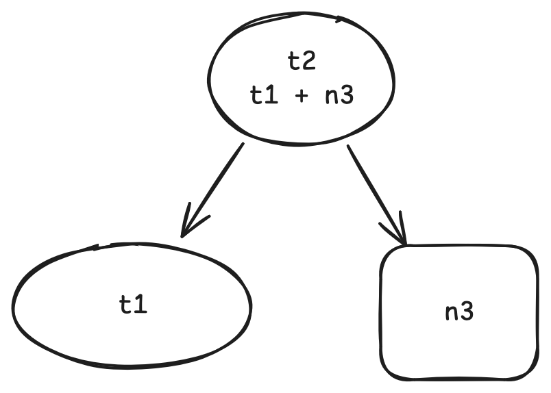
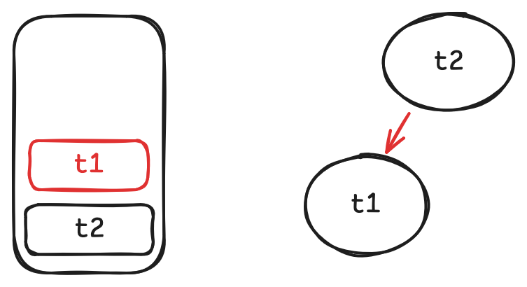
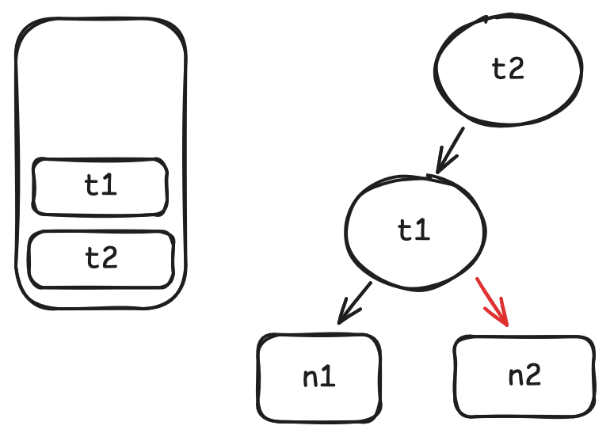
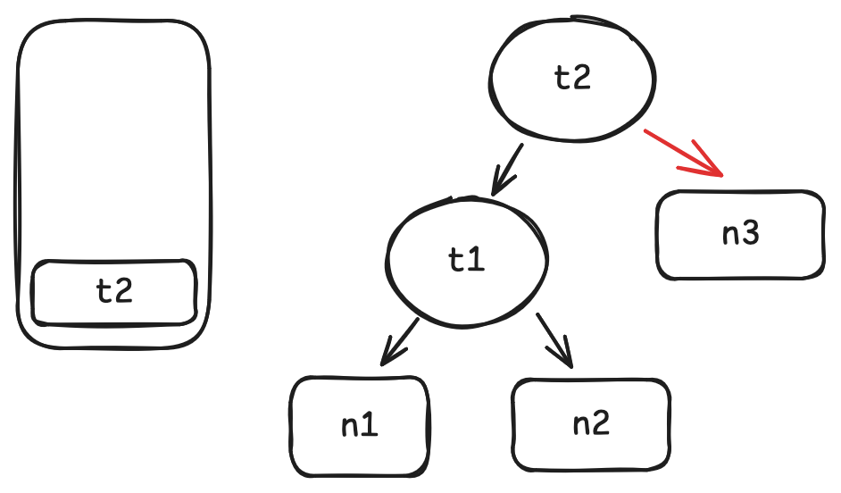

# Mini-adapton: incremental computation in MoonBit


## Introduction

Let's first illustrate how incremental computation looks like with an example similar to spreadsheet.
First define a dependency graph like this:


In this graph, `t1`'s value is computed from `n1 + n2` and `t2`'s value is computed from `t1 + n3`.

When we want to get the value of `t2`, the computation defined in the graph will be done: first `t1` is computed by `n1 + n2`, then t2 is computed by `t1 + n3`. This process is the same as non-incremental computation.

However, when we start to change values in `n1`, `n2`, or `n3`, things get different. Say we swap the value of `n1` and `n2`, then get `t2`'s value. In non-incremental computation, both `t1` and `t2` will be recomputed. But the computation of `t2` is actually not needed, since all its dependency `t1` and `n3` are not changed (swap `n1` and `n2` wont change `t1`'s value).

The following code example does exactly what we describe above. We use `Cell::new` to define `n1`, `n2`, and `n3`, which does not need computation. And `Thunk::new` to define `t1` and `t2` with computation.

```mbt
test {
  // a counter to record the times of t2's computation
  let mut cnt = 0
  // start define the graph
  let n1 = Cell::new(1)
  let n2 = Cell::new(2)
  let n3 = Cell::new(3)
  let t1 = Thunk::new(fn() {
    n1.get() + n2.get()
  })
  let t2 = Thunk::new(fn() {
    cnt += 1
    t1.get() + n3.get()
  })
  // get the value of t2
  inspect(t2.get(), content="6")
  inspect(cnt, content="1")
  // swap value of n1 and n2
  n1.set(2)
  n2.set(1)
  inspect(t2.get(), content="6")
  // t2 does not recompute
  inspect(cnt, content="1")
}
```

In this article, we will show how to implement an incremental computation library in MoonBit with the api used in the above example:

```
Cell::new
Cell::get
Cell::set
Thunk::new
Thunk::get
```

## Problem Analysis and Solution

To implement the library, there are three main problems to solve:

### Build up dependency graph on the fly

As a library in MoonBit, we don't have any easy ways to build up the dependency graph statically, since MoonBit does not have any meta programming mechanism currently. Therefore, we need to construct dependency graph on the fly. Since all we care about is what cells/thunks does a thunk depend on, a good option to build up dependency graph would be when user calls `Thunk::get`. Take the code above as an example:

```mbt skip
let n1 = Cell::new(1)
let n2 = Cell::new(2)
let n3 = Cell::new(3)
let t1 = Thunk::new(fn() { n1.get() + n2.get() })
let t2 = Thunk::new(fn() { t1.get() + n3.get() })
t2.get()
```

When user calls `t2.get()`, we can know that at runtime `t1.get()` and `n3.get()` are called inside it. Therefore, `t1` and `n3` are dependencies of `t2` and we can construct a subgraph:



The same story will also happen when `t1.get()` is called inside `t2.get()`.

So here is the plan:

1. we declare a stack to record which thunk are we currently getting. The reason we use stack here is that we are essentially record call **stack**s of every `get`.
1. whenever we call `get`, mark it as the dependency of stack top. If it's a thunk, push it onto stack.
1. whenever a thunk's `get` finished, pop it off the stack.

Let's see the full process of above example under this algorithm:

1. when we call `t2.get`, push `t2` on the stack.

   

1. when we call `t1.get` inside `t2.get`, mark `t1` as a dependency of `t2` and push t1 onto the stack.

   

1. when we call `n1.get` inside `t1.get`, mark `n1` as a dependency of `t1`.

   

1. same story goes for `n2`.

   

1. when `t1.get` finished, pop it from stack.

   

1. when we call `n3.get`, mark `n3` as a dependency of `t2`

   

Besides the edge from dependent to dependency, we'd better also record an edge from dependency to dependent, so that we can easily traverse the graph backwards when we need.

In the code below, we'll use `outgoing_edges` to refer to edge from parent(dependent) to child (dependency) and `incoming_edges` to refer to the opposite.

### A mechanism to mark outdated node

Whenever we call `Cell::set`, the node itself and all nodes depend on it should be marked as outdated. This will be one of the criteria to determine whether a thunk needs to be recomputed. This is generally a recursive backward traverse from a leaf of a graph. We can describe the process as pseudo MoonBit code:

```moonbit skip
fn dirty(node: Node) -> Unit {
  for n in node.incoming_edges {
    n.set_dirty(true)
    dirty(node)
  }
}
```

### Determine whether a thunk needs to be recomputed

Whenever we call `Thunk::get`, we need to determine whether it really needs to be recomputed. But the dirty mechanism we describe in the last subsection is not enough. If we only use dirtiness to determine whether a thunk needs to be recomputed, there would be unneeded computation. Let's see it from the example we give at the beginning:

```mbt skip
n1.set(2)
n2.set(1)
inspect(t2.get(), content="6")
```

After we swap the value of `n1` and `n2`, `n1`, `n2`, `t1`, and `t2` should all be marked as dirty, but when we call `t2.get`, there is no need to recompute `t2`, since the value of `t1` does not change.

This reminds us that despite dirtiness, we need also to record whether a node's value differs from its last value. If a node is both dirty and one of its dependencies' value changed, it needs to be recomputed.

We can describe the algorithm as the pseudo MoonBit code below:

```mbt skip
fn propagate(self: Node) -> Unit {
  // When a node is dirty, it might need to be recomputed
  if self.is_dirty() {
    // after recomputing, it's no longer dirty
    self.set_dirty(false)
    for dependency in self.outgoing_edges() {
      // recursively recompute every dependency
      dependency.propagate()
      // If a dependency's value changed, the node needs to be recomputed
      if dependency.is_changed() {
        // remove all incoming_edges and outgoing_edges, since they will be reconstructed during evaluate
        self.incoming_edges().clear()
        self.outgoing_edges().clear()
        self.evaluate()
        return
      }
    }
  }
}
```

## Implementation

Given the algorithms described in the last section, the implementation should be quite straightforward.

First, let's define `Cell`:

```mbt
struct Cell[A] {
  mut is_dirty : Bool
  mut value : A
  mut is_changed : Bool
  incoming_edges : Array[&Node]
}
```

Since `Cell` can only be leaf node in dependency graph, it does not have `outgoing_edges`. The trait `Node` here is used to abstract node in dependency graph.

Then, let's define `Thunk`:

```mbt
struct Thunk[A] {
  mut is_dirty : Bool
  mut value : A?
  mut is_changed : Bool
  thunk : () -> A
  incoming_edges : Array[&Node]
  outgoing_edges : Array[&Node]
}
```

`Thunk`'s value is optional, since it only exists after we first call `Thunk::get`.

We can easily add `new` for both types:

```mbt
fn[A : Eq] Cell::new(value : A) -> Cell[A] {
  Cell::{
    is_changed: false,
    value,
    incoming_edges: [],
    is_dirty: false,
  }
}
```

```mbt
fn[A : Eq] Thunk::new(thunk : () -> A) -> Thunk[A] {
  Thunk::{
    value: None,
    is_changed: false,
    thunk,
    incoming_edges: [],
    outgoing_edges: [],
    is_dirty: false,
  }
}
```

`Thunk` and `Cell` are the two kinds of node in dependency graph, we can use the trait `Node` mentioned above to abstract them:

```mbt
trait Node {
  is_dirty(Self) -> Bool
  set_dirty(Self, Bool) -> Unit
  incoming_edges(Self) -> Array[&Node]
  outgoing_edges(Self) -> Array[&Node]
  is_changed(Self) -> Bool
  evaluate(Self) -> Unit
}
```

And implement the trait for both types:

```mbt
impl[A] Node for Cell[A] with incoming_edges(self) {
  self.incoming_edges
}

impl[A] Node for Cell[A] with outgoing_edges(_self) {
  []
}

impl[A] Node for Cell[A] with is_dirty(self) {
  self.is_dirty
}

impl[A] Node for Cell[A] with set_dirty(self, new_dirty) {
  self.is_dirty = new_dirty
}

impl[A] Node for Cell[A] with is_changed(self) {
  self.is_changed
}

impl[A] Node for Cell[A] with evaluate(_self) {
  ()
}

impl[A : Eq] Node for Thunk[A] with is_changed(self) {
  self.is_changed
}

impl[A : Eq] Node for Thunk[A] with outgoing_edges(self) {
  self.outgoing_edges
}

impl[A : Eq] Node for Thunk[A] with incoming_edges(self) {
  self.incoming_edges
}

impl[A : Eq] Node for Thunk[A] with is_dirty(self) {
  self.is_dirty
}

impl[A : Eq] Node for Thunk[A] with set_dirty(self, new_dirty) {
  self.is_dirty = new_dirty
}

impl[A : Eq] Node for Thunk[A] with evaluate(self) {
  // push self into node_stack top
  // now self is active target
  node_stack.push(self)
  // `self.thunk` might contains `source.get()`,
  // such as `s1.get()`, `s2.get()` and `s3.get()`
  //
  // when call `Thunk::get` or `Cell::get`,
  // they will treat `node_stack.last()` as themself's target.
  // if source is `Cell`, then it only record `incoming_edges`.
  // if source is `Thunk`, then it record `incoming_edges` and `outgoing_edges`, connect each other.
  //
  let value = (self.thunk)()
  self.is_changed = match self.value {
    None => true
    Some(v) => v != value
  }
  self.value = Some(value)
  // pop self from node_stack
  // now self is no longer active target
  node_stack.unsafe_pop() |> ignore
}
```

The only complicated implementation is `Thunk`'s `evaluate`. Here we need first to push the thunk on stack for dependency recording. `node_stack` is defined as below:

```mbt
let node_stack : Array[&Node] = []
```

Then do the real computation and compare it with the last value to update `self.is_changed`. `is_changed` is used later to determine whether we need to recompute a thunk.

`dirty` and `propagate` are almost the same as the pseudo code described above:

```mbt
fn &Node::dirty(self : &Node) -> Unit {
  for dependent in self.incoming_edges() {
    if not(dependent.is_dirty()) {
      dependent.set_dirty(true)
      dependent.dirty()
    }
  }
}
```

```mbt
fn &Node::propagate(self : &Node) -> Unit {
  if self.is_dirty() {
    self.set_dirty(false)
    for dependency in self.outgoing_edges() {
      dependency.propagate()
      if dependency.is_changed() {
        self.incoming_edges().clear()
        self.outgoing_edges().clear()
        self.evaluate()
        return
      }
    }
  }
}
```

With all the foundation we build, the three main api: `Cell::get`, `Cell:set`, and `Thunk::get` are easy to implement.

To get value from a cell, it's simply just return the `value` filed in struct. But before that, we need first record it as a dependency if it's called inside `Thunk::get`.

```mbt
fn[A] Cell::get(self : Cell[A]) -> A {
  if node_stack.last() is Some(target) {
    target.outgoing_edges().push(self)
    self.incoming_edges.push(target)
  }
  self.value
}
```

Whenever we set a cell, we need to first make sure that the two states `is_changed` and `dirty` are updated correctly. Then mark every dependent as dirty.

```mbt
fn[A : Eq] Cell::set(self : Cell[A], new_value : A) -> Unit {
  if self.value != new_value {
    self.is_changed = true
    self.value = new_value
    self.set_dirty(true)
    &Node::dirty(self)
  }
}
```

In `Thunk::get`, similar to `Cell::get`, we first need to record `self` as a dependency. After that we pattern match on `self.value`. If it's `None`, it means that this is the first time user tries to get the thunk's value, so we can safely just evaluate it. If it's `Some`, we use `propagate` to make sure that we only recompute thunks that's really needed.

```mbt
fn[A : Eq] Thunk::get(self : Thunk[A]) -> A {
  if node_stack.last() is Some(target) {
    target.outgoing_edges().push(self)
    self.incoming_edges.push(target)
  }
  match self.value {
    None => self.evaluate()
    Some(_) => &Node::propagate(self)
  }
  self.value.unwrap()
}
```

## Reference

- [Adapton: Composable, demand-driven incremental computation, PLDI 2014](http://matthewhammer.org/adapton/) original paper of adapton
- [illusory0x0/adapton.mbt](https://github.com/illusory0x0/adapton.mbt) adapton library in MoonBit
