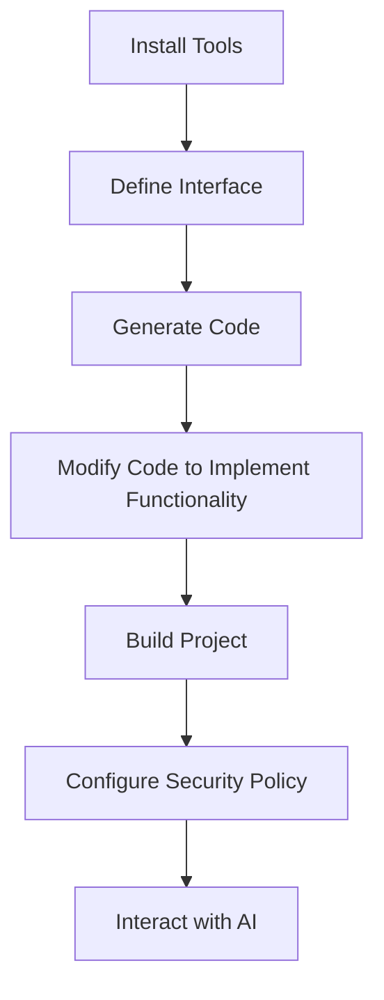

# Building Secure WebAssembly Tools with MoonBit and Wassette


Welcome to the world of MoonBit and Wassette! This tutorial will guide you step-by-step in building a secure tool based on the WebAssembly Component Model. Through a practical weather query application example, you will learn how to leverage MoonBit's efficiency and Wassette's security features to create powerful AI tools.

## Introduction to Wassette and MCP

MCP (Model Completion Protocol) is a protocol for AI models to interact with external tools. When an AI needs to perform a specific task (such as network access or data query), it calls the corresponding tool through MCP. This mechanism extends the capabilities of AI but also brings security challenges.

Wassette is a runtime developed by Microsoft based on the WebAssembly Component Model, providing a secure environment for AI systems to execute external tools. It solves potential security risks through sandbox isolation and precise permission control.

Wassette allows tools to run in an isolated environment, with permissions strictly limited by a policy file and interfaces clearly defined by WIT (WebAssembly Interface Type). WIT interfaces are also used to generate data formats for tool interaction.

## Overall Process

Before we start, let's understand the overall process:



Let's start this journey!

## Step 1: Install Necessary Tools

First, we need to install four tools (we assume the MoonBit toolchain is already installed):

- **wasm-tools**: A WebAssembly toolset for processing and manipulating Wasm files
- **wit-deps**: A WebAssembly Interface Type dependency manager
- **wit-bindgen**: A WebAssembly Interface Type binding generator for generating language bindings
- **wassette**: A runtime based on the Wasm Component Model for executing our tools

Among them, `wasm-tools`, `wit-deps`, and `wit-bindgen` can be installed via cargo (requires Rust to be installed):

```bash
cargo install wasm-tools
cargo install wit-deps
cargo install wit-bindgen-cli
```

Or download from GitHub Releases:

- wit-bindgen: https://github.com/bytecodealliance/wit-bindgen/releases/tag/v0.45.0
- wasm-tools: https://github.com/bytecodealliance/wasm-tools/releases/tag/v1.238.0
- wit-deps: https://github.com/bytecodealliance/wit-deps/releases/tag/v0.5.0
- wassette: https://github.com/microsoft/wassette/releases/tag/v0.3.4

## Step 2: Define the Interface

Interface definition is the core of the entire workflow. We use the WebAssembly Interface Type (WIT) format to define the component's interface.

First, create the project directory and necessary subdirectories:

```bash
mkdir -p weather-app/wit
cd weather-app
```

### Create deps.toml

Create a `deps.toml` file in the `wit` directory to define project dependencies:

```toml
cli = "https://github.com/WebAssembly/wasi-cli/archive/refs/tags/v0.2.7.tar.gz"
http = "https://github.com/WebAssembly/wasi-http/archive/refs/tags/v0.2.7.tar.gz"
```

These dependencies specify the WASI (WebAssembly System Interface) components we will use:

- `cli`: Provides command-line interface functionality. Not used in this example.
- `http`: Provides HTTP client and server functionality. The client functionality is used in this example.

Then, run `wit-deps update`. This command will fetch the dependencies and expand them in the `wit/deps/` directory.

### Create world.wit

Next, create a `world.wit` file to define our component interface. WIT is a declarative interface description language designed for the WebAssembly Component Model. It allows us to define how components interact with each other without worrying about specific implementation details. For more details, you can check the [Component Model](https://component-model.bytecodealliance.org/) manual.

```wit
package peter-jerry-ye:weather@0.1.0;

world w {
  import wasi:http/outgoing-handler@0.2.7;
  export get-weather: func(city: string) -> result<string, string>;
}
```

This WIT file defines:

- A package named `peter-jerry-ye:weather` with version 0.1.0
- A world named `w`, which is the main interface of the component
- Imports the outgoing request interface of WASI HTTP
- Exports a function named `get-weather` that takes a city name string and returns a result (a weather information string on success, or an error message string on failure)

## Step 3: Generate Code

Now that we have defined the interface, the next step is to generate the corresponding code skeleton. We use the `wit-bindgen` tool to generate binding code for MoonBit:

```bash
# Make sure you are in the project root directory
wit-bindgen moonbit --derive-eq --derive-show --derive-error wit
```

This command will read the files in the `wit` directory and generate the corresponding MoonBit code. The generated files will be placed in the `gen` directory.

Note: The current version of the generated code may contain some warnings, which will be fixed in future updates.

The generated directory structure should look like this:

```
.
├── ffi/
├── gen/
│   ├── ffi.mbt
│   ├── moon.pkg.json
│   ├── world
│   │   └── w
│   │       ├── moon.pkg.json
│   │       └── stub.mbt
│   └── world_w_export.mbt
├── interface/
├── moon.mod.json
├── Tutorial.md
├── wit/
└── world/
```

These generated files include:

- Basic FFI (Foreign Function Interface) code (`ffi/`)
- Generated import functions (`world/`, `interface/`)
- Wrappers for exported functions (`gen/`)
- The `stub.mbt` file to be implemented

## Step 4: Modify the Generated Code

Now we need to modify the generated stub file to implement our weather query functionality. The main files to edit are `gen/world/w/stub.mbt` and `moon.pkg.json` in the same directory. Before that, let's add dependencies to facilitate implementation:

```bash
moon update
moon add moonbitlang/x
```

```json
{
  "import": [
    "peter-jerry-ye/weather/interface/wasi/http/types",
    "peter-jerry-ye/weather/interface/wasi/http/outgoingHandler",
    "peter-jerry-ye/weather/interface/wasi/io/poll",
    "peter-jerry-ye/weather/interface/wasi/io/streams",
    "peter-jerry-ye/weather/interface/wasi/io/error",
    "moonbitlang/x/encoding"
  ]
}
```

Let's look at the generated stub code:

```moonbit
// Generated by `wit-bindgen` 0.44.0.

///|
pub fn get_weather(city : String) -> Result[String, String] {
  ... // This is the part we need to implement
}
```

Now, we need to add the implementation code to request weather information using an HTTP client. Edit the `gen/world/w/stub.mbt` file as follows:

```moonbit
///|
pub fn get_weather(city : String) -> Result[String, String] {
  (try? get_weather_(city)).map_err(_.to_string())
}

///| Use MoonBit's error handling mechanism to simplify implementation
fn get_weather_(city : String) -> String raise {
  let request = @types.OutgoingRequest::outgoing_request(
    @types.Fields::fields(),
  )
  if request.set_authority(Some("wttr.in")) is Err(_) {
    fail("Invalid Authority")
  }
  if request.set_path_with_query(Some("/\{city}?format=3")) is Err(_) {
    fail("Invalid path with query")
  }
  if request.set_method(Get) is Err(_) {
    fail("Invalid Method")
  }
  let future_response = @outgoingHandler.handle(request, None).unwrap_or_error()
  defer future_response.drop()
  let pollable = future_response.subscribe()
  defer pollable.drop()
  pollable.block()
  let response = future_response.get().unwrap().unwrap().unwrap_or_error()
  defer response.drop()
  let body = response.consume().unwrap()
  defer body.drop()
  let stream = body.stream().unwrap()
  defer stream.drop()
  let decoder = @encoding.decoder(UTF8)
  let builder = StringBuilder::new()
  loop stream.blocking_read(1024) {
    Ok(bytes) => {
      decoder.decode_to(
        bytes.unsafe_reinterpret_as_bytes()[:],
        builder,
        stream=true,
      )
      continue stream.blocking_read(1024)
    }
    Err(Closed) => decoder.decode_to("", builder, stream=false)
    Err(LastOperationFailed(e)) => {
      defer e.drop()
      fail(e.to_debug_string())
    }
  }
  builder.to_string()
}
```

This code implements the following functions:

1. Creates an HTTP request to the `wttr.in` weather service
2. Sets the request path, including the city name and format parameters
3. Sends the request and waits for the response
4. Extracts the content from the response
5. Decodes the content and returns the weather information string

## Step 5: Build the Project

Now that we have implemented the functionality, the next step is to build the project.

```bash
moon build --target wasm
wasm-tools component embed wit target/wasm/release/build/gen/gen.wasm -o core.wasm --encoding utf16
wasm-tools component new core.wasm -o weather.wasm
```

After a successful build, a `weather.wasm` file will be generated in the project root directory. This is our WebAssembly component.

You can then load it into Wassette:

```bash
wassette component load file://$(pwd)/component.wasm
```

## Step 6 (Optional): Configure Security Policy

Wassette strictly controls the permissions of WebAssembly components — a key part of ensuring tool security. Through fine-grained permission control, we can ensure the tool only performs expected operations.

In this example, we want it to access `wttr.in`, so we can grant permission using:

```bash
wassette permission grant network weather wttr.in
```

## Step 7: Interact with AI

Finally, we can use Wassette to run our component and interact with AI. For example, in VSCode Copilot, modify `.vscode/mcp.json`:

```json
{
  "servers": {
    "wassette": {
      "command": "wassette",
      "args": ["serve", "--disable-builtin-tools", "--stdio"],
      "type": "stdio"
    }
  },
  "inputs": []
}
```

After restarting Wassette, you can ask AI:

> Using Wassette, load the component `./component.wasm` (note the use of the file schema) and query the weather for Shenzhen.

The AI will call `load-component` and `get-weather` in sequence, returning:

> The component has been successfully loaded. The weather in Shenzhen is: ☀️ +30°C.

## Summary

At this point, we have successfully created a secure MCP tool based on the WebAssembly Component Model, which can:

1. Define clear interfaces
2. Utilize the efficiency of MoonBit
3. Run in Wassette's secure sandbox
4. Interact with AI

Wassette is currently at version 0.3.4 and still lacks some MCP concepts, such as prompts, workspaces, reverse retrieval of user instructions, and AI generation capabilities. But it demonstrates how quickly an MCP can be built using the Wasm Component Model.

MoonBit will continue to improve its component model capabilities, including adding asynchronous support from the upcoming WASIp3 and simplifying the development process. Stay tuned!
