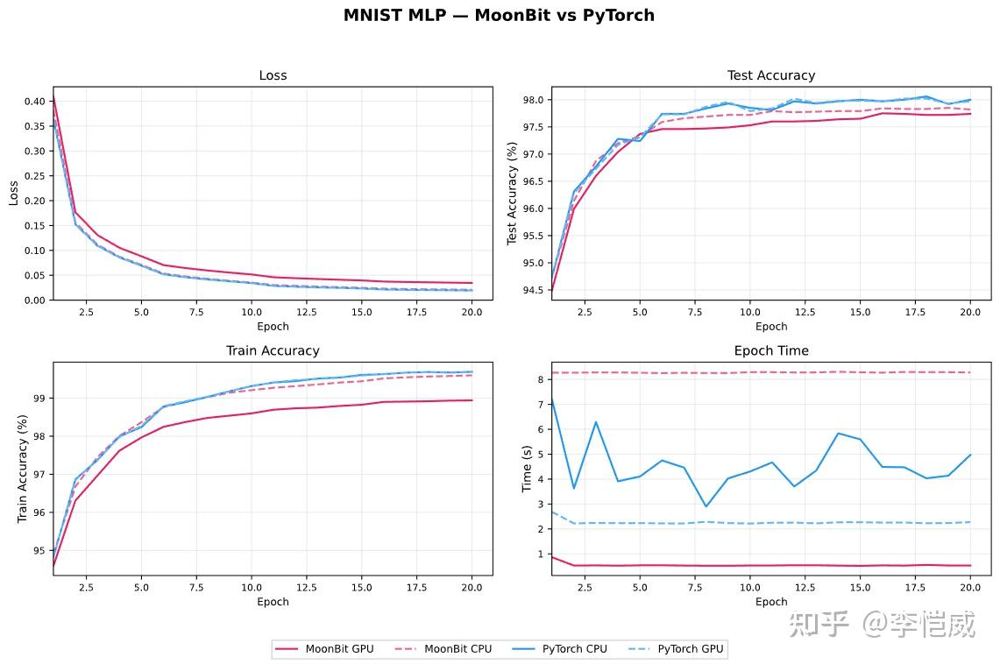
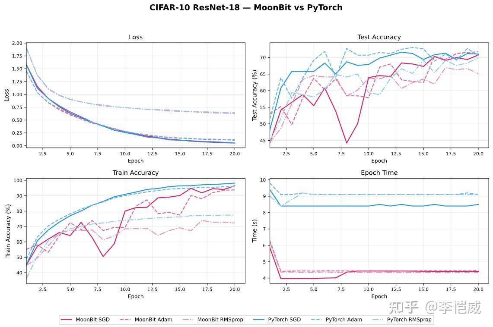

# MoonXi-net: A Deep Learning Training Framework Built with MoonBit


Original author: Li Kaiwei, Ph.D. in Computer Science and Technology, Tsinghua University.

Based on good system architecture design, MoonBit + domestic large language models + an open-source harness can implement a PyTorch-like deep learning training framework, with performance twice as fast as PyTorch. The development time was less than one month, and all of it was done in spare time.

## Links

- [moonxi-net GitHub repository](https://github.com/moonxi-net/moonxi-net)
- [Mooncakes](https://mooncakes.io)
- [chnlkw/moonxi-net](https://mooncakes.io/docs/chnlkw/moonxi-net)
- [chnlkw/moonxi-net-gpu](https://mooncakes.io/docs/chnlkw/moonxi-net-gpu)


## Origin

About a month ago, a colleague complained that writing Torch training code in Python was not type-safe for all kinds of things, and that code quality could not be guaranteed. As an old-school systems programmer who has worked on systems for many years, I keenly realized: is this not another good opportunity to reinvent the wheel? Seeing that the Rust wheel-reinventing project I had pushed hard for a year had already attracted a few colleagues to join, it was time to bring out MoonBit, which I had been thinking about for a long time. As expected, my colleagues were cautious and wanted to wait and see with the new language, so I took the opportunity to propose first putting something together at home in my spare time.

## First Try

It is already 2026. Even if MoonBit has the fastest compilation speed in the universe and the fastest IDE navigation, one still cannot hand-write everything line by line in the old-fashioned way. Since this was an experiment anyway, I decided to use the leading domestic large model GLM-5.1 (DeepSeek V4 and Kimi K2.6 had not been released at the time), plus the blindly chosen oh-my-opencode, and got started directly.

Here I omit ten thousand words of complaints about wrestling with the CUDA environment in WSL.

With absolutely zero personal experience in PyTorch, the large model quickly put together the first version of MNIST, which made me very excited. So I told it to continue directly with CUDA. As expected, something unexpected happened: MoonBit did not support linking CUDA, or at least I did not figure it out. No big deal, I forked a version of the open-source moon toolchain, added my epic CMakeLists.txt experience, and got it done before long. After that it was mindless vibe coding. After waiting one night, the ResNet model actually ran, using the CIFAR-10 dataset. Do not ask why I chose that; it was only because I asked DeepSeek.

The turning point also came quickly. I asked it to put together PyTorch code for the same algorithm for comparison. Not only was it one hundred times slower, but the accuracy also did not match at all. Test accuracy was only 10%, no better than random guessing. Fine, I then realized I hadn’t included the evaluation harness. So I gave it another night to optimize efficiency and accuracy. The results were much better: it ended up only about 2× slower than native Python, with acceptable accuracy.

## Iteration

Once the prototype ran, it was worth bragging about to colleagues. But no one could accept code that looked like noodles. So I had an in-depth architecture discussion with DeepSeek about whether a framework written in MoonBit should use a JAX style or a Torch style. After several rounds of dialogue, I, with zero PyTorch experience, gained quite a bit of understanding of basic concepts such as model, loss, grad, optimizer, and loader. Feeling pretty confident, I waved my hand and asked the AI to go ahead and build a JAX-style framework.

While writing MoonBit, AI produced many Rust syntax hallucinations. For example, for traits with generics, it tried to add them next to the name and near interface functions, all of which were mercilessly rejected by the compiler. It even tried to write a higher-kinded lambda function, and all attempts failed. After I do not know how many obstacles, the thing it finally wrote could run, but it was still far from my expectations.

If AI were a junior colleague I was mentoring, and after so much effort it still looked like this, would you blame it or start wondering whether your expectations were too high? Taking the attitude that whoever proposes an idea should take responsibility for it, I gave up all my illusions about AI and decided to go head-to-head with the compiler myself.

## Plan

I organized my thoughts. First, it could not be written as purely dynamic types like PyTorch. Instead, CPU and GPU tensors needed to be defined as different types. At the same time, the model's forward function had to be written only once and be able to generalize. Also, computing backward gradients had to be done in one sentence, like PyTorch.

## Tensor Trait

Define the `Tensor` trait, with various computational interfaces:

```moonbit
trait Tensor: Add + Sub + Mul {
  dims(Self) -> FixedArray[Int]
  zeros(dims : FixedArray[Int]) -> Self
  scale(Self, Float) -> Self
  square(Self) -> Self
  mean(Self) -> Self
  scalar(Float) -> Self
  size(Self) -> Int
}
```

Define an implementation of `Tensor`, such as `NpArray`, and implement its computational functions. Dimension checks and other functions are omitted here.

```moonbit
struct NpArray {
  dims : FixedArray[Int]
  data : FixedArray[Float]
} derive(Debug)

impl Add for NpArray with add(x : NpArray, y : NpArray) -> NpArray {
  let n = x.data.length()
  { dims: x.dims, data: FixedArray::makei(n, fn(i) { x.data[i] + y.data[i] }) }
}
```

Note: broadcast computation for adding tensors of different dimensions is omitted here.

## Model Forward

Define the model and implement its `forward` function:

```moonbit
struct Linear[T] {
  w : T
  b : T
}

fn[T : Tensor] Linear::forward(self : Self[T], x : T) -> T {
  x * self.w + self.b
}
```

Functions such as loss are similar and are omitted here.

## Grad

The main event is the automatic gradient `Grad[T]` (formally called Automatic Differentiation).

It is a generic wrapper. `T` can be `NpArray`, a future `GPUTensor` implementation, or even `Grad` itself if second-order gradients are required.

```moonbit
struct Grad[T] {
  mut value : T
  mut grad : T
}
```

It can also implement the `Tensor` trait. Note that backpropagation happens only during `backward`, so the operations need to be "recorded" first. This algorithm is called tape-based autograd.

Define a tape. It is an appendable array whose contents are closures of type `() -> Unit`, recording the backward gradient computations to be performed later:

```moonbit
let tape : Array[() -> Unit] = Array::new()

impl[T : Tensor] Add for Grad[T] with add(gx : Grad[T], gy : Grad[T]) -> Grad[T] {
  let value = gx.value + gy.value
  let out = { value, grad: value.zeros_like() }
  tape.push( () => gx.grad = gx.grad + out.grad) )
  tape.push( () => gy.grad = gy.grad + out.grad) )
  out
}
```

The core is this closure: `() => gx.grad = gx.grad + out.grad`. The key point is that the closure captures both `gx` and `out`, so `gx.grad` can be assigned and updated, and the value of `out.grad` is accessed only when the closure is called, not when it is zero.

Then implement the `backward` function: set the loss gradient to 1 and play the tape backward:

```moonbit
fn[T : Tensor] Grad::backward(self : Grad[T]) -> Unit {
  self.grad = T::scalar((1.0 : Float))
  for i in tape.length()>..0 {
    tape[i]()
  }
}
```

## Main

Finally, implement gradient descent for the complete linear model:

```moonbit
fn main {
  let xs : Array[Float] = [1.0, 2.0, 3.0, 4.0, 5.0]
  let ys : Array[Float] = [4.0, 7.0, 10.0, 13.0, 16.0]
  let w : Grad[NpArray] = no_grad(NpArray::scalar((0.0 : Float)))
  let b : Grad[NpArray] = no_grad(NpArray::scalar((0.0 : Float)))
  let model : Linear[Grad[NpArray]] = { w, b }
  let lr : Float = (0.01 : Float)
  let params : Array[Grad[NpArray]] = [model.w, model.b]
  for epoch in 0..<=100 {
    for idx in 0..<xs.length() {
      tape.clear()
      for p in params {
        p.grad = NpArray::zeros(p.value.dims())
      }
      let x = no_grad(NpArray::scalar(xs[idx]))
      let y = no_grad(NpArray::scalar(ys[idx]))
      let y_hat = model.forward(x)
      let loss = (y_hat - y).square()
      loss.backward()
      for p in params {
        p.value = p.value - p.grad.scale(lr)
      }
    }
  }
}
```

## AI Development

With a complete prototype architecture, letting AI develop became very smooth. Basically, I gave it two or three tasks every night and checked them the next morning. Whether for feature development, performance iteration, comparative validation, or experimental reports, AI programming brought an exponential efficiency improvement compared with old-school programming. Although the overall development took a month, the time actually spent on this project was only my spare time, without affecting work or taking care of children.

## Improvements

### Grad Optimization

If `Tensor` is an input, there is no need to record `grad`, so `Option[T]`, that is, `T?`, can be used to represent `grad`:

```moonbit
pub struct Grad[T] {
  mut value : T
  mut grad : T?
}
```

For parameters in large models, `grad` is initialized to 0. When computing gradients backward, there will be many cases of adding 0 and a gradient, wasting time and space. Therefore, add another layer of `Option`:

```moonbit
pub struct Grad[T] {
  mut value : T
  mut grad : T??
}
```

This gives `grad` three cases:

- `None` => does not participate in grad computation
- `Some(None)` => `grad` is 0
- `Some(Some(grad))` => `grad` is nonzero

### Extending Operators

Because `Tensor` has already been defined, future extensions such as CNN convolution operators must define new traits:

```moonbit
pub(open) trait ImageTensor {
  conv2d(Self, weight : Self, bias : Self, stride : Int, padding : Int) -> Self
  relu(Self) -> Self
  // ...
}
```

When defining the `forward` function for a model, the trait constraints need to be updated:

```moonbit
fn[T : Tensor + ImageTensor] Renset::forward(x: T) {
  //...
}
```

### GPU Support

```moonbit
struct GPUTensor {
}

impl Add for GPUTensor with add(x : GPUTensor, y : GPUTensor) -> GPUTensor{
   ...
}
```

Using MoonBit's FFI feature, it is convenient to call operator interfaces such as CUDA kernels, cuBLAS, and cuDNN.

## Tagless Final

Without realizing it, we had already implemented a Tagless Final architecture, which enables matrix-like flexible extension. The location of concrete function implementations can be very flexible. Other code repositories that depend on moonxi-net can also conveniently extend operators or tensor implementations. For example, this table:

| Trait / backend | `NpArray[T]` | `GpuTensor[T]` | `Grad[T]` |
|---|---|---|---|
| `Tensor` | `nparray/impl.mbt` | `gpu/impl.mbt` | `grad.mbt` |
| `BlasTensor` | `nparray/blas_impl.mbt` | `gpu/impl.mbt` | `grad.mbt` |
| `ImageTensor` | `nparray/img_impl.mbt` | `gpu/impl.mbt` | `grad.mbt` |

## Shortcomings

- The global tape needs to be reset manually and does not support second-order gradients.
- The generic `Tensor` type `T` does not support compile-time dimension and shape checks. For this, `shapeTensor` was defined for runtime checks and shape inference.
- During training, GPU memory allocation uses a pool for acceleration. This causes optimizer state and model parameters to have to be updated in place.

## Experiments

Experiments were run on MNIST digit recognition and CIFAR-10 image classification, using a 5060 laptop.





After various optimizations such as operator fusion, moonxi-net's training speed on GPU is about twice as fast as PyTorch. In convergence accuracy, it is slightly lower than the PyTorch version, which may be caused by differences in random seeds, kernel implementations, and so on, and needs further research.

## Summary

moonxi-net is a deep learning training framework based on the MoonBit language, using a tagless-final architecture and referencing the PyTorch style. It has both type safety and flexible extensibility, and separates model definitions from multi-backend implementations. After operator fusion optimization, its GPU performance surpasses PyTorch. The first version of moonxi-net was completed in one month, proving the potential of the MoonBit programming language for implementing large system frameworks, while also validating that domestic models plus an open-source harness framework already have sufficient system-code development capability.
