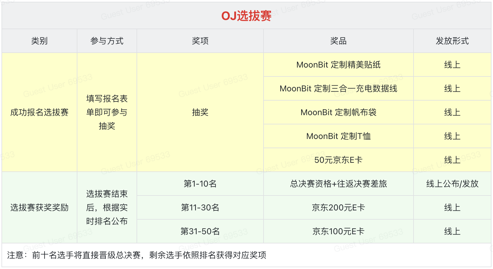

# MoonBit 线上编程竞技赛

**This campaign is exclusively available to users in Mainland China. Stay tuned for our global reward program launching soon!**

## 参赛平台

本次大赛将在 MoonBit 自有的 [OJ 平台](https://oj.moonbitlang.com/problems)进行举办，平台为参赛者提供了一个稳定、高效的在线编程环境，支持多种语言和题型，确保每一位参与者都能在公平的环境中展示自己的编程能力。未来赛事将发展成为长期赛事，将有多个赛季，持续为广大编程爱好者提供竞技交流的舞台！

## 参赛须知

1、赛事全程使用 MoonBit 月兔编程语言

2、本次编程竞技赛为个人赛

## 参赛时间&报名方式

本系列赛事分为练习赛（初赛）+选拔赛+决赛进行，练习赛与选拔赛为线上参赛，决赛为线下形式。

- 第一赛季时间为：2025年1月13日 10:30 - 2025年3月13日 18:00

- 申请兑奖截止时间：2025年3月14日 12：00

- 获奖名单公示：2025年3月16日 18：30

## OJ 线上编程竞赛选拔赛

自1月13日启动以来，OJ线上编程竞赛收获了许多同学的关注与积极参与，每一位提交兑奖邮件的同学我们都已根据评级发放了相应奖励，感谢每一位同学的热情参与！

🔥大家期待已久的「选拔赛」来啦！

✅ 零门槛开放：不限身份、无需初赛经历

✅ 多维度奖励：参赛即享双重福利

🏆 最终排名TOP10的参赛选手将直通总决赛，来到深圳与顶尖开发者同台竞技，所有差旅费用由组委会全额承担！

### 选拔赛规则说明

比赛内容：在4小时内挑战7道题。

🔑 注册与比赛：

参赛者需在比赛开始前通过GitHub ID登录比赛系统（具体地址将在竞赛群内统一通知）进行注册并熟悉操作界面。

比赛开始后，题目将自动显示，选手即可开始作答。

比赛结束后，排行榜将自动锁定，不再接受新的提交。

💻 提交与评测：

每道题目允许多次提交，系统会实时进行评测并反馈结果。

错误提交将导致20分钟的罚时（编译错误不计入罚时）。

具体细节请参见后续比赛系统的详细说明。

📢 实时排名：

参赛选手可以随时查看自己的排名情况。

📊 排名机制：

优先按做题数排名：解决题目数量多的选手排名靠前。

做题数相同：按总用时排名，总用时是指所有已解题目时间的总和。

总用时相同：按最后一道题目提交的时间排名。

⏳ 报名通道已开启！填写报名问卷即可参与首轮0门槛幸运抽奖，MoonBit定制数据线/T恤/50元京东E卡等你来抽！成功参赛答题，更可解锁进阶奖励，充电宝/北极狐双肩包/100元京东E卡/200元京东E卡......

### 奖励领取说明

1. 公平竞赛原则：为了确保活动的公平性，主办方将对参赛者的答题后台进行严格审核。若系统识别出作弊行为，如使用重复设备注册、刷题、设备环境异常等不正当手段，该参赛者的领奖资格将不被通过审核。
2. 账号使用规定：每位用户仅限使用一个注册账号参与活动。若发现使用多个账号参与，所有相关参与行为将被视为无效，参赛资格将被取消，且无权获得任何奖品。
3. 开放参赛资格：本次选拔赛不限制参赛者的身份，我们热烈欢迎广大同学以及社区的开发爱好者积极参与。
4. 奖品发放说明：关于奖品的发放，MoonBit运营团队保留最终解释权。

## 好友共练计划

为了让更多人加入挑战，我们特别推出 “好友共练”计划，鼓励大家携手提升，共享竞赛乐趣。还在犹豫的你，不妨现在就加入答题平台，与大家一起冲刺，瓜分万元奖金池！

### 步骤一：邀请

邀请人于个人邀请页面（“Invite & Earn”）复制专属邀请码，邀请朋友通过本人专属邀请码注册MoonBit OJ平台账户，并完成题目。

**专属邀请链接位置：**

### 步骤二：邀请进度查看

OJ 平台现已上线「好友共练」自动化积分系统！现在，您邀请好友后无需再手动检查排行榜来确认您的邀请对象答题情况和兑奖资格。自动化积分系统上线后，您可在【Invite&Earn】面板查看：

✅已邀请用户名单及邀请时间

✅达标人数统计（邀请对象答题积分≥15分，系统会自动标记）

✅您当前已获得累计邀请积分

### 步骤三：兑奖

**1️⃣ 确认兑奖资格：**

当有效邀请数≥1时，【Invite&Earn】面板「兑奖中心」自动开放（注：有效邀请=好友积分≥15分）

**2️⃣ 提交兑奖申请：**

在问卷表单中填写ID名称、手机号等信息（用于发放卡密）。

**3️⃣ 奖金结算：**

- **取消最高奖励限制：**
  不再设置有效邀请人数最高10人（即300元封顶）的限制，所有有效邀请均可申请兑奖。

- **奖金发放规则：**「好友共练」计划将持续整个赛季，我们分期收集兑奖信息，在第一期兑奖期间（即3月14日18:00前）每位用户只能填写一次兑奖表单
  - 若累计奖金金额**≤300元**：申请兑奖后即可全额发放。
  - 若累计奖金金额**超过300元**：本次将优先发放300元，超出部分将自动顺延至下一期兑奖开放期继续收集并发放。

（如：您有效邀请18人，您可兑奖金额将为540元， → 本期发300元，剩余的240元将会在下个兑奖期给您发放）

⚠️ 注意事项：

🔒 数据保护：系统会自动统计分数，但人工也会复核异常数据，确保公平公正。

🚫 违规处理：禁止刷分/虚假邀请，违规者取消奖励资格

（温馨提示：原先的兑奖问卷已停用，现所有用户请统一通过「兑奖中心」自助提交申请兑奖问卷。此前提交过兑奖申请的邀请者，请于3个工作日内与MoonBit小助手联系13923429458，我们将同步至新系统并优先发放奖励。）

### 领奖注意事项

1. 为了让大家公平地参与活动，主办方会对用户答题后台进行审核，如经系统识别判定为作弊行为，使用重复设备、多个账号注册或刷题、设备环境异常等异常行为，则领奖审核不通过。

2. 为培养编程领域人才和鼓励高校同学踊跃参与，练习赛（初赛）奖项仅限在校学生领取，并需验证学生身份，领取奖励时需提供如：校园卡，身份证等信息（仅用于身份验证，使用在线表单收集），选拔赛与决赛领奖要求不受身份限制（即不参加初赛也可以报名选拔赛）。

3. 每个账号仅能参与一次“活跃之星”排名。如果同一账号在多个周期中排名位列前三，则该账号只能领取一次奖励，后续排名将不再计入奖励发放。

4. 奖品发放最终解释权归属 MoonBit 运营团队所有。

5. 如对本次活动规则有疑问，请务必扫描下方二维码加入MoonBit OJ 赛事官方竞赛交流群或添加小助手（微信：13923429458）邀请进群，以确保后续兑奖事宜顺利进行，不错过任何重要信息。

