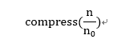
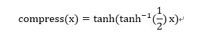

import ContestNavbar, { items2025en } from '@site/src/components/ContestNavbar'

<ContestNavbar
  activeIndex={1}
  items={items2025en}
  buttons={[
    {
      text: 'Sign up',
      href: 'https://tianchi.aliyun.com/competition/entrance/532402'
    },
    {
      text: 'Ranking List',
      href: 'https://tianchi.aliyun.com/competition/entrance/532402/rankingList'
    }
  ]}
/>

# Compiler Design and Implementation Track Guidelines

## I. General Description of the Competition Tasks

- Article 1

  Each participating team is required to comprehensively apply a broad range of knowledge (including, but not limited to, compiler technology, operating systems, and computer architecture) to design and implement an integrated compiler system. The purpose is to demonstrate their capability in compiler construction and optimization targeting specific platforms.

- Article 2

  The competition encourages each team to thoroughly understand the characteristics of the target language and the target hardware platform (such as CPU instruction sets, cache, and various parallel acceleration features). The generated target code should, to the greatest extent possible, leverage the capabilities of the target hardware platform in order to improve execution efficiency.

- Article 3

  To further demonstrate the teams’ design expertise and increase the competitiveness of the contest, finalist teams will be required to adjust their compiler systems on-site in response to changes in the target language or target platform.

- Article 4

  Except for the specific requirements, regulations, and prohibitions explicitly stated in this technical document, each team is free to determine the details of their compiler architecture, frontend and backend design, as well as code optimization strategies.

## II. Preliminary Round Scoring Criteria

Competition Content
Participants are required to develop a comprehensive compiler system that supports a designated programming language and targets the RISC-V hardware platform.

1. The compiler must be developed using the MoonBit language (a designated fixed version) and be able to compile and run on the evaluation server with an x86_64 architecture and Ubuntu 24.04 LTS operating system.
   The compiler itself shall be compilable and executable using MoonBit’s WASM-GC backend.
2. RISC-V Hardware Platform Requirements:
   The compiler must be capable of compiling test programs written in the custom-designed language MiniMoonBit 2025 into either LLVM IR or RISC-V assembly code.

   a. If assembly code is generated, it must target the RV64GC instruction set and, after linking, run on a RISC-V device with Linux installed.

   b. If LLVM IR is generated, the output must be compatible with LLVM 19 for the riscv64-unknown-linux-gnu target platform.

Functional Testing: The compiler must be able to compile the benchmark test programs written in MiniMoonBit 2025 provided by the competition.

3. The compiler must support the following capabilities:

- Lexical analysis
- Syntax analysis
- Semantic analysis
- Target code generation and optimization
  It must also support accurate identification, localization, and handling of compilation errors.

4. For benchmark test programs written in MiniMoonBit 2025 that compile successfully, the compiler must generate LLVM IR or assembly code files that meet the specified requirements. Functional testing shall be conducted using the parser, assembler, linker, and other tools provided by the competition. Based on the prescribed command-line interface, participants must use their own compiler implementation to generate the corresponding output for each benchmark program.

- For tests requiring executable outputs, the generated files will be loaded and executed on designated RISC-V hardware platforms running Linux.
- For each test case, the provided input data will be compared against the expected output to determine whether the test passes.
  For quantitative scoring, each test case will carry a base score calculated as **total score ÷ total number of tests**.
  Different levels of compiler implementation will be evaluated and scored according to corresponding criteria (details provided in subsequent sections).

### Scoring Table

| Category                    | Subcategory                                                                                | Points  |
| --------------------------- | ------------------------------------------------------------------------------------------ | ------- |
| **Mandatory Functions**     | Type Checking                                                                              | 15      |
|                             | Code Generation (LLVM IR or Assembly)                                                      | 35      |
|                             | _(Subtotal for Mandatory Functions)_                                                       | **50**  |
| **Optional Functions**      | Generics                                                                                   | 20      |
| _(Choose 1–2)_              | Type System Extensions – Struct                                                            | 15      |
|                             | Type System Extensions – Enum                                                              | 15      |
|                             | Code Generation (Assembly)                                                                 | 20      |
|                             | _(Maximum optional score: 50 points in total; 2 out of 3 options selected can achieve 50)_ | **50**  |
| **Quantitative Evaluation** | Output Program Size                                                                        | 50      |
|                             | Program Execution Speed                                                                    | 150     |
|                             | _(Subtotal for Quantitative Evaluation)_                                                   | **200** |
| **(Total)**                 |                                                                                            | **300** |

1. Mandatory Functions
   The mandatory functions evaluate the steps required for a compiler to fully compile a program. For each step, the test requires the participating compiler to either correctly accept the given input or, in case of an error, reject it with an appropriate compilation error message. Points are awarded if the compiler’s behavior matches the expected result.
   Note: For the code generation step, two output formats are accepted in this competition:

- LLVM IR conforming to the llvm-19.0 standard, with the file suffix `.ll`.
- Assembly code conforming to the RISCV64GC standard, with the file suffix `.s`.
  When the output file suffix is .ll, the test platform will use the LLVM tool `llc` to compile it into RISCV64GC assembly, which is then linked into an executable file. When the output file suffix is `.s`, the test platform will directly perform the linking process. Afterward, the behavior of the executable program will be tested against the expected result.

2. Optional Functions
   Optional functions extend the mandatory functionality by adding additional language features. For each feature, the compiler must correctly process the new language constructs and generate code that produces the expected runtime behavior. Test programs are designed for each optional language feature, and points are awarded if the runtime behavior is correct.
   Some optional tests may include **two or more different optional features simultaneously**. In such cases, the compiler must support **all** the required features in order to pass these tests.
3. Quantitative Evaluation
   Quantitative evaluation includes test cases measured by time performance rather than pass/fail correctness. For each case, the evaluation system records the total time taken from compiler startup through type checking and pattern match exhaustiveness checking, and compares this to a reference time. The calculation method is specified later. The final score is the sum of the results across all test cases.
   The quantitative evaluation includes test programs that cover both mandatory and optional functions, with proportions distributed as follows:

- 3/8 of the programs include only mandatory functions
- 1/4 include generics
- 3/16 include structs, etc.

4. Code Generation in Optional Functions
   For optional functionality, the code generation tests accept only RISCV64GC assembly. Scoring is based on the pass rate of the generated assembly programs.
   All other tests in the competition may accept either LLVM IR or RISCV64GC assembly as output. Scores are equivalent regardless of which format is used.
   In the quantitative evaluation tests, some programs may also contain one or more optional language features simultaneously. As with the functional tests, the compiler must implement all required features in order to pass these tests.
5. Quantitative Evaluation Scoring Criteria
   The quantitative evaluation tests will use the version of the MoonBit toolchain (with C backend) and Clang-20.0 released on the specific competition date as the benchmark to generate reference data for program execution time and program size. The rules for generating benchmark data are as follows:

- The benchmark MoonBit toolchain compiles programs in release mode. The RISC-V Clang used in the benchmark compiles the C backend output of MoonBit with the -O3 optimization level, with debug information disabled.
- For program size, the measured data refers to the total size of the RISC-V Linux ELF binary executable (dynamically linked to libc) generated by either the benchmark or the participant’s compiler, after applying the command strip --strip-all to remove all debug information and symbols.
- For program runtime performance, the measured data refers to the reciprocal of the total execution time of the benchmark or participant’s program on the target platform, given the specified input.
  Let the benchmark value of each test item be denoted as n₀, and the value for the participant’s submission as n. The score for each test item is then calculated as follows:

where

## III. Final Round Evaluation Criteria

The tasks in the final round are to be completed based on the final version of the compiler system submitted during the preliminary round.
Competition Content:
The Organizing Committee will release new benchmark test programs. Within the given time limit, participating teams must modify their compiler source code accordingly and submit the updated system to the competition platform. The updated compiler must use the newly provided benchmark test programs as input to generate the corresponding output programs.
For scoring, the test datasets provided during the preliminary round will continue to be used in the final round, accounting for **50% of the score** for each evaluation item, while the newly introduced datasets in the final round will account for the remaining **50%**. The total score for each evaluation item remains unchanged.

### Final Round Scoring

| Item                         | Details                                  | Points  |
| ---------------------------- | ---------------------------------------- | ------- |
| **Preliminary Test Content** |                                          | 300     |
| **On-Site Defense**          | Creative New Feature Demonstration       | 25      |
|                              | On-Site Presentation and Q&A by the Team | 25      |
| **Total**                    |                                          | **350** |

## IV. Submission of Entries

4.1 During the preliminary round, each participating team must submit the following materials to the competition platform:

1. A complete MoonBit project file of the integrated compiler system design, with at least one recorded and valid performance test run on the competition platform.
2. An analysis and design document for the compiler system design.
   4.2 If third-party IP or portions of source code borrowed from others are used, they must be explicitly stated in the design document and at the beginning of the source code. Auxiliary tools that are essential for compiler development, such as IO libraries and command-line parsers, are not included in this requirement.
   4.3 Teams must strictly adhere to academic integrity. If code plagiarism or technical plagiarism is detected, and the code similarity rate exceeds 50%, the team will be disqualified.

## V. Competition Platform and Test Programs

The competition will provide the following platform and test programs:

- Code hosting platform – Supports team collaboration and version control.
- Competition evaluation system – Retrieves the designated version from the hosting platform upon request, builds the compiler system, loads benchmark test programs, and automatically performs functional and performance tests.
- MiniMoonBit 2025 benchmark test programs – Including MiniMoonBit 2025 source code and test datasets, used to evaluate the performance of the executable files generated by the participants’ compilers on target hardware platforms such as RISC-V.
  VI. Hardware and Software Specifications
  MiniMoonBit 2025 is the high-level programming language designated for this competition. It is a subset of the core MoonBit syntax. In terms of language features, it supports global variables and function declarations, two data types (Int and Double), arrays, closures, higher-order functions, arithmetic operations in expressions, function calls, and type inference. The features of MiniMoonBit remain consistent with those of the MoonBit language.
  During the final round, the competition committee will announce updates to the language syntax, target hardware platform specifications, and benchmark test sets.

### Competition Compilation Environment

The official compilation environment designated by the competition will be used to compile the compiler source code submitted by participants, with the following specifications:

1. CPU architecture: x86_64
2. Operating system: Ubuntu 24.04
3. The standard MoonBit toolchain will be used to compile and run the submitted compilers (e.g., moon build, moon run). Network access will be allowed during compilation to download necessary libraries from Mooncakes.
4. For teams that choose to output LLVM IR: note that the compiler itself will be compiled and run using the WASM-GC backend. Therefore, the official MoonBit LLVM bindings (llvm.mbt) cannot be used in this competition.
5. Teams may use the official MoonBit LLVM IR generator MoonLLVM (https://github.com/moonbitlang/MoonLLVM) to output LLVM IR, or they may implement their own LLVM IR generator conforming to the LLVM 19 standard, or use other projects available on Mooncakes that support LLVM IR output, and then implement additional optimization passes.
   Note: If intermediate code uses LLVM IR but the final output is RISC-V64 assembly, participants can still receive the bonus points associated with assembly code generation in the optional functionality category.

### Competition RISC-V Testing Hardware

The designated RISC-V performance testing device for the competition is the Milk-V Pioneer Box, with the following key specifications:

1.  CPU: SOPHON SG2042 (64-core C920, RVV 0.71, up to 2GHz)
2.  Memory: 121 GiB DDR4
3.  Operating system: OpenEuler Linux riscv64 6.6.0-27.0.0.31.oe2403.riscv64
4.  Assembler and linker: Zig 0.14.1 / LLVM 19

- Compilation and linking command:
- zig build-exe -target riscv64-linux -femit-bin=\{output_file\} \{input_files\} -fno-strip -mcpu=baseline_rv64

5. Additional test constraints: Each tested program will be restricted to using a maximum of 2 CPU cores (exclusive use) and no more than 4 GiB of memory. These restrictions may be adjusted depending on the actual performance characteristics of the programs under evaluation.

## VII. Prize Allocation

First Prize (1 team): ¥20,000

Second Prize (2 teams): ¥10,000 each

Third Prize (3 teams): ¥5,000 each

Excellence Award (10 teams): ¥500 each

## VIII. Competition Website

The competition website provides a variety of software development tools and design materials, including but not limited to the following:

[MiniMoonBit 2025 Programming Language Specification, Grammar, and Documentation](https://github.com/moonbitlang/contest-2025-data/releases/download/docs-2025-08-21/syntax-en.pdf)

[Competition Platform Documentation (Competition Testing System User Guide)](https://github.com/moonbitlang/contest-2025-data/releases/download/docs-2025-08-21/test-platform-en.pdf)

[Performance Benchmark Programs and Related Documentation](https://github.com/moonbitlang/contest-2025-data/releases/download/docs-2025-08-21/test-platform-en.pdf)

Local Debugging Guide

(Some documents may be temporarily unavailable for viewing; the specific update time will be before September 1.)
