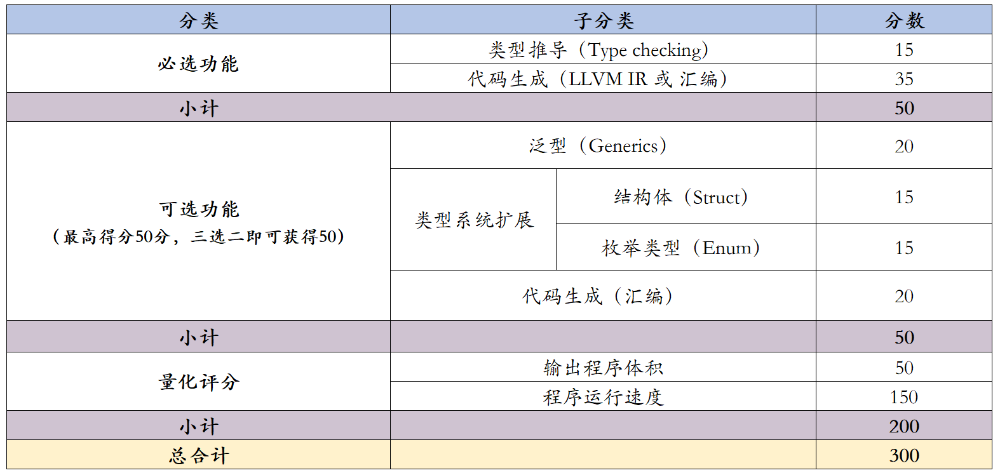

import ContestNavbar, { items2025 } from '@site/src/components/ContestNavbar'

<ContestNavbar
  activeIndex={1}
  items={items2025}
  buttons={[
    {
      text: '立即报名',
      href: 'https://tianchi.aliyun.com/competition/entrance/532402'
    },
    {
      text: '查看排行榜',
      href: 'https://tianchi.aliyun.com/competition/entrance/532402/rankingList'
    }
  ]}
/>

# 一、赛题基本说明

第 1 条 ：大赛要求各参赛队综合运用各种知识(包括但不局限于编译技术、操作系统、计算机体系结构等)，构思并实现一个综合性的编译系统，以展示面向特定目标平台的编译器构造与编译优化的能力。

第 2 条 ：大赛鼓励各参赛队充分了解目标语言及目标硬件平台(CPU指令集、Cache、各类并行加速能力等)特点，使编译出的目标码能够尽可能利用目标硬件平台能力以提高目标码的运行效率。

第 3 条 ：为展示参赛队的设计水平，增加竞赛的对抗性，进入决赛的参赛队还需针 对目标语言或目标平台的变化，现场调整编译系统。

第 4 条 ：除本技术方案特别要求、规定和禁止事项外，各参赛队可自行决定编译器体系结构、前端与后端设计、代码优化等细节。 除本技术方案特别要求、规定和禁止事项外.

# 二、初赛评分标准

**比赛内容：**

开发支持特定语言、面向 RISC-V 硬件平台的 综合性编译系统。

1. 编译器应当基于 MoonBit 语言（某固定版本）开发，并能够在 x86_64 架构、Ubuntu 24.04LTS 操作系统的评测服务器上编译运行。编译器本身应当可以使用 MoonBit 的 WASM-GC 后端编译运行。
2. RISC-V硬件平台：能够将符合自定义程序设计语言 MiniMoonBit 2025 的测试程序编译为 LLVM IR 或 RISC-V 汇编语言程序。如果输出汇编，程序应当使用 RV64GC 指令集，并将在链接后在 Linux 操作系统的 RISC-V 设备上运行。如果输出 LLVM IR，应当输出 LLVM 19 可以接受的 riscv64-unknown-linux-gnu 目标平台的程序。

**功能测试：**

参赛队所开发的编译器应能够编译大赛提供的 MiniMoonBit 2025 语言编写的基准测试程序。

1. 具有词法分析、语法分析、语义分析、目标代码生成与优化等能力， 并支持编译错误的准确识别、定位与错误处理功能。
2. 对于正确编译通过的 MiniMoonBit 2025 基准测试程序，应生成符合要求的 LLVM IR 或者汇编文件。
   功能测试要求基于大赛给出的代码解析器（parser）、汇编器（assembler）、链接器（linker）等工具，基于大赛给出的命令行接口要求，用自行编写的实现为每个基准测试程序生成对应的输出。对于输出可执行文件的测试，输出将在安装有 Linux 操作系统的指定硬件平台上加载并运行。对于每个测试用例，我们将给定输入数据，比对程序运行输出结果是否满足预期，以此决定该测试是否通过。对于量化评分部分，每个测试用例的基准分数为 总分数/总测试数量。

不同的编译器实现级别与对应的分数如下：

比赛中各得分内容的介绍与评测方式如下：

1. 必选功能考察编译器完整编译一个程序的步骤。对于每个步骤，测试要求参赛者的编译器正确接受给定的输入，或者通过编译失败提示输入有误。参赛编译器的行为与预期相符则可以获得对应测试的分数。\*注意：对于代码生成步骤，本次竞赛接收两种形式的代码，一种是符合llvm-19.0标准的LLVM IR，输出文件名后缀为.ll；另一种是符合RISCV64GC标准的汇编代码。输出文件名后缀为`.s`。当文件名后缀为`.ll`时，测试平台将使用llvm编译工具llc编译成RISCV64GC汇编，再链接成可执行文件。当文件名后缀为`.s`时，测试平台将直接进行链接操作。之后再测试程序的运行行为是否与预期相符。

2. 可选功能在必选功能的基础上增加了一部分额外的语言特性和功能。对于每个功能，参赛者的编译器需要可以额外接受这些新的语言特性，并生成行为与预期相符的程序的代码。测试程序会针对每个语言特性对编译器进行测试，程序运行行为相符的可以获得相应的分数。
   在可选功能的测试中，有一部分测试将同时包含两种或以上不同的可选语言特性，参赛者的编译器必须同时实现所有要求的语言特性才能通过这些测试。

3. 量化评分包含按照时间比例而不是测试通过率评测的测试用例。对于量化评分中的每个测例，评测系统会记录从编译器启动到执行完类型检查和模式匹配完整性检查为止所用的总时间，并将该时间与参考时间进行比较。具体计算方式见下文。最终得分是所有测试用例的得分之和。
   量化评分会按对应得分比例含有包含必选和可选功能的测试程序，即 3/8 的程序只包含必选功能，1/4 包含泛型，3/16 包含结构体等。

4. 可选功能中的代码生成测试只接受生成RISCV64GC汇编，并根据汇编程序的测试通过率进行评分。比赛中的所有其余测试均可以接受LLVM IR和RISCV64GC输出格式的任意一种，且使用两者的得分没有区别。
   在量化评分的测试中，有一部分测试将同时包含一种或以上的可选语言特性，参赛者的编译器必须同时实现了所有要求的语言特性才能通过这些测试。

5. 量化评分部分评分标准
   量化评分部分测试将使用（具体比赛日期）发布的 MoonBit 工具链版本（使用 C 后端）和Clang-20.0作为测试基准，产生比赛中所需要的时间和程序大小基准数据。评分所用数据的产生规则如下：

- 测试基准使用的 MoonBit 工具链使用 release 模式编译程序。使用的 RISC-V Clang 使用 -O3 优化级别编译 MoonBit 的 C 后端生成的程序，不开启调试信息。
- 输出程序体积一项的数据为基准或选手程序输出的 RISC-V Linux 平台 ELF 二进制可执行文件（动态链接 libc）经过 strip --strip-all 命令删除所有调试信息与符号后的总大小。
- 程序运行速度一项的时间数据为基准或选手输出的应用程序在目标运行平台、使用给定的输入下的总运行时长的倒数。
  将每个测试项中的基准数据值记为n0，当前队伍的数据记为 n，每个测试项的得分计算方式为：

# 三、决赛评分标准

决赛阶段的任务在初赛提交的最终版本编译系统上完成。

**比赛内容**：大赛组委会公布新的基准测试程序。参赛队根据变化，在限定 时间内自行修改编译系统源代码，提交给竞赛系统。生成的编译系统需要 以新给出的基准测试程序集作为输入，生成对应的程序。在评分中，初赛提供的测试数据集将在决赛中继续进行测试，占据每个测试项目 50% 的分数，决赛新加入的测试集占剩下的 50%。各个测试项目的总分数不变。

**现场答辩**：比赛团队制作演示文稿，展示团队实现的编译器的技术细节等。这一部分的具体评分标准在将决赛阶段另行公布。现场答辩部分分为两部分：

- 有创意的新功能：团队可以展示在编译器中实现的有创意的、不在比赛范围内的新功能。例如，可以实现一个垃圾收集器（GC），或者高级语言特性（异步、trait 等）。这些新功能不参与初赛测试内容或者类似的评测机测试，由评委人工打分。
- 团队协作和答辩内容：团队展示比赛过程中的团队分工、编译器的技术细节、实现方式等，并接受评委提问。

总决赛得分标准：

# 四、参赛作品提交

4.1. 各参赛选手初赛阶段需要在大赛的竞赛平台提交完整的设计内容:

1. 综合编译系统设计的完整 MoonBit 项目文件，并在竞赛平台中至少有一次完整进行性能测试的记录和有效成绩。
2. 编译系统设计的分析设计文档。

4.2. 如果需要使用第三方IP或者借鉴他人的部分源码，必须在设计文档和源代码的头部予以明确说明。为了编写编译器必需在项目中引用的IO库、命令行解析器等辅助工具不包含在内。

4.3. 参赛队必须严守学术诚信。一经发现代码抄袭或技术抄袭等学术不端行 为， 代码重复率在 50%以上，取消参赛队的参赛资格

# 五、竞赛平台与测试程序

大赛提供的竞赛平台和测试程序包括:

1. 代码托管平台，支持各参赛队的群体协作与版本控制。
2. 竞赛评测系统，根据参赛队的申请从代码托管平台获取指定版本，生 成编译系统，并加载基准测试程序，自动进行功能及性能测试。3.基于MiniMoonBit 2025语言的基准测试程序(包括MiniMoonBit 2025源码及评测点数据)，用于RISC-V 等目标硬件平台上对参赛队编译器生成 的可执行文件进行性能评测

# 六、软硬件系统规范

MiniMoonBit 2025 语言是用于本次竞赛的高级程序设计语言，是 MoonBit 基本语法的子集。语言特性方面，支持全局变量与函数声明、Int 和 Double 两种数据类型、数组、闭包、高阶函数，表达式支持算术运算、函数调用，支持类型推导。MiniMoonBit 在其所拥有的特性上与 MoonBit 语言保持一致。

决赛阶段的语言语法、目标硬件平台特性、基准测试集调整，由大赛组委 会在决赛阶段发布。

- 大赛指定的编译环境用于编译参赛队提交的编译系统源码，参数如下：

  1. CPU 体系结构: x86_64
  2. 操作系统：Ubuntu 24.04
  3. 使用标准的 MoonBit 工具链对提交的编译器进行编译与运行（如：moon build、moon run 等）。但是编译期间可以访问网络从 Mooncakes 下载合适的程序库等。
  4. 对于选择输出 LLVM IR 的参赛队伍。请务必注意编译器本身的编译运行将使用 WASM-GC 后端，因而 Moonbit 的官方 llvm 绑定 llvm.mbt 无法在本次竞赛中使用。
  5. 参赛队伍可以选择Moonbit官方提供的 LLVM IR 生成器 MoonLLVM（https://github.com/moonbitlang/MoonLLVM）来输出 LLVM IR，或者自行实现符合 LLVM 19 标准的 LLVM IR 输出，或者从Mooncakes上寻找其它支持输出llvm ir的项目，并在此基础上实现各类优化Pass。

  \*注：如果中间代码使用llvm IR，但最终输出为RISCV64汇编，仍然可以获得可选功能中汇编代码生成的加分分数。

- 大赛指定的 RISC-V 架构目标程序性能测试实验设备为 Milk-V Pioneer Box，主要参数如下
  1. CPU: 算丰 (SOPHON) SG2042 (64 Core C920, RVV 0.71, up to 2GHz)
  2. 内存: 121GiB DDR4
  3. 操作系统: OpenEuler Linux riscv64 6.6.0-27.0.0.31.oe2403.riscv64
  4. 汇编和链接器：Zig 0.14.1 / LLVM 19。编译与连接指令：zig build-exe -target riscv64-linux -femit-bin=\{output_file\} \{input_files\} -fno-strip -mcpu=baseline_rv64
  5. 额外的测试限制：我们将限制每个被测程序占用的 CPU 核心数最多为 2 个（独占），内存不超过4GiB。这一限制后续可能会根据实际被测程序的情况进行调整。

# 七、奖金设置

- 一等奖（1名）20000元
- 二等奖（2名）10000元
- 三等奖（3名）5000元
- 优异奖（10名）500元

# 八、大赛网站

大赛网站提供多种软件开发工具及设计资料，包括但不限于下列内容:

1. [MiniMoonBit 2025 程序设计语言规范、文法及说明](https://github.com/moonbitlang/contest-2025-data/releases)。
2. [竞赛平台(竞赛测试系统)使用文档](https://github.com/moonbitlang/contest-2025-data/releases)。
3. [性能基准测试程序及其文档](https://github.com/moonbitlang/contest-2025-data)。
4. 本地调试指南。
   （以上文档中暂不可浏览部分，具体更新时间为 9月1日之前）
