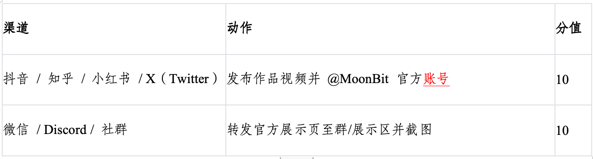

import ContestNavbar, { items2025 } from '@site/src/components/ContestNavbar'

<ContestNavbar
  activeIndex={2}
  items={items2025}
  buttons={[
    {
      text: '立即报名',
      href: 'https://tianchi.aliyun.com/competition/entrance/532403'
    },
    {
      text: '提交作品',
      href: 'https://github.com/moonbitlang/MoonBit-Code-JAM-2025'
    }
  ]}
/>

# 一、赛题基本说明

游戏赛道旨在鼓励开发者通过使用 MoonBit 编程语言，开发出具有创新性和趣味性的游戏作品。面向全球游戏专业人士、企业机构、高校师生、独立开发团队和游戏爱好者征集作品。赛事组将从作品创新性、完成度、精良度、技术性等维度对作品进行综合评价。同时设立指定奖项，鼓励对人工智能技术的应用、与社会公益的结合。

# 二、活动报名

1. 本届MoonBit 游戏挑战赛的报名、比赛过程均在线上完成、决赛评选、颁奖典礼等在线下完成。
2. 选手请在11月13日前在竞赛报名网站（阿里云天池）完成报名，报名确认完成后（参选队伍ID生成）即可开始作品创作。

- 本次活动面向全球高校学生，不限年级、不限专业，参赛选手年龄需满14岁以上，每支队伍需至少包含一名成年人。
- 报名选手须保证提供的信息合法、真实、有效。
- 参赛者报名前请仔细阅读《隐私政策》内容。
- 主办方将对所有选手提交的个人信息予以保密，未经选手本人同意主办方不会透露给第三方。

# 三、组队规则

1. 参赛者可选择以个人身份参赛或以团队方式参赛，二者择其一。以团队方式参赛的，需满足以下条件：

- 团队人数不得超过5人；
- 每人只能参加一支队伍。
  a. 选手可自由组队，支持跨校、跨国组队。
  b. 报名后若需更换队伍，需先退出原队伍再重新加入新队伍。
- 截止至初赛报名截止前（即2025年11月13日），选手可随意组队或加入新队伍。
- 更换队伍时，需将原队伍与新队伍的信息一并发送至赛事组邮箱，经赛事组邮件确认后方可生效。
  c. 报名阶段截止后，未锁定队伍的同学，其报名信息将自动失效。

2. 若需寻找一起创作的“伙伴”或“队伍”，可直接加入官方活动QQ群：914387051，寻找队友报名。

# 四、线上线下宣讲

主办方于9月-11日前往全国高校举办了赛事宣讲会线上不定期直播宣讲，内容包括赛事介绍、经验分享以及关游戏研发流程。具体时间地点由主办方另行通知。

# 五、比赛流程

本次挑战赛将分为初赛和决赛，初赛纯线上、线下决赛线下的形式。
线下决赛还将包括游戏展示路演、导师交流会等，届时主办方会统一安排。\*本次赛程安排中涉及到的所有时间均为北京时间

# 六、作品要求

## 1. 游戏本体

- 游戏为静态 HTML 5 游戏，至少支持桌面端 Chrome 浏览器 135 及以后版本，至少支持键盘或鼠标交互
  游戏核心逻辑应当用 MoonBit 开发，优先推荐使用官方游戏框架：[pixel adventure.mbt](https://github.com/moonbitlang/pixel-adventure.mbt) 、Wasm-4（https://github.com/moonbitlang/wasm4） 等
- 游戏开发不限制 MoonBit 编译后端，选手可以给游戏增加后端及其他功能，并利用最新或实验性浏览器特性。比如：可以使用 MoonBit Native 后端开发后通过 emcc / WASI-SDK 等工具链编译至 Wasm / JS；多后端/跨平台支持特性将以附加分的形式纳入初赛总成绩，并纳入决赛入围考核标准，该部分将在决赛路演时展示，具体详见八（初赛评分标准）说明

## 2. 游戏介绍视频

- 视频长度不少于 1 分钟
- 游戏介绍视频内容需包含以下要素：
  1. 游戏玩法介绍和核心机制说明
  2. 实际操作演示片段
  3. 技术亮点或视觉特色呈现（如使用 AI、MoonBit 技术等）

# 七、作品提交规范

- 提交方式：通过创建合并请求提交至官方指定Github仓库链接；合并请求的标题命名格式要求：天池竞赛报名ID+队伍名称+作品名称
  📍 https://github.com/moonbitlang/MoonBit-Code-JAM-2025
- 提交内容：  
  **a.（必选）提交游戏作品（artifact）。游戏应当包含 index.html 作为入口。**  
  **b.（必选）提交游戏说明（README）。应当提供游戏描述以及游戏玩法介绍，包括：**

  1. 游戏简介：创作背景、玩法目标与设计理念
  2. 操作说明：用户如何开始游戏、控制方式、游戏流程指引
  3. 技术特色：关键实现方式、难点攻克、MoonBit 使用亮点等
  4. 团队信息：团队名称、成员名单、联系方式（如邮箱）

  **c. （必选）游戏介绍视频链接**  
  提交方式：发布至哔哩哔哩视频网站
  添加指定 hashtag：#MoonBit 2025编程挑战赛+@MoonBit 月兔
  注意\*：初赛结束后入围前50名的队伍需要提交完整源代码、游戏素材以及构建指引。

- 选手允许以合法途径获得并使用非原创素材，但必须保证拥有其完整的版权，并在提交文档中标注，因参赛行为或参赛作品而引起的侵权争议及其他争议，由参赛者自行解决，并承担由此导致的一切责任和损失。
- 如果使用了已有的开源代码，需在文档中明确声明，并确保符合相关的授权和使用条款
- 作品必须遵守法律法规，不得宣传色情、暴力、血腥等不良内容；不得盗用、剽窃抄袭他人作品；不得侵犯他人知识产权，使用未经授权的素材、图片、字体等；若违反相应规则，则取消成员参赛及获奖资格
- 作品在报名截止前可多次更新优化，每次更新须通过平台同步提交版本并附简要修改说明

# 八、初赛评分标准

MoonBit 游戏赛道初赛评审将基于两个维度综合评分：

## 标准一：宣传与内容提交维度（最高 30 分）

该维度旨在鼓励参赛团队尽早完成作品提交，并积极参与官方平台宣传与社区传播，具体评分项如下：

1. 提交完整作品（早鸟奖，最高 10 分）
   参赛队伍在初赛阶段按照第七条「作品提交规范」要求，作品符合要求并且成功录入展示墙的前20支队伍，可获得10分奖励并且额外每支队伍获得100 元京东卡奖励
2. 官方宣传加权（月度动态评比，最高 20 分）
   赛制组每月15日从展示墙中评选 3～5 个【月度推荐展示作品】，并授予以下专题类奖项奖项称号（可重复获得）：

   - 「月度最佳视觉奖」：在画面风格、动画细节、美术表现等方面具备卓越设计能力；
   - 「月度最佳创意奖」：在玩法机制、交互设计、题材立意方面具有独创性；
   - 「月度最佳 AI玩法奖」：合理融合 AI 技术（如语言模型、图像生成、AI 决策）形成核心玩法的作品。

   获奖作品将获得价值300-800元奖励以及 MoonBit 官方渠道推荐，包括视频号、B 站、微信公众号等。

## 标准二：附加加分项（最高 70 分）

### 1、选手传播得分（最高 20 分）

选手自发将作品转发至以下渠道

### 2、跨平台兼容性（可选，最高 50 分）

为鼓励技术探索与兼容性拓展，本届赛事增设跨平台兼容性加分项：

参赛作品若支持在多个平台上运行（如 Web、Native 桌面应用、微信小游戏、小程序、移动端等），每增加一个有效平台可获得 10 分，最高 50 分。

有效平台需能完整展示游戏主要玩法并具备基本交互功能，且与主展示版本保持一致。
评审认定平台包括但不限于：

- Native 本地运行（Windows/macOS/Linux 可执行文件）
- 微信小游戏或小程序版本
- Android/iOS 移动应用

附加分申请方式：
凡希望申请附加加分的参赛队伍，须在作品提交截止日前填写官方发布的《MoonBit 附加加分申请表》，并在初赛截至之前按照表单要求提交相应材料：

## 标准三：专家评审（最高60分）

MoonBit 官方将组织语言作者、开发者代表、AI 游戏专家等组成评审团，从以下四个维度打分：

1. 游戏实现完整度：评估游戏内容的实现程度、关卡完整性和操作体验。（25%）
2. 游戏技术难度：考虑实现过程中技术的复杂性和难度。（20%）
3. 游戏玩法创意性：考察游戏玩法的创新性、关卡设计的趣味性及AI融合表现形式。（30%）
4. 游戏美观设计：评估美术风格的匹配度、美术设计的美感以及音乐和音效的表现。（25%）
5. 决赛名单将根据以上得分求和计算，队伍从高到低的排名进行入围通知。

# 九、晋级机制说明

决赛入围资格将基于初赛阶段的综合得分排名确定，评分构成如下：专家评审占比 50%、附加加分项40%、宣传与内容提交维度占比 10%

综合得分排名前列的参赛队伍，将获得决赛入围资格（具体名额视作品质量及报名情况确定）；官方将于初赛阶段结束后公布入围名单，并发送邮件通知。

# 十、决赛评分标准

如果你的团队进入到第二阶段的比赛，你需要在队伍中派出代表在线下（深圳）进行决赛创作路演（Live），决赛具体路演要求主办方将另行通知

- 主办方邀请了多位业界大咖作为本次挑战赛的评审专家。

- 将从核心玩法体验、操控感、表现力、切题程度四个方面对入围决赛作品进行评审和打分。

## 作品评审与投票周期

初赛作品的专家评审与宣传周期均为8月15日-11月14日下午18：00。

初赛和决赛作品评选期间，参赛作品将被展示在赛事官网上，选手可以通过八（标准一）中涉及的宣传方式，参与获取得分。

决赛作品的评审日期为11月23日

# 十一、奖金设置

## 初赛：

- 早鸟奖：提前20个成功提交并在展示墙上线展示的作品，将自动获得“早鸟奖”称号与奖励，早鸟奖励与阳光普照、特别单元奖项可重叠。奖项将滚动发放，数量优先，先到先得。
- 阳光普照奖【初赛综合排名前50名】：每队500 元
- 特别单元奖：为进一步鼓励多元创作方向，激发参赛热情，大赛特别设立若干主题鼓励类奖项，专门授予未进入线下决赛的优秀作品给予一定现金奖励和参赛证明，体现包容性与多维度价值导向。

### 1. 最佳中华文化表达奖（1名）（1000元）

作品在题材立意、艺术风格、交互体验等方面积极融合中华优秀传统文化元素，具备较强文化辨识度与传播力。

### 2. 最佳高校团队奖（1名）（1000元）

由在读高校学生创作的作品，具有鲜明的创新思维和可执行的技术实现，体现青年创意活力。

### 3. 最佳社会价值功能奖（1名）（1000元）

以学习辅助、心理调节、技能训练、行为养成等现实社会服务功能为核心，具有一定社会影响力的游戏作品。

### 4. “怪”好玩奖（1名）（1000元）

授予不拘泥于传统游戏设计思维，在玩法构造、视觉风格或交互方式上展现出强烈创新特征的作品。

### 线下决赛：

- 一等奖（1名）10000元
- 二等奖（2名）5000元
- 三等奖（3名）3000元
- 优异奖（3名）2000元
