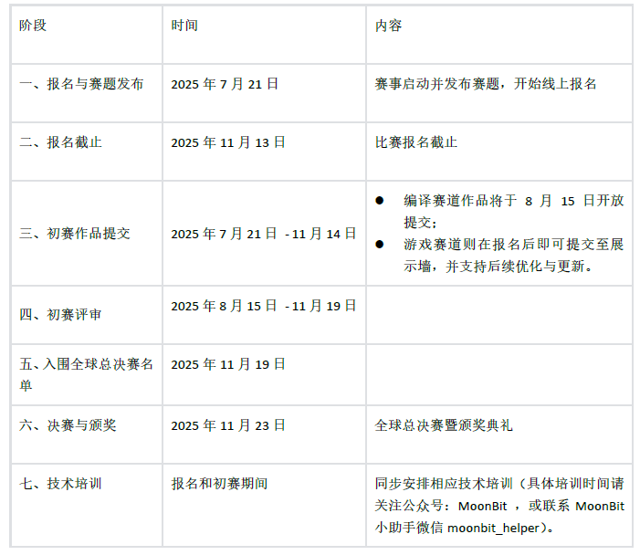
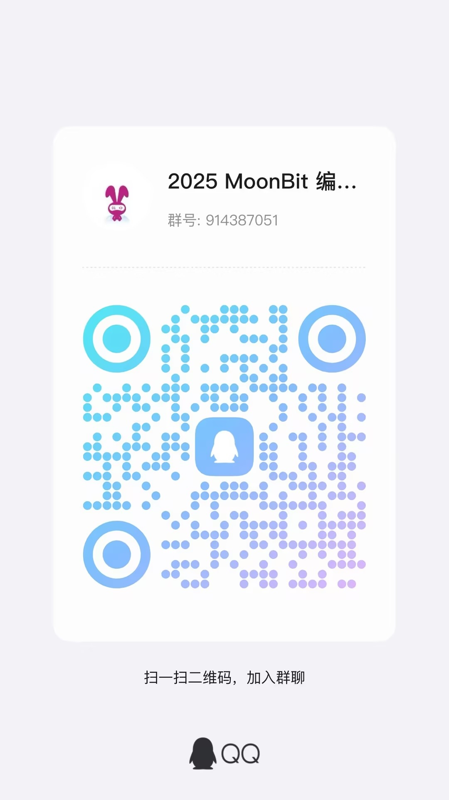

import ContestNavbar, { items2025 } from '@site/src/components/ContestNavbar'

<ContestNavbar activeIndex={0} items={items2025} qqGroup={false}/>

# 2025年 MoonBit 全球编程创新挑战赛章程

## 一、竞赛总则

MoonBit 编程创新挑战赛是由深圳市河套深港科技创新合作区深圳发展署指导，粤港澳大湾区数字经济研究院基础软件中心主办，面向全球开发者的专业性挑战赛事，旨在推动计算机软件开发相关专业建设，服务国家基础软件和人工智能云原生领域的人才战略。

本赛事鼓励参赛者设计并实现创新性计算机系统项目，学习新一代人工智能云原生开发平台，培养系统级的设计、分析、优化与工程实践能力，提升团队协作与综合创新素质。赛事以赛促学、以赛促教，致力于构建高水平计算机人才交流、展示与合作的开放平台。

本赛事自 2024 年首届举办以来，反响热烈。首届大赛共吸引 超1888 支队伍参赛，覆盖清华大学、剑桥大学、中山大学、香港科技大学（广州）等多所国内外知名高校，比赛设置“编程语言设计与实现”与“游戏开发挑战”两个赛道，由沈向洋、林惠民、赵琛、倪明选等担任荣誉评委，获得学术界与产业界的广泛关注与高度认可。

## 二、竞赛组织

主办单位：粤港澳大湾区数字经济研究院
合作单位：中国科学院软件研究所、香港科技大学（广州）、中山大学软件工程学院
大赛竞赛平台：阿里云天池

为保证大赛顺利进行，MoonBit 编程创新挑战赛下设名誉指导委员会、赛事组委会成员、评审委员会负责指导、执行和监督大赛的组织、运营和奖项评审工作。

**名誉指导委员会成员（以下排名按照姓氏笔划排序）：**
（本届评审团队将延续 2024 年专家阵容，目前正在确认中。）

- 沈向洋 美国国家工程院外籍院士、香港科技大学校董会主席
- 林惠民 中国科学院院士、中国科学院软件研究所学术委员会主任
- 赵琛 中国科学院软件研究所所长
- 倪明选 IEEE终身会士、香港工程科学院院士、香港科技大学（广州）创校校长

**赛事组委会成员：**
（本届评审团队将延续 2024 年专家阵容，目前正在确认中。）

- 苏玉鑫 中山大学软件工程学院副院长
- 曹钦翔 上海交通大学计算机科学中心副教授
- 汪宇霆 上海交通大学长聘教轨副教授
- 徐辉 复旦大学计算机科学技术学院副教授
- 李丹 中山大学软件工程学院副教授
- 王迪 北京大学计算机学院助理教授
- 王焱林 中山大学软件工程学院助理教授
- 丁子硕 香港科技大学（广州）数据科学与分析学域助理教授
- 吴伟 中国科学院软件研究所PLCT实验室项目总监
- 李亚飞 ShowMeBug 的创始人兼CEO
- 狼叔 CNode社区联合创始人，知名前端高级技术专家
  （持续更新中）

## 三、赛道设置

参赛选手报名视为同意并自愿遵守赛事章程的全部内容
本次大赛分为【游戏开发挑战赛】、【程序语言设计和实现赛】

1. 游戏开发挑战赛道：面向14岁以上的开发者，使用 MoonBit 编程语言进行开发，优先推荐使用官方游戏框架：如pixel adventure.mbt(后续提供) 、Wasm-4（https://github.com/moonbitlang/wasm4） 等。
2. 程序语言设计与实现赛道：面向14岁以上的开发者，使用 MoonBit 编程语言在 RISC-V 后端硬件平台开发。

## 四、赛事流程

### 4.1 赛事安排

1. 大赛分初赛和决赛两个阶段，初赛全程线上进行，初赛胜出团队中，按照成绩从高到低等因素综合评判，在两个赛道共评选出10个参赛队伍（原则上每个赛道 5 队，队长 1 人作为代表，将根据实际情况进行调整）拥有资格参加决赛路演，根据各参赛队伍路演情况，结合比赛规则、各项标准进行打分，最终评选结果将在决赛当日公布。
2. 为鼓励获奖队伍，主办方将视情况安排为期一日的线下名企大厂研学活动，表现优异者有机会获得由名企大厂提供的面试、实习机会。

### 4.2 报名名额及要求

1. 参赛以队为基本单位报名，每支参赛队伍人数为 1～5 人，单人也可组队参赛，视为独立参赛队。
2. 每支参赛队可选择报名多个赛道（如编译赛道 + 游戏赛道），但最终仅以得分更高的一个赛道作为晋级决赛的依据，另一个赛道成绩及奖项荣誉将予以保留但不重复进入决赛环节。
3. 每位参赛选手只能报名参加 1 支参赛队，不可重复报名或以不同身份创建多个队伍。主办方将对所有参赛队伍成员信息进行核验，若发现重复报名、虚假注册或冒名顶替等情况，将取消相关队伍参赛资格。
4. 每个参赛队最多有两位指导教师，每位指导教师可同时指导本校多支参赛队。指导教师负责指导参赛队选题、组织学生参加赛前的技术培训，并鼓励学生应用大赛指定的实验平台进行作品的创意设计与实现，同时负责在大赛过程中与学校及组委会之间的信息沟通。如果参赛队伍以高校队伍的形式参赛，则适用本条规定。
5. 每位参赛选手需满14岁以上，每队需包含至少一名成年人，且需选出一人作为队长；每个参赛队伍之队长须于活动期间代表该团队负责比赛联系及得奖奖品领取等相关事宜。团队成员须自行分配团队内部的各项权责归属，若有任何争执之处（如奖品领取方式与分配），主办/执行单位不涉入处理。
6. 本次比赛同时面向全球开发者。
7. 参赛者保证提供的参赛者资料和信息真实、准确、合法、有效，同意并授权赛事主办方在法律允许的范围内，在下列情况下收集、存储和使用参赛者资料（包括姓名、性别、手机号码、电子邮箱、身份证号、照片、银行卡号等信息）：
   1、用于赛事报名、决赛评奖差旅事项、奖金发放；
   2、用于赛事相关的公关材料、广告或宣传活动；

### 4.3 报名方式

1. 赛事采取双通道报名，参赛队伍可以自行在以下报名网站任选其一进行报名，不可重复：
   1、MoonBit 官方赛事活动页：
   https://www.moonbitlang.cn/2025-mgpic/
   2、阿里云天池竞赛平台：(待补充)

2. 参赛队报名时需提交队伍信息至在线报名页面，信息包括队名，各队员姓名、相关技能、相关项目经验等信息。参赛队应确保所提交信息真实有效，并保持联系方式畅通。如信息不实或无法联系到参赛队，将会影响报名甚至取消成绩。

### 4.4 参赛费用

1. 大赛不收取报名费、参赛费、评审费及技术平台购买费等任何费用。
2. 参赛选手代表在全国总决赛及颁奖典礼期间产生的交通、住宿费用由主办方提供（具体的行程时间由主办方确定）。
3. 大赛指定的游戏引擎等资源由大赛组委会免费向参赛队提供。

## 五、竞赛管理

### 5.1 初赛

1. **游戏开发挑战赛道**
   参赛队按照比赛指南要求在大赛网站提交作品设计方案。评审专家根据评测标准，对初赛作品进行打分，并按照分数对各参赛队进行排序, 按初赛分数高低决定入围决赛的参赛队，最终进入决赛的队伍名额由评委根据作品质量等因素综合评判。
2. **程序语言设计与实现赛道**
   参赛队按照比赛指南要求在大赛网站提交作品和相关源代码。评审专家通过评测系统给出的依照作品性能评估给出的客观分数，对各参赛队进行排序，按排序先后决定入围决赛的参赛队。

### 5.2 全国总决赛

1. 原则上每个赛道分别有五个队伍到达决赛现场进行最终比拼，且由队长作为代表
2. 由大赛组委会组织决赛，决赛根据两个赛道评判标准等不同，设作品演示、性能测试、系统展示、答辩环节等环节。最终按决赛各环节的综合分数高低决定奖项归属。
3. 参赛团队必须按组委会要求参加决赛，未参赛的队伍视为自动放弃决赛资格。
4. 获奖参赛者应按照主办方发布/通知的奖金发放流程和规则领取奖金，包括但不限于及时提供身份证复印件、银行卡复印件等资料和信息，签署相关领奖文件等；未按前述流程和规则操作的，主办方有权不予发放奖金。
5. 入围决赛的参赛团队应在比赛结束后，将作品源代码以 OSI 认可的开源协议之一公开发布，建议使用 GitHub 等主流平台进行托管。推荐采用 https://opensource.org/licenses 中列出的许可证。

## 六、奖项设置

| 赛道                   | 奖金池总金额（现金） | 其他奖励                         | 备注                                                                                                                                                                                                |
| ---------------------- | -------------------- | -------------------------------- | --------------------------------------------------------------------------------------------------------------------------------------------------------------------------------------------------- |
| 程序语言设计与实现赛道 | 60000 元             | 参赛证书、企业研学、实习直通车等 | 详情见《2025年 MoonBit 全球编程创新挑战赛程序语言设计与实现赛道》指南                                                                                                                               |
| 游戏开发挑战赛道       | 60000 元             | 参赛证书、企业研学、实习直通车等 | 1、详情见《2025年 MoonBit 全球编程创新挑战赛游戏开发挑战赛道》指南  2、为鼓励参赛者积极参与，游戏赛道前50队均可获得现金500元奖励！  3、视具体赛事进展及选手参与人数，奖金将可能增加！ |

## 七、知识产权及学术诚信

- 除另行说明，参赛作品的知识产权归参赛队所有。
- 参赛队应自觉遵守知识产权的有关法规，不得侵犯他人的知识产权或其他权益，不得未经相关单位许可，对外共享或公开发布涉及该单位知识产权的作品及软件。如造成不良后果，相关法律责任由参赛队自行承担，大赛的主办、承办和协办方均不负任何法律责任。
- 参赛队应保证学术诚信，一经确认代码抄袭或技术抄袭等学术不端行为，或代码重复率在50%以上，将取消参赛资格，并列入赛事黑名单。
- 大赛报名者默认同意大赛的主办方公开赛道参赛作品源代码。大赛主办方拥有免费使用参赛作品进行演示和出版的权利（不涉及技术细节）。如果以盈利为目的使用参赛作品，需与参赛队协商，经参赛队同意后，签署有关对参赛作品使用的协议。

## 八、交流与宣传

- 大赛致力于推动计算机软件开发专业建设，助力编程语言领域创新人才梯队培育，培养编程语言这一基础软件领域的后备人才，为学术与创新交流合作提供平台。大赛期间鼓励参赛队伍间举办各种形式的交流活动，并对参赛期间优秀作品和参赛团队进行宣传。
- 大赛主办方欢迎行业内各大机构或组织共同参与大赛的组织、命题、宣传、赞助等活动，提升本赛事质量及影响力。
- 报名本次比赛默认同意主办方使用选手参加比赛期间的肖像权，主办方仅使用肖像用于赛事相关内容的宣传
- 如有合作宣传等需求请联系邮箱：jichuruanjian@idea.edu.cn

## 特别说明

大赛组委会保留对本方案的最终 解释权，并有权根据实际情况调整竞赛流程和相关要求。
参赛选手请扫描官方大赛答疑咨询总群（914387051），或搜索微信号：moonbit_helper

附件一：2025年MoonBit 全球编程创新挑战赛——程序语言设计与实现赛道指南
附件二：2025年MoonBit 全球编程创新挑战赛——游戏开发挑战赛道指南
