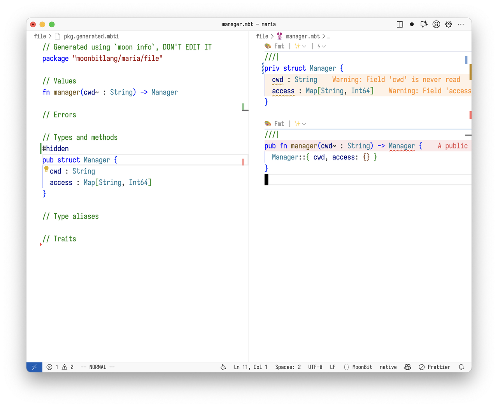
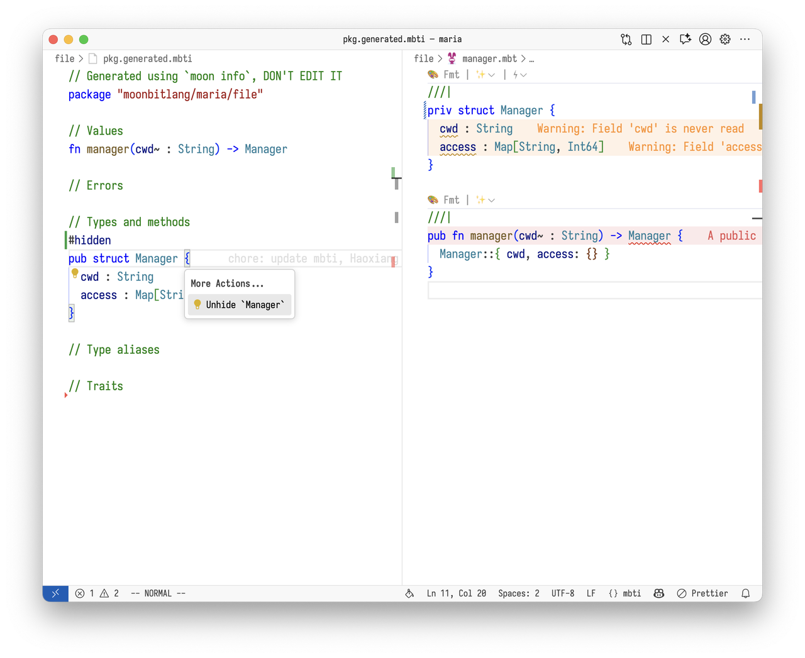

# 20251103 MoonBit Monthly Update Vol.05

## Version v0.6.30+07d9d2445

## Compiler Updates

#### 1. Updates of the alias system

MoonBit has three different alias syntaxes for traits, functions, and types respectively:

- `traitalias @pkg.Trait as MyTrait`
- `fnalias @pkg.fn as my_fn`
- `typealias @pkg.Type as MyType`

This distinction introduces unnecessary complexity and limitations. For example, we couldn't create aliases for const values. In upcoming versions, we will introduce a new `using` syntax to unify alias creation.

The `using { ... }` syntax unifies `traitalias`, `fnalias`, and **simple** `typealias`, with the following specific syntax:

```moonbit
using @pkg {
  value,
  CONST,
  type Type,
  trait Trait,
}
```

This syntax creates aliases with the same name, allowing you to directly use `value`, `CONST`, `Type`, `Trait` in the current package to refer to the entity from `@pkg`.

You can add `pub` before `using` to make these aliases visible externally.

You can also use the `as` keyword for renaming in `using` statements, for example:

```moonbit
using @pkg {
  value as another_value
}
```

This creates an alias named `another_value` referring to `@pkg.value`. However, we do not encourage using `as` for renaming as it harms code readability, so the compiler will report a warning when `as` is used. We will remove this syntax in the future, and it's currently retained to allow migration from `fnalias` to `using`.

In addition to `using`, we also add support for the `#alias` attribute on types and traits. Therefore, all top-level definitions can now use `#alias` to create aliases.

The **simple** typealias mentioned earlier refers to cases where only a type alias is created, such as `typealias @pkg.Type as MyType`. For more complex type aliases that cannot be created with `using`, we introduce the `type AliasType = ...` syntax, for example:

```mbt
type Handler = (Request, Context) -> Response
type Fun[A, R] = (A) -> R
```

Overall, in the future we will completely remove `traitalias`, `fnalias`, and `typealias`, replacing them with `using`, `type Alias = ...`, and `#alias`. Specifically:

- `using` is used to create aliases of another package in the current package, for example, to import definitions from other packages
- `type Alias = ...` is used to create aliases for complex types
- `#alias` is used to create aliases for entities in the current package, for example, for migration during naming changes

Using `moon fmt` can automatically complete most migrations. We will subsequently report warnings for the old `typealias`/`traitalias`/`fnalias` syntax and eventually remove them.

#### 2. Duplicate test name checking. The compiler now reports warnings for duplicate test names.

#### 3. Experimental lexmatch updates

The experimental lexmatch update supports `lexmatch?` expressions similar to `is` expressions, and case-insensitive modifier syntax `(?i:...)`. For details, please check the [proposal](https://github.com/moonbitlang/moonbit-evolution/pull/15)

```moonbit
if url lexmatch? (("(?i:ftp|http(s)?)" as protocol) "://", _) with longest {
  println(protocol)
}
```

#### 4. Added linting checks for anti-patterns

The compiler now includes linting checks for some anti-patterns, reporting warnings during compilation. Currently includes the following checks:

anti-pattern:

```mbt
match (try? expr) {
  Ok(value) => <branch_ok>
  Err(err) => <branch_err>
}
```

Suggested modification:

```mbt
try expr catch {
  err => <branch_err>
} noraise {
  value => <branch_ok>
}
```

anti-pattern:

```mbt
"<string literal>" * n
```

Suggested modification:

```mbt
"<string literal>".repeat(n)
```

#### 5. Added `ReadOnlyArray` built-in type

The compiler now includes a new `ReadOnlyArray` built-in type. `ReadOnlyArray` represents fixed-length immutable arrays, mainly used as lookup tables. When using `ReadOnlyArray`, if all elements are literals, it is guaranteed to be statically initialized in the C/LLVM/Wasmlinear backends. Its usage is basically the same as FixedArray, for example:

```moonbit
let int_pow10 : ReadOnlyArray[UInt64] = [
  1UL, 10UL, 100UL, 1000UL, 10000UL, 100000UL, 1000000UL, 10000000UL, 100000000UL,
  1000000000UL, 10000000000UL, 100000000000UL, 1000000000000UL, 10000000000000UL,
  100000000000000UL, 1000000000000000UL,
]

fn main {
  println(int_pow10[0])
}
```

#### 6. Adjustments to bitstring pattern syntax

Previously, bitstring patterns supported using `u1(_)` pattern to match a single bit. At the same time, MoonBit allows omitting payloads when pattern matching with constructors, for example:

```moonbit
fn f(x: Int?) -> Unit {
  match x {
    Some => ()
    None => ()
  }
}
```

This could cause confusion when using `u1` - whether it's a bitstring pattern or a single identifier. To avoid confusion with regular identifiers, in the new version, we require bitstring patterns to be written in suffix form, such as `u1be(_)`. (Bit reading order is always high-bit first, so endianness has no meaning when reading data with length not exceeding 8 bits; this is just to more explicitly indicate that the current pattern uses bitstring pattern.)

Additionally, because little-endian semantics are more complex, little-endian can only be used when the number of bits read is a multiple of 8, such as `u32le(_)`.

Overall, the current bitstring pattern syntax is `u<width>[le|be]` where:

- `width` range is `(0..64]`
- `le` and `be` suffixes must be written explicitly; all `width` values support `be`, only `width` values that are multiples of 8 support `le`

#### 7. `#deprecated` adds a new parameter `skip_current_package`

Previously, when using a deprecated definition from the current package marked with `#deprecated`, the compiler would not report warnings. This was to prevent uneliminable warnings in tests/recursive definitions, but sometimes it's also necessary to detect usage of deprecated definitions within the current package. Therefore, `#deprecated` adds a new parameter `skip_current_package` with a default value of `true`, which can be overridden with `#deprecated(skip_current_package=false)`. When `skip_current_package=false`, using this definition within the current package will also report warnings.

#### 8. moon.pkg DSL plan

We plan to design a new `moon.pkg` syntax to replace the original `moon.pkg.json`. The new DSL will improve the experience of writing `import` information under three premises:

- Compatible with existing options
- Friendly to build system performance
- Preserve the semantics of `import` being "effective for the entire package"

Current `moon.pkg` syntax overview in the proposal (not final):

```TypeScript
import {
  "path/to/pkg1",
  "path/to/pkg2",
  "path/to/pkg3" as @alias1,
  "path/to/pkg4" as @alias2,
}

// Blackbox test imports
import "test" {
  "path/to/pkg5",
  "path/to/pkg6" as @alias3,
}

// Whitebox test imports
import "wbtest" {
  "path/to/pkg7",
  "path/to/pkg8" as @alias4,
}

config {
  "is_main": true, // Comments allowed
  "alert_list": "+a+b-c",
  "bin_name": "name",
  "bin_target": "target",
  "implement": "virtual-package-name", // Trailing commas allowed
}
```

Proposal discussion and details: https://github.com/moonbitlang/moonbit-evolution/issues/18

## Build System Updates

#### 1. Deprecate `moon info --no-alias`.

In the last monthly, we added the `moon info --no-alias` functionality to generate `pkg.generated.mbti` files without default aliases:

`moon info`

```Plain
package "username/hello2"

import(
"moonbitlang/core/buffer"
)

// Values
fn new() -> @buffer.Buffer
```

`moon info --no-alias`

```Plain
package "username/hello2"

// Values
fn new() -> @moonbitlang/core/buffer.Buffer
```

In practice, we found this functionality had limited utility while increasing maintenance costs, so we decided to deprecate it.

#### 2. Updated template project generated by `moon new`.

We added `.github/workflows/copilot-setup-steps.yml` to the template project generated by `moon new` to help users quickly use GitHub Copilot in MoonBit projects.

## IDE Updates

#### 1. mbti files support find references.

Users can find references of a definition in mbti files within the project:


As shown, we currently support three different ways to find references:

- Go to References: Search in all reverse dependencies of the package
- Go to References (current package only): Search only within the package, including all tests
- Go to References (current package only, excluding tests): Search only within the package, skipping all tests

#### 2. mbti files support Hide and Unhide code actions, facilitating API refactoring:


For definitions in mbti, LSP provides a `Hide ...` code action to make it private. After executing the above code action, `Manager` will become a private definition:



If no errors are reported after executing the code action, it means this is a redundant API that can be remove; if there are errors, users can use the `Unhide ...` code action to undo the previous operation:



#### 3. Automatically format updated code blocks after test updates.

When using update codelens in VSCode to update tests, the updated tests are automatically formatted.

#### 4. Added more attribute snippet completions.

## Standard Library Updates

1.  Added external iterator type `Iterator`. We will migrate iterators for common container types in core from internal to external. This is to enable async usage in `for .. in` loops and support APIs like `zip` that internal iterators cannot support. The `for .. in` loop now calls `.iterator()`/`.iterator2()` methods for iteration through external iterators. When the iterated type doesn't support external iterators, it falls back to the original internal iterator type `Iter`. In the future, we will migrate from internal iterators to external iterators, and eventually keep only external iterators.


