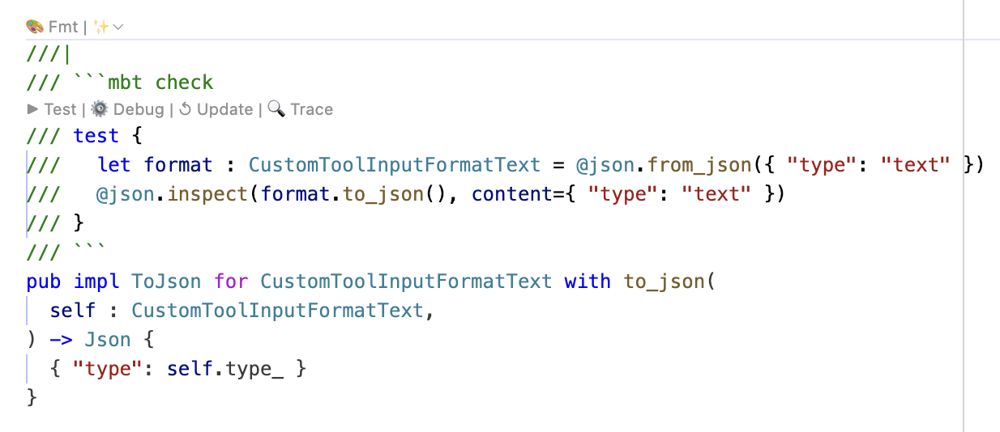

# 20260112 MoonBit Monthly Update Vol.07
Version:v0.7.1

## Language Updates
1. Added warning for unused `async`. This helps clean up unnecessary `async` annotations, improving code readability and maintainability while avoiding potential stack overflow issues.
    ```moonbit
    pub async fn log_debug(msg : String) -> Unit {
      //^^^^^ Warning (unused_async): This `async` annotation is useless.
      println("[DEBUG] \{msg}")
    }
    ```
2. Default value expressions in optional arguments now can raise errors. Optional arguments can now use expressions that may `raise` an error as their default values. Note that the function has to be marked as "can raise error".

    ```moonbit
    pub async fn log_debug(
      msg : String,
      file? : @fs.File = @fs.open("log.txt", mode=WriteOnly, append=true),
    ) -> Unit {
      file.write("[DEBUG] \{msg}\n")
    }
    ```
3. New `#declaration_only` Attribute. Added the `#declaration_only` attribute for functions, methods, and types. This supports spec-driven development, allowing developers to define function signatures and type declarations first and provide implementations later. When used on functions/methods, the body must be filled with `...`.

    Example of a TOML parser declaration:

    ```moonbit
    #declaration_only
    type Toml

    #declaration_only
    pub fn Toml::parse(string : String) -> Toml raise {
      ...
    }

    #declaration_only
    pub fn Toml::to_string(self : Toml) -> String {
      ...
    }
    ```
4. `SourceLoc` now displays relative paths. The display for `SourceLoc` has been migrated to use relative paths.
    ```moonbit
    ///|
    #callsite(autofill(loc))
    fn show_source_loc(loc~ : SourceLoc) -> Unit {
      println(loc)
    }

    ///|
    fn main {
      show_source_loc()
    }
    ```
    Running `moon run` . outputs: `main.mbt:9:3-9:20@username/test`
5. Optimized warnings for array literals. Added warnings for array literals that only undergo specific operations, suggesting `ReadOnlyArray` or `FixedArray` for better compiler optimization.
    ```moonbit
    pub fn f() -> Unit {
      let a = [1, 2, 3]
          ^ --- [E0065] Warning (prefer_readonly_array)
      ignore(a[0])
      let b = [1, 2, 3]
          ^ --- [E0066] Warning (prefer_fixed_array)
      b[0] = 4
    }
    ```
    *Note: These warnings are currently disabled by default. Users must manually enable them by adding warnings `+prefer_readonly_array` and `+prefer_fixed_array` to the `warn-list` in `moon.pkg`.*

6. Pipeline Syntax Improvement
Support for the syntax `e1 |> x => { e2 + x }` has been added. This allows you to simplify the original `e |> then(x => e2 + x) `expression.

7. Support annotating for-loops with loop invariants and reasoning. For example
    ```moonbit
    fn test_loop_invariant_basic() -> Unit {
      for i = 0; i < 10; i = i + 1 {
        println(i)
      } where {
        invariant: i >= 0,
        reasoning: "i starts at 0 and increments by 1 each iteration",
      }
    }
    ```
8. The behavior of inferring `Ref` type through struct literal is deprecated:
    ```moonbit
    let x = { val: 1 } // Previously this will infer the `Ref` type.
                      // This behavior is deprecated and
                      // will be removed in the future
    let x : Ref[_] = { val: 1 } // no problem if type is known
    let x = Ref::{ val: 1 } // no problem if annotated
    let x = Ref::new(1) // you may also use `Ref::new`
                        // instead of struct literal
    ```
## Toolchain Updates
1. Experimental `moon.pkg` Support. We introduced an experimental `moon.pkg` configuration file to replace `moon.pkg.json`. It uses a syntax similar to MoonBit Object Notation, simplifying configuration while remaining easy to read.
  - Compatibility: If a `moon.pkg` file exists in a package, MoonBit will use it as the configuration.
  - Migration: When the environment variable `NEW_MOON_PKG=1` is set, `moon fmt` will automatically migrate old `moon.pkg.json` files to the new format.
  - Features: Supports comments and empty configurations. All options from `moon.pkg.json` are compatible via the `options(...)` declaration.

    Example of the new syntax:
      ```json
      // moon.pkg
      // import package
      import {
        "path/to/package1",
        "path/to/package2" as @alias,
      }

      // import package for black box test
      import "test" {
        "path/to/test_pkg1",
        "path/to/test_pkg2" as @alias,r
      }

      // import package for white box test
      import "wbtest" {
        "path/to/package" as @alias,
      }

      // Compatible with all options from the original moon.pkg.json
      options(
        warnings: "-unused_value-deprecated",
        formatter: {
          ignore: ["file1.mbt", "file2.mbt"]
        },
        // Compatible with old options using "-" in names; double quotes can be used
        "is-main": true,
        "pre-build": [
          {
            "command": "wasmer run xx $input $output",
            "input": "input.mbt",
            "output": "output.moonpkg",
          }
        ],
      )
      ```
2. Improved Workflow for `moon add`. Running `moon add` now automatically executes `moon update` first, streamlining the dependency management process.
2. The refactored `moon` implementation is now enabled by default. Users can manually switch back to the older implementation using `NEW_MOON=0`.
3. Support for Indirect Dependencies. Users can now use methods and `impl` from a package without explicitly importing it in `moon.pkg`, provided it is an indirect dependency.
    ```moonbit
    // @pkgA
    pub(all) struct T(Int)
    pub fn T::f() -> Unit { ... }

    // @pkgB
    pub fn make_t() -> @pkgA.T { ... }

    // @pkgC
    fn main {
      let t = @pkgB.make_t()
      t.f()
    }
    ```
    Previously, `@pkgC` must explicitly import `@pkgA` in its `moon.pkg.json` to use the method `@pkgA.T::f`. With indirect dependency, importing `@pkgA` is no longer required. The import for a package `@pkg` is only necessary when it's used directly as `@pkg.xxx`.
4. `moon fmt` no longer formats output from `prebuild`.

5. `moon check --fmt` now supports detecting unformatted source files.

6. When the target is `js`, `moon's` execution of tests and code is no longer affected by the local `package.json`.

7. The build artifacts directory `target` is moved to `_build`, however we generated a symlink `target` points to `_build` in order to keep backward compatibility.
## Standard and Experimental Library Updates
1. `moonbitlang/async` Changes:
    - Windows Support: Now supports Windows (MSVC only). Most features are implemented except for symbolic links and specific filesystem permissions.

    - Recursive Directory Creation: `@fs.mkdir` now has a `recursive? : Bool = false` parameter.

    - Process Management: Improved `@process.run` cancellation. It now attempts to notify external processes to exit gracefully before forcing termination, always waiting for the process to end before returning.

    - Specific Pipe Types: `@process.read_from_process` and `write_to_process` now return specialized types (`ReadFromProcess`/`WriteToProcess`) instead of generic pipes.

2. The Iter type in `moonbitlang/core` has migrated from internal iterator to external iterator:
    - The signature of `Iter::new` has changed. `Iter::new` has previously been deprecated in https://github.com/moonbitlang/core/pull/3050

    - The external iterator type `Iterator` is merged with `Iter`. There is only one iterator type in `moonbitlang/core` now. If you have implemented the same trait for both `Iter` and `Iterator`, please remove the implementation for `Iterator`

    - The name `Iterator` is now an alias of `Iter` and is deprecated. Similarly, the various `.iterator()` methods of data structures in `moonbitlang/core` are deprecated in favor of `.iter()`

    For most users who do not construct iterators directly, the changes above should be backward-compatible. There is one notable difference in the behavior of iterators, though: previously the `Iter` type can be traversed more than once. Every traversal will recompute every element in the iterator. After migrating to external iterators, `Iter` can be traversed only once. Traversing an iterator more than once is an anti-pattern and should be avoided.

3. Experimental `lexmatch` Enhancements. Added support for POSIX character classes (e.g., `[:digit:]`) in `lexmatch`, while deprecating escape sequences like `\w`, `\d`, and `\s`.
      ```moonbit
      fn main {
        let subject = "1234abcdef"
        lexmatch subject {
          ("[[:digit:]]+" as num, _) => println("\{num}")
          _ => println("no match")
        }
      }
      ```
## IDE Updates
1. Fixed issues where `.mbti` files were not working correctly in the LSP.
2. New `moon ide` command line tools. Refer to https://docs.moonbitlang.com/en/latest/toolchain/moonide/index.html for documentation.
    - `moon ide peek-def`: Find definitions based on location and symbol name.

    ```moonbit
    ///|
    fn main {
      let value = @strconv.parse_int("123") catch {
        error => {
          println("Error parsing integer: \{error}")
          return
        }
      }
      println("Parsed integer: \{value}")
    }
    ```
      Run `moon ide peek-def -loc main.mbt:3 parse_int`, we can see it outputs:
    ```moonbit
    Definition found at file $MOON_HOME/lib/core/strconv/int.mbt
        | }
        |
        | ///|
        | /// Parse a string in the given base (0, 2 to 36), return a Int number or an error.
        | /// If the `~base` argument is 0, the base will be inferred by the prefix.
    140 | pub fn parse_int(str : StringView, base? : Int = 0) -> Int raise StrConvError {
        |        ^^^^^^^^^
        |   let n = parse_int64(str, base~)
        |   if n < INT_MIN.to_int64() || n > INT_MAX.to_int64() {
        |     range_err()
        |   }
        |   n.to_int()
        | }
        |
        | // Check whether the underscores are correct.
        | // Underscores must appear only between digits or between a base prefix and a digit.
        |
        | ///|
        | fn check_underscore(str : StringView) -> Bool {
        |   // skip the sign
        |   let rest = match str {
    ```
    - `moon ide outline`: Lists an overview/outline of a specified package.
    - `moon doc <symbol>` has been migrated to `moon ide doc <symbol>`.
3. Doc tests now support `mbt check`. You can write `test` blocks within doc comments and receive CodeLens support for running, debugging, and updating tests.
