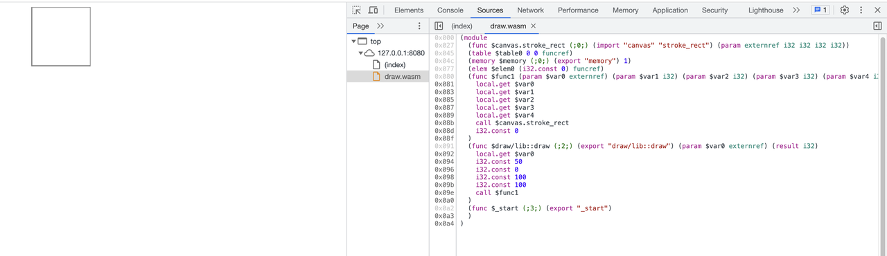
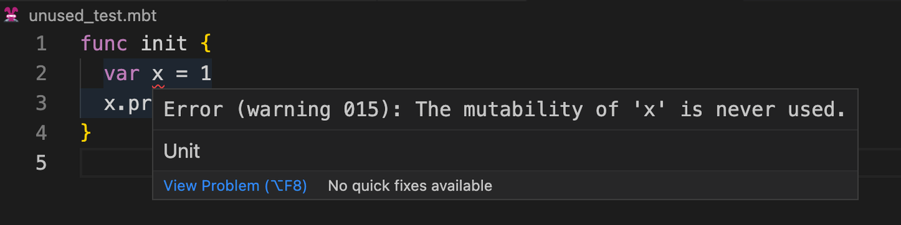
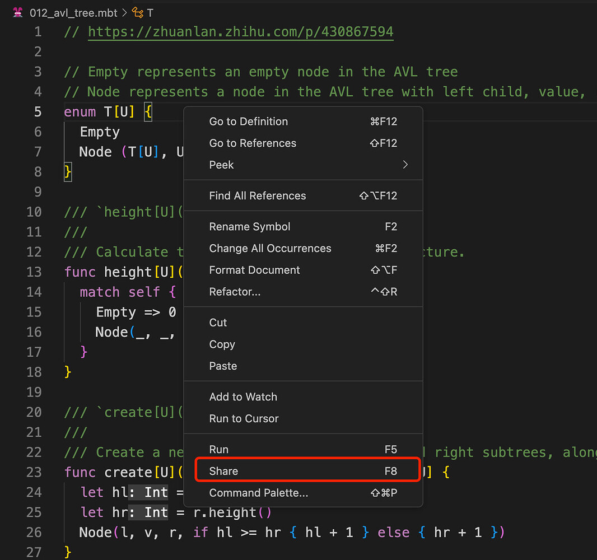
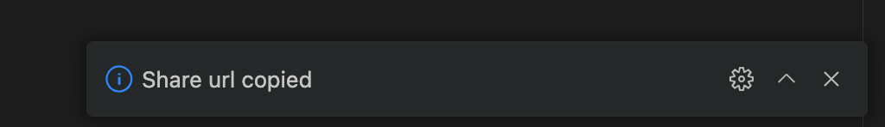

# weekly 2023-08-28

Moonbit was introduced to the public this month, and we received a lot of positive feedback. This post is intended to provide updates on the changes to Moonbit's language and build system over the past week.

<!--truncate-->

# Changes in Moonbit Language

1.  Support for externref

Moonbit has added support for externref, allowing for more interaction with the host language. Now, we can use extern ref to call some Javascript APIs, like Canvas. Let's illustrate how to use this feature with a drawing example:

A. Use `moon new draw` to create a new MoonBit project
B. Add the following code to lib/draw.mbt:

```
type Canvas_ctx

func stroke_rect(self : Canvas_ctx, x : Int, y : Int, width : Int, height : Int) = "canvas" "stroke_rect"

pub func draw(canvas : Canvas_ctx) {
  canvas.stroke_rect(50, 0, 100, 100)
}

```

C. Run `moon build`
D. Execute `wat2wasm` target/build/main/main.wat --output=draw.wasm
E. Create an` index.html` in the same directory as main

```

<html lang="en">
    <body>
    <canvas id="canvas" width="150" height="150"></canvas>
  </body>
  <script>

const spectest = {
    canvas: {
      stroke_rect: (ctx, x, y, width, height) => ctx.strokeRect(x, y, width, height)
    },
  };

const canvas = document.getElementById("canvas");
if (canvas.getContext) {
  const ctx = canvas.getContext("2d");

  WebAssembly.instantiateStreaming(fetch("draw.wasm"), spectest).then(
    (obj) => {
        const draw = obj.instance.exports["draw/lib::draw"];
        draw(ctx);
    }
  )
}

  </script>
</html>

```

F. Run using http-server ./ (or use another method to serve this HTML file)

You can see the following output when you open the browser:



2. Unused mutability detection

Moonbit has added an analysis for` var` variable definitions. When a variable is defined but not used for reassignment, a warning will be triggered. For example:

```
func init {
  var x = 1
  x.print()
}
```

The code above will trigger a warning:


# Changes in MoonBit's build system and IDE

1. Performance optimization for moon run

The new version of the build system has replaced the runtime, resulting in significant performance improvements for complex calculations.

For example, for 015_hamt.mbt in the playground, when the input parameter is 2000, the original moon run needed 10.535 seconds, but now it only needs 0.015 seconds.

2. Web IDE supports code sharing

The online IDE supports sharing the current file via URL. You can trigger this by hitting F8 or right-clicking and selecting Share in the editor.



If the URL is successfully created, a notification will appear in the lower right corner of the webpage:


At this point, the shared URL will be copied to the clipboard, for example:
https://try.moonbitlang.com/#049c7e88a8357df1413d15ea48115b74
