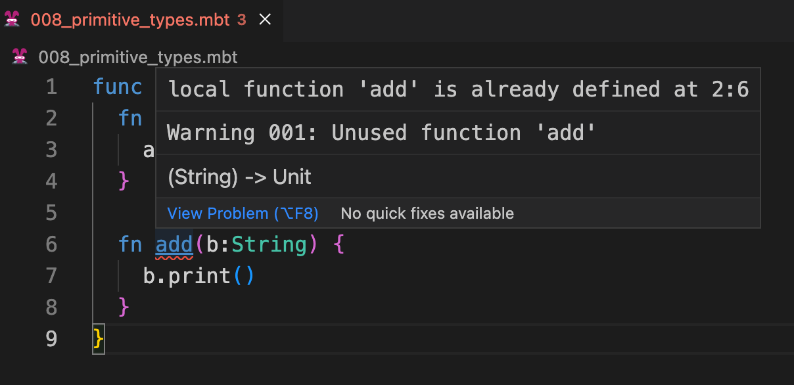
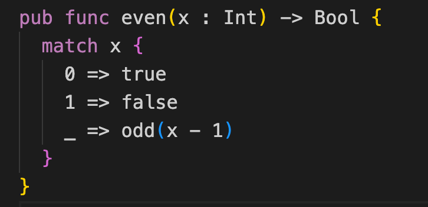
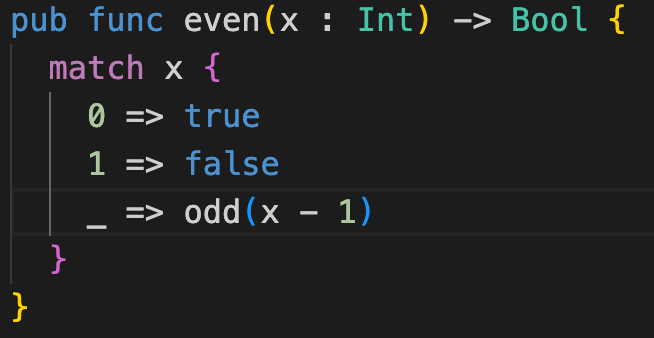
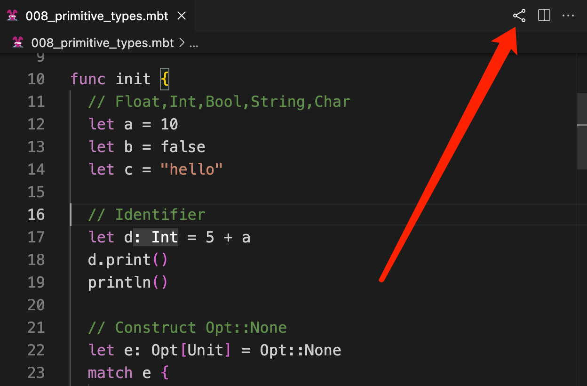
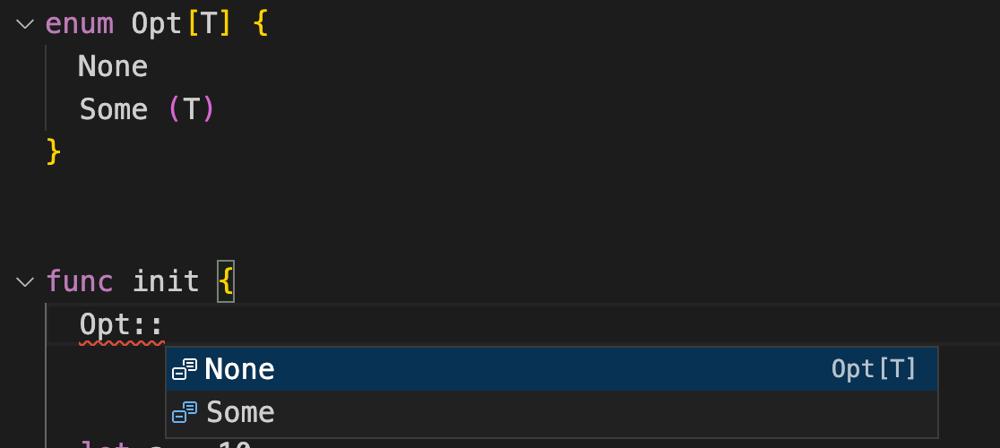

# weekly 2023-09-04

Moonbit was introduced to the public last month, and we received a lot of positive feedback. This post is intended to provide updates on the changes to Moonbit's language and build system over the past week.

<!--truncate-->

## Changes in Moonbit Language

### 1. user-defined interface

Moonbit now allows users to define their own interfaces using the `interface` keyword. For example:

```
interface Number {
  op_add(Self, Self) -> Self
  op_sub(Self, Self) -> Self
  op_mul(Self, Self) -> Self
  op_div(Self, Self) -> Self
  op_neg(Self) -> Self
}

func f[X: Number](x: X, y: X) -> X {
  x * x + (- y / x - y)
}

func init {
  f(1, 2).print()
  f(1.0, 2.0).print()
}
```

The code above defines an interface called `Number`, which abstract over number-like types supporting arithmetic operations. Now the function `f` can operate on _any_ type `X` that implements the five arithmetic operations specified in `Number`. One can call `f` on `Int`, `Float`, or other user-defined number-like types such as vector or matrix.

### 2. Moonbit now supports floating point numbers (floats) in foreign function interfaces (FFI):

```
func sqrt(x: Float) -> Float = "math" "sqrt"
func get_pi() -> Float = "math" "get_pi"

let pi: Float = get_pi()

func init {
  let x = sqrt(9.0)
  x.print()
  pi.print()
}
```

Corresponding functions need to be provided at runtime, such as:

```
#!/usr/bin/env node
const spectest = {
  math: {
    sqrt: (x) => Math.sqrt(x),
    get_pi: () => Math.PI
  },
  spectest: {
    print_i32: (x) => console.log(String(x)),
    print_f64: (x) => console.log(String(x)),
    print_char: (x) => console.log(String.fromCharCode(x)),
  },
};
(async () => {
  WebAssembly.instantiateStreaming(fetch("foo.wasm"), spectest).then(
    (obj) => {
      obj.instance.exports._start()
    }
  )
})();
```

### 3. New Bytes Built-in Type

Moonbit has added a new built-in type `Bytes`, with the following methods:

1)`make`: create Bytes

2)`length`: get Bytes' length

3)Read and write Bytes content through square brackets + subscript numbers

```
func init{
  let bytes : Bytes = Bytes::make(3, 56)
  var i = 0
  bytes[1] = 57;
  bytes[2] = 58;

  let len = bytes.length()
  "length of bytes: \(len)\n".print()


  while i < 3 {
    let b = bytes[i]
    "byte \(i): \(b)\n".print();
    i = i + 1
  }
}
```

### 4. More uniform naming style for built-in functions

Moonbit has removed the previous `string_make` and `array_make` interfaces, migrating to the new `T::method` style:

```
func init{
  let ary = Array::make(4,3) // [3,3,3,3]
  let str = String::make(4,'s') // "ssss"
}
```

### 5. Changes to Local Function Naming Logic

Moonbit has changed the logic for local functions, and they are now not allowed to have the same name. For example, this code will prompt that the function has already been defined:

```
func init {
  fn add(a:Int) -> Int {
    a + 1
  }

  fn add(b:String) {
    b.print()
  }
}
```



## Changes in MoonBit's IDE

### 1. Improved Moonbit Code Highlighting Mechanism

The highlighting of the current token is now more user-friendly.

Before optimization:



After optimization:



### 2. Enhanced Code Sharing Interaction

There's a new sharing icon added at the top right of the editor:



### 3. IDE Added Auto-Completion for :: Syntax

The IDE has now added auto-completion for the `::` syntax.


