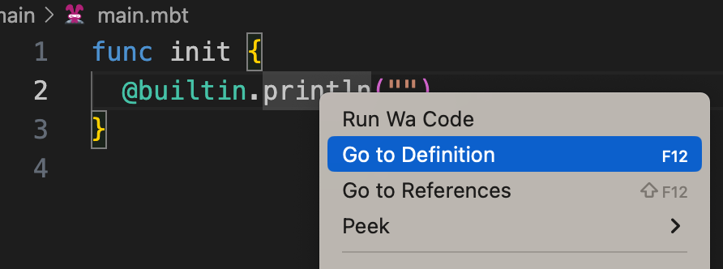

# weekly 2023-09-11

Moonbit was introduced to the public last month, and we received a lot of positive feedback. This post is intended to provide updates on the changes to Moonbit's language and build system over the past week.

<!--truncate-->

# Changes in Moonbit Language

## 1. Added built-in function `println[T : Show](input : T)`

Any type that has implemented the `to_string` method can be output by `println`, for example:

```
enum Tree[T]{
  Node(Tree[T],Tree[T])
  Leaf(T)
}

func to_string[T : Show](self : Tree[T]) -> String {
  match self {
    Node(l,r) => "Tree(\(l), \(r))"
    Leaf(v) => "Leaf(\(v))"
  }
}

func init {
  let tree = Tree::Node(Leaf(1),Node(Leaf(2),Leaf(3)))
  println(tree)
}
```

The above program outputs:

```
Tree(Leaf(1), Tree(Leaf(2), Leaf(3)))
```

# Changes in MoonBit's IDE

## 1. IDE supports jumping to the source code of the built-in function definition

```
func init {
  @builtin.println("")
}
```

For instance, the above code that calls the built-in function can jump to the function definition in the IDE.



Result:


## 2. VS Code extension supports auto-completion of packages within the project

The latest VS Code extension supports auto-completion of packages within the project. Users only need to input `@` on the keyboard to display the package list. After selecting the package to import, the corresponding `moon.pkg` will be automatically updated. For example:


## 3. Hover Highlighting

When the mouse hovers over the code, the type definition shown now supports highlighting.


## 4. Hover displays custom types

The latest IDE can show the code type definition by hovering the mouse over a custom type.


## 5. Only code that has passed checks can trigger compilation

Now, only the code that has passed syntax checks and type checks can trigger compilation and execution, such as:

```
func init {
  a.print()
}
```

Executing Run on the above code will show the following prompt:


