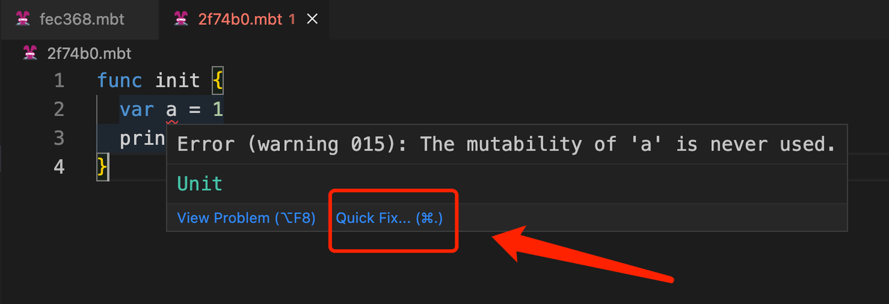
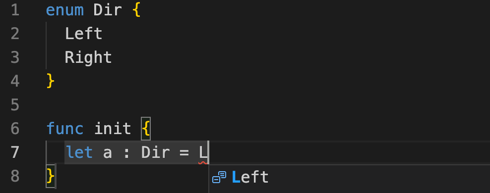

# weekly 2023-09-18

Moonbit was introduced to the public last month, and we received a lot of positive feedback. This post is intended to provide updates on the changes to Moonbit's language and build system over the past week.

<!--truncate-->

## Changes in Moonbit Language

### 1. Int64 built-in type support

Moonbit has added the Int64 built-in type. Integers of the Int64 type must have an 'L' as a suffix, for example:

```
func init {
  let a = 9_223_372_036_854_775_807L
  print(a)
}
```

The above program outputs:

```
9223372036854775807
```

### 2. Built-in method print[T : Show](t : T) change

Removal of the Built-in Method t.print(), Replaced with Function print[T : Show](t : T), and any type that has implemented the to_string method can be printed out, for example:

```
enum Tree[T]{
  Node(Tree[T],Tree[T])
  Leaf(T)
}

func to_string[T : Show](self : Tree[T]) -> String {
  match self {
    Node(l,r) => "Tree(\(l), \(r))"
    Leaf(v) => "Leaf(\(v))"
  }
}

func init {
  let tree = Tree::Node(Leaf(1),Node(Leaf(2),Leaf(3)))
  // tree.print() // old method
  print(tree) // new method
}
```

The above program outputs:

```
Tree(Leaf(1), Tree(Leaf(2), Leaf(3)))
```

### 3. Built-in to_string method for bool type

Now bool type data can be directly printed via print and println, for example:

```
func init {
  println(false)
  print(true)
}
```

Output:

```
false
true
```

## Changes in MoonBit's IDE

### 1. Quick Fix Support for Unused Mutable Variables

If a var variable is defined and its content is not modified in the subsequent code, the IDE can provide a Quick Fix function.

For instance, with the following code:

```
func init {
  var a = 1
  print(a)
}
```



When we click Quick Fix, the code can be automatically fixed to:

```
func init {
  let a = 1
  print(a)
}
```

### 2. Auto-completion adds support for enum constructors

For instance, with an enum-defined type like this:q

```
enum Dir {
  Left
  Right
}
```

When we type L in the init function, the custom-defined Left will appear in auto-completion.


