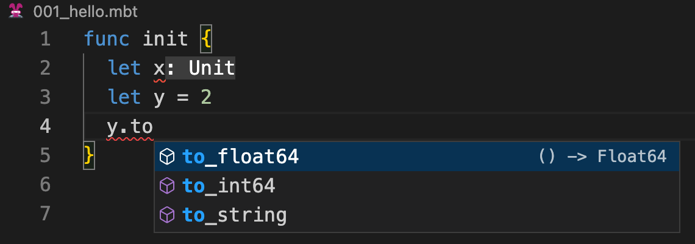
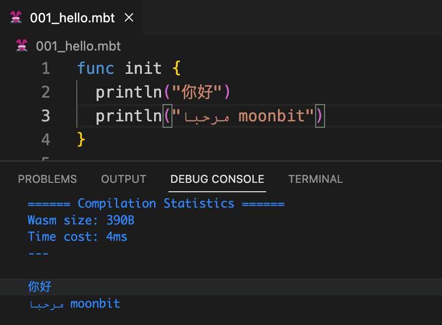

# weekly 2023-10-09

In August 2023, MoonBit underwent Alpha testing. This post aims to introduce recent updates to MoonBit's language and toolchain, along with applications developed using MoonBit.

<!--truncate-->

## Changes in MoonBit Language

### 1. MoonBit Introduces a new handwriting Syntax Parser

MoonBit introduces a new handwriting syntax parser which brings better error recovery. For example, in the case below, even if an error is prompted due to x not being assigned, it will not affect the automatic completion function of y in the following two lines of code.



## 2. MoonBit Standard Library in Development

To facilitate users in developing larger scale projects, MoonBit is currently developing a standard library, which is expected to be merged in the near future.

The first batch of the externally available standard library is expected to include the following containers: Stack, Queue, Deque, and Heap.

**Stack**

```
func init {
  let stack = Stack::make()
  repeat(5, fn(i) { stack.push(i + 1) })
  while stack.is_empty().not() {
    print(stack.peek())
    stack.pop()
  }
  print('\n')
}
```

Output：54321

**Queue**

```
func init {
  let queue = Queue::make()
  repeat(5, fn(i) { queue.push(i + 1) })
  while queue.is_empty().not() {
    print(queue.peek())
    queue.pop()
  }
  print('\n')
}
```

Output：12345

**Heap**

```
func init {
  let heap = MinHeap::make()
  heap.push(3)
  heap.push(1)
  heap.push(4)
  heap.push(2)
  heap.push(5)
  while heap.is_empty().not() {
    print(heap.peek())
    heap.pop()
  }
  print('\n')
}
```

Output：12345

### 3. Integration with the forthcoming Wasm GC proposal

The Wasm GC standard implementation is progressing rapidly and is expected to be shipped soon.

## Changes in MoonBit's IDE

### 1. IDE supports utf8 string output

MoonBit IDE supports utf8 string print output, for example:

```
func init {
  println("你好")
  println("مرحبا moonbit")
}
```

The results are as follows:


