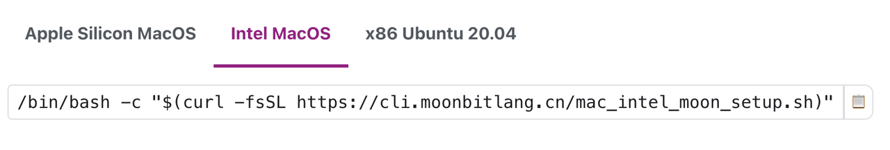

# weekly 2023-10-23

In October 2023, MoonBit underwent Alpha testing. This post aims to introduce recent updates to MoonBit's language and toolchain, along with applications developed using MoonBit.

<!--truncate-->

## Changes in MoonBit Language

### 1. According to community feedback, the keyword for top-level functions has been changed from `func` to `fn`, unifying it with local functions. This change also helps to prevent unnecessary confusion for developers

Before:

```
func fib(num : Int) -> Int {
  fn aux(n, acc1, acc2) {
    match n {
      0 => acc1
      1 => acc2
      _ => aux(n - 1, acc2, acc1 + acc2)
    }
  }
  aux(num, 0, 1)
}

func init {
  println(fib(46))
}
```

After:

```
fn fib(num : Int) -> Int {
  fn aux(n, acc1, acc2) {
    match n {
      0 => acc1
      1 => acc2
      _ => aux(n - 1, acc2, acc1 + acc2)
    }
  }
  aux(num, 0, 1)
}

fn init {
  println(fib(46))
}
```

### 2. Based on feedback from the community, the `Float64` type name has been changed to `Double`

Before

```
let pi : Float64 = 3.14
```

After

```
let pi : Double = 3.14
```

3. The MoonBit's toolchain download for Intel-based Mac is now supported. https://www.moonbitlang.com/download/



Additionally, support for Windows is expected to be available by the next few weeks.

## Build System

### 1. `moon.pkg` and `moon.mod` have been changed to JSON format

`moon.pkg` and `moon.mod` have been changed to JSON format `moon.pkg.json` and `moon.mod.json`. The transition from a custom format to JSON is due to the rapid evolution of toolchains. Using JSON reduces maintenance overhead and simplifies integration with other tools, making it a more efficient choice as the toolchain continues to evolve quickly.

#### Before

moon.mod

```
module hello
```

#### After

moon.mod.json

```
{
  "name": "hello"
}
```

#### Before

moon.pkg

```
package main

import "hello/lib"
```

#### After

moon.pkg.json

```
{
  "name": "main",
  "import": {
    "hello/lib": ""
  }
}
```
