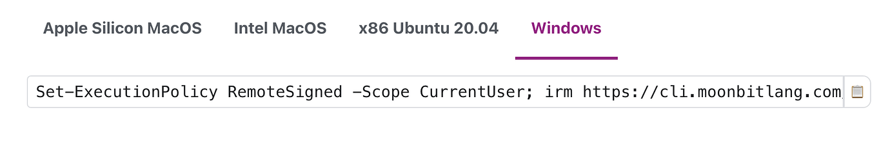

# weekly 2023-10-30

In October 2023, MoonBit underwent Alpha testing. This post aims to introduce recent updates to MoonBit's language and toolchain, along with applications developed using MoonBit.

<!--truncate-->

## Changes in MoonBit Language

### 1. Added `Js_string` type, enabling the transfer of strings from MoonBit to the JavaScript host environment.

For example, the following program will print "Hello, Js_string!" to the console.

```
fn init {
  let x = Js_string::new("Hello, ")
  let y = Js_string::new("Js_string!")
  let z = x + y
  z.log()
}
```

The Moonbit/JS string interoperability relies on FFI and customized JS runtime support. Our online playground will provide a template of the JS runtime with the FFI used by Moonbit, and allow users to customize the JS runtime.

### 2. Double now supports the to_string method

`Double` now supports the `to_string` method, allowing direct printing of floating-point numbers using println.

```
fn init {
  println(3.14)
}
```

### 3. Unboxing optimization has been applied to structs with only one immutable field.

For example, in the following code, the struct `x`, which originally required memory allocation on the heap, is replaced with a single` i32` integer through optimization. This avoids the memory allocation of the struct and the overhead of accessing struct fields.

```
struct X {
  val: Int
}

fn init {
  let x : X = { val : 42 }
  println(x.val)
}
```

## Build System

### 1. moon build now defaults to outputting the WebAssembly binary format.

`moon build` now defaults to outputting the WebAssembly binary format and no longer relies on external tools like `wat2wasm` for conversion. It also provides the -`-output-wat` option for generating the wat format.

### 2. The MoonBit's toolchain download for Intel-based Windows is now supported.

The download link is here: https://www.moonbitlang.com/download/

