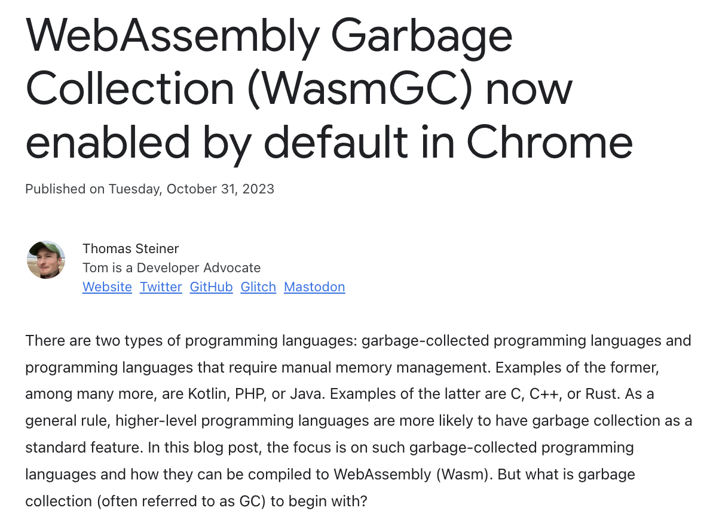
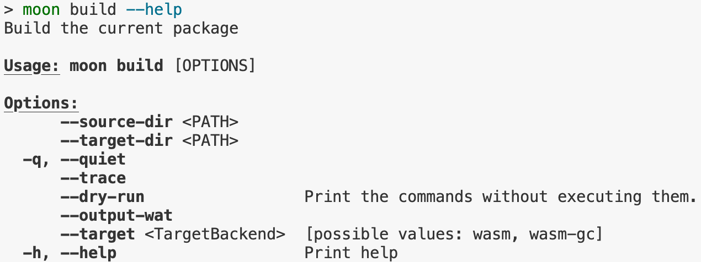
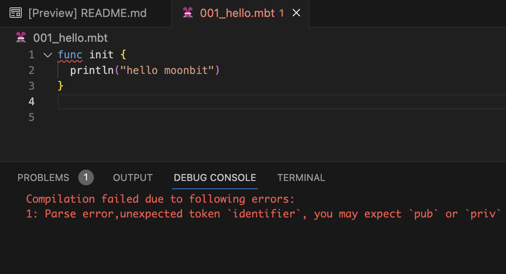

# weekly 2023-11-06

In November 2023, MoonBit underwent Alpha testing. This post aims to introduce recent updates to MoonBit's language and toolchain, along with applications developed using MoonBit.

<!--truncate-->

## WasmGC

### 1. WasmGC is now supported

WebAssembly Garbage Collection (WasmGC) is now enabled by default in Chrome（details can be found in the official announcement: https://developer.chrome.com/blog/wasmgc/), and we have provided our support at the first opportunity.

### 2. Added `moon build --target wasm-gc` build option

Added `moon build --target wasm-gc` build option to generate instruction that conforms to the Wasm GC standard.

Wasm tutorial link:https://github.com/moonbitlang/moonbit-docs/tree/main/examples/wasm-gc

## Debugger

We are making progress on source debugging support. Currently, we support source mapping and setting breakpoints based on the source code. The next step will be to support inspecting local and global variables. Once this is completed, you can try it out and experience it firsthand. Stay tuned! 😚

## Changes in MoonBit Language

Removed the `func` keyword, now only `fn` can be used to declare functions.

## Build System

The command `moon check --daemon` used to start the code checking daemon supports Windows.
