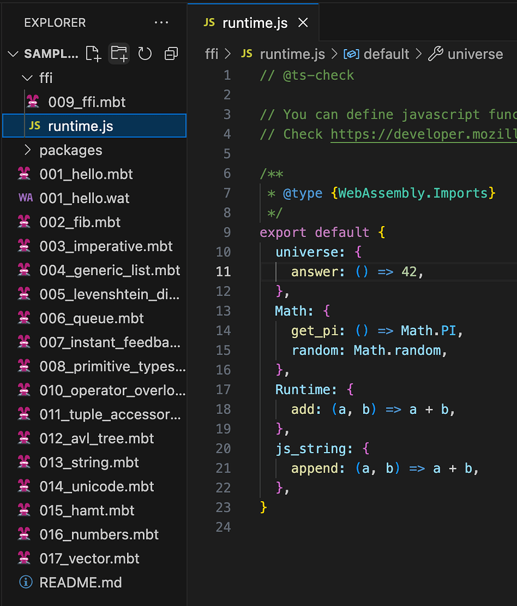
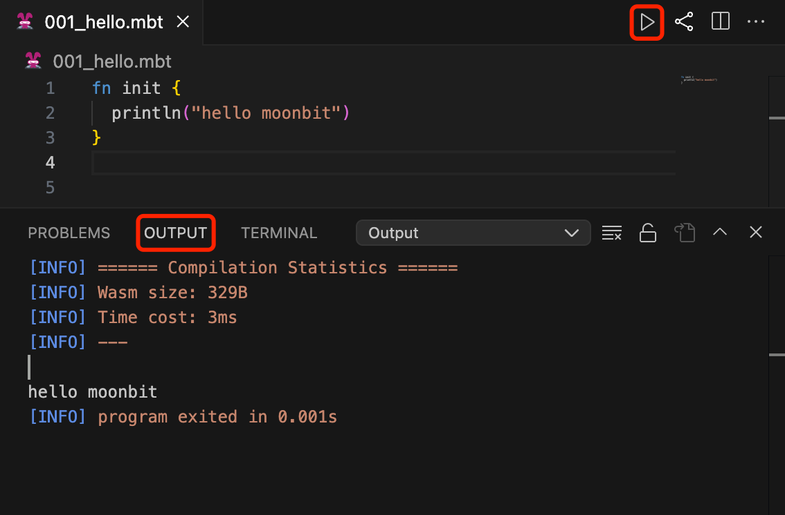
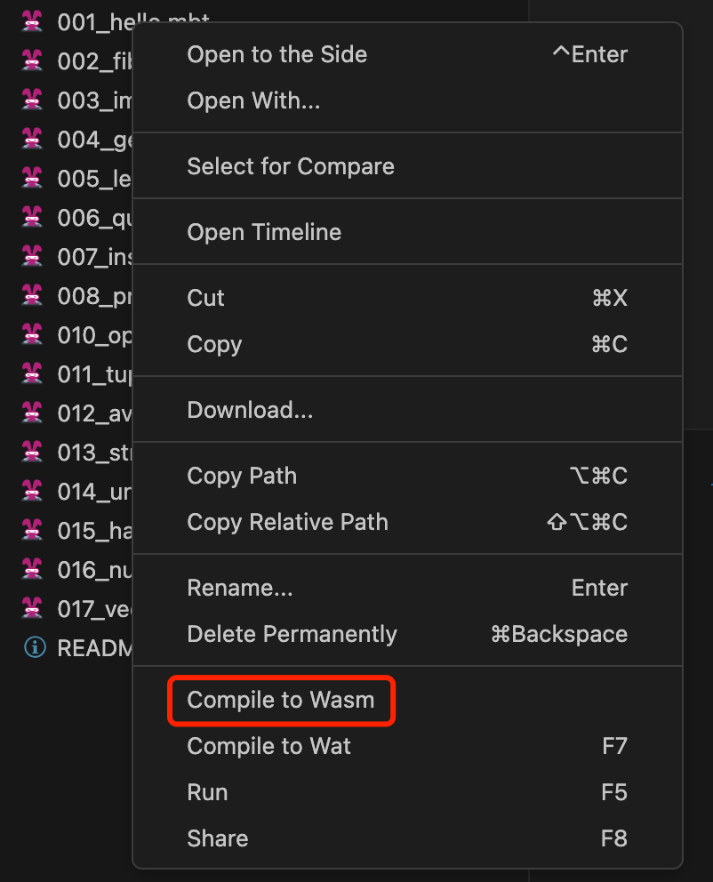

# weekly 2023-11-13

In November 2023, MoonBit underwent Alpha testing. This post aims to introduce recent updates to MoonBit's language and toolchain, along with applications developed using MoonBit.

<!--truncate-->

## Changes in MoonBit Language

### 1. Performance improvement

- Tokenization performance is improved around 25%.

- Builtin comparison is inlined in an early stage which could have a large impact over a hotloop.

### 2. Syntax improvement

`x := expr` is discouraged in favor of the uniform `let x = expr` per the user feedback, the former grammer may be removed in the future.

### 3. Method calls on integers now require parentheses.

Before: `1.to_string()`

After: `(1).to_string()`

### 4. Primitive types now support the `hash` method

Primitive types `Bool`, `Char`, `Int`, `Int64`, `Double`, `String` now support the `hash` method.

Example:

```
fn init {
  println("test".hash())
}

// Output: 1042293711
```

### 5. Removed the built-in type Result、print_float64

- Removed the built-in type `Result`. This type will be provided in the standard library in the future.
- Removed `print_float64` FFI. This function has been replaced by the`println`function.

## IDE

### 1. Support for users to customize runtime using JavaScript in the IDE

The IDE now supports users to customize runtime using JavaScript. For usage examples, please refer to the `ffi` folder at [https://try.moonbitlang.com](https://try.moonbitlang.cn/).



### 2. Added a run button in the IDE

Added a run button in the IDE and changed the display of printed content from the Debug Console (DEBUG CONSOLE) to the Output Channel (OUTPUT).



### 3. Improved package support in the IDE

Previously, users could only run a package from a`moon.pkg.json`file in that package. Now, any`.mbt`file within a package can be used to run the package.

### 4.Added an option in the IDE to compile directly to wasm



## Build System

- Added `moon build --debug` option for adding debug information to the build output.

- Adjusted the output directory of`moon build`. Now, depending on the build target and whether debug mode (`--debug`) is enabled, the output path of the build product is set to `target/<arch>/<mode>`.

| Command                               | Output directory         |
| ------------------------------------- | ------------------------ |
| `moon build`                          | `target/wasm/release`    |
| `moon build --debug`                  | `target/wasm/debug`      |
| `moon build --target wasm-gc`         | `target/wasm-gc/release` |
| `moon build --target wasm-gc --debug` | `target/wasm-gc/debug`   |
