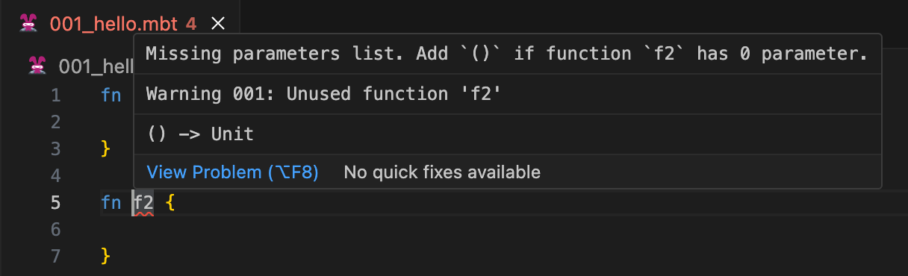
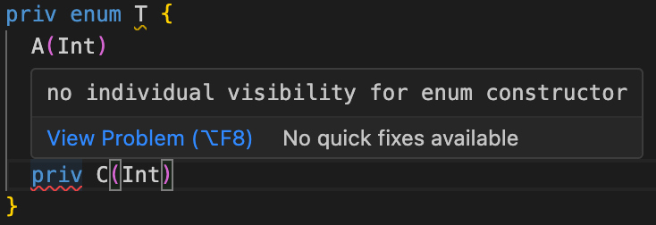

# weekly 2023-11-20

In November 2023, MoonBit underwent Alpha testing. This post aims to introduce recent updates to MoonBit's language and toolchain, along with applications developed using MoonBit.

<!--truncate-->

## Changes in MoonBit Language

- Optimized the compilation process for top-level functions without indirect calls, resulting in approximately a 14% improvement in compilation performance.

- Enhanced error recovery and reporting in the parser:

  - Fixed the issue where top-level function declarations without parameters, such as `fn f2 {}`, were allowed to compile without parentheses. Now, this will result in an error:



- Code that attempts to set visibility for individual constructors of an enum type will now result in an error:

```
priv enum T {
  A(Int)
  pub B(Int)
  priv C(Int)
}
```



- Fixed issues in dead code analysis where unused types or fields were incorrectly reported as unused.
