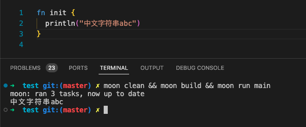
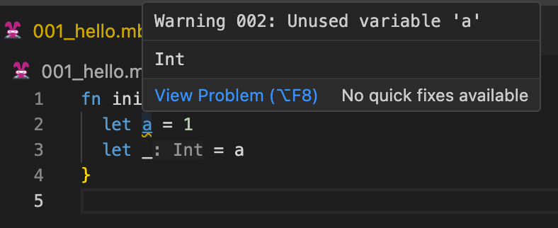
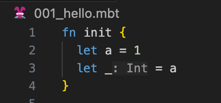
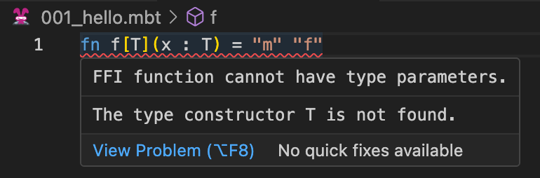

# weekly 2023-11-27

In November 2023, MoonBit underwent Alpha testing. This post aims to introduce recent updates to MoonBit's language and toolchain, along with applications developed using MoonBit.

<!--truncate-->

## Changes in MoonBit Language

### 1. Support for deriving `Eq`, `Compare`, `Show`, and `Default` in `struct` and `enum`.

```
struct T {
  x: Int
  y: Int
} derive(Eq, Show, Compare, Default)

fn init {
  let t0 = T::default()
  let t1 = { x : 1, y : 1 }
  println(t0)
  println(t1)
  println(t0 < t1)
  println(t0 == t1)
}

// {x: 0, y: 0}
// {x: 1, y: 1}
// true
// false
```

Related documentation link: https://www.moonbitlang.com/docs/syntax#automatically-derive-builtin-interface

### 2. Command-line tool supports printing UTF-8 strings.



### 3. Allow the use of `_` to ignore unused variable warnings.

Before



After



### 4. More user-friendly error messages

More user-friendly error messages: attempting to give FFI declarations type parameters will result in an error.



### 5. MoonBit Gallery added Mario Game

Last week, the MoonBit Gallery added a Mario game where, in a real-time programming environment, you can flexibly adjust Mario's jumping height, create multiple Mario characters. Additionally, you can dynamically change the game's ending logic, offering a whole new gaming experience. Here's the link to the game： [MoonBit Gallery | MoonBit (moonbitlang.com)](https://www.moonbitlang.com/gallery/), come and try it out!
