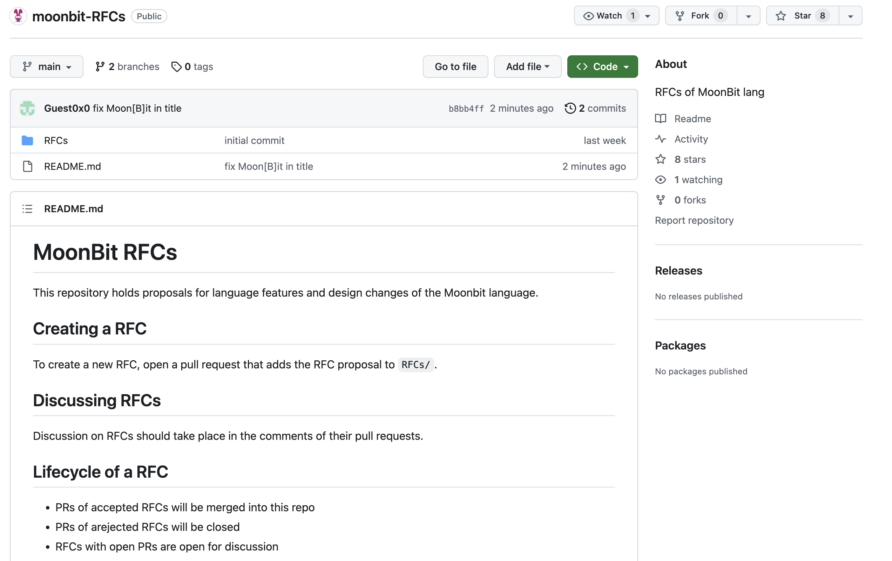

# weekly 2023-12-04

In December 2023, MoonBit underwent Alpha testing. This post aims to introduce recent updates to MoonBit's language and toolchain, along with applications developed using MoonBit.

<!--truncate-->

## Changes in MoonBit Language

### 1. MoonBit Debugger is now available for use

Use the build command `moon build --debug --target wasm-gc` to support outputting sourcemap, which can be used for source debugging in browser. For specific usage, please refer to the example at https://github.com/moonbit/moonbit-debugging-example.git.

### 2. Optimized layout for enum data types with only constant constructors

For instance, in the following code, the optimization will now represent `A` and `B` directly as integers `0` and `1`, eliminating the need for boxing and unboxing operations.

```moonbit
enum T {
  A
  B
}

fn init {
  let t = T::A
  match t {
    A => println(0)
    B => println(1)
  }
}
```

### 3. Reference types are non-nullable at function boundaries

This paves the way for a stable ABI for the builtin data types, such as String, Array, etc.

## Build System

Removed the `name` field in `moon.pkg.json`. The entry point is no longer identified by `"name": "main"`, but explicitly using `"is_main": true` instead.

## Community

We've launched a new process for modifying MoonBit language features, the GitHub link is here: https://github.com/moonbitlang/moonbit-RFCs.


This will be the hub for all our language feature ideas.Plus, we welcome anyone passionate about language features to contribute.
