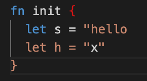
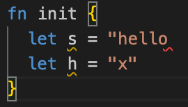

# weekly 2023-12-11

In December 2023, MoonBit underwent Alpha testing. This post aims to introduce recent updates to MoonBit's language and toolchain, along with applications developed using MoonBit.


<!--truncate-->

## Changes in MoonBit Language

Here's the translation of the release notes into English:

### 1. Support for defining newtype using the `type` keyword:

```
type MyInt Int derive(Show)

fn init {
  let x = MyInt::MyInt(5)
  println(x) // Output: MyInt(5)
  println(x.0) // Output: 5
}
```

### 2. Support for inline Wasm functions, for example:

```
fn char_to_string(c: Char) -> String =
   "(func $char_to_string (param $c i32) (result (ref $moonbit.string)) (array.new $moonbit.string (local.get $c) (i32.const 1)))"
```

For now, inline Wasm functions are only supported for the wasm-gc backend.

### 3. Improved automatic semicolon insertion.

Chained method call in the following style is now supported:

```
fn init {
  receiver
    .method1()
    .method2()
    .method3()
}
```

and there is no need for trailing comma in multi-line application and record creation anymore:

```
fn init {
  let record = {
    x: 1,
    y: "abc" // before: must add comma here
  }
  function(
    arg1,
    arg2 // before: must add comma here
  )
}
```

### 4. String interpolation now supports unicode

```
let s = "string interpolate unicode \( 中文 )"
```

### 5. Optimized string highlighting.

- Before:
  

- After:
  

### 6. Built-in type improvements:

- String:

  - Added `String::make`:

```
fn init {
  let s = String::make(3, 'a')
  println(s) // Output: aaa
}
```

- Fixed `String::compare`. Before, `String::compare` only compared lengths; now, it compares in dictionary order.
- Bytes and Buffer:

  - Added Bytes-related functions: `blit`, `to_string`, `of_string`, `sub_string`, `blit_from_string`, `copy`, `set_utf8_char`.

  - Introduced Buffer type and related functions: `to_string`, `make`, `write_string`, `write_char`, `length`.

- `Option` now includes default implementations for `Eq/Compare/Show/Default`, and `Ref/Array` includes a default implementation for `Show`.
