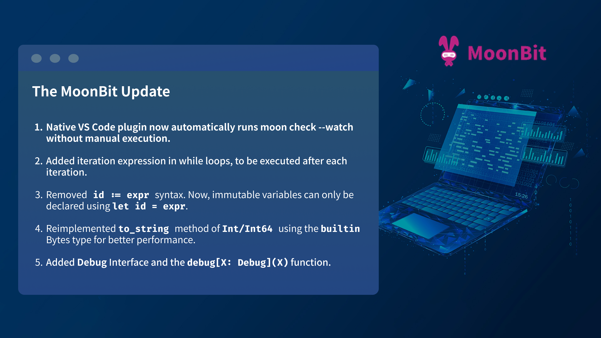
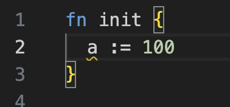
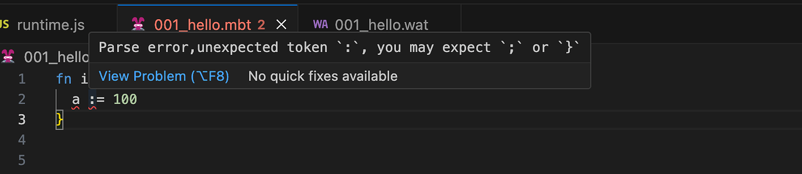
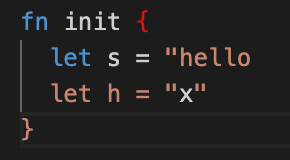
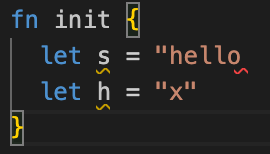

# weekly 2023-12-18

In December 2023, MoonBit underwent Alpha testing. This post aims to introduce recent updates to MoonBit’s language and toolchain, along with applications developed using MoonBit.



<!--truncate-->

## MoonBit Update

### 1. Added Debug Interface

```moonbit
interface Debug {
  debug_write(Self, Buffer)
}
```

Added Debug Interface and the `debug[X: Debug](X)` function. The Debug interface has been implemented for built-in types and can be derived automatically for user-defined types. Compared to the previous `Show` interface, `Debug` has better performance, and would correctly add double quotes around values of type `String`. Users are encouraged to replace `Show` with `Debug` and `println` with `debug` for debugging purpose. `Show` and `println` may get deprecated or receive breaking change in the future.

Example usage of `Debug`:

```moonbit
struct T[X] {
  s: String
  x: X
} derive (Debug)

fn init {
  let t = { s : "hello", x: "world" }
  debug(t) // Output: {s: "hello", x: "world"}
}
```

### 2. Added iteration expression in `while` loops, to be executed after each iteration

```moonbit
var i = 0
while i < len, i = i + 1 {
  do_something_with(i)
}
```

The example above is roughly equivalent to:

```moonbit
var i = 0
while i < len {
  do_something_with(i)
  i = i + 1
}
```

However, `continue`statements will not skip the iteration expression, which makes it very handy to write `for`-like loops. For example, the following program will do something on all odd numbers smaller than `10`, instead of looping forever:

```moonbit
var i = 0
while i < 10, i = i + 1 {
  if i % 2 == 0 {
    continue
  }
  do_something_with(i)
}
```

### 3. Removed `id := expr` syntax

Now, immutable variables can only be declared using `let id = expr`.

Before:


After:


### 4. Reimplemented high-performance `to_string` method

Reimplemented high-performance `to_string` method of `Int/Int64` using the built-in `Bytes` type.

### 5. Added `String::default`

```moonbit
fn init {
  let s = String::default()
  debug(s) // Output: ""
}
```

IDE Updates

### 1. Native VS Code plugin now automatically runs `moon check --watch` without manual execution

### 2. Added hints for methods

Before:



After:



### 3. Improved many type error messages.
