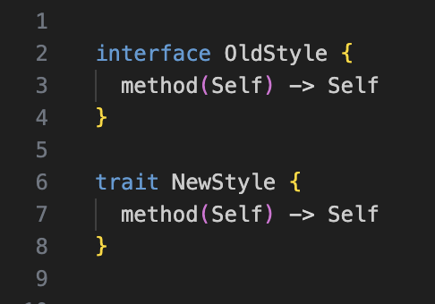

# weekly 2023-12-25
## MoonBit Update

### 01. Added built-in type `Result`

```moonbit
enum Result[T, E] {
  Ok(T)
  Err(E)
}
```

### 02. Added the question mark operator

A new question mark operator has been introduced to simplify error handling:

```moonbit
fn may_fail() -> Option[Int] { ... }

fn compose_may_fail() -> Option[String] {
  let x = may_fail()?
  let y = may_fail()?.lsr(3)
  Some ((x + y).to_string())
}
```

The semantics of the question mark operator are: if `t` in `t?` results in `None`, then `t?` is equivalent to `return None` (exiting the current function). If `t?` results in `Some(x)`, then `t?` is equivalent to `x`. Besides `Option` type, the question mark operator can also be used with `Result` type:

```moonbit
fn may_error() -> Result[Int, String] { ... }

fn compose_may_error() -> Result[Int, String] {
  let x = may_error()?
  let y = may_error()?
  if y == 0 {
    return Err("divide by zero")
  }
  Ok (x / y)
}
```

### 03. The keyword `interface` has been changed to `trait`

Based on community feedback, the keyword `interface` has been changed to `trait`, and the `interface` keyword is temporarily retained.


### 04. Modified the logic for dead code elimination

Top-level `let` statements not used are always considered removable, regardless of side effects. For example,

```moonbit
let a = 1       // will be removed
let b: T = f(a) // will be removed
fn init {
  ..            // a and b are not used
}
```

If the function `f` has side-effects, move it to `fn init { .. }` to prevent it from being removed.

### 05. Fixed issues where the code formatting tool did not correctly handle Chinese comments.

### 06. Fixed issues with handling Chinese global identifiers.

## IDE Update

### 01. Added an option to control whether `moon check` starts automatically.

VSCode users can use `moonbit.autoMoonCheck.enable` in `settings.json` to control whether `moon check` starts automatically. Or, you can search "moonbit:" in the settings.


### 02. Fixed a bug where `derive(Show)` incorrectly reported errors.

Before the fix:


After the fix:


## Build System Update

### 01. Added the `moon doc` command for generating and previewing documentation.

`moon doc --serve` will create documentation based on markdown comments in the code and launch a web server locally. Accessing the provided link allows you to view the results.


