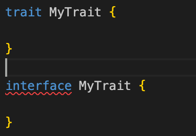
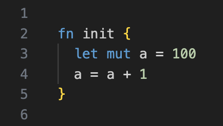
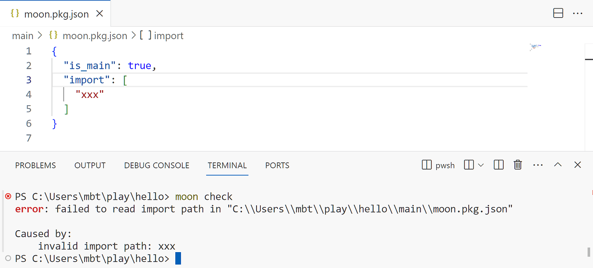

# weekly 2024-01-08
## MoonBit Update

- Now we have removed the `interface` keyword officially, replacing it with `trait`.
  
- Based on community feedback, we've introduced the syntax `let mu` `t` ` id = expr` to replace `var id = expr`. Support for `var id = expr` will be removed next week.
  

- Added `Default` implementation for the `Array` type:

```
fn init {
  debug(Array::default()) // []
}
```

- Added `Default`, `Eq`, and `Debug` implementations for the `List` type:

```
fn init {
  let l1: List[_] = Cons(1, Cons(2, Cons(3, List::default())))
  let l2: List[_] = Cons(1, Cons(2, Cons(4, Nil)))
  debug(l1) // Cons(1, Cons(2, Cons(3, Nil)))
  debug(l1 == l2) // false
  debug(l2 == l2) // true
}
```

- Fixed type checking for public function bodies. For example:

```
priv type T
pub fn f() {
  let t: T = ... // public definition cannot depend on private type
      ...
}
```

This used to cause an error in T, it will no longer result in such an issue.

## Plugin Update

- We've integrated the MoonBit AI, now available at [https://ai.moonbitlang.com](https://ai.moonbitlang.com/), feel free to try it.

- Resolved several issues to enhance the stability of the LSP, preventing unexpected crashes.

## Build System Update

- Fixed an issue where `moon test` would test packages in the `.mooncakes` folder.

- Deprecated `moon check --daemon`.

- Improved error messages for incorrect format or content in `moon.pkg.json`.


