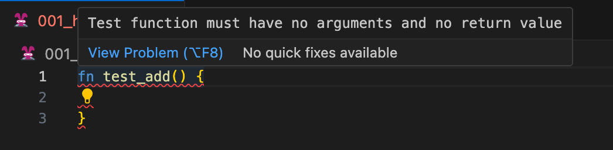
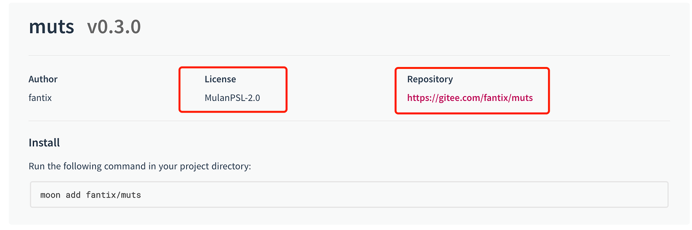

# weekly 2024-01-15
## MoonBit Update

- Relaxed the syntax on the right-hand side of `match`, allowing the appearance of single statements. The following syntax is now permitted:

```
match x {
  A => return
  B => return 1
  C => i = i + 1
  D => break
  E => continue
  F => while true {}
}
```

- Fix various bugs in the formatter, and resolve issues with missing curly braces and parentheses in the code after formatting. For example:
<table>
<tr>
<td> Original Code </td> <td> Before Fix </td> <td> After Fix </td>
</tr>
<tr>
<td>

```moonbit
fn init {
  let mut a = 1
  {
    {
      let a = 2
      f(a)
    }
    let a = 3
    f(a)
    {
      let a = 4
      f(a)
    }
  }
  f(a)
}
```

</td>
<td>

```moonbit
fn init {
  let mut a = 1
  let a = 2
  f(a)
  let a = 3
  f(a)
  let a = 4
  f(a)
  f(a)
}
```

</td>

<td>

```moonbit
fn init {
  let mut a = 1
  {
    {
      let a = 2
      f(a)
    }
    let a = 3
    f(a)
    let a = 4
    f(a)
  }
  f(a)
}
```

</td>
</tr>
</table>

- Added a new experimental inline testing mechanism. The declaration format is `fn test_*`. Inline tests need to be declared in regular `.mbt` files (instead of `_test.mbt`). They must not have any parameters or return types. For example, the following usage will result in an error:


Now, `moon test` will not only execute each test file ending with `_test.mbt` in every package, but also perform inline tests within each package.

## Plugin Updates

- Fixed bugs related to `newtype goto definition` and `rename`.

## Build System Updates

- `moon new` now adds default values for various options, allowing users to select default values by pressing Enter.

```
$ moon new
Enter the path to create the project (. for current directory) [default: myproject] >
Enter the create mode (exec or lib) [default: exec] >
Enter your username [default: username] >
Enter the package name [default: hello] >
Enter your license [default: Apache-2.0] >
Created my-project

```

- `moon.mod.json` now includes `license` and `repository` fields. `license` indicates the license used by the [mooncakes.io](http://mooncakes.io), which must comply with the SPDX standard.



- Removed `moon check --daemon`.
- `moon publish` now includes an upload size limit, the upload size must be less than 16 MiB.

## Other

- On the Windows platform, the installation path has been changed from `~/.moon` to `~/.moon/bin`, bringing it in line with other platforms.
