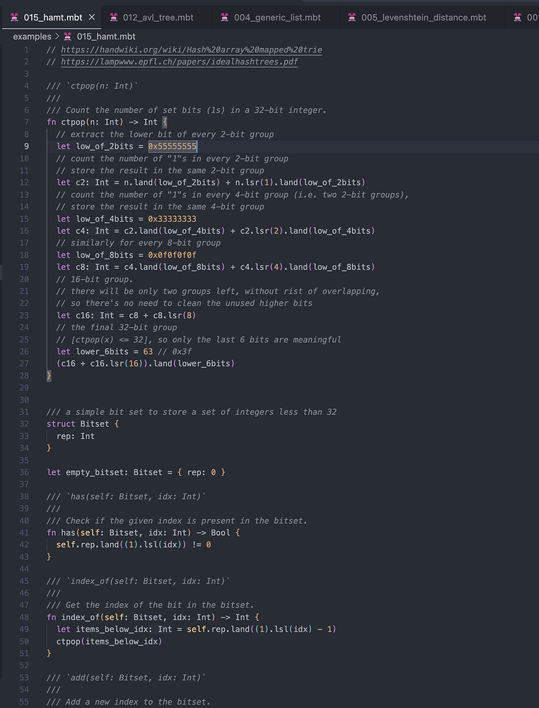
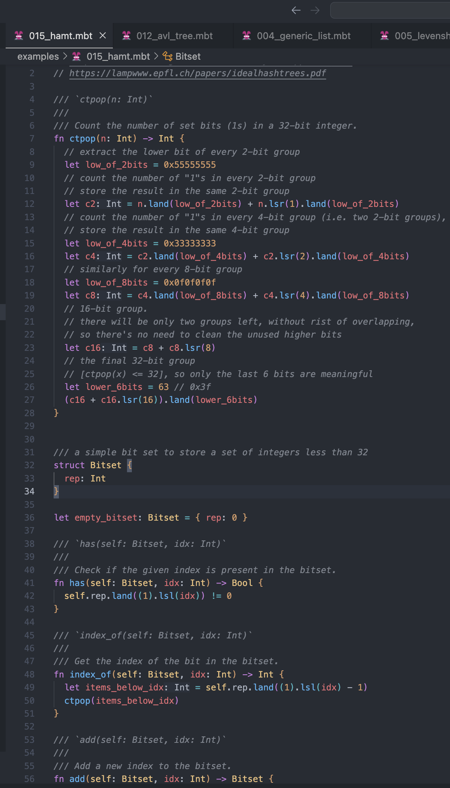

# weekly 2024-01-22
## MoonBit Update:

- Added syntactic sugar for **matrix functions** to easily define local functions and anonymous functions with pattern matching:

```
fn init {
  fn boolean_or { // local function with pattern matching
    true, _ => true
    _, true => true
    _, _    => false
  }
  fn apply(f, x) {
    f(x)
  }
  let _ = apply(fn { x => x + 1 }, 42) // anonymous function
  let _ = apply(fn {                   // anonymous function with pattern match
    0 => 0
    1 => 1
    _ => 2
  }, 42)
}
```

- Added syntax for constructing records using `T::{ ... }`. This syntax allows explicit record disambiguation and better completion for labels in the record:

```
struct T {
  x: Int
  y: Int
}

struct T2 {
  x: Int
  y: Int
}

fn init {
  let x = T::{x: 1, y: 2}
  debug(x.x + x.y) // 3
}
```

- Officially removed the syntax `var id = expr`.

- The new testing syntax `test "name" {}` is used to replace the original `fn test_name(){}`. Currently, only tests with top-level indentation are recognized as keywords, and in the future, `test` will no longer be supported as an identifier. Old syntax: `fn test_name {}` New syntax: `test "name" {}`

- Supported the use of return statements within `init` or `test` code blocks.

```
fn init  {
  if i > 0 {
    return
  }
  ...
}

test {
  if i > 0 {
    return
  }
  ...
}
```

## Plugin Update

- Improved syntax highlighting:

Before:



After:


