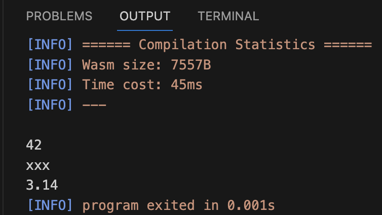
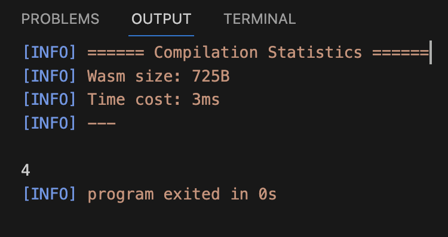
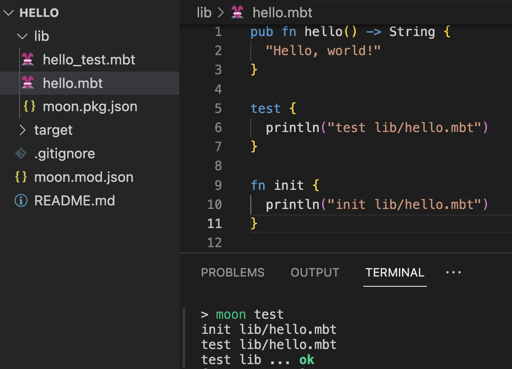
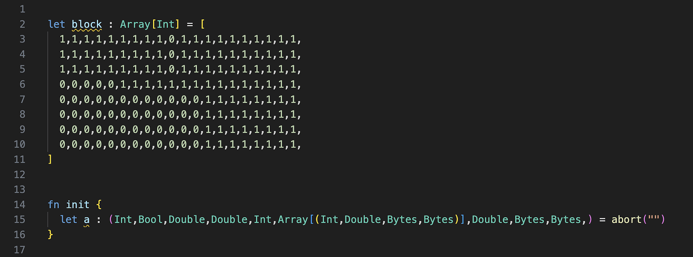
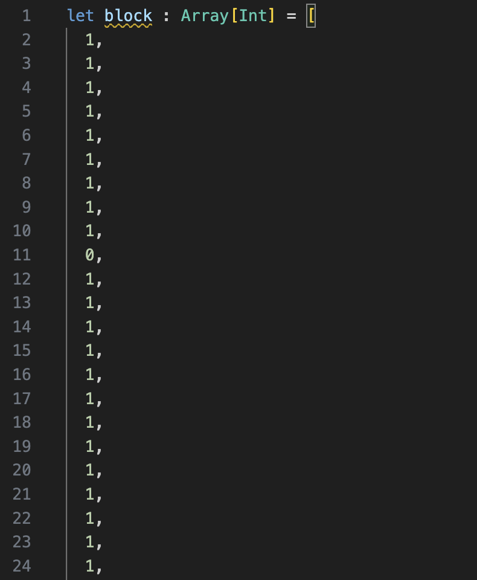
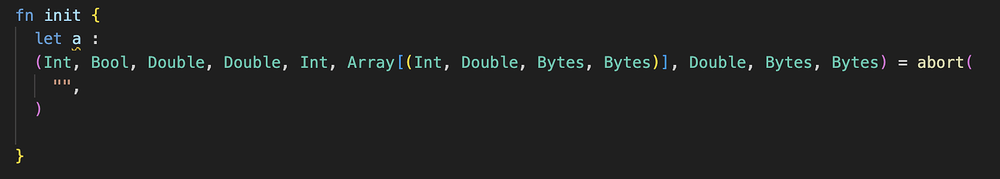
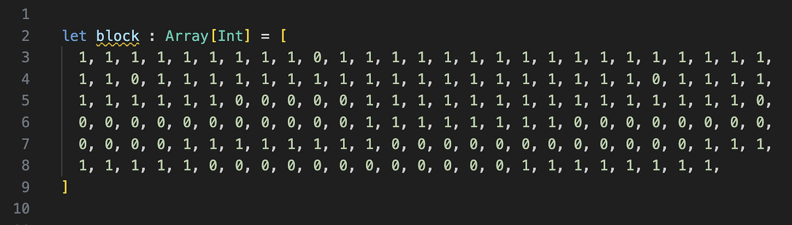
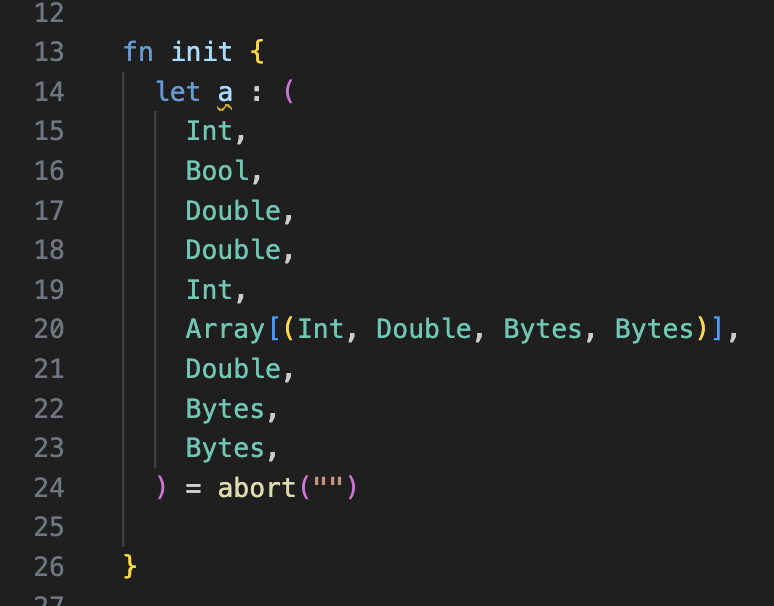

# weekly 2024-01-29
## MoonBit Update

### 1.**New feature** ——Trait object

It can explicitly box values of different types but implement the same trait and represent them as the same type, achieving dynamic dispatch of functions.

```
fn get_show_list() -> List[Show] {
  let a = 42 as Show
  let b = "xxx" as Show
  let c = 3.14 as Show
  List::Cons(a, Cons(b, Cons(c, Nil)))
}

fn init {
  fn print_show_list {
    List::Cons(a, rest) => { println(a); print_show_list(rest) }
    List::Nil => ()
  }
  print_show_list(get_show_list())
}
```



### 2. Introduction of the Pipe Operator

The Pipe Operator, provides a syntax similar to method chaining, which can string together multiple consecutive function calls, eliminating the need for`let name = ... `code. For example, `value |> func1(arg1,arg2) |> func2` is equivalent to:

```
let a = value
let b = func1(a, arg1, arg2)
func2(b)
```

Another example：

```
fn sub2(x : Int, y : Int) -> Int {
  x - y
}

fn sum3(x : Int, y : Int, z : Int) -> Int {
  x + y + z
}

fn init {
  6 |> sub2(5) |> sum3(1,2) |> println()
}
```



### 3. Strings support hexadecimal escape using `\xFF`

```
fn init {
  let data = "\x48\x65\x6c\x6c\x6f"
  println(data) //output: Hello
}
```

### 4. Inline test change

Now test mode will also run fn init, and the order of execution is before inline test.



### 5. Moonfmt: Improved indentation of types and long array literals.

Original code：



Formatting before improvements：





Formatting after improvements：




