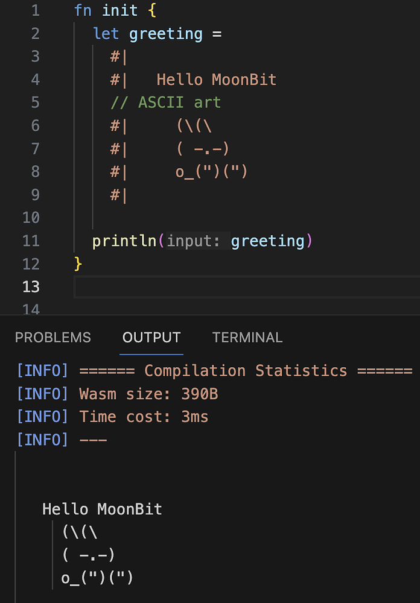
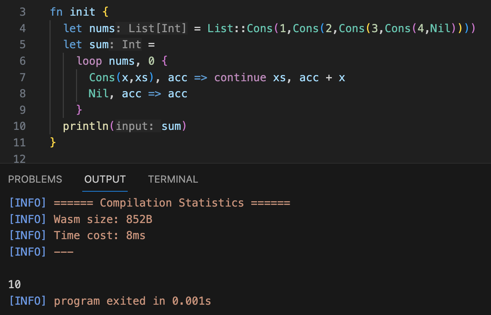
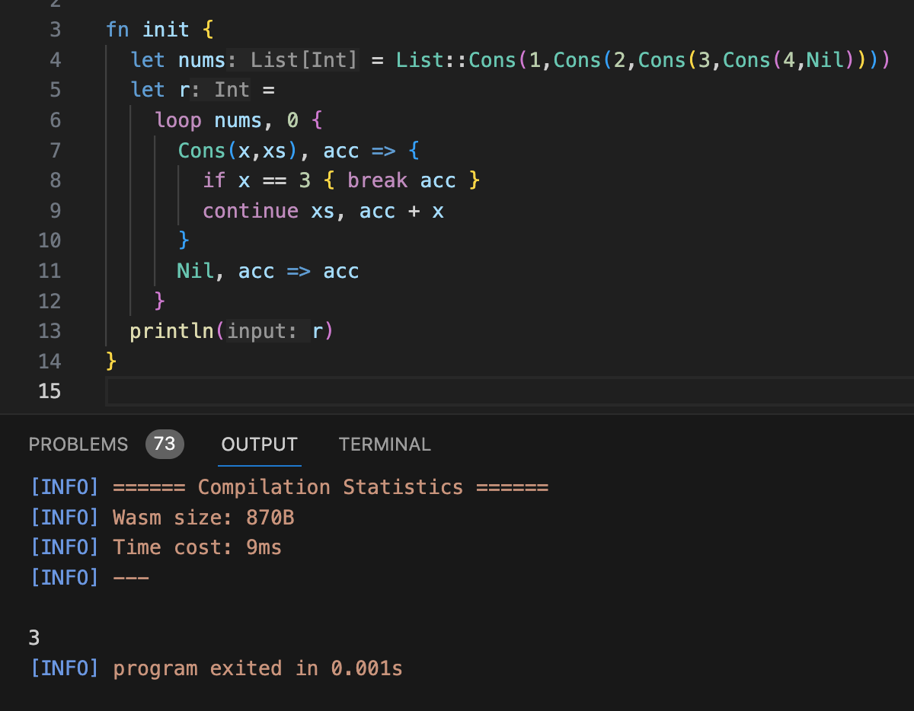
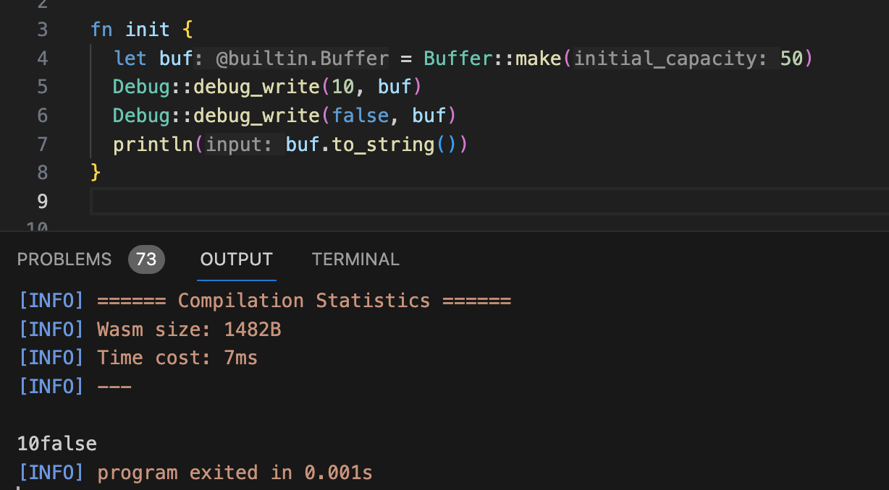
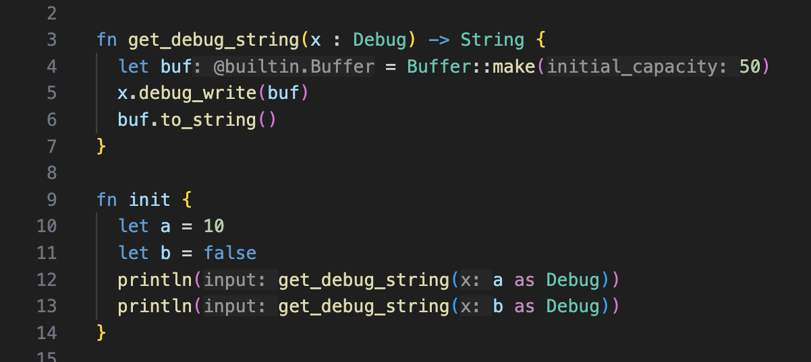
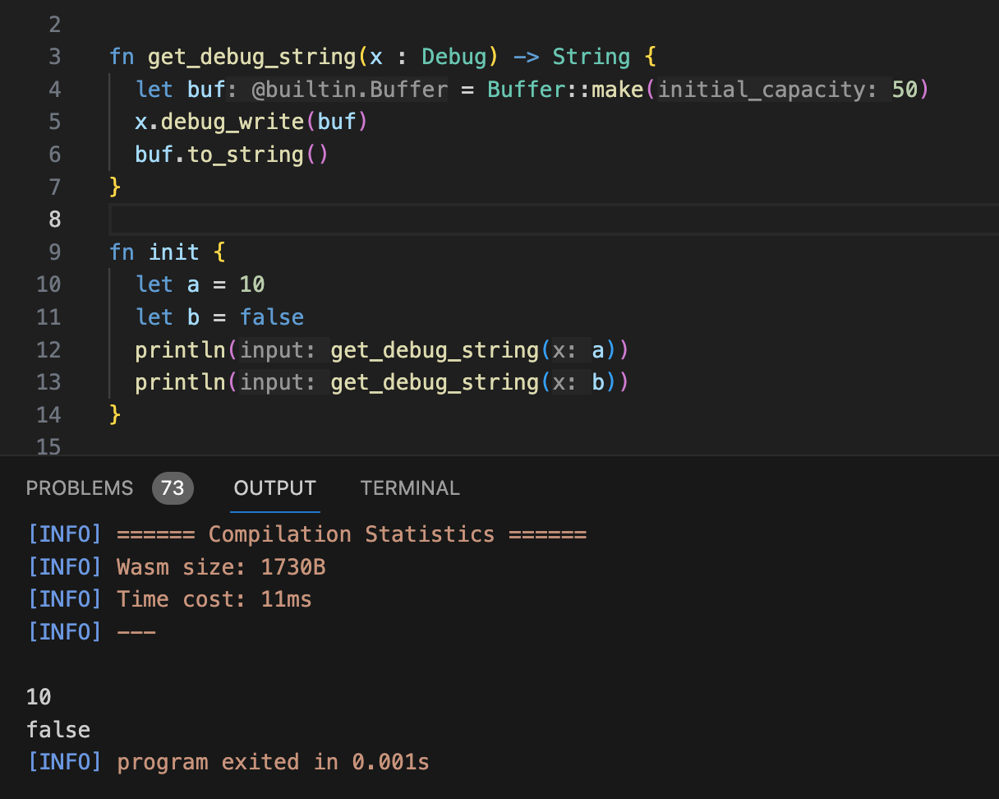
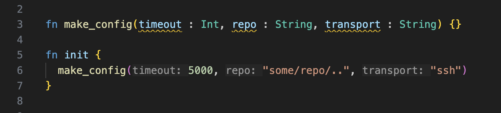
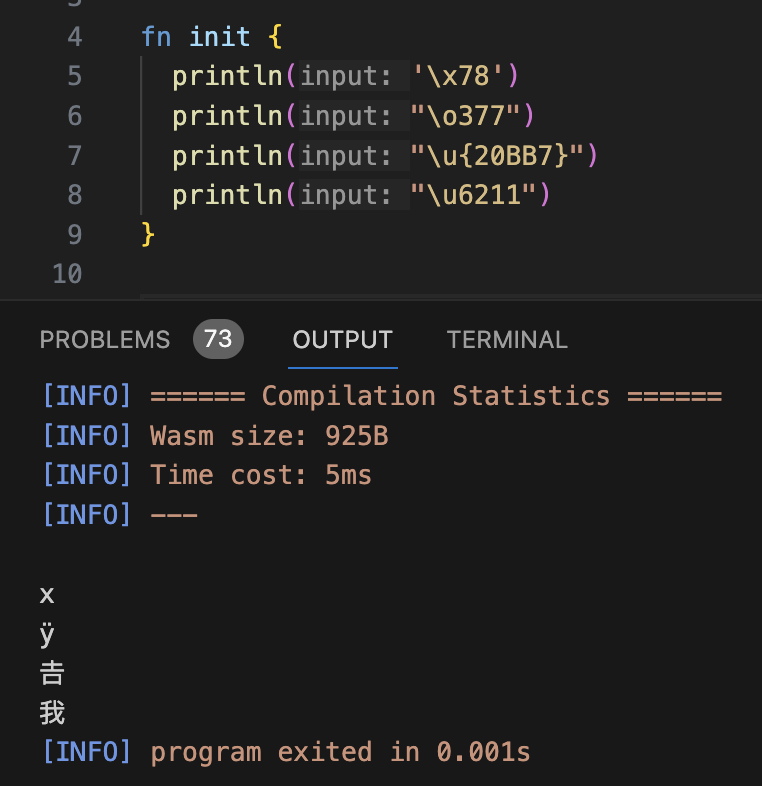

# weekly 2024-02-05
## MoonBit Update

1. Introduced support for multi-line strings, requiring each line to commence with `#|`. Multi-line strings allow for breaks and comments between lines, but do not support escape sequences or string interpolation.

2. Functional loop: A functional style loop. Here, `continue` is only allowed at the position of tail recursion calls, and within the loop, `break` can be used to return a value early.

3. Added support for `Trait::method` calls: Enables calling trait methods in the form of `Debug::debug_write(self, buf)`.

4. Supported implicit conversion to trait objects. When a trait object is explicitly required in the context, `as SomeTrait` will be automatically inserted. For example, in the code below:

Now we can omit `as Debug`.

5. Supported inlay hints for function parameters.

6. Strings and character literals now support Unicode escapes, hexadecimal escapes, and octal escapes.

