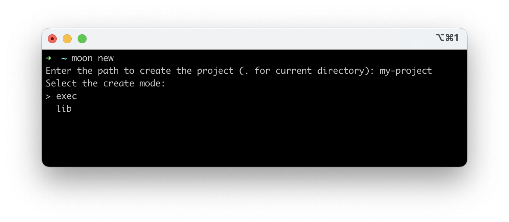
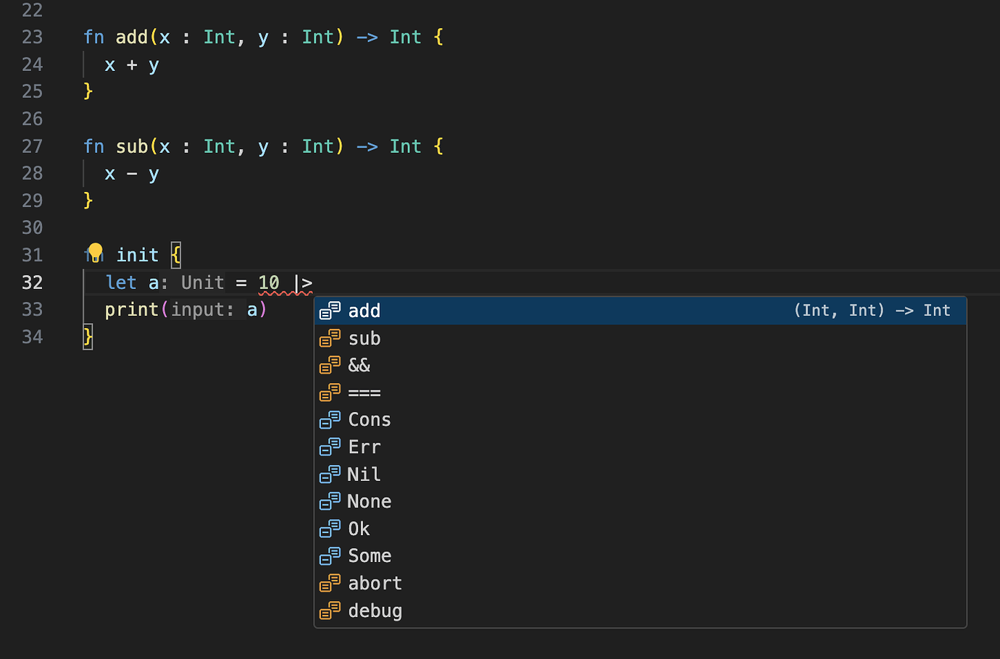

# weekly 2024-02-19
## MoonBit Update

1. Added support for functional for loop control flow. Unlike traditional imperative for loops, the loop variable is immutable. Such a design will also be easier to extract for formal verification in the future.

```
fn init {
  for i = 0; i < 5; i = i + 1 {
    debug(i)
    // i = i + 4  error: The variable i is not mutable.
  }
}
```

Output：

```
01234
```

The functional for loop also supports multiple bindings. Setting it apart from other languages, x and y have semantics of being updated simultaneously in the third expression of the functional for loop:

```
fn init {
  for x = 0, y = 0; x < 10; x = x + 1, y = x + 1 {
                                        // ^~~ the value of x is pre-update
    println("x: \(x), y: \(y)")
  }
}
```

Output：

```
x: 0, y: 0
x: 1, y: 1
x: 2, y: 2
x: 3, y: 3
x: 4, y: 4
x: 5, y: 5
x: 6, y: 6
x: 7, y: 7
x: 8, y: 8
x: 9, y: 9
```

Functional for loop also supports the use of `break` and `continue`.

```
fn init {
  let xs = [0,1,2,3,4,5,6,7,8]
  let mut sum = 0
  for i = 0, v = xs[0]; i < xs.length(); i = i + 1, v = xs[i + 1] {
    if v % 2 == 0 { continue }
    if v >= 7 { break }
    sum = sum + v
  }
  debug(sum) //output： 9
}
```

2. Improved the wizard for creating projects with moon new, now allowing the selection of creating a lib or an exec project using the arrow keys:



3. The IDE now supports intelligent autocompletion for the pipeline operator. Functions whose first parameter type matches the type of the expression on the left side of the pipeline will be placed at the top of the completion list, while other completion options will still be displayed further down the list.



4. Adjusted the pipe expression based on community feedback. Now, the right side of the pipeline operator supports function calls like `Double::to_int`.

```
fn init {
  debug(3.14 |> Double::to_int) // output: 3
  debug(4 |> Array::make('c')) // output: ['c', 'c', 'c', 'c']
}
```

5. Fixed an issue in the IDE where inlay hints were incorrectly inserted for infix expressions.
