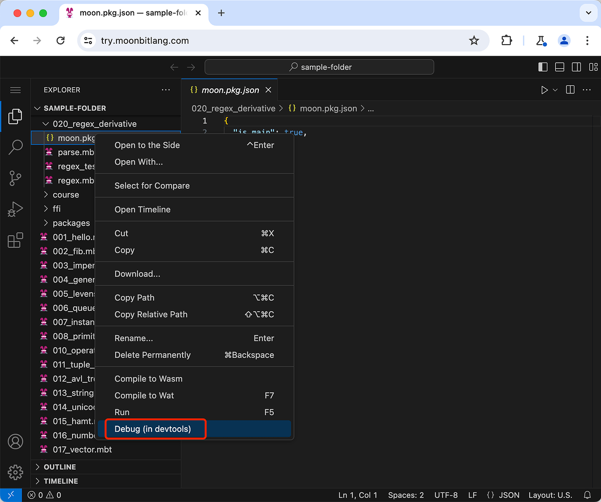
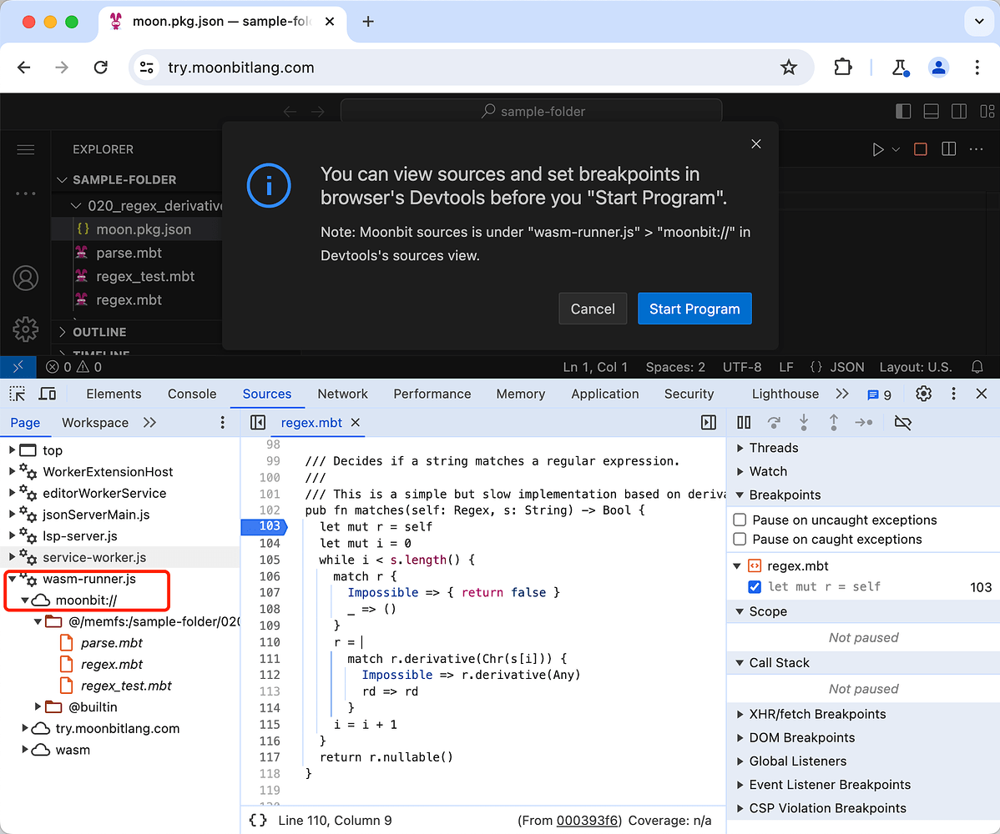
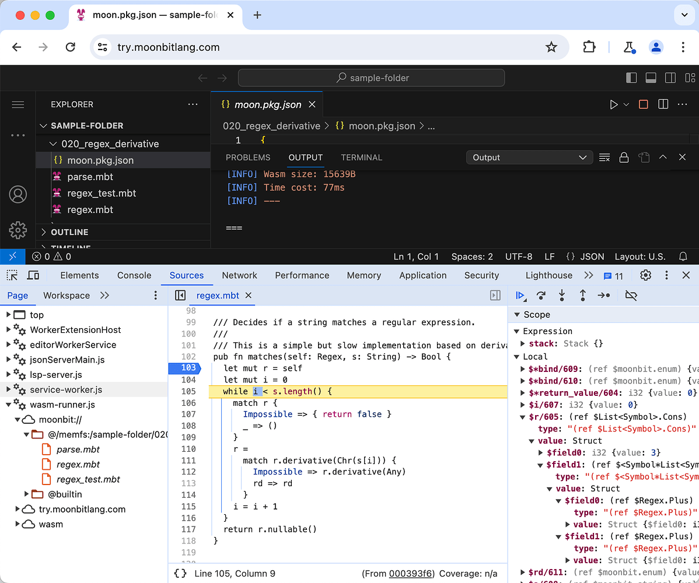
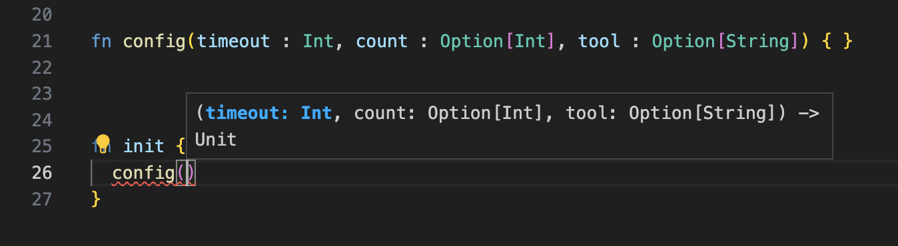

# weekly 2024-02-26
## MoonBit Update

### 1. Supports cloud-native debugging features.

Now, you can debug MoonBit programs directly in your browser using devtools by visiting try.moonbitlang.com, without installing any software. The steps are as follows:







### 2. MoonBit now supports functional loop control flow defined with the `for` keyword.

MoonBit now supports functional loop control flow defined with the `for` keyword, purely functional yet as efficient as C. For instance, the `fib` function can be written as follows:

```
fn fib( n : Int ) -> Int {
    for i = 0, a = 1, b = 2
        i < n
        i = i + 1, a = b, b = a + b {
    } else { b }
}
```

MoonBit's `for` loop can return a value as an expression. For example, in the program mentioned above, `b` is used as the value of the entire `for` loop after the loop ends. It's also possible to return early by using `break` within `for` loop body, like:

```
fn exists(haystack: Array[Int], needle: Int) -> Bool {
  for i = 0; i < haystack.length(); i = i + 1 {
    if haystack[i] == needle {
      break true
    }
  } else {
    false
  }
}
```

Moreover, within the `for` loop, you can use `continue` to proceed to the next iteration, just as in traditional languages. MoonBit further offers a parameterized `continue` to specify the value of the loop variable in the next iteration of the loop, for example:

```
fn find_in_sorted[T](xs: Array[(Int, T)], i: Int) -> Option[T] {
  for l = 0, r = xs.length() - 1; l < r; {
    let mid = (l + r) / 2
    let k = xs[mid].0
    if k == i {
      break Some(xs[mid].1)
    } else if k > i {
      continue l, mid
    } else {
      continue mid + 1, r
    }
  } else {
    None
  }
}
```

In cases where a return value is not required, the `else` branch can be omitted, like:

```
fn print_from_0_to(n: Int) {
  for i = 0; i <= n; i = i + 1 {
    println(i)
  }
}
```

### 3. Inline Test Improvements

The return type of tests has been changed from `Unit` to `Result[Unit, String]` to represent the outcome of the test:

```
test "id" {
  if (id(10) != 10) { return Err("The implementation of `id` is incorrect.") }
}
```

The compiler automatically wraps the block `{...}` in a `test "id" {...}` statement with `Ok()`. Therefore, when the block type is `Unit` and there is no early return, it indicates that the inline test has passed. Combined with the question mark operator, this makes testing more elegant:

```
fn id(x : Int) -> Int {
  x + 1 // incorrect result
}

fn assert(x : Bool, failReason : String) -> Result[Unit,String] {
  if x { Ok(()) } else { Err(failReason) }
}

test "id" {
  assert(id(10) == 10, "The implementation of `id` is incorrect.")?
}
```

Running `moon test`, generates the following output:

```
➜  my-project moon test
running 1 tests in package username/hello/lib
test username/hello/lib::hello ... ok

test result: 1 passed; 0 failed

running 1 tests in package username/hello/main
test username/hello/main::id ... FAILED: The implementation of `id` is incorrect.

test result: 0 passed; 1 failed

Hello, world!
```

### 4. Improved function signature hints in the VS Code extension, now displaying parameter names:



### 5. Enhanced support for core package development in the VS Code extension.

### 6. `moon new` supports the rapid creation of new projects.

- `moon new hello` creates an executable project named `username/hello` inside the `hello` folder.

- `moon new hello --lib` creates a library named `username/hello` inside the `hello` folder.
