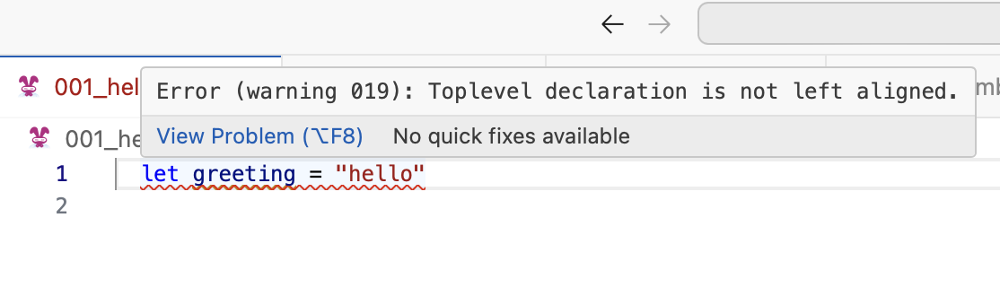
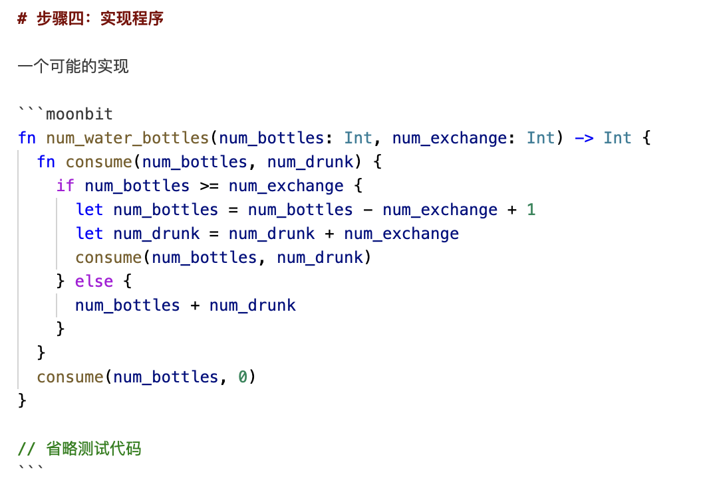

# weekly 2024-03-04
## MoonBit Update

1. We added support for `+=` operators, including: `+=`, `=`, `=` and `/=`. You can use them to mutate the value of a mutable variable.

   ```moonbit

   fn init {
     let array = [1,2,3,4]
     array[2] *= 10
     println(array) // [1, 2, 30, 4]
   }

   fn init {
     let mut a = 1
     a += 20
     println(a) // 21
   }

   ```

   ```moonbit
   struct Foo {
     data : Array[Int]
   } derive(Debug)

   fn op_set(self : Foo, index : Int, value : Int) {
     self.data[index] = value
   }

   fn op_get(self : Foo, index : Int) -> Int {
     self.data[index]
   }

   fn init {
     let foo : Foo = { data: [0,0,0,0] }
     foo[2] -= 10
     debug(foo) // {data: [0, 0, -10, 0]}
   }

   ```

2. Toplevel declarations that are not left-aligned will be an error now.



3. New language feature: Super Trait. A super trait can be specified using `:`, e.g.

   ```moonbit
   trait A {
     // ...
   }

   trait B : A { // A is a super trait of B, B is a sub trait of A
     // ...
   }

   ```

   You can specify that a trait has multiple super traits, which means this trait requires those super traits to be implemented:

   ```moonbit
   // ...

   trait B: A + Compare + Debug {
     //       ^~~ B is a sub-trait of A *and* Compare *and* Debug
     // ...
   }

   ```

   Wherever a trait is required, a sub-trait of that trait can also be used, but not the other way around. For built-in traits, we make `Compare` a sub-trait of `Eq`. This means if you have a value of type `A : Compare`, you can put it into a place where `Eq` trait is required. For example,

   ```moonbit
   trait Eq {
     op_equal(Self, Self) -> Bool
   }

   trait Compare: Eq {
     compare(Self, Self) -> Int
   }

   fn eq[X: Compare](this: X, that: X) -> Bool {
     this == that // Ok.
   }

   fn compare[X: Eq](this: X, that: X) -> Int {
     this.compare(that) // !! Error
     //   ^~~~~~~ Type X has no method compare.
   }

   ```

4. We added`T::[x, y, ...]` as a short-hand notation for `T::from_array([x, y, ...])`, to provide a more handy way to initialize array-like structures, for example, a list.

   ```moonbit
   enum List[X] {
     Nil
     Cons(X, List[X])
   } derive(Show, Debug)

   fn List::from_array[X](array: Array[X]) -> List[X] {
     let mut list = List::Nil
     for i = array.length() - 1; i >= 0; i = i - 1 {
       list = Cons(array[i], list)
     }
     list
   }

   fn main {
     println(List::[1, 2, 3])
     // outputs Cons(1, Cons(2, Cons(3, Nil)))
   }

   ```

5. `fn hello() = "xx"` has been deprecated. Instead, we suggest you write it as follows:

   ```moonbit
   extern "wasm" fn hello () =
     #| ...

   ```

   For now inline stubs like these only support wasmgc, not wasm1.

6. The logic of derived `Show` implementation is modified. It now uses `Debug` as implementation. So to derive `Show` for a type, users now need to implement or derive `Debug` for that type first. `Debug`'s output is valid MoonBit syntax for creating values, while `Show` can be used to produce better-looking output. This solves the problems of derived `Show` implementation with `String` fields:

   ```moonbit
   struct T {
     x: String
   } derive(Show, Debug)

   fn init {
     println({ x: "1, y: 2" })
     // before: {x: 1, y: 2}
     // now: {x: "1, y: 2"}
   }

   ```

7. Dropping non-unit values is now an error. Use `ignore` to explicitly discard them.

   ```moonbit
   fn f() -> Int {
     ignore(3)   // Ok.
     3 |> ignore // Ok.
     3           // Err: Expr Type Mismatch: has type Int, wanted Unit
     3           // Ok, as this value is returned, not dropped
   }

   ```

8. `test` is now a keyword, and cannot be used as an identifier anymore.

## IDE Update

1. Better support for Markdown in online IDE.

- MoonBit Code inside markdown will be highlighted.



- We open-sourced a simple tools to check the syntax correctness of MoonBit code blocks in a markdown documentation at https://github.com/moonbitlang/moonbit-markdown . Refer to its README for usage.

## Build System Update

1. We support _the_ `main` function now. However, there are some caveats you might want to know
   1. It can only be in the `main` package (where `is_main: true`).
   2. The `main` package should have _exactly_ one `main` function.
   3. It will be executed after all `init` functions
   4. We disallow any `test`to co-exists with the `main` function inside the same package.
2. You can use `moon upgrade`to upgrade your MoonBit toolchain to the latest version. However, before using it, you must run the installation script one more time :-)
3. The `moon check|build|run` command now defaults to linking with the standard library `moonbitlang/core`.
