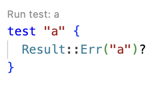

# weekly 2024-03-11
## MoonBit Update

1. moonbitlang/core is now open-source at https://github.com/moonbitlang/core. We are thrilled to receive positive feedback from the community. To learn more about the moonbitlang/core open source details, click here: https://www.moonbitlang.com/blog/moonbitlang-core-opensource

2. MoonBit now supports labeled argument and optional argument. Labelled arguments are useful for distinguishing different parameters of the same type in a function:

   ```moonbit
   fn greeting(~name: String, ~location: String) {
     println("Hi, \(name) from \(location)!")
   }

   fn init {
     greeting(~name="somebody", ~location="some city")
     let name = "someone else"
     let location = "another city"
     // `~label=label` can be abbreviated as `~label`
     greeting(~name, ~location)
   }

   ```

   Optional arguments must be labelled, and you must specify a default value when declaring an optional parameter. When the function is called, if no argument is explicitly provided, the default value will be used. Note: the default value expression will be evaluated on every function call:

   ```moonbit
   fn greeting(~name: String, ~location: Option[String] = None) {
     match location {
       Some(location) => println("Hi, \(name)!")
       None => println("Hi, \(name) from \(location)!")
     }
   }

   fn init {
     greeting(~name="A") // Hi, A!
     greeting(~name="B", ~location=Some("X") // Hi, B from X!
   }

   ```

3. A new builtin type `SourceLoc` is added, representing source code location. If a function declares an optional parameter of type `SourceLoc` with `_` as default value, MoonBit will automatically inject the location of call site when calling this function:

   ```moonbit
   fn f(~loc : SourceLoc = _) {
     println("called at \(loc)")
   }

   fn g(~loc : SourceLoc = _) {
     f() // show the position inside `g`
     f(~loc) // autofilled arguments can be manually overidden:
             // this call should show the location of the caller of `g`
   }

   test "source loc" {
     g()
   }

   ```

   Paste the above code into a new file called `test.mbt` at try.moonbitlang.com, and run the test "source loc", you should see the following output:

   ```moonbit
   test source loc ...
   called at memfs:/sample-folder/test.mbt:6:3-6:6
   called at memfs:/sample-folder/test.mbt:11:3-11:6

   ```

   `SourceLoc` can be used to write test utilities, providing handful location information when tests fail:

   ```moonbit
   fn assert_eq[X: Eq + Show](result: X, expect: X, ~loc : SourceLoc = _) -> Result[Unit, String] {
     if (result == expect) {
       Ok(())
     } else {
       Err("\(loc): Assertion failed: \(result) != \(expect)")
     }
   }

   test "1 =? 2" {
     assert_eq(1, 2)?
   }

   ```

   ```
   running 1 tests
   test 1 =? 2 ... FAILED memfs:/sample-folder/test.mbt:10:3-10:18: Assertion failed: 1 != 2

   test result: 0 passed; 1 failed

   ```

4. `===` has been deprecated; please use `physical_equal` as its replacement.
5. A new builtin type `UnsafeMaybeUninit[T]` and a few related builtin primitives have been added to support implementing high performance data structures, like vectors, in the MoonBit Core. Because they are unsafe, regular MoonBit programs are not expected to use them.

## IDE Updates

1. The online IDE now supports running tests via CodeLens.



2. Significantly improved how moonfmt handles source code with comments.

3. Enhanced stability and user experience for the IDE and VSCode plugin.

   a. The VSCode plugin now invokes `moon check` on file changes rather than starting `moon check -w`.

   b. Improved the typing experience for multi-line strings and docstrings. Now, inserting a line break inside a multi-line string/docstring automatically prefixes it with `#|` or `///`.

   c. Fixed issues with hover, errors in `moon.pkg.json`, empty files, etc., that caused lsp errors.

## Build System Update

Fixed several issues with moonbuild.

a. Fixed an issue where `moon upgrade` failed on Windows.

b. Fixed an issue where `moon add` did not remove the old version when adding a new version.

c. Fixed an issue where `moon check` could fail locally but still allow publishing.

## Toolchain Update

Markdown linter now supports `expr` tags.

````markdown
```moonbit expr
1 * 2 + 3
```
````

You can see the corresponding output when running `mdlint`:

```
5
```
